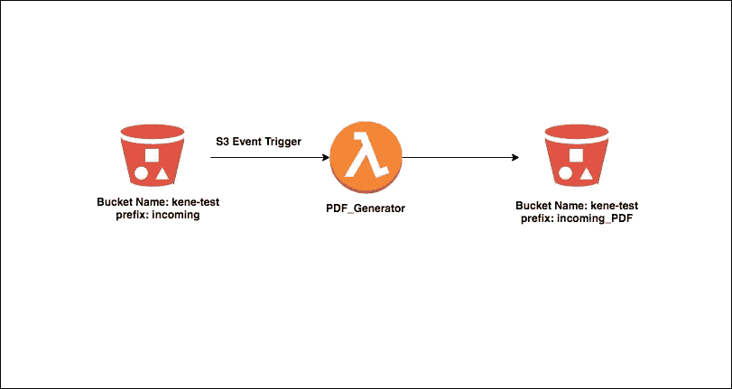
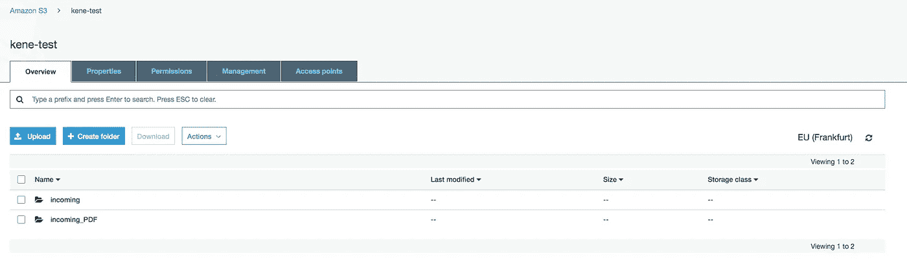
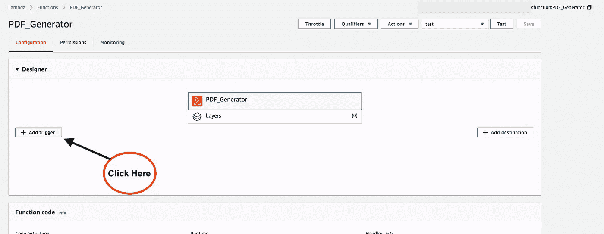
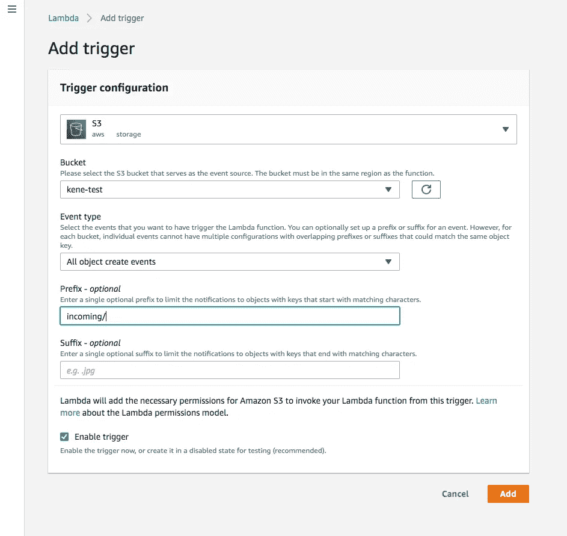
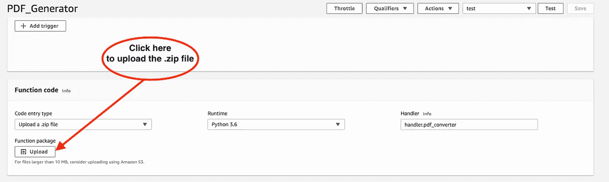
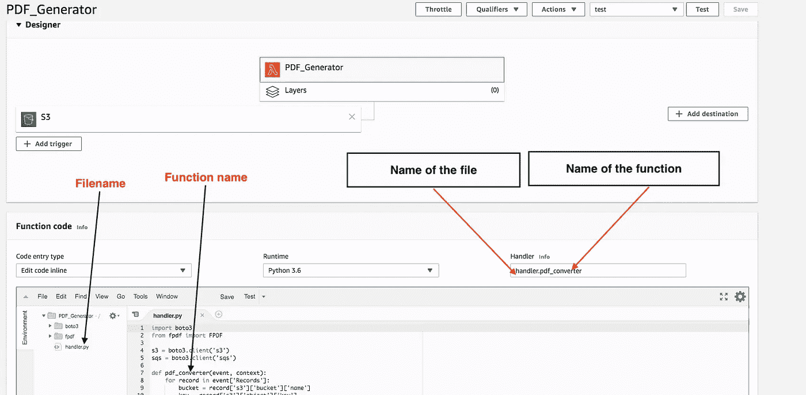

# 基于 Python 的具有 S3 事件触发器的 PDF 生成器 Lambda 函数

> 原文：<https://medium.com/analytics-vidhya/python-based-pdf-generator-lambda-function-with-s3-event-trigger-52faea791c80?source=collection_archive---------2----------------------->



示意图

# 介绍

S3 非常适合存放物品。任何类型的对象，如图像、文档和二进制文件都可以存储在 S3 上。S3 提供无限的存储空间，并以非常低的成本提供极其耐用、高度可用和无限可扩展的数据存储基础设施，尽管每个对象不需要超过 5TB。这里是 [S3 常见问题解答](https://aws.amazon.com/s3/faqs/)。

通常，企业可能希望生成 PDF 格式的文件，并将其保存在 S3 存储桶中。本文提供了使用 Lambda 函数设置和创建此类服务的分步指南，并附有用 python 编写的示例代码。

## 建筑说明

名为 **kene-test** 的 S3 桶将有两个前缀(文件夹),分别是 **incoming** 和 **incoming_PDF。**顾名思义， **incoming** 将是我们推送 S3 对象的文件夹，而 **incoming_PDF** 将作为我们保存 **incoming** 文件夹中生成的 PDF 格式文件的文件夹。

Lambda 函数将由“**所有对象创建事件**”S3 事件触发。将文件转换为 PDF 后，它保存在 Lambda **/tmp** 文件夹中，然后被推送到 **incoming_PDF** 文件夹中。需要注意的是 **/tmp** 是一个 **512MB** 目录存储路径，也是 Lambda 函数中唯一可写的路径。

## S3 水桶

转到 [AWS 控制台](https://aws.amazon.com/s3/)并创建一个 S3 桶(在本例中为 **kene-test** ),带有两个文件夹，如下所示。



肯尼测试 S3 桶

## **λ函数**

将以下策略添加到 Lambda 函数角色。这将使 Lambda 函数能够执行 S3 Get 和 Put 操作。

```
{
    "Version": "2012-10-17",
    "Statement": [
        {
            "Effect": "Allow",
            "Action": [
                "s3:PutObject",
                "s3:GetObject"
            ],
            "Resource": "arn:aws:s3:::*/*"
        }
    ]
}
```

点击 Lambda 函数界面上的**添加触发器**按钮，配置 Lambda 函数，当有物体被推入 **kene-test** S3 桶的 **incoming** 文件夹时，该函数被触发。



添加触发器

在搜索栏中键入并选择 S3。根据下图填写表格。完成后，单击保存。



现在你的 Lambda 函数被配置为每当在 **kene-test** S3 桶的 **incoming** 文件夹中创建一个对象时被触发。

## Lambda 函数 Python 代码

有三种方法可以将代码添加到 Lambda 函数中，它们是:

1.  内联编辑代码
2.  上传代码和代码依赖项的. zip 文件
3.  从 S3 上传文件

在这个简短的练习中，我们将把代码和代码包上传为一个. zip 文件。



显示了示例代码。注意 **boto3** 和 **fpdf** 需要包含在。zip 文件，以防您想要创建。自己压缩文件。

你可以下载完整版。来自我的 Github repo 的 zip。

```
git clone [https://github.com/Kenec/Lambda-PDF-Generator.git](https://github.com/Kenec/Lambda-PDF-Generator.git)
```

下一步是编辑处理程序文本字段以指向我们自己的。如下图所示进行更改，以便 Lambda 可以执行代码。



## 测试

为了测试设置，上传一个文件到 S3 的**接收文件夹**。这将调用该函数，生成您上传的 PDF 格式文件，并将其保存到 **incoming_PDF** 文件夹中。

## 结论

这个简单的设置可以是另一个复杂架构的一部分。它可以被调整来执行其他任务，比如当这样的操作完成时在 Slack 信道上通知团队。

感谢您的阅读。