# 具有 VGG-19 卷积神经网络的新冠肺炎检测器

> 原文：<https://medium.com/analytics-vidhya/python-based-project-covid-19-detector-with-vgg-19-convolutional-neural-network-f9602fc40b81?source=collection_archive---------7----------------------->

> **了解你的肺，为 COVID 作证！！！(针对初学者的紧凑的真实世界深度学习项目。)**

***新冠肺炎检测器*** 是一个 web 应用，解决了疫情新冠肺炎病毒世界当前面临的部分问题。它帮助像医生这样的用户检查他们的肺部 x 光图像。为此，他们需要上传 X 射线的影印件或图像和网络应用程序，他们将得到肺部是否存在新冠肺炎效应的结果。它还将有助于预测该人何时有机会感染冠状病毒。

**先决条件:**

本项目所需的库有:

*   克拉斯
*   张量流
*   枕头
*   Numpy
*   Sklearn
*   Matplotlib
*   OpenCV

**什么是 VGG-19 卷积神经网络？**

卷积神经网络是一种特定的深度神经网络，可以处理输入形状为 2D 矩阵的数据。图像通常表示为 2D 矩阵，CNN 在处理图像时非常有用。它从上到下和从左到右扫描图像，从图像中提取基本特征，并组合提取的特征来识别图像。它可以管理经过平移、旋转、缩放和透视变化的图像。

对于这个特定的项目，VGG -19，使用了一种 CNN 模型，它是由 16 个卷积层组成的 19 个权重层，具有 3 个全连接层和相同的 5 个汇集层。

输入是到基于 VGG 的 convNet 的 224 * 224 RGB 图像。预处理层获取像素值在 0–255 范围内的 RGB 图像，并减去在整个 ImageNet 训练集合上计算的平均图像值。预处理后，输入图像通过权重层。训练图像通过一叠卷积层进行处理。

**VGG-19 的建筑:**

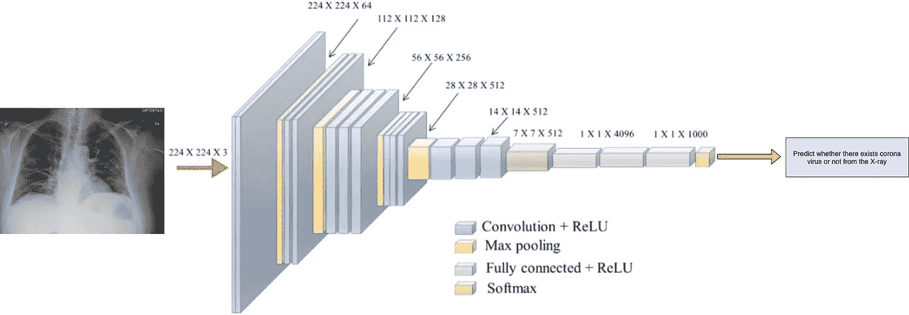

新冠肺炎探测器流程图

*   前两层是具有 3*3 滤波器的卷积层，前两层使用 64 个滤波器，结果是 224*224*64。过滤器总是 3*3，步长为 1。
*   接下来是池层，最大池大小为 2*2，跨距为 2，将图像大小从 224*224*64 缩小到 112*112*64。
*   在此之前是 2 个具有 128 个过滤器的卷积层，这产生了 112*112*128 的新尺寸。再次应用池层，将大小更改为 56*56*128。
*   增加了两个具有 256 个滤波器的卷积层，每个卷积层之后是下采样层，这将尺寸减小到 28*28*256。
*   还有两个堆栈，每个都有 3 个卷积层，由一个体积为 7*7*512 的 max-pool 层分隔，该层被展平为一个全连接(FC)层，然后是一个 softmax 层作为输出。

**构建基于 python 的项目:**

1.  **我们需要创建一个 juypter 文件并导入所有必需的包**

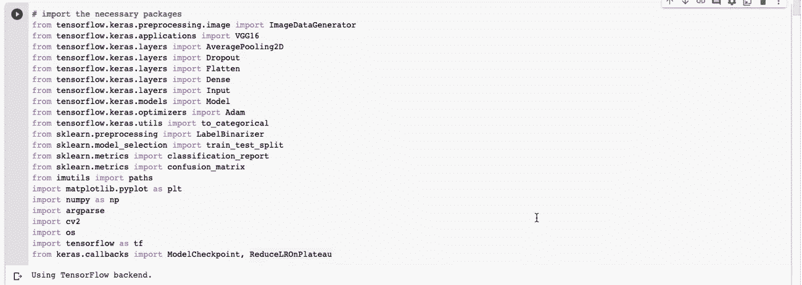

**2。** **加载数据集进行训练和验证，之后对其进行归一化处理。**

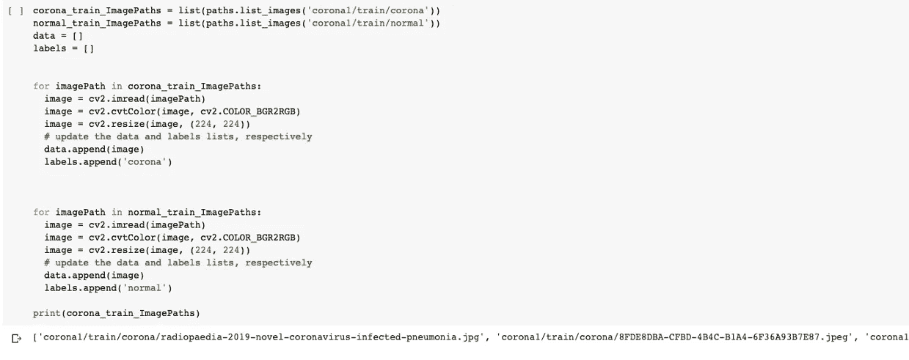

**3。** **现在对目标类**执行标签二值化

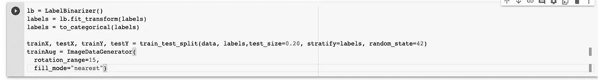

**4。** **现在创建模型并添加图层**

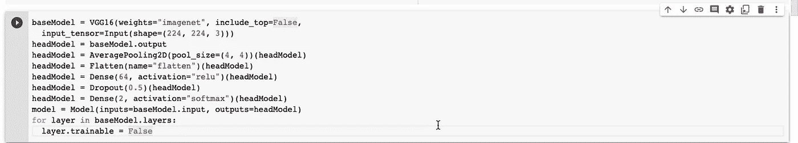

**5。** **配置优化器和编译器**

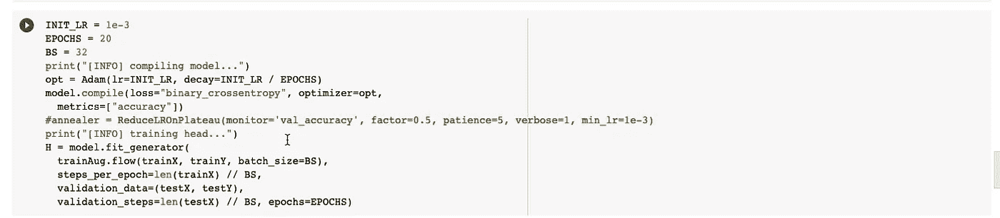

**6。**

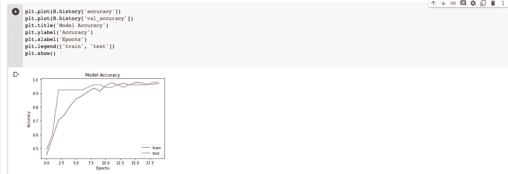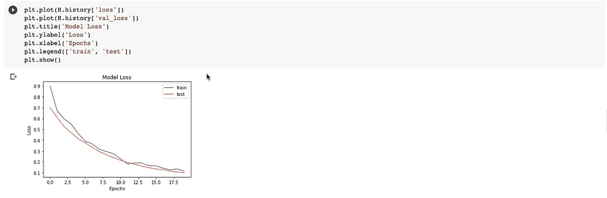

7。 **根据不同参数评估网络**

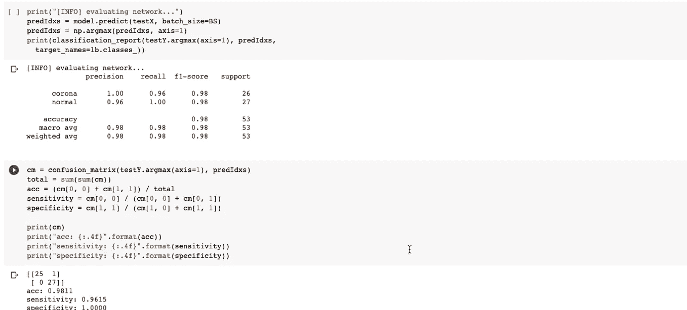

8。 **测试模型**

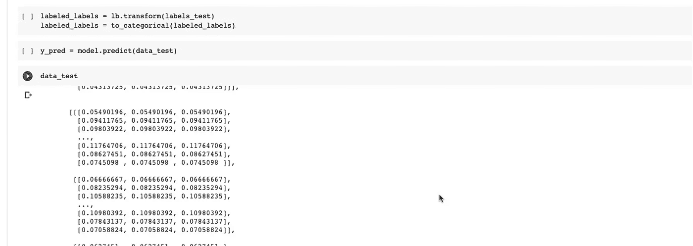

**9。** **用混淆矩阵**可视化预测结果

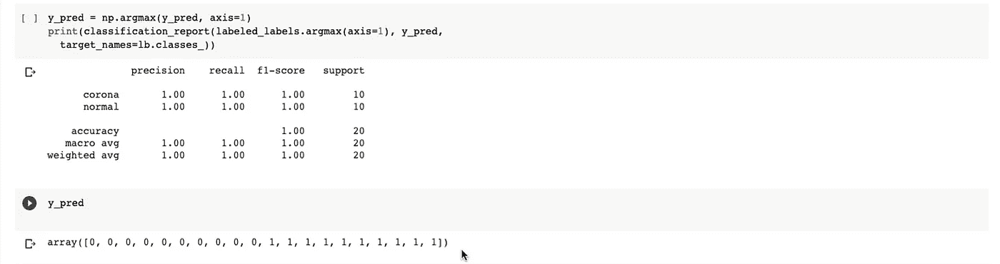

**10。** **保存模型**

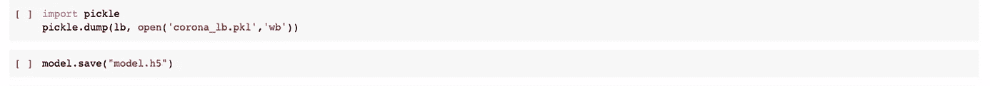

现在在 Flask 的帮助下将模型与 GUI 集成在一起

1.  创建 app.py 并在文件中导入模型。

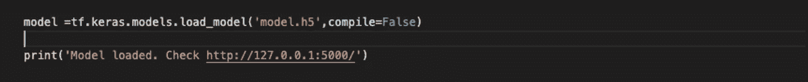

2.现在创建标准化给定图像和预测类所需的函数。

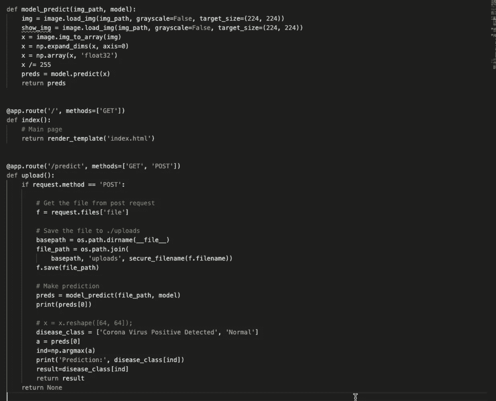

3.在模板文件夹中创建两个 HTML 页面。并运行 app.py 文件。

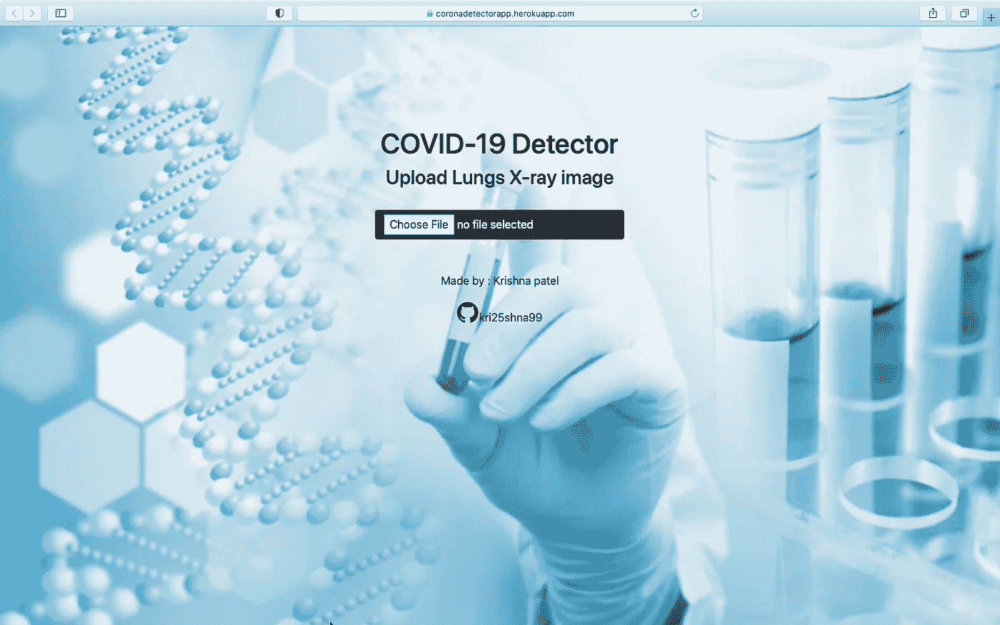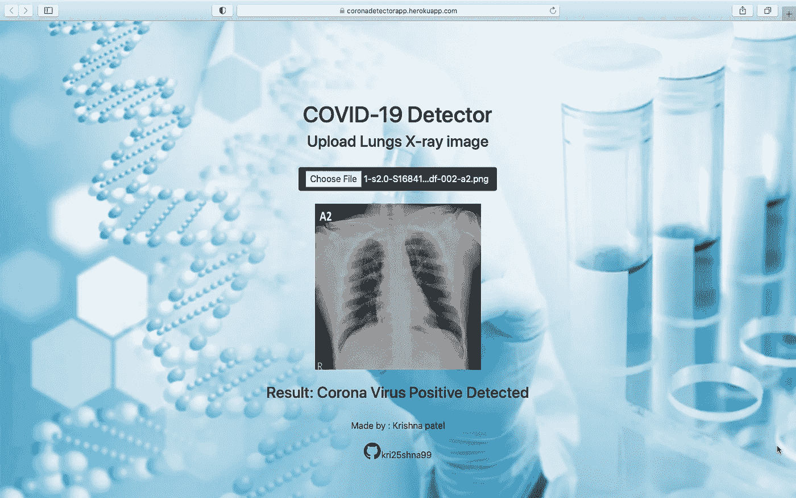

## **概要:**

在这个新冠肺炎展中，我必须使用 flask 构建一个 web 应用程序，并使用 python 构建一个深度学习项目。该模型依赖于数据集，因此对于不同的情况可能不准确。相同的概念可以扩展到具有大量训练数据和有效网络的各种对象。相同的概念可以扩展到具有大量训练数据和有效网络的各种对象。

**参考文献:**

[https://www . ka ggle . com/nabeelsajid 917/新冠肺炎-x-ray-10000-images](https://www.kaggle.com/nabeelsajid917/covid-19-x-ray-10000-images)

[https://www.youtube.com/watch?v=ArPaAX_PhIs&list = plkdae 6 sczn 6 GL 29 AOE 31 idvwsg-KnDzF](https://www.youtube.com/watch?v=ArPaAX_PhIs&list=PLkDaE6sCZn6Gl29AoE31iwdVwSG-KnDzF)

[https://www . coursera . org/learn/neural-networks-deep-learning/home/welcome](https://www.coursera.org/learn/neural-networks-deep-learning/home/welcome)

[https://machine learning mastery . com/save-load-machine-learning-models-python-scikit-learn/](https://machinelearningmastery.com/save-load-machine-learning-models-python-scikit-learn/)

***查看项目:***

[https://coronadetectorapp.herokuapp.com](https://coronadetectorapp.herokuapp.com)

***项目编码:***

[https://github.com/kri25shna99/Corona-Detector-Web-App](https://github.com/kri25shna99/Corona-Detector-Web-App)