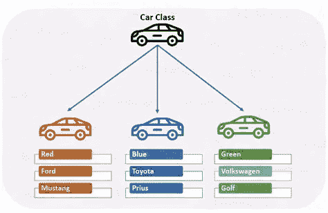

# Python 基础:一切都是对象

> 原文：<https://medium.com/analytics-vidhya/python-basics-everything-is-an-object-6833a7ab3285?source=collection_archive---------10----------------------->

## **可变与不可变对象**


奥斯卡·尼尔森在 Unsplash 上拍摄的照片

## 本职位的学习目标:

> 简单介绍一下类，对象，一切都是对象。
> 
> 什么是对象的 id 和类型？
> 
> 什么是可变对象和不可变对象？
> 
> 为什么这很重要，Python 对待可变对象和不可变对象有什么不同？
> 
> 参数是如何传递给函数的，这对可变和不可变对象意味着什么？

## 简介(面向对象与面向过程)

Python 利用面向对象的**和面向对象的**来编写程序。面向过程的编程使用*函数*，而 OOP 使用**对象**。在 OOP 中，你编写代表现实世界事物和情况的 ***类*** 。您可以将类视为创建对象的蓝图。因此，您基于类创建对象。**对象是数据和方法的集合，这些数据和方法基于它们持有的数据而行动**。您可以将数据视为变量，方法创建功能。它们被打包在一起创建一个对象，用类指定它将做什么。****

例如，想象一个类是一个草图或者一辆汽车的原型。该类包含构建汽车的部件的规范以及汽车的功能。基于这些属性，你就可以做出一辆一般的车。*汽车是*的对象。你也可以从一个类中创建单独的对象，你可以给每个对象任何你想要的独特的特征。例如，每辆汽车都自动配备了常规行为，但您可以自定义其颜色、品牌和型号



该类在顶部创建基本的汽车。单个对象是由程序员编写的具有特定独特特征的汽车。

## 一切都是对象或“头等一切”是描述 Python 的常用短语，但为什么呢？

在 Python 代码中，所有的对象都表示数据或保存其他数据的对象之间的关系。

> “Python 的所有对象都基于通用的 C 数据结构，这种结构在解释器中随处可见。变量、列表、函数和其他一切都只是使用了这种数据结构的变体——不管这种结构是表示一个简单的对象，比如一个整数，还是表示一个更复杂的对象，比如一个类。”—吉多·范·罗苏姆，Python 的创造者

## 对象、值和类型

## 身份(id)= 1

一旦创建，对象的身份*永远不会改变*。函数为指定的对象返回一组唯一的整数，在 Python 中，所有对象都有自己唯一的 id。*注意*，具有常量唯一 id 的对象，如从-5 到 256 的整数，保持不变。您可以将 id 视为对象的内存地址。

```
id(0)          #10105056a = "hello"
id(a)          #140296298136888
```

## 类型

类型定义了一个对象可能拥有的值和操作。类型概述了不可更改的特定属性。回到汽车的例子，保持不变的汽车属性是它的结构，即汽车有一个方向盘，四个轮子，一个引擎等。

它返回对象的类型。`type()`功能有两种不同的形式:

```
type(object)                  # a single object parameter 
type("Hello")                 # <class 'str'>
type(4)                       # <class 'int'>type(name, bases, dict)       #class name, a tuple, and dict
```

你也可以使用`isinstance()`函数来查看数据值的类型。

## 对象中的值—可变与不可变

**可变对象**有允许改变的值。**不像不可变对象**，它们的值一旦被创建就不允许改变。以我们的汽车为例，不可变的对象具有汽车本身的基本结构。每辆车有四个轮子，四个门，一个引擎等等。然而，变得可变的对象是汽车的品牌、型号和颜色。*所以，对象的可变性是由它的类型决定的，来表示它是什么样的值。*

> *可变对象的例子= list、set、dict 和一个字节数组
> 
> *不可变对象的示例=数字(int、float、complex)、字符串、元组、冻结集和字节

## 为什么这很重要，Python 对待可变对象和不可变对象有什么不同？

不可变类型允许对象具有静态规范。这些类型具有保持不变的属性。然而，Python 中的可变类型创造了一种编写程序的动态方法。它允许您根据自己的需要来决定功能。

*   可变对象(dict)的值可以改变，但对象保持不变。
*   不可变对象将基于更改后的值创建一个新对象。
*   可变对象更容易访问，因此调整更有用。
*   当您希望某个东西保持不变时，您可以依赖不可变对象，因为它的值在您修改程序后不会改变。

## 参数是如何传递给函数的？

可变和不可变对象在函数中传递，不管是 int、tuples 还是 lists。重要的是要记住，参数需要验证，以验证传递给函数的参数符合我们的标准。

当你在函数中传递一个可变类型时，你知道对象的值会改变。

```
def change(a)
    a[1] = 24
l = ["c", "b", "a"
change(l)
print(l)               # output: ["c", 24, "a"]
```

在不可变对象中，对象的值将保持不变。它是如何工作的？在 Python 中，您将不可变的`i`传递给函数，它将该对象加 1。由于您不能更改不可变对象的值，Python 将为该值创建一个新对象。因此，在执行该功能后，`i`将保持不变。要更改`i,`的值，请在函数中添加一个 return 语句，或者访问不可变值的值来修改它。

```
def increment(num)
   num += 1i = 1
increment(i)
print(i)               # output of a is 1 because a = 1
```

## 结论

Python 中的一切都是对象，它的值取决于类型是可变的还是不可变的。它展示了 Python 如何成为一种具有动态编程方法的面向对象语言。不像基于过程的编程依赖于更静态的方法。

## 资源

## 面向对象编程