# Python 集合——第 1 部分

> 原文：<https://medium.com/analytics-vidhya/python-collections-part-1-b9760f940f5?source=collection_archive---------15----------------------->

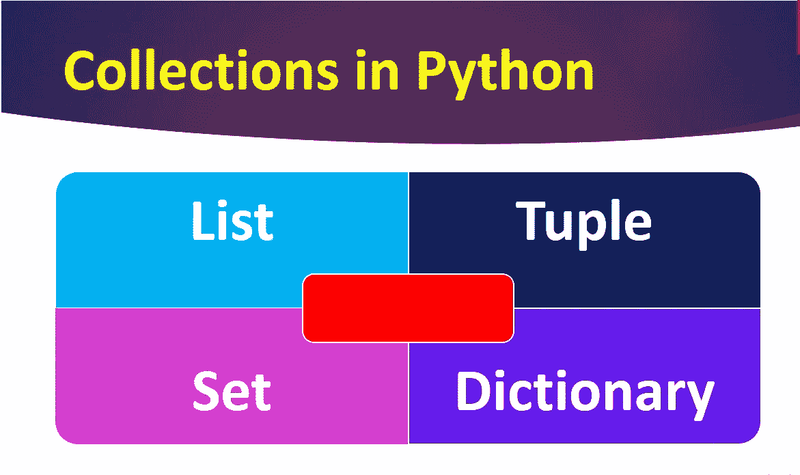

Python 中的集合

集合只不过是一组项目。

Python 中有 4 种集合数据类型，它们是:

1.  目录
2.  元组
3.  一组
4.  词典

**列表**

列表是有序且可改变的集合。列表使用方括号([])书写。

**语法:**

list _ variable =[用逗号运算符分隔的双引号中的列表值]

**举例:**

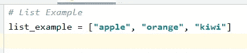

**从列表中访问项目:**

我们可以使用索引来访问列表中的项目。

例如，如果要打印列表的第二项，我们可以用下面的方法来做，

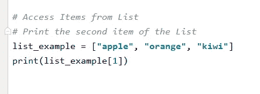

**输出:**

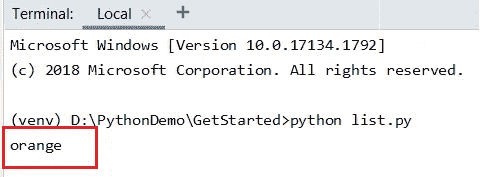

**负步进:**

负索引意味着从末尾访问项目。 ***-1*** 表示最后一项， ***-2*** 表示倒数第二项，依此类推。

***例如:***

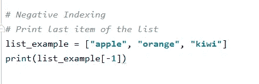

**输出**:

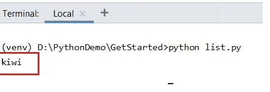

**指标范围:**

比方说，如果您想一次访问多个元素，我们可以通过指定范围的开始和结束位置来指定一个索引范围。

当我们指定范围时，返回值将是一个包含指定项目的新列表。

**语法**:

**列表变量**【开始索引:结束索引】

**例** : list_example[2:5]

**注意:**搜索将从索引 2 开始(**包括**)，到索引 5 结束(**不包括**)

返回列表的第三、第四和第五项

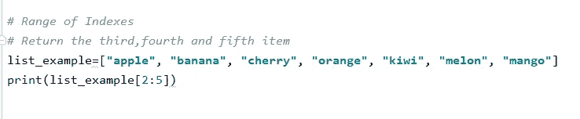

**输出**:

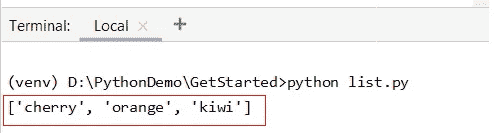

如果没有指定结束值，范围将继续到列表的末尾。

**举例**:

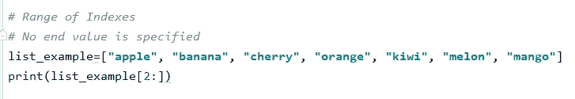

***输出*** :

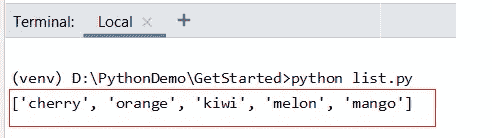

如果没有指定起始值，范围将从列表的第一项开始。

**示例**:

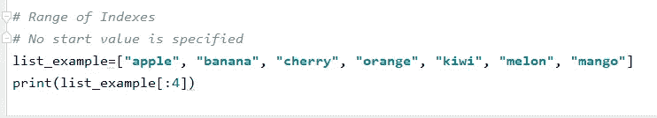

**输出**:

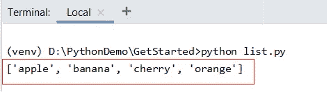

**负指数范围**:

如果要从列表末尾开始搜索，请指定负索引。

**示例**:

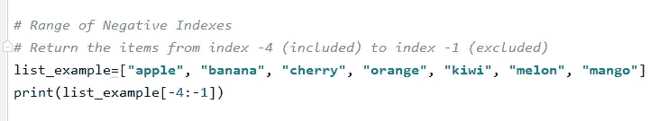

**输出**:

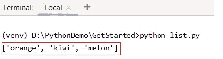