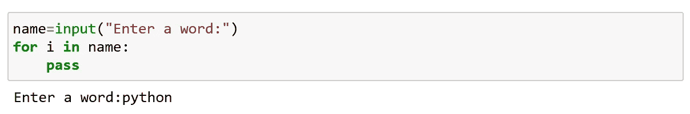

# Python 控制流语句

> 原文：<https://medium.com/analytics-vidhya/python-control-flow-statements-cca91964235?source=collection_archive---------22----------------------->

Python 流控制由条件语句、循环和函数调用来管理。

控制流语句

Python 如果…else 语句:

为了在编码中创建决策，我们使用不同形式的 if…else 语句。

用于在我们根据条件执行代码时做出决策。

检查条件:

1.满意:执行语句

2.不满意:执行 else 语句

重新运行程序。

记住，if…else 语句对<<test expression="">求值，只有当条件为真时才会执行主体；如果条件为假，将执行 else 语句。</test>

# 注意:不要忘记缩进

**Python if…elif…else 语句:**

elif 是 else…if 的缩写形式

用于检查多个表达式。

当 if 条件失败时，它检查下一个块，即 elif 块，依此类推。

如果所有条件都不满足，它将执行 else 语句。

“If”块可以有多个“elif”块，但只能有一个“else”块。

**Elif 阶梯:**

当有多个 elif 语句时，称为 elif 阶梯。

**嵌套 if:**

当我们有如果…else inside if…else(loop inside loop)则称为嵌套 if。

再次运行代码:

再次运行:

**Python‘for’循环语句:**

For 循环用于迭代一系列元素[列表、元组、字符串]

遍历一个序列叫做遍历。

仅在列表末尾保持迭代。

**范围:**

返回一个对象，该对象产生从开始(含)到结束(不含)的整数序列。

**for 循环内部的条件:**

**Python while 循环语句:**

While 循环继续执行语句，直到给定的条件为真(继续迭代语句)。

While 循环通常在您不知道迭代必须发生多少次时使用。

现在让我们看一个 while with else 语句的例子，

For 和 while 循环称为原始循环。这些是入口控制回路。

**Python break 语句:**

为了改变循环的流程，我们使用中断并继续。

break 语句终止包含它的循环。

它不会移动到下一个迭代，而是在那里中断，之后不会执行任何东西。

程序的控制直接转到循环体之后的语句。

如果 break 语句在嵌套循环中(循环在循环中)，break 将终止最内层的循环。

*break* 是 break 语句的语法

**Python 继续语句:**

Continue 跳过迭代并在跳过的迭代后打印下一个变量。

*continue* 是 continue 语句的语法。

**Python pass 语句:**

Pass 用作占位符。

在某些情况下，我们可能有一个尚未实现但将来会实现的循环或函数。

我们使用 pass 语句来构造一个不存在的几何体。

简单地说，我们使用 pass，而不是让循环或函数为空。

我们可以在空函数和类中使用 pass。

我们已经看到了如何使用控制流语句——if、while 和 for 以及它们相关的 break 和 continue 语句。这些是 Python 最常用的部分，因此，熟悉它们是必不可少的。

快乐编码…😊😊😊