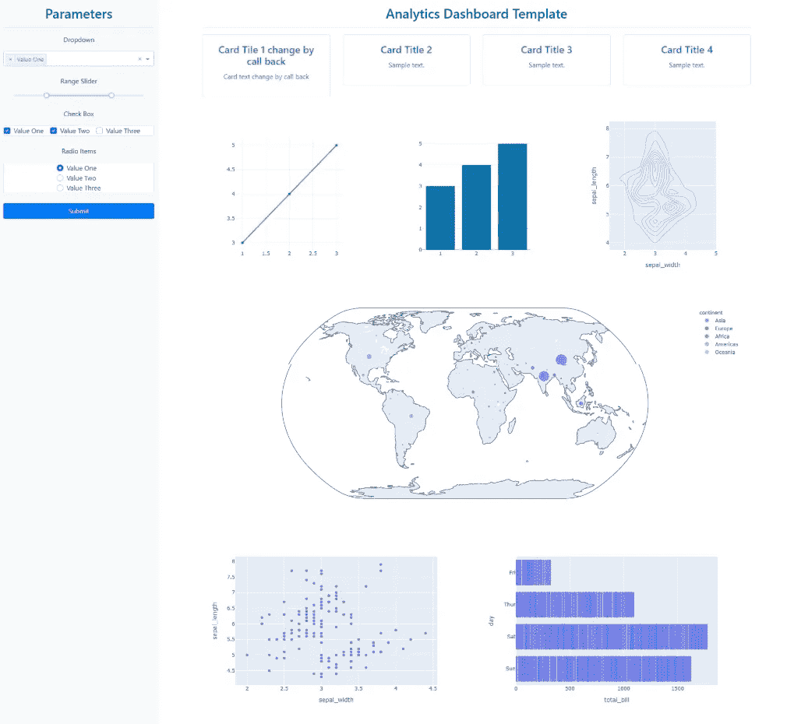
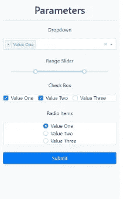
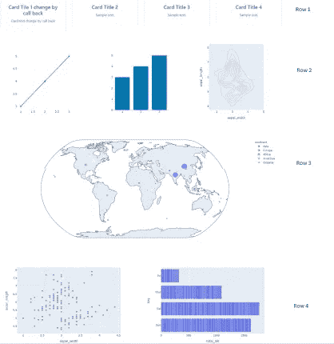

# Python Dash 数据可视化仪表板 Web 应用程序模板

> 原文：<https://medium.com/analytics-vidhya/python-dash-data-visualization-dashboard-template-6a5bff3c2b76?source=collection_archive---------0----------------------->

在本教程中，我将分享一个使用 Python Dash 的数据可视化 web 应用仪表板的示例模板，如下所示。



这是一个示例模板，可以使用 Python Dash 并连接正确的数据源来快速创建仪表板。之前的 Python 和 Dash 背景将有助于理解本文。

我将在文章中浏览代码，并分享 GitHub 代码的链接，供任何人使用。

```
import dash
import dash_bootstrap_components as dbc
import dash_core_components as dcc
import dash_html_components as html
from dash.dependencies import Input, Output, State

import plotly.express as px
```

导入相关的库。pip 安装任何缺失的库。

该模板使用 Dash bootstrap、Dash HTML 和 Dash 核心组件。

“dbc”是 dash boostrap 组件，“dcc”是 dash 核心组件，“html”是 dash html 组件

布局由侧边栏和主要内容页面组成

应用程序初始化为:

```
app = dash.Dash(external_stylesheets=[dbc.themes.BOOTSTRAP])
app.layout = html.Div([sidebar, content])
```

侧边栏由参数标题和控件组成。

```
sidebar = html.Div(
    [
        html.H2('Parameters', style=TEXT_STYLE),
        html.Hr(),
        controls
    ],
    style=SIDEBAR_STYLE,
)
```

下面是侧边栏的所有控件，包括下拉列表、范围滑块、检查表和单选按钮。一个可以扩展添加自己的。



```
controls = dbc.FormGroup(
    [
        html.P('Dropdown', style={
            'textAlign': 'center'
        }),
        dcc.Dropdown(
            id='dropdown',
            options=[{
                'label': 'Value One',
                'value': 'value1'
            }, {
                'label': 'Value Two',
                'value': 'value2'
            },
                {
                    'label': 'Value Three',
                    'value': 'value3'
                }
            ],
            value=['value1'],  # default value
            multi=True
        ),
        html.Br(),
        html.P('Range Slider', style={
            'textAlign': 'center'
        }),
        dcc.RangeSlider(
            id='range_slider',
            min=0,
            max=20,
            step=0.5,
            value=[5, 15]
        ),
        html.P('Check Box', style={
            'textAlign': 'center'
        }),
        dbc.Card([dbc.Checklist(
            id='check_list',
            options=[{
                'label': 'Value One',
                'value': 'value1'
            },
                {
                    'label': 'Value Two',
                    'value': 'value2'
                },
                {
                    'label': 'Value Three',
                    'value': 'value3'
                }
            ],
            value=['value1', 'value2'],
            inline=True
        )]),
        html.Br(),
        html.P('Radio Items', style={
            'textAlign': 'center'
        }),
        dbc.Card([dbc.RadioItems(
            id='radio_items',
            options=[{
                'label': 'Value One',
                'value': 'value1'
            },
                {
                    'label': 'Value Two',
                    'value': 'value2'
                },
                {
                    'label': 'Value Three',
                    'value': 'value3'
                }
            ],
            value='value1',
            style={
                'margin': 'auto'
            }
        )]),
        html.Br(),
        dbc.Button(
            id='submit_button',
            n_clicks=0,
            children='Submit',
            color='primary',
            block=True
        ),
    ]
)
```

我使用 Dash Boostrap 布局的主要内容页面的布局

[https://dash-bootstrap-components . open source . faculty . ai/docs/components/layout/](https://dash-bootstrap-components.opensource.faculty.ai/docs/components/layout/)

主内容页面有一个标题，然后分成 4 行。



第一排有 4 张卡片，第二排有 3 个数字，第三排有 1 个数字，第四排有 2 个数字。

```
content = html.Div(
    [
        html.H2('Analytics Dashboard Template', style=TEXT_STYLE),
        html.Hr(),
        content_first_row,
        content_second_row,
        content_third_row,
        content_fourth_row
    ],
    style=CONTENT_STYLE
)
```

下面是包含 4 张卡片的第一行。

```
content_first_row = dbc.Row([
    dbc.Col(
        dbc.Card(
            [

                dbc.CardBody(
                    [
                        html.H4(id='card_title_1', children=['Card Title 1'], className='card-title',
                                style=CARD_TEXT_STYLE),
                        html.P(id='card_text_1', children=['Sample text.'], style=CARD_TEXT_STYLE),
                    ]
                )
            ]
        ),
        md=3
    ),
    dbc.Col(
        dbc.Card(
            [

                dbc.CardBody(
                    [
                        html.H4('Card Title 2', className='card-title', style=CARD_TEXT_STYLE),
                        html.P('Sample text.', style=CARD_TEXT_STYLE),
                    ]
                ),
            ]

        ),
        md=3
    ),
    dbc.Col(
        dbc.Card(
            [
                dbc.CardBody(
                    [
                        html.H4('Card Title 3', className='card-title', style=CARD_TEXT_STYLE),
                        html.P('Sample text.', style=CARD_TEXT_STYLE),
                    ]
                ),
            ]

        ),
        md=3
    ),
    dbc.Col(
        dbc.Card(
            [
                dbc.CardBody(
                    [
                        html.H4('Card Title 4', className='card-title', style=CARD_TEXT_STYLE),
                        html.P('Sample text.', style=CARD_TEXT_STYLE),
                    ]
                ),
            ]
        ),
        md=3
    )
])
```

更多关于 dash 卡的参考资料可以在这里找到

 [## 卡片— dbc 文档

### 编辑描述

dash-bootstrap-components . open source . faculty . ai](https://dash-bootstrap-components.opensource.faculty.ai/docs/components/card/) 

下面是第二行，有两列数字。

```
content_second_row = dbc.Row(
    [
        dbc.Col(
            dcc.Graph(id='graph_1'), md=4
        ),
        dbc.Col(
            dcc.Graph(id='graph_2'), md=4
        ),
        dbc.Col(
            dcc.Graph(id='graph_3'), md=4
        )
    ]
)
```

下面是第三行，其中一列有一个图形。

```
content_third_row = dbc.Row(
    [
        dbc.Col(
            dcc.Graph(id='graph_4'), md=12,
        )
    ]
)
```

下面是最后一行，有两列数字。

```
content_fourth_row = dbc.Row(
    [
        dbc.Col(
            dcc.Graph(id='graph_5'), md=6
        ),
        dbc.Col(
            dcc.Graph(id='graph_6'), md=6
        )
    ]
)
```

图形回调示例。这可以扩展到使用任何人选择的数据源和数据。

```
@app.callback(
    Output('graph_1', 'figure'),
    [Input('submit_button', 'n_clicks')],
    [State('dropdown', 'value'), State('range_slider', 'value'), State('check_list', 'value'),
     State('radio_items', 'value')
     ])
def update_graph_1(n_clicks, dropdown_value, range_slider_value, check_list_value, radio_items_value):
    print(n_clicks)
    print(dropdown_value)
    print(range_slider_value)
    print(check_list_value)
    print(radio_items_value)
    fig = {
        'data': [{
            'x': [1, 2, 3],
            'y': [3, 4, 5]
        }]
    }
    return fig
```

卡片回拨示例。这可以扩展到在卡片上显示动态文本。

```
@app.callback(
    Output('card_title_1', 'children'),
    [Input('submit_button', 'n_clicks')],
    [State('dropdown', 'value'), State('range_slider', 'value'), State('check_list', 'value'),
     State('radio_items', 'value')
     ])
def update_card_title_1(n_clicks, dropdown_value, range_slider_value, check_list_value, radio_items_value):
    print(n_clicks)
    print(dropdown_value)
    print(range_slider_value)
    print(check_list_value)
    print(radio_items_value)  # Sample data and figure
    return 'Card Tile 1 change by call back'

@app.callback(
    Output('card_text_1', 'children'),
    [Input('submit_button', 'n_clicks')],
    [State('dropdown', 'value'), State('range_slider', 'value'), State('check_list', 'value'),
     State('radio_items', 'value')
     ])
def update_card_text_1(n_clicks, dropdown_value, range_slider_value, check_list_value, radio_items_value):
    print(n_clicks)
    print(dropdown_value)
    print(range_slider_value)
    print(check_list_value)
    print(radio_items_value)  # Sample data and figure
    return 'Card text change by call back'
```

组件的 CSS。侧边栏的位置是固定的(滚动页面不会改变侧边栏)。宽度、右边距和左边距以百分比表示，以便网页根据大小动态改变大小。

```
# the style arguments for the sidebar.
SIDEBAR_STYLE = {
    'position': 'fixed',
    'top': 0,
    'left': 0,
    'bottom': 0,
    'width': '20%',
    'padding': '20px 10px',
    'background-color': '#f8f9fa'
}

# the style arguments for the main content page.
CONTENT_STYLE = {
    'margin-left': '25%',
    'margin-right': '5%',
    'top': 0,
    'padding': '20px 10px'
}

TEXT_STYLE = {
    'textAlign': 'center',
    'color': '#191970'
}

CARD_TEXT_STYLE = {
    'textAlign': 'center',
    'color': '#0074D9'
}
```

模板源代码的 Github 库。

[](https://github.com/ishanmehta17/dash_template) [## ishanmehta17/dash_template

### Python Dash 数据可视化模板。通过在…上创建帐户，为 ishanmehta17/dash_template 开发做出贡献

github.com](https://github.com/ishanmehta17/dash_template) 

您可以在“src”文件夹中找到 dash_template.py 文件。运行这个可以在 [http://127.0.0.1:8085/](http://127.0.0.1:8085/) 上查看 web app 页面

几个参考链接

 [## 仪表板引导组件

### dash-bootstrap-components 是 Plotly Dash 的一个引导组件库，它使构建更容易…

dash-bootstrap-components . open source . faculty . ai](https://dash-bootstrap-components.opensource.faculty.ai/)  [## Dash 用户指南

### Plotly Dash 用户指南和文档

dash.plotly.com](https://dash.plotly.com/) 

[https://plotly.com/python/plotly-express/](https://plotly.com/python/plotly-express/)