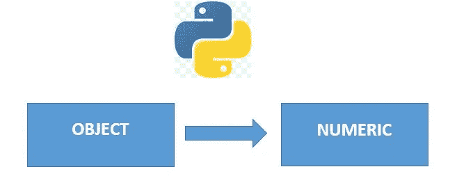
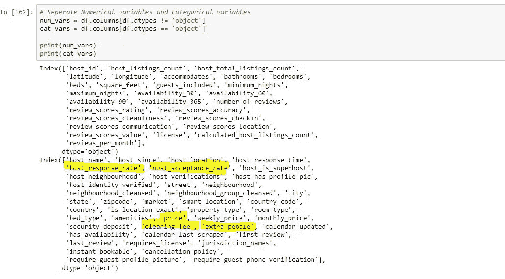
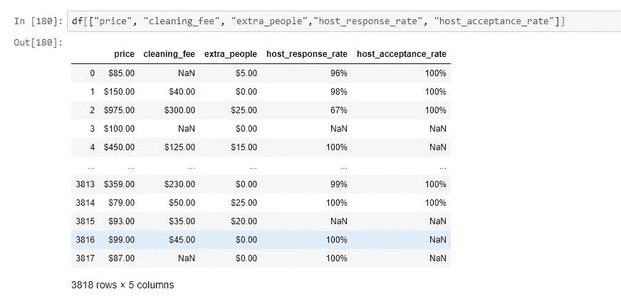
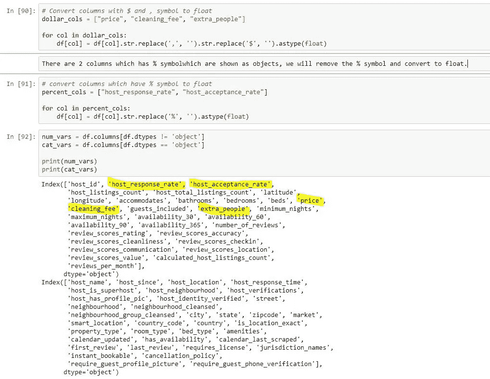

# Python 数据清理:将字符串对象转换为数字对象

> 原文：<https://medium.com/analytics-vidhya/python-data-cleaning-convert-string-objects-to-numeric-64ccfb1a2f33?source=collection_archive---------10----------------------->

# **简介:**

在从事任何数据科学项目时，大部分时间都花在数据清理和准备数据以应用机器学习算法上。

在许多这样的情况下，你可能会发现数据被标记为 object，而它本应该是数字的。例如，包含价格的数据集可能具有格式为$100，000 的价格。由于数据具有特殊字符，如“$”和“，”该列被视为对象，而不是数字。

在本文中，我们将介绍如何将这些类型的列从 object 转换为 numeric。

在本练习中，我将使用西雅图 Airbnb 数据中的“listings.csv”数据文件。数据可以在这个链接下找到:【https://www.kaggle.com/airbnb/seattle?select=listings.csv 

**第一步:加载数据框并研究数据框的结构。**

我们将加载数据帧并研究数据帧的结构。正如您在下面看到的，有 62 列标记为 objects，30 列标记为 numeric (float 和 int)

**第 2 步:浏览数值列和对象列:**

查看 object 和 numeric 列，您可以看到一些包含数值的列被视为对象。

**步骤 3:浏览被错误标记为对象的列**

在研究这些列的数据时，我发现这些列在数据中有特殊字符，如“$”、“”和“”。因此，这些列被视为对象，而不是数字。

**第四步:去除特殊字符，转换为数字**

下一步是从这些列中删除特殊字符并转换成数字。由于 host_response_rate 和 host_acceptance_rate 与其他 3 个相比具有不同的特殊字符，因此我们将分别处理它们。

您可以使用“str.replace”函数来删除特殊字符。因为我们有多列，所以我们可以遍历每一列并删除特殊字符。

正如您在下面看到的，这些列在去除特殊字符后被标记为数字。

# **结论**

在本文中，我们研究了数据清理过程中的一个重要步骤，即当列应该是数字时，如何处理被标记为对象的列。

我们讨论了如何使用 str.replace()删除特殊字符并将它们转换成数字。