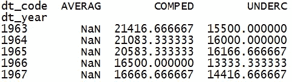

# Python 中数据操作的一站式指南

> 原文：<https://medium.com/analytics-vidhya/python-data-manipulation-fb86d0cdd028?source=collection_archive---------0----------------------->


对于那些正在寻找所有数据操作代码和语法的一站式读物的读者来说，这篇文章非常有帮助。在本文中,‘PANDAS’库被用于数据操作。Pandas 是一个流行的 Python 数据分析工具。它提供了易于使用和高效的数据结构。这些数据结构处理以表格形式存储的数字或标签数据。

本文涵盖的主题:


# 1.资料组

美国房屋销售，1963 年至 2016 年:全国和地区已出售和待售的新独栋房屋数量数据。还提供了关于中值和平均价格、按建设阶段划分的已出售和待售房屋数量的全国数据，以及其他统计数据。来自美国人口普查，经济时间序列指标。美国商务部 Enigma.io 提供的数据。

数据集有 20，404 行和 20 列。

# 2.将你的数据放入数据框架

**从 CSV 文件加载数据帧**

```
df = pd.read_csv(‘file.csv’)df = pd.read_csv(‘file.csv’, header=0, index_col=0, quotechar=’”’,sep=’:’, na_values = [‘na’, ‘-‘, ‘.’, ‘’])
```


# 3.保存数据帧

**将数据帧保存到 CSV 文件**

```
df.to_csv(‘name.csv’, encoding=’utf-8')
```

**将数据帧保存到 Python 字典**

```
dictionary = df.to_dict()
```

**将数据帧保存到 Python 字符串**

```
string = df.to_string()
```

# 4.使用整个数据框架

**查看数据帧内容**

```
df.info()
```


**列统计汇总**

```
df.describe()
```


**头**

```
df.head(n)
```

**尾巴**

```
df.tail(n)
```

**形状(行数、列数)**

```
df.shape
```


# 5.使用行—第 1 部分

**守排**

```
df = df[df['cat_code']== 'SOLD']
```


**删除行**

```
df = df[(df['dt_code']!= 'MEDIAN') & (df['dt_code']!= 'NOTSTD') &(df['dt_code']!= 'TOTAL')]
```

**删除空值(NaN)**

```
df = df[pd.notnull(df['dt_code'])]
```


# 6.使用列—第 1 部分

**删除列**

```
df = df.drop(['et_idx','et_code','et_desc','et_unit'], axis=1)
```

**保管栏**

```
df = df[['per_name','dt_code','dt_desc','dt_unit','val']]
```


**向数据帧添加新列**

```
df['dt_year'] = df['per_name'].str[0:4]
```


# 7.用户定义的函数

**使用函数创建新列**

```
def price (x):
   if x.dt_unit == "K": return(x.val*1000)
   else: return(x.val)
   df['dt_val'] = df[['dt_unit','val']].apply(price, axis=1)
```


# 8.清洗数据集

**创建三个数据集**

```
df_UNDERC = df[df['dt_code']==’UNDERC’]df_COMPED = df[df['dt_code']==’COMPED’]df_AVERAG = df[df['dt_code']==’AVERAG’]
```

**保管栏**

```
df_UNDERC = df_UNDERC[['per_name','dt_year','dt_val']]df_COMPED = df_COMPED[['per_name','dt_year','dt_val']]df_AVERAG = df_AVERAG[['per_name','dt_year','dt_val']]
```

**重命名列**

```
df_UNDERC = df_UNDERC.rename(columns={'dt_val':'UNDERC'})df_COMPED = df_COMPED.rename(columns={'dt_val':'COMPED'})df_AVERAG = df_AVERAG.rename(columns={'dt_val':'AVERAG'})
```


# 9.连接/组合数据帧和分组依据

**在列上合并**

```
df_new = pd.merge(left=df_AVERAG, right=df_COMPED, how='left',left_on='per_name',right_on='per_name')df_new = pd.merge(left=df_new, right=df_UNDERC, how='left',left_on='per_name',right_on='per_name')
```

**分组——应用聚合函数**

```
gb = df_new.groupby(['dt_year'])['AVERAG','COMPED','UNDERC'].agg(np.mean)
```


# 10.图表和统计

**单线图**

```
gb['AVERAG'].plot.line(color= 'green')
```


**多线条图形**

```
gb[['COMPED','UNDERC']].plot.line()
```


**相关性**

```
gb.corr()
```


**分位数**

```
quants = [0.05, 0.25, 0.5, 0.75, 0.95]df_new = gb.quantile(quants)
```


**直方图**

```
import matplotlib.pyplot as pltcount, bins = np.histogram(gb['AVERAG'],bins=5)plt.hist(gb['AVERAG'],bins=5,color='gray',edgecolor='white')
```


# 11.使用行—第 2 部分

**对数据帧的行值进行排序**

```
gb = gb.sort_values(by='AVERAG',ascending=False)
```


**按行索引对数据帧进行排序**

```
gb = gb.sort_index()
```


**按整数位置选择一片行**

```
gb = gb[32:]
```


# 12.使用列—第 2 部分

**在**栏中找到最小/最大值的索引标签

```
print(gb['AVERAG'].idxmin())print(gb['AVERAG'].idxmax())
```


**整体数据框架上的数学**

```
print(gb.count())print(gb.mean())
```


**常见的全列方法**

```
print(gb['AVERAG'].count())print(gb['AVERAG'].mean())print(gb['AVERAG'].describe())
```

**常见的基于元素的方法**

```
s = gb['AVERAG'].fillna(0)s = df_new['AVERAG'].cumsum()
```

**对列应用 numpy 数学函数**

```
df_new['log_data'] = np.log(df_new['AVERAG'])df_new['rounded'] = np.round(df_new['log_data'], 2)
```

# 13.使用单元格

**通过行列标签选择单元格**

```
print('AVG price in 1996: ',round(gb.loc['1996','AVERAG'],2))print('AVG price in 2006: ',round(gb.loc['2006','AVERAG'],2))print('AVG price in 2016: ',round(gb.loc['2016','AVERAG'],2))
```


**通过行列标签设置单元格**

```
gb.loc['1976','AVERAG'] = -1000
```

**选择并切割标签**

```
df_new = gb.loc['2007':'2016', 'AVERAG':'UNDERC']
```


**选择行**

```
print(gb.loc['2016'])
```


**选择列**

```
print(gb['AVERAG'])
```

# 14.处理缺少的值和字符串

**删除所有有 NaN 的行**

```
df = df.dropna()
```

**删除所有带 NaN 的列**

```
df = df.dropna(axis=1)
```

**删除 NaN 出现两次以上的所有行**

```
df=df.dropna(thresh=2)
```

**删除特殊列中出现 NaN 的所有行**

```
df = df.dropna(df['AVERAG'].notnull())
```

**记录所有缺失数据**

```
df.fillna(0, inplace=True)
```

**在特殊栏中记录缺失数据**

```
s = df['AVERAG'].fillna(0)
```

**使用琴弦**

```
s = df['col'].str.lower()s = df['col'].str.upper()s = df['col'].str.len()s = df['col'].str.replace('old', 'new')
```

# 15.数据透视表

**枢轴**

```
df_pt = pd.pivot_table(df,index='dt_year',columns='dt_code',values='dt_val',aggfunc=np.mean)
```

**头**

```
df_pt.head()
```



**尾巴**

```
df_pt.tail()
```

