# Python 数据项目 Ipywidgets 增强的数据分析 UI

> 原文：<https://medium.com/analytics-vidhya/python-data-projects-data-analysis-ui-reinforced-by-ipywidgets-d680493464b8?source=collection_archive---------1----------------------->

Jupyter 笔记本附带 ipywidget 插件，提供舒适的交互式用户体验。

在本帖中，我们将构建一个 ipywidget 框架，该框架:

*   **检索**源数据(CSV 格式)并解析内容，
*   **补充**统计和元信息，以及
*   **用普通 matplotlib 图绘制**数据

预期的设计和实际功能

面对现实吧！任何处理 CSV 数据的人，尤其是在开发一个非常小的函数时，都必须接受这样一个事实:这是一个非常麻烦的过程，因为每个文件都有特殊的格式、定界、meta|top 头、总计等。否则，函数的通用性就相当有限。因此，我们应该定义并坚持一种促进用户体验的方式，这种方式允许用户在选项中进行交互选择。

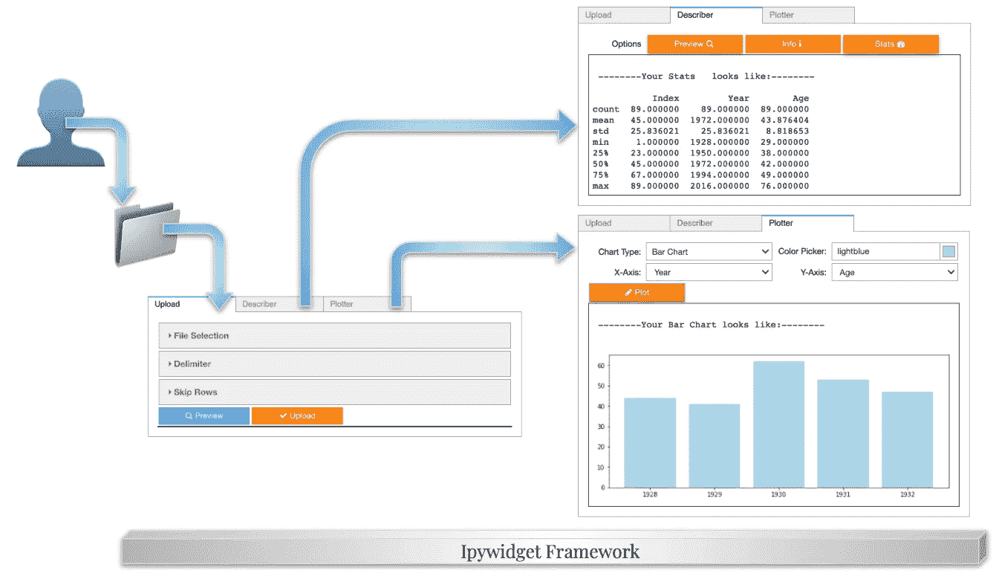

典型的场景流程

让我们从消化一般的 ipywidget 框架和小部件类型开始。

# Ipywidget 布局结构和小部件类型

在开发 ipywidget 实现时，首先要做的是创建布局并将小部件分布到。下图总结了我们的目标。

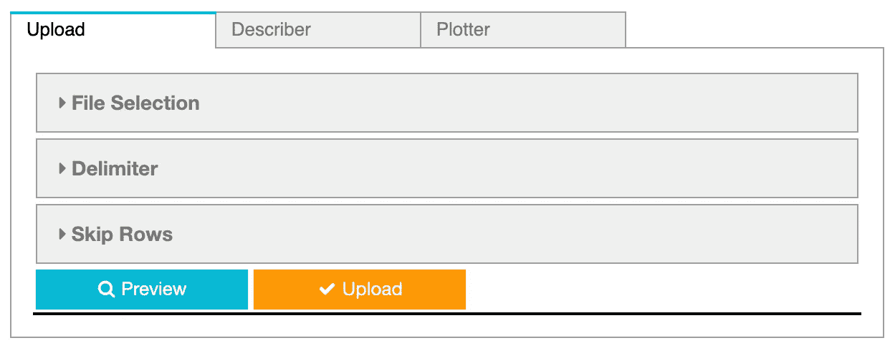

预期布局预览

是时候应用逆向工程技术并仔细检查它的组件了。

## 标签结构

在布局中，存在一个 3- *partite* 选项卡结构，每个选项卡包含不同的子窗口小部件，这些子窗口小部件协作实现项目目标；**检索**、**补充**和**剧情**。

```
tab = widgets.Tab()children = [...]                            # to be introducedtab.children = children
tab.set_title(0, "Upload")
tab.set_title(1, "Describer")
tab.set_title(2, "Plotter")
```

*children* 属性加载包含索引和名称的选项卡列表。

## 折叠式小部件

在*上传*选项卡中，我们面对的是一个超级用户友好的折叠式小部件，尤其是在要遵循顺序流程的情况下。

```
accordion = widgets.Accordion(children=[...])    # to be introduced
accordion.set_title(0, 'File Selection')
accordion.set_title(1, 'Delimiter')
accordion.set_title(2, 'Skip Rows')
```

就像选项卡小部件一样，可以通过*子*属性和 *set_title()* 方法引入层级系统。

## 按钮部件

按钮部件是触发元素，用户单击它来检索预期的操作。

```
button_preview = widgets.Button(
    description='Preview',
    disabled=False,
    button_style='info',
    tooltip='Click to Preview',
    icon='search')def preview():
    ...  # to be introduceddef preview_clicked(b):
    preview()button_preview.on_click(preview_clicked)
```

由于我们可以通过*描述*、*按钮样式*和*图标*属性来增强按钮的视觉效果，也可以通过 *on_click()* 等方法来增强功能。现在，让我们将功能保存到下面的相关部分。

## 输出部件

命名应该是直截了当的，输出小部件动态呈现数据的快照。

```
out = widgets.Output(layout={'border': '1px solid black'}).
.
.with out:
        out.clear_output()
        print('\n -----Now this is how your DF looks like:----- \n')
        if df is not None:
            print(df.head(10))
        else:
            print('Configuration is wrong/missing...')
```

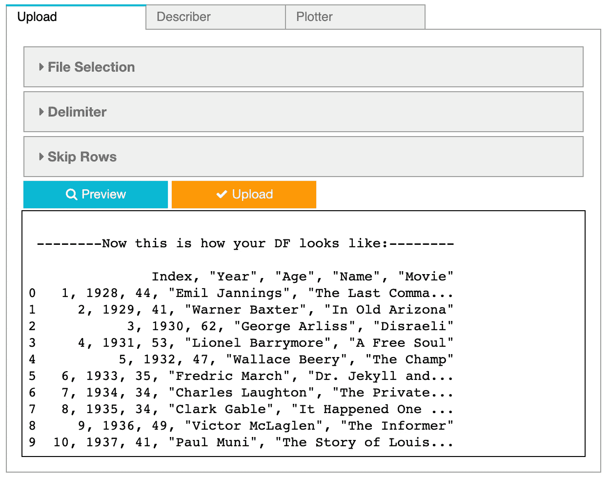

输出小部件预览

## 文件上传小部件

同样，顾名思义，FileUpload 小部件被激活以向系统提供原始数据。

```
up = widgets.FileUpload(accept="", multiple=False)
```

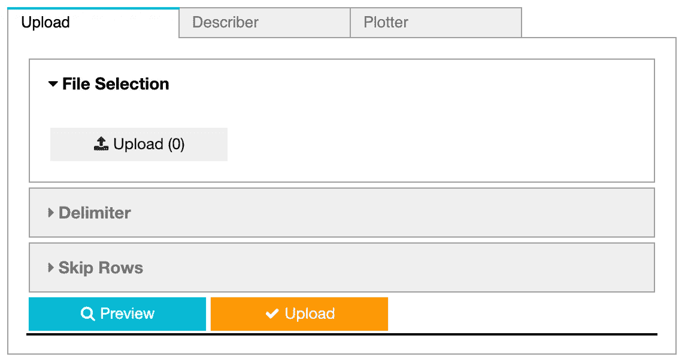

文件上传小部件预览

## 单选按钮小部件

RadioButtons 小部件用于在选项中进行单一选择。

```
# RadioButtons widget instantiation
delim = widgets.RadioButtons(
    options=[';', ',', ' '],
    description='Separator: ',
    disabled=False
)
```

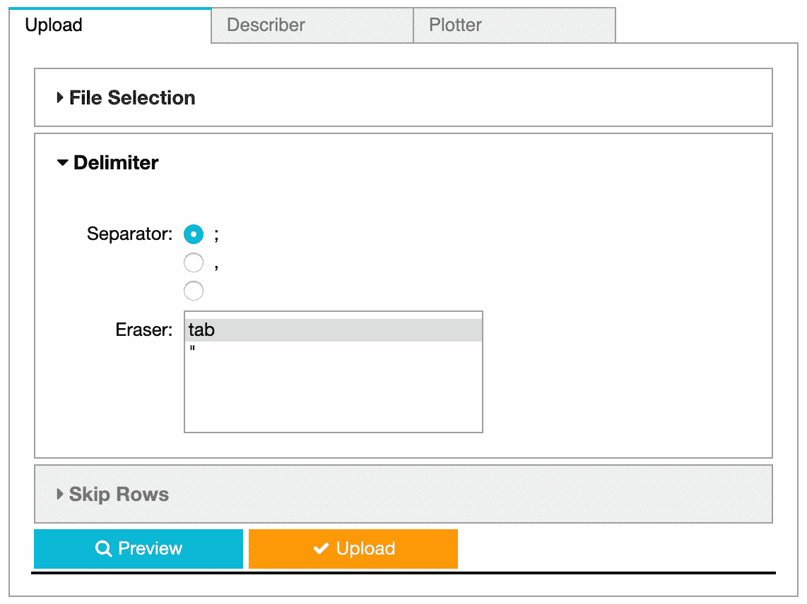

单选按钮和选择多个小部件预览

## 选择多个小部件

SelectMultiple 小部件允许在不同的选项中进行多重选择。

```
# SelectMultiple widget instantiation
eraser = widgets.SelectMultiple(
    options=['tab','"'],
    value=['tab'],
    #rows=10,
    description='Eraser: ',
    disabled=False
)
```

## IntSlider 小工具

IntSlider 小部件提供了在滑动选择器上定义数值大小和预定义最小-最大频谱配置的可能性。

```
# IntSlider widget instantiation
rows = widgets.IntSlider(
    value=0,
    step=1,
    description='# of lines:',
    disabled=False,
    continuous_update=False,
    orientation='horizontal',
    readout=True,
    readout_format='d'
)
```

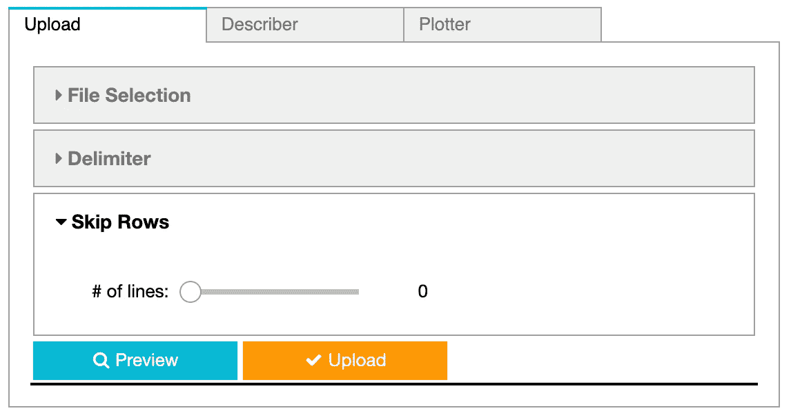

IntSlider Widget 预览

## ToggleButtons 构件

ToggleButtons，由于两者；体现一个标准按钮的功能并允许在不同的选项中进行选择是强视觉类型。

```
# ToggleButtons widget instantiation
toggle = widgets.ToggleButtons(
    options=['Preview', 'Info', 'Stats'],
    description='Options',
    disabled=False,
    button_style='warning',
    icons=['search', 'info', 'tachometer']
)
```

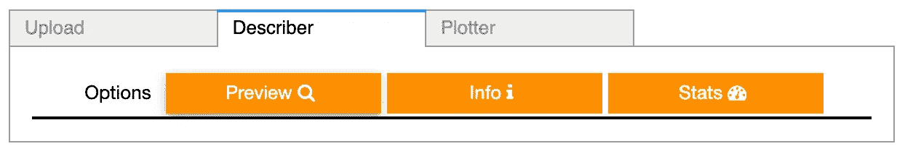

ToggleButtons 部件预览

## 下拉小工具

Dropdown widget 是单一选择器的又一个例子。在典型的用法中，用户被要求选择一个由开发人员预先定义或动态更新的选项。

```
# Dropdown widget instantiation
graph_type = widgets.Dropdown(
    options=['Bar Chart', 'Line Chart'],
    value='Bar Chart',
    description='Chart Type:',
    disabled=False,
)
```

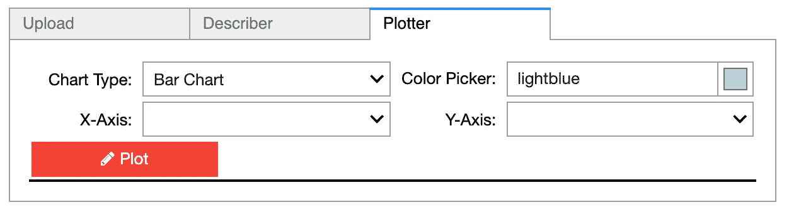

下拉菜单和颜色选择器小部件预览以及 HBox/VBox 的使用

## 颜色选择器小工具

ColorPicker 小部件进入场景，一旦颜色相关的值尚未定义。通过在调色板上选择一种色调，或者通过在小部件中引入颜色名称，来定义颜色。

```
# ColorPicker widget instantiation
color_picker = widgets.ColorPicker(
    concise=False,
    description='Color Picker: ',
    value='lightblue',
    disabled=False
)
```

## HBox/VBox

HBox/VBox，尽管都被评价为小部件，但它们缺乏独立的视觉形式。另一方面，HBox/VBox 用作容器，因此这些容器中的分组小部件将被定位，无论它们是横向( **H** 框)还是纵向(VBox)群集的 **V** 。

```
# 4 horizontal layers (VBox) and 2 columnar structure (HBox)
widgets.VBox([
        widgets.HBox([graph_type, color_picker]),
        widgets.HBox([x_axis, y_axis]), 
        button_plot,
        out
])
```

在完成视觉架构的练习后，现在是赋予按钮功能的时候了。

# 数据检索和解析

数据检索和内容解析过程中要遵循的步骤:

*   访问用户通过 FileUpload 小部件(“up”对象)共享的 CSV 内容；
*   根据从用户引入的参数(“delim”、“eraser”和“rows”对象)清理数据，并将数据对象转换成 pandas 数据帧；和
*   赋予按钮“预览”功能，用户可以随时观察数据快照，并“上传”以将数据存储在系统中。

## 通过文件上传小部件访问 CSV 的内容

一旦分析了通过 FileUpload 小部件获得的数据，很容易观察到原始数据存储在“content”字段下。

```
>>> print(up)FileUpload(value={'oscar_male.csv': {'metadata': {'name': 'oscar_male.csv', 'type': 'text/csv', 'size': 4413, 'lastModified': 1555765537290}, 'content': b'"Index", "Year", "Age", "Name", "Movie"\n 1, 1928, 44, "Emil Jannings", "The Last Command, The Way of All Flesh"\n 2, 1929, 41, "Warner Baxter", "In Old Arizona"\n 3, 1930, 62, "George Arliss", "Disraeli"\n 4, 1931, 53, "Lionel Barrymore", "A Free Soul"\n 5, 1932, 47, "Wallace Beery", "The Champ"\n 6, 1933, 35, "Fredric March", "Dr. Jekyll and Mr. Hyde"\n 7, 1934, 34, "Charles Laughton", "The Private Life of Henry VIII"\n 8, 1935, 34, "Clark Gable", "It Happened One Night"\n 9, 1936,...)
```

剩余部分提供了关于源文件的元信息，如文件类型等。

```
def content_parser():
    if up.value == {}:
        with out:
            print('No CSV loaded')    
    else:
        typ, content = "", ""
        up_value = up.value
        for i in up_value.keys():
            typ = up_value[i]["metadata"]["type"]        if typ == "text/csv":
            content = up_value[i]["content"]
            content_str = str(content, 'utf-8')
```

## 解析内容并将其传输到数据帧中

本文开头提到的事实会重复出现，每个 CSV 的结构各不相同。默认情况下，选取的分隔符是“；”，然而实际上，“”将细胞彼此分开。输出小部件揭示了事实。

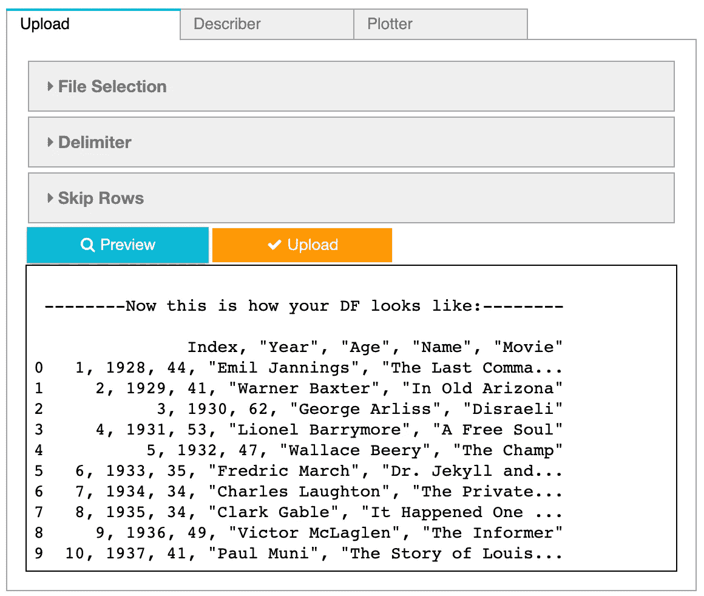

预览按钮上的数据快照以及分隔符和橡皮擦输入的选择

为此，Accordion 小部件中的“分隔符”部分以及“橡皮擦”部分都必须重新调整。这样，就可以进行正确的解析。

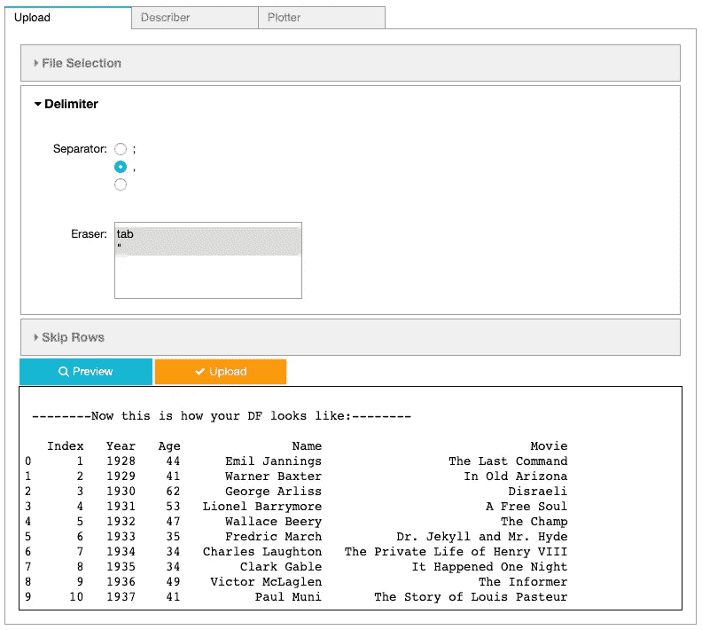

正确解析后输出小部件

用户引入的所有值都可以通过小部件的“值”属性捕获，并在函数中重用。

```
def content_parser():
    if up.value == {}:
        with out:
            print('No CSV loaded')    
    else:
        typ, content = "", ""
        up_value = up.value
        for i in up_value.keys():
            typ = up_value[i]["metadata"]["type"]                if typ == "text/csv":
            content = up_value[i]["content"]
            content_str = str(content, 'utf-8')

            if eraser.value != {}: 
                for val in eraser.value:
                    if val == "tab":
                        content_str = content_str.replace("\t","")
                    else:
                        content_str = content_str.replace(val,"")
            if content_str != "":
                str_io = StringIO(content_str) 
                return str_iodef df_converter():
    content = content_parser()
    if content is not None:
        df = pd.read_csv(
             content, 
             sep=delim.value, 
             index_col=False, 
             skiprows=rows.value)    
        return df
    else:
        return None
```

## 逐步流程监控和上传最终 CSV

由于“预览”按钮的功能，可以监控中间结果，并通过“上传”按钮，最终 CSV 可以上传到系统中。

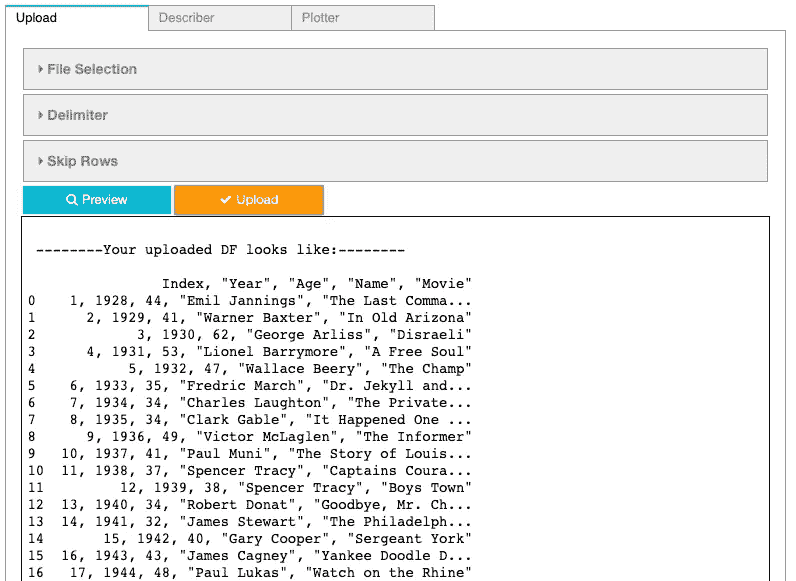

流程中预览按钮的用法

“上传”和“预览”按钮的主要区别在于，在“上传”动作之后，“绘图仪”选项卡中的轴选项会根据加载的数据进行更新。正如我们在场景中所观察到的，在窗口小部件内部以及窗口小部件和用户之间有一个动态的通信。

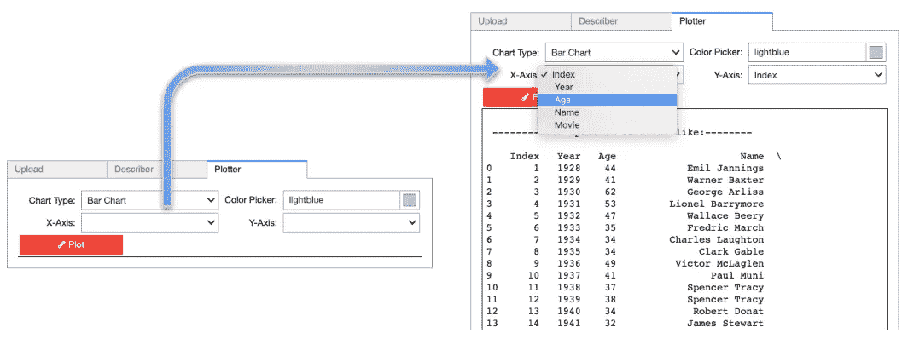

加载 CSV 后动态更新下拉选项值

```
def preview():
    df = df_converter()
    with out:
        out.clear_output()
        print('\n -----Now this is how your DF looks like:----- \n')
        if df is not None:
            print(df.head(10))
        else:
            print('Configuration is wrong/missing...')def upload():
    df = df_converter()
    with out:
        out.clear_output()
        print('\n -----Your uploaded DF looks like:----- \n')
        if df is not None:
            print(df)
            x_axis.options = df.columns  # Dropdown Widget update
            y_axis.options = df.columns  # Dropdown Widget update
        else:
            print('Configuration is wrong/missing...')def preview_clicked(b):
    preview()def upload_clicked(b):
    upload() # Assigning functionality to buttons
button_preview.on_click(preview_clicked)
button_upload.on_click(upload_clicked)
```

# 获取统计信息和元信息

在本文的范围内，我们所讨论的“统计”和“元”信息仅限于基本的数据帧操作，如“head()”、“info()”和“describe()”以及它们在输出小部件上的外观。

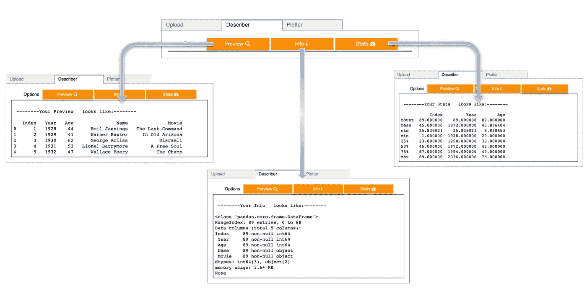

描述符选项卡预览

下面列出了每个 ToggleButton 的替代选项。在 ToggleButtons 中，由于使用了“observe()”方法，我们可以检索并返回当前值，而不是像处理按钮那样使用“on_click()”方法。

```
def desc():
    info_level = toggle.value
    if info_level != {}:
        df = df_converter()
        with out:
            out.clear_output()
            print('\n ------Your {} looks like:------ \n'.format(
                info_level))
            if df is not None:
                if info_level == 'Info  ':
                    print(df.info(verbose=True))
                elif info_level == 'Stats  ':
                    print(df.describe())
                elif info_level == 'Preview  ':
                    print(df.head(5))
                else:
                print('Configuration is wrong/missing...')toggle.observe(desc_clicked, 'value')
```

# 数据可视化

我们已经介绍了如何在上传原始文件时填充 X 和 Y 轴选项值。用户可以通过选择维度和度量来开始分析图表。除此之外，图形表示可以通过进一步的色彩和绘图风格得到加强。

为了将重点放在 ipywidget 主题上，我用简单的线图和条形图来限制可视化选项。在下文中，“图表类型”下拉菜单可用于定义图表样式。

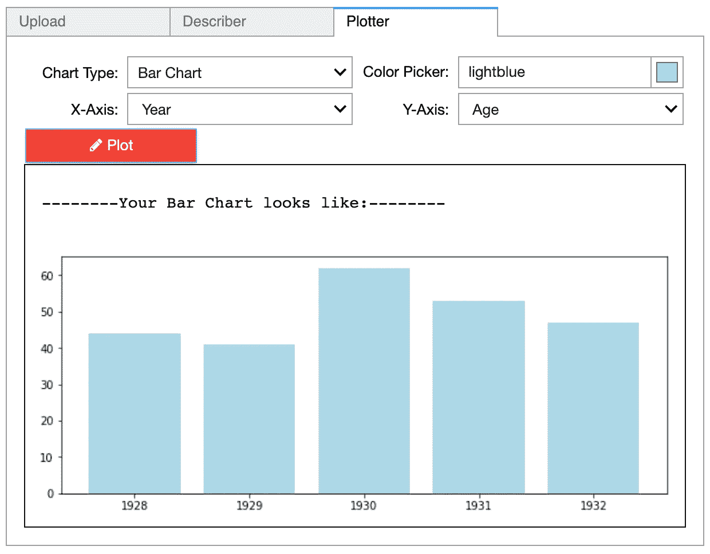

条形图可视化预览

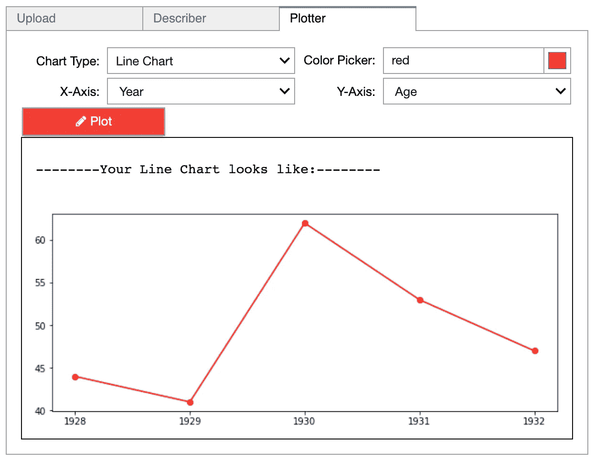

折线图可视化预览

```
def plot():
    graph = graph_type.value
    if graph != {}:
        df = df_converter()
        with out:
            out.clear_output()
            print('\n -----Your {} looks like:----- \n'.format(
                graph))
            if (df is not None):
                df = df.head(5)
                height = df[y_axis.value]
                bars = df[x_axis.value]
                y_pos = np.arange(len(height))
                plt.figure(figsize=(10,4))
                if graph == 'Bar Chart':
                    plt.bar(
                        y_pos, 
                        height, 
                        color=color_picker.value)
                    plt.xticks(y_pos, bars)
                elif graph == 'Line Chart':
                    plt.plot(
                        bars,
                        height, 
                        color=color_picker.value,
                        marker='o', 
                        linestyle='solid'
                    )
                    plt.xticks(bars)
                plt.show() def plotter_clicked(b):
    plot()button_plot.on_click(plotter_clicked)
```

通过考虑各种使用选项，上面介绍的实现可以进行开发和改进。让这个框架适应特殊的 CSV 格式、利基分析用例以及华而不实的图表简直是小菜一碟。

访问实施视频(仅提供土耳其语版本)👇

实施视频(用土耳其语解释)

要访问完整的 Python 代码👇

```
import pandas as pd
import sys
from io import StringIO
import numpy as np
import matplotlib.pyplot as plt
%matplotlib inlinetab = widgets.Tab()    
out = widgets.Output(layout={'border': '1px solid black'})
up = widgets.FileUpload(accept="", multiple=False)
delim = widgets.RadioButtons(
    options=[';', ',', ' '],
    description='Separator: ',
    disabled=False)eraser = widgets.SelectMultiple(
    options=['tab','"'],
    value=['tab'],
    #rows=10,
    description='Eraser: ',
    disabled=False)rows = widgets.IntSlider(
    value=0,
    step=1,
    description='# of lines:',
    disabled=False,
    continuous_update=False,
    orientation='horizontal',
    readout=True,
    readout_format='d')button_upload = widgets.Button(
    description='Upload',
    disabled=False,
    button_style='warning',
    tooltip='Click to Upload',
    icon='check')button_preview = widgets.Button(
    description='Preview',
    disabled=False,
    button_style='info',
    tooltip='Click to Preview',
    icon='search')button_plot = widgets.Button(
    description='Plot',
    disabled=False,
    button_style='danger',
    tooltip='Click to Plot',
    icon='pencil')graph_type = widgets.Dropdown(
    options=['Bar Chart', 'Line Chart'],
    value='Bar Chart',
    description='Chart Type:',
    disabled=False)x_axis = widgets.Dropdown(
    options=[''],
    value='',
    description='X-Axis:',
    disabled=False)y_axis = widgets.Dropdown(
    options=[''],
    value='',
    description='Y-Axis:',
    disabled=False)color_picker = widgets.ColorPicker(
    concise=False,
    description='Color Picker: ',
    value='lightblue',
    disabled=False)toggle = widgets.ToggleButtons(
    options=['Preview  ', 'Info  ', 'Stats  '],
    description='Options',
    disabled=False,
    button_style='warning',
    icons=['search', 'info', 'tachometer'])accordion = widgets.Accordion(children=[
    up, 
    widgets.VBox([delim, eraser]), 
    rows])
accordion.set_title(0, 'File Selection')
accordion.set_title(1, 'Delimiter')
accordion.set_title(2, 'Skip Rows')
accordion_box = widgets.VBox([
    accordion, 
    widgets.HBox([button_preview, button_upload]),
    out
])children = [
    accordion_box, 
    widgets.VBox([toggle, out]),
    widgets.VBox([
        widgets.HBox([graph_type, color_picker]),
        widgets.HBox([x_axis, y_axis]), 
        button_plot,
        out
])]tab.children = children
tab.set_title(0, "Upload")
tab.set_title(1, "Describer")
tab.set_title(2, "Plotter")
tabdef content_parser():
    if up.value == {}:
        with out:
            print('No CSV loaded')    
    else:
        typ, content = "", ""
        up_value = up.value
        for i in up_value.keys():
            typ = up_value[i]["metadata"]["type"]if typ == "text/csv":
            content = up_value[i]["content"]
            content_str = str(content, 'utf-8')

            if eraser.value != {}: 
                for val in eraser.value:
                    if val == "tab":
                        content_str = content_str.replace("\t","")
                    else:
                        content_str = content_str.replace(val,"")
            if content_str != "":
                str_io = StringIO(content_str) 
                return str_iodef df_converter():
    content = content_parser()
    if content is not None:
        df = pd.read_csv(content, sep=delim.value, index_col=False, skiprows=rows.value)    
        return df
    else:
        return Nonedef preview():
    df = df_converter()
    with out:
        out.clear_output()
        print('\n -----Now this is how your DF looks like:----- \n')
        if df is not None:
            print(df.head(10))
        else:
            print('Configuration is wrong/missing...')def upload():
    df = df_converter()
    with out:
        out.clear_output()
        print('\n --------Your uploaded DF looks like:-------- \n')
        if df is not None:
            print(df)
            x_axis.options = df.columns
            y_axis.options = df.columns
        else:
            print('Configuration is wrong/missing...')def desc():
    info_level = toggle.value
    if info_level != {}:
        df = df_converter()
        with out:
            out.clear_output()
            print('\n ------Your {} looks like:------ \n'.format(
                info_level))
            if df is not None:
                if info_level == 'Info  ':
                    print(df.info(verbose=True))
                elif info_level == 'Stats  ':
                    print(df.describe())
                elif info_level == 'Preview  ':
                    print(df.head(5))
                else:
                    print('Configuration is wrong/missing...')

def plot():
    graph = graph_type.value
    if graph != {}:
        df = df_converter()
        with out:
            out.clear_output()
            print('\n ------Your {} looks like:------ \n'.format(
                graph))
            if (df is not None):
                df = df.head(5)
                height = df[y_axis.value]
                bars = df[x_axis.value]
                y_pos = np.arange(len(height))
                plt.figure(figsize=(10,4))
                if graph == 'Bar Chart':
                    plt.bar(
                        y_pos, 
                        height, 
                        color=color_picker.value)
                    plt.xticks(y_pos, bars)
                elif graph == 'Line Chart':
                    plt.plot(
                        bars,
                        height, 
                        color=color_picker.value,
                        marker='o', 
                        linestyle='solid'
                    )
                    plt.xticks(bars)
                plt.show()

def preview_clicked(b):
    preview()def upload_clicked(b):
    upload()def desc_clicked(b):
    desc()def plotter_clicked(b):
    plot()

button_preview.on_click(preview_clicked)
button_upload.on_click(upload_clicked)
toggle.observe(desc_clicked, 'value')
button_plot.on_click(plotter_clicked)
```