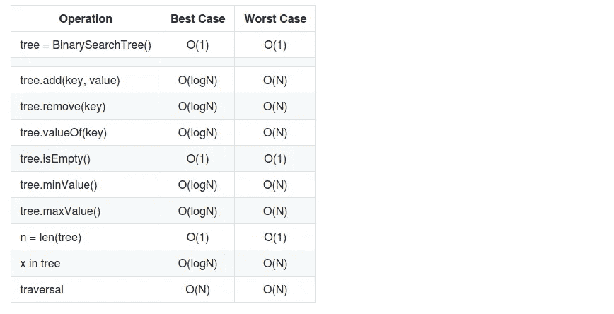
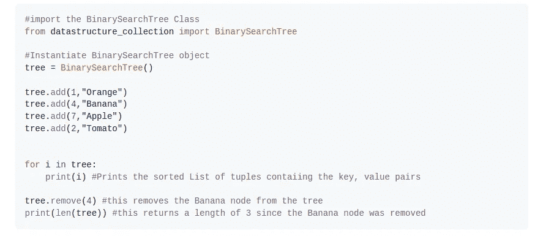
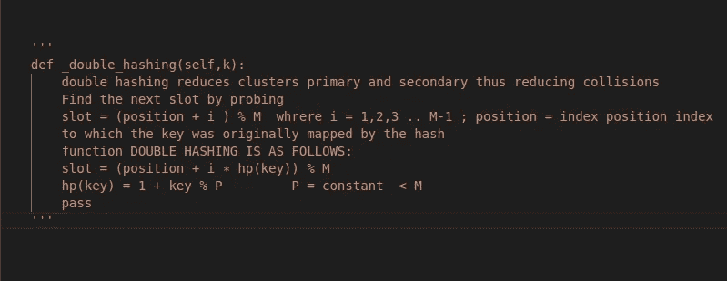
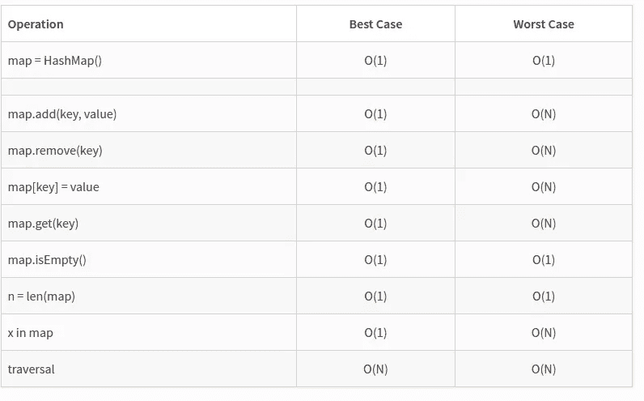
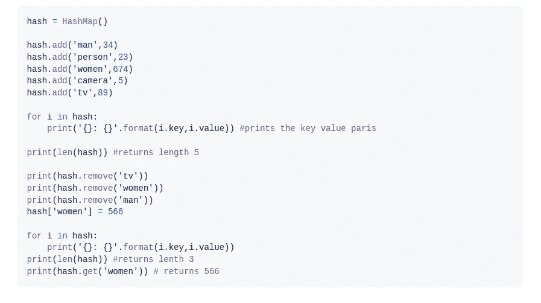
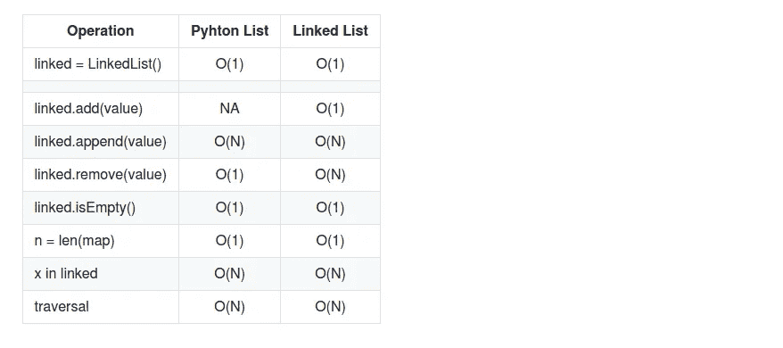
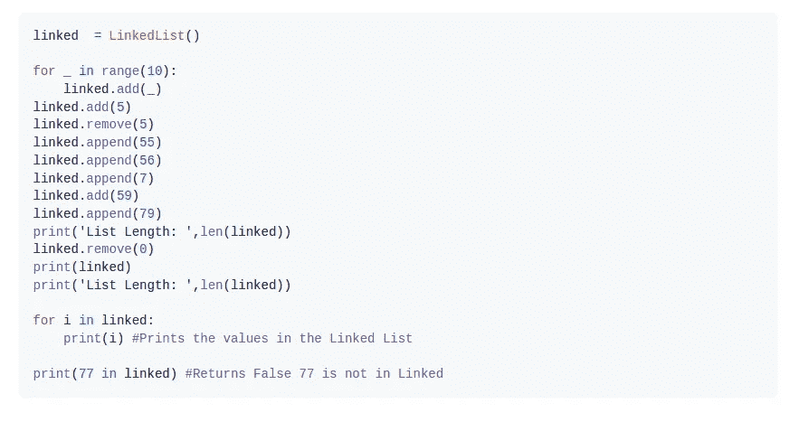

# Python 数据结构集合

> 原文：<https://medium.com/analytics-vidhya/python-data-structure-collection-2c2e1ea32fcc?source=collection_archive---------20----------------------->


用 Python 编写的 [datastructure_collection](https://pypi.org/project/datastructure-collection/) 帮助开发人员和大数据科学家实现快速高效的算法。

# 包裹

Pypi[data struct er _ collection](https://pypi.org/project/datastructure-collection/)包可以在[这里](https://pypi.org/project/datastructure-collection/)找到。

# 入门指南

datastructure_collection 有三个数据结构类:

1.  [二进制搜索树](https://github.com/nyakaz73/datastructure_collection.git)
2.  [散列表](https://github.com/nyakaz73/datastructure_collection.git)
3.  [链接列表](https://github.com/nyakaz73/datastructure_collection.git)

我期待在未来加入更多的数据结构。

# 装置

运行以下命令来安装软件包:

```
pip install datastructure_collection
```

# 使用

[示例](https://github.com/nyakaz73/datastructure_collection/blob/master/tests/datastructure_example.py)

要使用此软件包:

```
from datastructure_collection import BinarySearchTreefrom datastructure_collection import HashMapfrom datastructure_collection import LinkedList
```

# 1.二叉查找树

二叉查找树操作和时间复杂性如下表所示:



从上表可以看出，由于其搜索机制，二叉查找树比线性列表有优势。将在节点的左子节点少于右子节点的情况下对树进行排序，并且由于其排序的性质，与 O(N)的列表搜索相比，这给予它 O(logN)的最佳情况运行时间。二叉查找树 O(N)的最坏情况发生在树的元素线性排序时，即(元素以递增的顺序插入)例如 2 -> 3 ->4 -> 5 …

*   **NB**add、remove、minValue、maxValue **，contains** 和 valueOf 运算符使用搜索机制来定位目标。

然而，二叉查找树的最坏情况可以通过使用类似于 **(AVL 树、八字树和红黑树)**的数据结构实现**平衡搜索树**来改善，我期待在未来添加这些数据结构。

# 示例二进制搜索树



# 2.哈希映射

[HashMap](https://pypi.org/project/datastructure-collection/) 是解决大数据和映射问题最常用的数据结构。在大多数数据结构收集中，搜索是最重要的操作，因此我们需要快速有效地完成它。与搜索目标时基于关键字比较的大多数数据结构(如列表、树)不同，[散列表](https://pypi.org/project/datastructure-collection/)使用在搜索时对关键字进行**散列**的概念，该概念以恒定时间 O(1)运行，以定位特定关键字的索引。我在实现哈希算法时使用了**双重哈希**的概念，在**探测**时使用了**封闭哈希/开放寻址**。哈希算法如下:



双重散列减少了主簇和次簇，从而减少了冲突。

下表显示了一个[散列表](https://pypi.org/project/datastructure-collection/)的操作和时间复杂度



从上表可以看出， [HashMap](https://pypi.org/project/datastructure-collection/) 是实现 Map 时最强大的数据结构之一，因为它的基本核心操作即 __ **getitem__** ， **__setitem__** ，__ **deltitem__** ，在最佳情况下以常数时间 O(1)运行。哈希映射最坏情况运行时总是可以通过实现 **SortedTableMap** 来增强，它将最坏情况 O(N)改进为 O(logN)，我希望在将来添加数据结构。

# 散列表示例



# 3.链表

有人可能会问，如果我们在 Python 中已经有了一个列表，为什么还要实现一个链表数据结构。当重新散列集合时，列表中的插入和删除操作需要移动项目。然而，这可能是耗时的，尤其是对于大量的数据集合。链表中的 add 操作符需要 O(1)时间，而 Python 列表需要 O(N)

下表显示了[链表](https://pypi.org/project/datastructure-collection/)的操作和时间复杂度



**NB** 。与在常数时间 O(1)运行的 add 操作不同，链表中的 append 操作需要 O(N)时间，因为它必须一直向下导航到尾部。

# 链接列表示例



# 拉取请求

我欢迎并鼓励所有拉动式请求。对于重大更改，请首先打开一个问题，讨论您希望更改的内容。

请确保适当更新测试。

Github 回购可以在[这里](https://github.com/nyakaz73/datastructure_collection)找到

# 创建和维护者

*   作者:[塔法兹瓦·拉梅克·尼亚姆卡帕](https://github.com/nyakaz73):
*   邮箱:【【tafadzwalnyamukapa@gmail.com】T4
*   对任何协作和远程工作开放！！
*   编码快乐！！