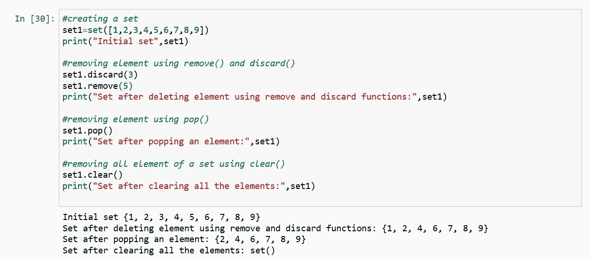

# Python 数据类型

> 原文：<https://medium.com/analytics-vidhya/python-data-types-d60c02e5825a?source=collection_archive---------14----------------------->

在编程中，数据类型是一个重要的概念。

什么是数据类型？

数据类型是数据项的分类或归类。它表示一种值，这种值告诉我们可以对特定数据执行什么操作。

python 中的每个值都有一个数据类型。因为在 python 编程中一切都是对象(默认情况下)，所以数据类型实际上是类，变量是这些类的实例(对象)。

数据类型有多种类型，分类如下:

Python 数据类型分类

# **数字:**

在 python 中，数值数据类型表示具有数值的数据。

数值可以是；

整数

浮动(浮动)

复数(复数)

## 整数:

这个值由 int 类表示

它包含正负整数

整数值的长度没有限制。

## 浮动:

这由 float 类表示。

它是一个用浮点表示的实数。它是由小数点指定的。

## 复数:

这是由复杂类表示的值。

它由(实部)+(虚部)j 指定，例如:-2+3j

数字数据类型

*type ( )* 函数用于确定数据类型的类型。

# 布尔型:

具有两个内置值“True”或“False”之一的数据类型。等于真的布尔对象是真实的，假的是不真实的。

它由 bool 类表示。

大写' T' & 'F '的 True 和 False 都有效，否则 python 会抛出 u 错误。

非布尔对象可以在布尔上下文中计算，并可以赋值为 True 或 False。

布尔数据类型

# 序列类型:

在 python 中，序列是相似或不同数据类型的有序集合。序列允许以一种有组织和有效的方式存储值。

python 中的序列类型如下:

线

目录

元组

## 字符串:

字符串是表示 Unicode 字符的字节数组。

字符串是放在单引号、双引号或三引号中的一个或多个字符的集合。

在 python 中没有字符数据类型，字符是长度为 1 的字符串。

它由 string 类表示。

*创建字符串:*

可以创建一个字符串，如下所示；

字符串创建

*访问字符串的元素:*

在 python 中，可以通过索引的方法访问字符串中的单个字符。

索引从零“0”开始

索引允许负地址引用从字符串后面访问字符。示例:-1 表示字符串的最后一个字符。

' Python '

-1 表示“n”

-2 表示“o”

0 表示“P”

访问超出范围的索引时，将导致“IndexError”

只允许整数作为索引传递；float 或其他类型将抛出一个错误(TypeError)

正负索引

访问字符串

*删除和更新字符串:*

在 python 中，不允许更新/删除字符串的字符。这将导致错误，因为不支持字符串中的项分配和项删除。

字符串是不可变的；因此，字符串的元素不能改变。

但是，新字符串可以被重新分配到相同的名称。

更新字符串的字符时出错

删除字符串中的字符时出错

重新分配新字符串

*python 中的转义序列:*

而打印包含单引号和双引号的字符串会导致语法错误，因为该字符串已经包含引号，无法打印。

要打印这样的字符串，我们可以使用三重引号或转义序列。

转义序列以反斜杠开头，可以有不同的解释。

转义序列

# 列表:

列表就像任何编程语言中声明数组一样。列表是项目的有序序列。它是 python 中使用最多的，非常灵活。列表中的所有项目不需要具有相同的数据类型。

列表是异构的(单个列表可能包含 int、float、string)。

列表是可变的(即使在创建后也可以更新或更改)。

列表中的元素按照一定的顺序进行索引。

列表的索引从 0(零)开始作为第一个索引。

声明一个列表很简单。项目可以用逗号分隔，并用方括号[ ]括起来。

它由 list 类表示。

*创建列表:*

只需将序列放在方括号[ ]内即可创建列表。列表的创建不需要内置函数。

创建列表

*向列表添加元素:*

可以使用内置的 *append( )* 方法将元素添加到列表中。使用 append 函数一次只能将一个元素添加到列表中。

对于在所需位置添加元素，使用 *insert( )* 方法。

要在列表末尾同时添加多个元素，我们可以使用一个叫做 *extend( )* 的方法

向列表添加元素

*访问列表元素:*

我们使用索引操作符[ ]来访问列表中的一个条目，引用它各自的索引号。

索引号必须是整数。

负整数和正整数都有效。

负索引表示从数组末尾开始的位置(从末尾开始；-1 分最后一项，-2 分倒数第二项，依此类推)。

访问列表元素

*从列表中删除元素:*

可以使用内置的 *remove( )* 函数从列表中删除元素。但是当元素不在列表中时，它会抛出一个错误。

另一种从列表中删除元素的方法是使用 *pop( )* 函数。默认情况下，pop()删除最后一个元素。要从特定位置移除，我们可以使用该元素的索引作为 pop 方法的参数。

列表中的 Remove( ) 方法将删除搜索到的元素的第一个匹配项(以防列表中有重复的元素)。

从列表中删除元素

*知道列表的大小:*

为了知道列表的大小，我们使用 *len。*

要查找列表的长度

*列表切片:*

为了打印列表中特定范围的元素，我们使用切片操作。

使用冒号( : )对列表执行切片操作。

从开始到某个范围打印元素；使用[:索引]

从末端打印元素；使用[: -index]

从特定索引开始打印元素，直到结束；使用[索引:]

打印某个范围内的元素；使用[开始索引:结束索引]

打印整个列表；使用[:]

要以逆序打印整个列表，请使用[:: -1]

正索引

负索引

以下是列表中可以使用的一些其他方法:

Clear ( ): 从列表中删除整个项目。

*Count ( ):* 返回作为参数传递的项目数。

*Sort ( ):* 默认情况下它按升序排序，要按降序排序我们简单给出 sort(reverse=True)

*Reverse ( ):* 颠倒列表中项目的顺序

*Copy ( ):* 返回列表的副本

*Index ( ):* 返回第一个匹配项的索引

与 list 一起使用的其他函数

# 元组:

Tuple 是 python 对象的有序集合，很像列表。

存储在元组中的值序列可以是任何数据类型，它们由整数索引。

列表和元组的区别在于元组是不可变的。元组一旦创建就不能修改。元组是可散列的，而列表不是。和元组并不总是可散列。

元组在括号( )内定义；其中项目用逗号分隔。

元组用于保护数据，通常比列表快，因为它们不能动态改变。

元组由元组类表示。

元组是由逗号分隔的对象，“不是括号中的对象”(即)。实际上是逗号使元组不是括号。

*创建元组:*

元组创建

*创建混合数据类型的元组:*

元组可以包含任意数量的元素和任意数据类型。

元组也可以用单个元素创建，只有一个元素是不够的，因此它必须包含一个尾部逗号才能成为元组。

混合数据类型的元组创建

*打包和解包元组:*

在打包时，我们将值放入一个新的元组中；而在解包时，我们将这些值提取回变量中。

打包和解包元组

*访问元组:*

元组是不可变的(一旦创建就不能改变)，它们包含一系列异构元素；可以使用索引来访问它。

访问元组

*元组的串联:*

元组的串联意味着连接两个或多个元组。使用+运算符完成连接。

串联总是从原始元组的末尾开始

只能连接相同的数据类型。

元组连接

*删除元组:*

使用 *del 可以删除元组。*

元组删除

*改变元组元素:*

与列表不同，元组是不可变的。这意味着元素一旦创建就不能在元组中修改。

改变元组的元素

但是如果一个元素本身是一个可变的数据类型，比如 list，那么它的嵌套项是可以改变的。

[闪烁:元组并不总是可散列的]

元组可以被重新分配。

更改可变元素并重新分配元组

# 设置:

集合是数据类型的有序集合，它是可迭代的、可变的并且没有重复。

Set 由{}内逗号分隔的值定义。

器械包中的物品没有顺序。

集合可以是异构的。

考虑到集合是无序的集合，索引是没有意义的，因为切片操作符在集合中不起作用。

使用集合的好处是它有一个高度优化的方法来检查一个集合中是否包含一个特定的元素。

*创建器械包:*

可以使用内置的 *set( )* 函数创建集合。

集合不能有可变元素。

创建集合

一个集合只能包含唯一的元素，但是在创建集合时，可以传递多个重复的值。集合中元素的顺序未定义。

传递集合中的重复项

*向集合添加元素:*

可以使用 *add( )* 功能将元素添加到集合中。使用此方法一次只能将一个元素添加到集合中。

对于多个元素的添加，我们可以使用 *update( )* 函数。

向集合中添加元素

***访问集合:***

无法使用索引访问集合，因为集合是无序的。但是您可以使用*的*循环遍历集合项目，或者使用中的关键字*询问集合中是否存在指定的值。*

访问集合

*从集合中删除元素:*

使用 *remove( )* 功能可以从集合中删除元素。但是 key error*T29 发生在元素不在集合中的时候。所以要去除无 KeyError，我们可以使用 *discard( )* 和 *pop()。**

*pop( )* 删除最后一个元素。

要删除所有元素我们可以使用 *clear()。*

集合中的删除

*冷冻设置:*

*frozenset( )* 是 Python 的一个内置函数，它将一个可迭代对象作为输入，并使它们不可变。它冻结了可迭代的对象，使它们不可改变。

在 Python 中，frozenset 与 set 相同，只是它的元素是不可变的。

语法:

冷冻集(可迭代)

冷冻凝固

# 词典:

python 中的 Dictionary 是数据值的无序集合。与保存单个数据值的其他数据类型不同；字典保存*键:值*对。

键值对由冒号(:)分隔，而每个键由逗号分隔。

*创建字典:*

可以通过将元素序列放在花括号{}中，用逗号分隔来创建字典。

键是唯一的，而值可以重复。

我们可以使用键来检索和更改值。

键是不可变的。

可以使用内置的 *dict( )* 函数创建字典。

字典键区分大小写。

创建词典

*向字典添加元素:*

可以用多种方式添加元素；

1.通过定义值和键，一次可以将一个值添加到字典中。示例:dict[key]='value '

2.使用 *update( )* 功能可以更新现有值。

当添加一个值时，如果键值已经存在，则该值被更新，否则一个新的键值将被添加到字典中。

向字典中添加元素

*从字典中访问元素:*

要访问字典中的条目，请参考它的键名。

可以在[]中使用键。

*get( )* 函数也用于从字典中访问元素。

访问字典

*从字典中删除元素:*

可以使用 *del* 关键字删除键。

使用 *del* 关键字，可以删除特定值或整个字典。

其他函数如 *pop( )* 和 *popitem( )* 也可以用来删除特定值和任意值。

使用 *clear( )* 功能可以删除字典中的所有条目。

字典删除

## Python 类型转换:

将一种数据类型转换为另一种数据类型的过程称为类型转换。

Python 有两种类型的类型转换:

1.隐式类型转换

2.显式类型转换

*隐式类型转换:*

在这里，Python 自动将一种数据类型转换成另一种数据类型。

隐式类型转换

Python 执行较低数据类型到较高数据类型的转换，以避免数据丢失。

这是因为字符串是较高的数据类型，整数是较低的数据类型，当你试图添加一个字符串和整数；这将导致程序出错。

当 python 不能处理这种情况时，就出现了显式转换。

*显式类型转换:*

在这里，用户将对象的数据类型从一种类型转换为另一种类型。这叫做类型转换，因为用户转换(改变)了对象的数据类型。

语法:

*必需 _ 数据类型(表达式)*

现在让我们用显式转换来编写同一个程序。

显式类型转换

## 结论

学习 python 或任何其他编程语言都是从消化其基础开始的。数据类型就是这样一个概念。

就这样，我们来到了这篇文章的结尾。

快乐编码…😊😊😊