# Python 数据收集类型第 1 部分:列表

> 原文：<https://medium.com/analytics-vidhya/python-data-types-part-1-lists-bd511c053c79?source=collection_archive---------21----------------------->


艾玛·马修斯数字内容制作在 [Unsplash](https://unsplash.com?utm_source=medium&utm_medium=referral) 拍摄的照片

在这篇文章中，我将介绍 python 中用于存储数据集合的 3 种内置数据类型之一:**列表**。

# 什么是 Python 列表？


Maksym Kaharlytskyi 在 [Unsplash](https://unsplash.com?utm_source=medium&utm_medium=referral) 上拍摄的照片

有太多不同的类比来描述 python 列表是什么以及它是如何有用的。我在帮助教孩子们用 [Codeverse](https://www.codeverse.com/) 在线编码时使用的一种方法是将它比作文件柜中可调整大小的抽屉。抽屉是可调整大小的，因为列表的长度仅与其中的项目数相同。例如，包含 20 个项目的列表长度为 20，但另一个列表可能包含 2000 个项目。它也像一个文件柜，因为您可以将项目放在列表中当前项目的前面或后面。令人惊叹的是，编程语言(在本例中是 python)将跟踪列表中每个对象的顺序，您可以像访问第一个项目一样轻松地访问第 4586 个项目。该列表还使得对列表中的每个项目应用相同的功能变得非常容易。

现在，这个类比唯一失效的地方是，你可以在列表中添加任何类型的项目，也可以在列表中添加任何数量的项目。你甚至可以在一个列表中添加一个嵌套列表。从理论上讲，这种情况会一直持续下去，但是从代码的速度和效率来看，在一个列表中嵌套另一个列表的次数越多，在嵌套列表中获取数据就越困难。列表不仅可以包含其他列表，还可以在一个列表中包含几种不同类型的项目。例如，一个列表可以包含:一个列表、一个字符串、一个整数或任何其他项的组合。

# 在本文中:

1.  如何创建列表
2.  访问项目
3.  添加/删除项目
4.  更改项目

# 创作时间！


由 [Max LaRochelle](https://unsplash.com/@maxlarochelle?utm_source=medium&utm_medium=referral) 在 [Unsplash](https://unsplash.com?utm_source=medium&utm_medium=referral) 拍摄的照片

创建列表非常简单。您所需要的只是列表的名称，它等于列表中的项目，用逗号分隔，用括号括起来。现在让我们想象一下，蒂姆去观鸟，并在途中辨认出 3 个物种。蓝松鸦、家麻雀和游隼。他可以将这三个物种放入下面的列表中:

```
birds = ['Blue Jay', 'House Sparrow', 'Peregrine Falcon']
```

在第一个例子中，我做了一个字符串列表(每个物种的名称)；然而，我也可以列出一个整数列表。因此，继续我们的例子，Tim 看到每个鸟类物种的以下计数，4 只蓝鸟，20 只家雀和 1 只游隼:

```
count = [4, 20, 1]
```

我也可以用两种方法将这两个列表合并成一个嵌套列表。我可以将两个列表都打印出来，如下所示:

```
bird_count = [['Blue Jay', 'House Sparrow', 'Peregrine Falcon'], 
             [4, 20, 1]]
```

(即使当在一个列表中分隔两个列表时，我仍然只用逗号分隔它们。)

或者，我们可以使用之前创建的变量，并将它们保存到新列表 bird_count 中:

```
bird_count2 = [birds] + [count]
```

*注意上面代码中括号的位置。如果没有括号，将两个列表加在一起将创建一个包含每个列表的所有值的列表。*

# 访问列表中的项目


照片由[菲伊·康尼什](https://unsplash.com/@fcornish?utm_source=medium&utm_medium=referral)在 [Unsplash](https://unsplash.com?utm_source=medium&utm_medium=referral) 上拍摄

现在假设我只想返回列表中的第一项(' Blue Jay ')。对列表来说，唯一的方法就是使用索引*(记住，所有的索引都是从零开始的！)*列表名称后右方括号[]内:

```
 birds[0]
```

输出:

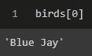

有了列表，你也可以通过使用负索引来调用相同的项目。因为我们有 3 个项目，我们可以通过在括号内使用[-3]来返回' Blue Jay'。对于负索引，它从-1 开始，是列表中的最后一项。这张图描述的很好:

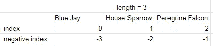

指数对负指数

```
birds[-3]
```

输出:

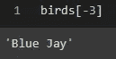

# 限幅

要在一个列表中返回多个值，可以使用列表切片。假设蒂姆不想把猛禽列入他的清单。为此，他可以使用以下方法:

```
birds[0:2]
```

输出:

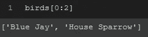

当对列表进行切片时，它最多返回，但不包括冒号后的数字。如上例所示，返回索引 0 和索引 1 处的项目，但不返回索引 2 处的项目(游隼)。

# 添加项目

在 Tim 创建了他的初始列表后，他很快意识到他忘记了他在观鸟途中看到的另一个物种。根据 Tim 希望结果列表的格式，向 Tim 的列表中添加另一个项目非常简单。在这种情况下，由于 Tim 只是向列表中添加了一个他忘记的条目，因此最简单的方法就是使用以下方法之一将其添加到列表中:

*   +
*   。追加(*对象*)
*   。插入(*索引，对象*)
*   。扩展(*可迭代*

```
birds + ['Cardinal']birds.append('Cardinal')birds.insert(4, 'Cardinal')birds.extend(['Cardinal'])
```

输出:

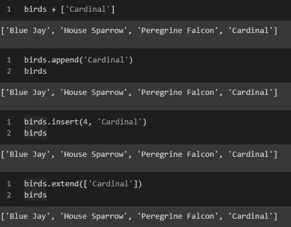

如果列表中的顺序很重要，使用。insert()方法是首选方法，因为您可以指定项目在列表中的索引位置。

请注意，当使用“+”操作符添加一个项目时，为了使命令正常工作，该项目本身必须在列表中。然而，当只向列表中添加一个项目时，这两种方法给出的结果是一样的。在这两种向列表中添加项目的方式之间有细微的差别。的。append()和。insert()方法用包含添加项的新列表覆盖 birds 列表。使用“+”操作符不能做到这一点，如果您想将项目添加到列表中，那么您必须将该行保存到“birds”变量中:

```
birds = birds + ['Cardinal']birds += ['Cardinal']
```

假设蒂姆想在他的清单上增加一个以上的项目，因为他不仅忘了添加“红衣主教”，还忘了添加“奇普斯派洛”。


布莱恩·麦高恩在 [Unsplash](https://unsplash.com?utm_source=medium&utm_medium=referral) 上的照片

向列表中添加多个项目时，有 4 种不同的方法可供选择。前面的每种方法都可以与一起使用。扩展( *iterable* )。里面的 *iterable* 可以是列表。

使用这 4 种方法，有两对会产生相同的结果:

*   。append()/。插入()

或者

*   "+"/.扩展()

的。append()和。insert()方法将产生嵌套列表，而“+”和。extend()方法会将新列表中的项目添加到现有列表中。但是，“+”运算符和。扩展()方法。的。extend()方法将改变原来的列表。

```
birds.append(['Cardinal', 'Chipping Sparrow'])
birds.insert(4, ['Cardinal', 'Chipping Sparrow'])
```

输出:

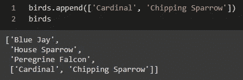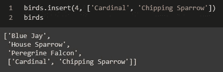

```
birds + ['Cardinal', 'Chipping Sparrow']
birds.extend(['Cardinal', 'Chipping Sparrow'])
```

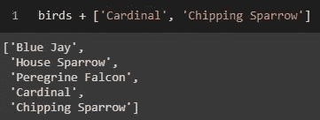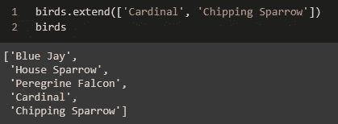

# 删除项目


Renee Fisher 在 [Unsplash](https://unsplash.com?utm_source=medium&utm_medium=referral) 上拍摄的照片

后来，蒂姆了解到，家麻雀是一种入侵物种，正在与他最喜欢的物种之一(东方蓝知更鸟)争夺巢箱，并降低了蓝知更鸟的种群数量。他讨厌将他们列入自己的清单，盛怒之下，他想将他们从清单中删除。


照片 via [好的免费照片](https://www.goodfreephotos.com/)

他有几个选择可以把那只可怜的家雀从他的名单上去掉:

*   倒三角形
*   。移除(*对象*)
*   。波普([ *i* ])
*   将项目重新分配给空列表

```
# House Sparrow is located at index 1
del birds[1]
```

输出:

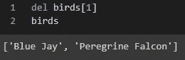

del 是删除列表中项目的有效方法。也可以用这个关键字删除整个列表。

```
birds.remove('House Sparrow')
```

输出:

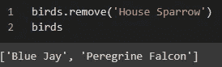

的。remove()方法将只删除列表中第一个具有圆括号中指定值的项目。例如，如果 Tim 的列表中有两次“家麻雀”，那么只有第一个“家麻雀”会从列表中删除。如果他想删除列表中的第二个“麻雀”，他可以考虑使用。reverse()方法，然后使用。移除()方法。然而，更简单的方法可能是使用这四种方法中的任何一种来删除列表中的第二个“House Sparrow”项目。

```
popped = birds.pop(1)
print(popped)
birds
```

输出:

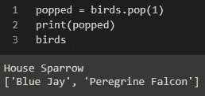

如果您仍然希望将项目保留在列表中以供以后使用，但不再希望它出现在列表中，此方法会很有用。的。pop()方法将移除并返回指定索引处的项目，因此如果您让它等于一个变量，那么您可以稍后使用您弹出的项目，如上面我创建的“弹出”变量所示。

```
birds[1:2] = []
```

输出:

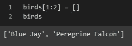

虽然使用这种方法看起来我是在切片 2 个项目，但我只是移除了“House Sparrow ”,因为当切片 Python 时，不包括最后一个索引，而是做了比该索引少的所有事情。

# 更改项目

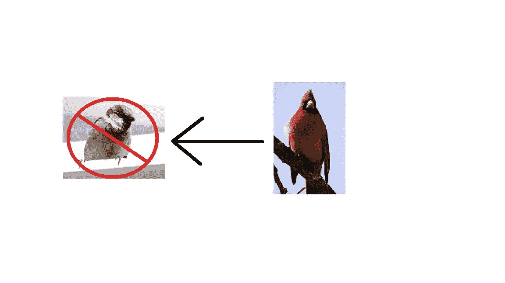

两张照片都是通过作者添加的[好的免费照片](https://www.goodfreephotos.com/)箭头

蒂姆只是想用他散步时看到的一只红雀来代替家雀。这可以通过用另一个项目替换项目的切片来容易地完成。

```
birds[1] = 'Cardinal'
```

输出:

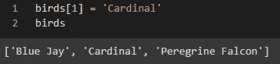

感谢您的阅读！