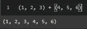

# Python 数据类型第 2 部分:元组

> 原文：<https://medium.com/analytics-vidhya/python-data-types-part-2-the-tuple-bde86bec07be?source=collection_archive---------21----------------------->


部分图像背景从 [Devostock](https://www.devostock.com/stock-photo/devostock-water-drop-liquid-rain-85975.html) images 下载，然后由作者编辑

在这篇文章中，我将介绍 python 中用于存储数据集合的 3 种内置数据类型之一:**元组**。

# 什么是 Python 元组？

元组是有序且不可变(不能改变)的项目的集合。

Python 元组在所有方面都与列表相同，除了:

1.  元组使用括号()，而不是括号[]
2.  元组中的项不能改变(不可变)。


比较元组和列表的维恩图。由作者创建。

如果你想了解更多关于列表的内容，你可以看看我的另一篇文章[。](https://billy-fetzner.medium.com/python-data-types-part-1-lists-bd511c053c79)

# 在本文中:

1.  元组创建
2.  访问元素
3.  限幅
4.  改变元素

# 创作时间！


照片由 [Akin Cakiner](https://unsplash.com/@akin?utm_source=medium&utm_medium=referral) 在 [Unsplash](https://unsplash.com?utm_source=medium&utm_medium=referral) 上拍摄

元组可以有多种方式，与列表相比，它几乎是 python 中的默认方式。

1.  括号()
2.  元素 __ 后的尾随逗号，
3.  在一行中用逗号分隔元素—元素 1，元素 2，…
4.  元组()

```
tup = ('Veery', 'Eastern Meadowlark', 10, 25, True)# trailing comma
tup2 = 'Veery',tup = 'Veery', 'Eastern Meadowlark', 10, 25, True# convert from a list
tuple(['Veery', 'Eastern Meadowlark', 10, 25, True])# blank tuple
tuple()
```


# 访问元素


照片由 [Brienne Hong](https://unsplash.com/@briennehong?utm_source=medium&utm_medium=referral) 在 [Unsplash](https://unsplash.com?utm_source=medium&utm_medium=referral) 上拍摄

如果你熟悉访问列表中的条目，那么访问元组中的条目就不会有问题。方法完全一样。我只需要将我想要访问的项目的索引放在方括号[]中。使用上面的同一个例子，我想访问我的元组的第一个元素(“Veery”)

```
tup[0]
```

输出:


负索引在这里也能很好地工作。

```
tup[-1]
```

输出:


# 限幅

现在，如果我想访问中间的三项，我可以对元组进行切片。

```
tup[1:4]
```

输出:


# 改变元素

这是列表和元组的主要区别。元组是不可变的，这意味着您不能更改元组中的项。然而，如果你真的需要的话，有一些方法可以解决这个问题。如果元素是可变的数据类型，比如列表，那么您可以在嵌套列表中更改项目。

```
tup2 = 'Veery', 'Eastern Meadowlark', [0, 24], [93, 11]
print(tup2)tup2[2][0] = 30
tup2
```

输出:


此外，如果你想增加一个元素在一个元组中重复的次数，我们可以使用+和*操作符来获得新的元组，在这个元组中将有更多的元素；但是，请注意，这并没有改变元组的原始元素，只是增加了元组中的项数。

```
tup = 'Tricolored Heron',tup * 3
```

输出:


当使用+运算符时，它被称为串联，因为它将两个元组连接在一起。

```
(1, 2, 3) + (4, 5, 6)
```

输出:



就是这样！！元组比列表简单一点，因为您不能改变单个元素。这既是优点也是缺点，取决于您打算如何处理元组中的项。

# 总结:

当通过不需要更改的项寻找更快的迭代时，请使用元组。如果你需要用它作为字典的键。在这种情况下，你要确保它不会被意外改变。