# Python 数据类型第 3 部分:字典

> 原文：<https://medium.com/analytics-vidhya/python-data-types-part-3-the-dictionary-4e328e88d718?source=collection_archive---------18----------------------->


照片由[皮斯特亨](https://unsplash.com/@pisitheng?utm_source=medium&utm_medium=referral)在 [Unsplash](https://unsplash.com?utm_source=medium&utm_medium=referral) 上拍摄

如果你想从这篇文章中记住一件事，那就是记住字典是以“键值”对的形式存储数据的。这意味着字典中的每个*键*都有一个对应的*值*。这个*值*可以是任何类型的数据对象(另一个字典、列表、元组、整数、字符串、布尔等)。);然而，*键*必须是惟一的，并且是不可变的类型(字符串、数字或具有不可变元素的元组)。

我喜欢把字典想象成一个钥匙和锁系统。你有一把可以打开锁的钥匙，这把锁可以装很多东西，但是这把钥匙是非常特殊的。对我来说这是最简单的类比，因为你已经在 python 定义中使用了“key”这个词。


照片由 [Jaye Haych](https://unsplash.com/@jaye_haych?utm_source=medium&utm_medium=referral) 在 [Unsplash](https://unsplash.com?utm_source=medium&utm_medium=referral) 上拍摄

字典也是无序的，这意味着不能通过索引访问值(就像使用列表或元组一样)，而必须通过**键访问它们。**

# 在本文中:

1.  如何创造
2.  访问元素
3.  添加/删除元素

# 创作时间！！


凯利·西克玛在 [Unsplash](https://unsplash.com?utm_source=medium&utm_medium=referral) 拍摄的照片

这本字典喜欢花哨。它有特殊的键，需要调用这些键来返回项目，因此它需要一种奇特的方式来将项目封装在其中。它使用了大括号{}。在这里，您几乎可以看到从最基本的数据类型到最复杂的数据类型的进展。元组是不可变的数据集合，使用最基本的符号括号()。该列表更上一层楼，因为它是可变的，可以更改，因此使用了方括号[]。最复杂的数据类型的最后一步是字典，它使用了最奇特的符号——花括号{}。

我提出这个问题的原因是因为这就是你如何通过使用{}来创建一个空白字典。

```
blank_dict = {}
```

输出:

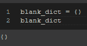

如果您想在以后使用函数或 for 循环用数据填充字典，空白字典是很有用的。

接下来，可以使用键:值对中列出的数据创建字典。如前所述，键必须是不可变的类型，如字符串、整数或元组，但值可以是任何类型。在我们的第一个例子中，想象埃莉诺正在研究东方蓝知更鸟(一种受威胁的物种)的不同解剖学方面。她测量体长、翼展和体重。她测量的第一只鸟分别为 16 厘米、25 厘米和 27 克。然后，Eleanor 将这些信息放入她的 python 字典中。


图片来自 [Pixabay](https://pixabay.com/?utm_source=link-attribution&amp;utm_medium=referral&amp;utm_campaign=image&amp;utm_content=3456115) 的 [Naturelady](https://pixabay.com/users/naturelady-3551620/?utm_source=link-attribution&amp;utm_medium=referral&amp;utm_campaign=image&amp;utm_content=3456115)

```
bb_measurements = {‘length’: 16, ‘wingspan’: 25, ‘weight’: 27}
```

输出:

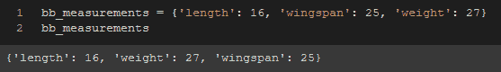

在这个初始示例中，我们使用字符串作为字典键的不可变对象；然而，它们也可以是数字或元组。我将在下面展示它们；然而，就目前的例子而言，它们没有意义，但我仍然会在这里展示这种可能性。

```
bb_measurements = {1: 16, 2: 25, 3: 27}
```

输出:

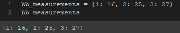

这也是一个让人有点困惑的地方。因为您可以使用数字作为字典中的键，所以看起来好像您正在使用索引来引用字典中的键。然而，事实并非如此。如果你真的想用一个数字来引用这些键，你必须像上面那样输入这些键。您不能像在列表中使用索引那样自动引用它们。


```
bb_measurements = {(‘length’,’cm’): 16, (‘wingspan’, ‘cm’): 25, (‘weight’, ‘g’): 27}
```

输出:

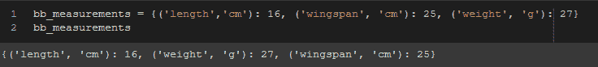

如果您需要将多个部分表示为一个键(如果您可能要将字典放入一个多索引数据帧中),那么使用元组作为一个键可能会很有用；然而，这种特性超出了本文的范围。

你也可以创建一个任何类型的字典作为值，它不必局限于数字，可以是字符串，布尔值，列表，附加字典等。与列表类似，它们也不一定都是相同的，因此您可以将一个值放在一个列表中，下一个值作为一个整数，下一个作为另一个字典。让字典变得非常通用。

# 访问元素

现在记住这篇文章中最重要的信息是什么，“字典使用键:值对”。因此，如果您试图访问字典中的一个元素，您必须使用键来访问您的数据。您不能像在列表或元组中那样使用它们的索引。在 Eleanor 的例子中，假设她想要访问她测量的东部蓝知更鸟的重量，她将执行以下操作:

```
bb_measurements[‘weight’]
```

输出:

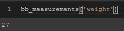

或者，她也可以使用。get()方法:

```
bb_measurements.get(‘weight’)
```

输出:

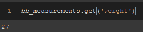

这两种方法都很有效。唯一的区别是，如果您试图调用一个不在字典中的键，您将收到一个带有括号的 ValueError，而您将从。get()方法。

```
bb_measurements[‘hi’]bb_measurements.get(‘hi’)
```

输出:

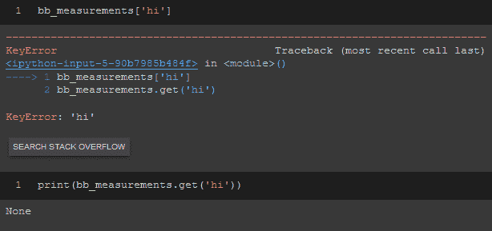

当您在函数中使用字典时，这两个结果之间的差异可能对您有用，这取决于您要寻找什么样的返回。

# 添加元素

埃莉诺也测量了东部蓝知更鸟的跗骨长度(基本上是鸟的胫骨),她也想加上这个测量值。她可以很容易地做到这一点，把她想要的键放在括号里，然后把值放在等号后面。

```
bb_measurements['tarsus'] = 6.3
```

输出:

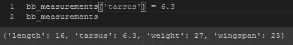

如果埃莉诺在回顾她的笔记后意识到蓝鸟实际上是 16.1 厘米长，而不仅仅是 16 厘米，她可以通过使用相同的过程更新字典中的值，16 将被替换为 16.1。

```
bb_measurements['length'] = 16.1
```

输出:

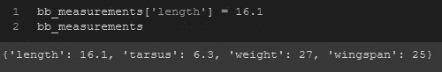

# 删除元素

埃莉诺的实验室同事在测量中没有使用跗骨长度，所以为了保持实验室数据的一致性，埃莉诺决定从字典中删除该元素。她有三种方法可以选择来达到凝聚力。

1.  倒三角形
2.  。流行()
3.  。popitem()

如果她想清除整个字典并重新开始，她可以使用。clear()方法。

del 关键字可以用来删除单个条目，或者删除整个词典。

```
del bb_measurements['tarsus']
```

输出:

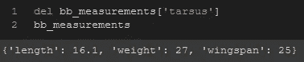

。pop()方法将从字典中删除该项并返回值。

```
bb_measurements.pop('tarsus')
```

输出:

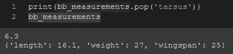

popitem()方法将删除最后添加到字典中的项，并将键和值作为元组返回。

```
bb_measurements.popitem()
```

输出:

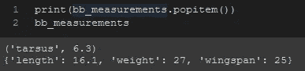

现在埃莉诺为她的东方知更鸟准备好了字典，我希望你也一样。


图片来自 [Pixabay](https://pixabay.com/?utm_source=link-attribution&amp;utm_medium=referral&amp;utm_campaign=image&amp;utm_content=3456115) 的 [Naturelady](https://pixabay.com/users/naturelady-3551620/?utm_source=link-attribution&amp;utm_medium=referral&amp;utm_campaign=image&amp;utm_content=3456115)