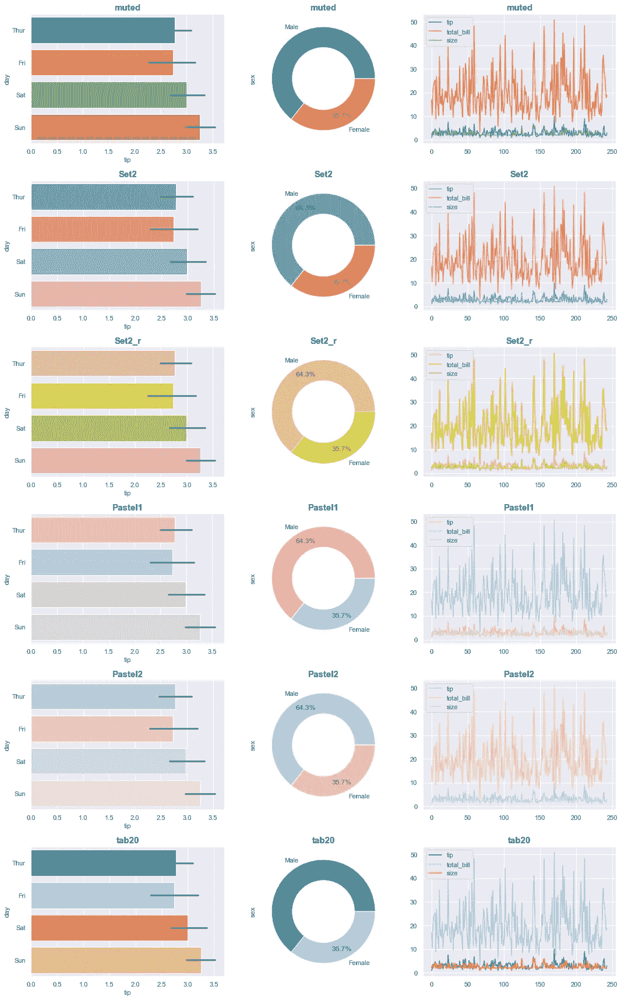
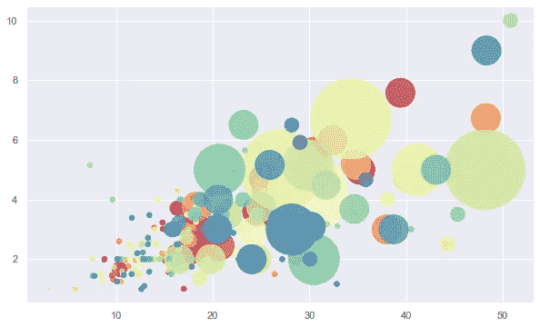
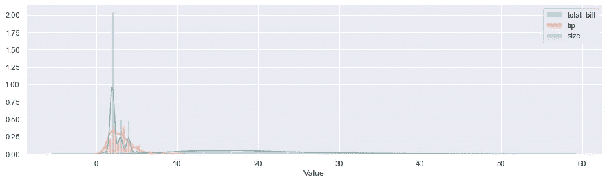
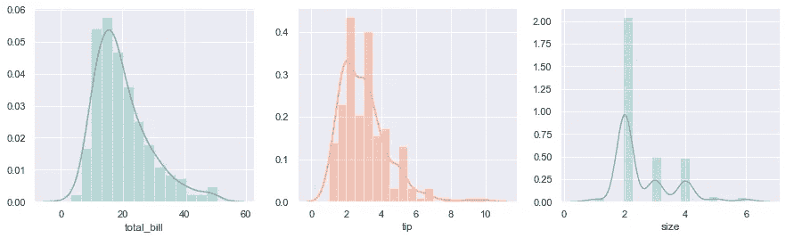

# Python 数据可视化:颜色方案

> 原文：<https://medium.com/analytics-vidhya/python-data-visualisation-colour-schemes-3a47245db723?source=collection_archive---------19----------------------->

在本文中，我们将研究 Python 的一些配色方案，主要是 **Seaborn** 库。这将是 Python 笔记本格式，包括图形旁边的代码。

让我们从必要的导入开始:

```
**import** **pandas** **as** **pd**
**import** **seaborn** **as** **sns**
**import** **matplotlib.pyplot** **as** **plt**
```

我们将使用 Seaborn 库的数据集之一，名为“**提示**”。数据集摘要如下:

*   **244** 餐厅订单交易(行)
*   **7** 特性(列):

1.  账单总额(美元)

2.小费(美元)

3.性别(女性/男性)

4.吸烟者(是/否)

5.日(星期六，星期日，星期四，Fri)

6.时间(午餐、晚餐)

7.尺寸(范围从 1 到 6)

```
df = sns.load_dataset("tips")
df.head(7)
```


## 使用默认样式/调色板

现在让我们用默认的颜色方案(matplotlib)在 seaborn 条形图中显示每天的提示

```
sns.barplot(x="tip",y="day",data=df,orient="h")
plt.show()
```


## 更改图形样式

有五种风格可供选择，我个人最喜欢的风格是“暗格”。您可以使用“set_style”或“set”来更改笔记本其余部分的图形样式。

语法:

***SNS . set _ style(" dark grid ")***

或者

***SNS . set(style = " dark grid ")***

```
plt.figure(figsize=(9,8))
**for** i,style **in** enumerate(["white", "whitegrid", "dark", "darkgrid", "ticks"]):
    sns.set(style=style)
    plt.subplot(3,2,i+1)
    sns.barplot(x="tip",y="day",data=df,orient="h")
    plt.ylabel(**None**)
    plt.title("style: '"+style+"'",fontweight="bold")
plt.tight_layout()
plt.show()
```


现在我们的笔记本风格是 for 循环中最新应用的风格，即“ticks”

```
sns.barplot(x="tip",y="day",data=df,orient="h")
plt.show()
```


假设您想在笔记本的不同部分使用不同的样式。通过使用" **with** "语句临时设置样式，该语句仅将样式应用于其下的地块。

语法:***with SNS . axes _ style(" dark grid ")*:**

```
**with** sns.axes_style("darkgrid"):
    sns.barplot(x="tip",y="day",data=df,orient="h")
plt.show()
```


## 更改调色板

除了定义风格，你还可以调整调色板。

语法:***SNS . set(palette = " muted ")***

我最喜欢的调色盘是“ **Set2** ”。我也喜欢使用“静音”、“设置 3”、“柔和 1”调色板。

可用调色板名称:

> *Accent，Accent_r，Blues，Blues_r，BrBG，BrBG_r，BuGn，BuGn_r，BuPu，BuPu_r，CMRmap，CMRmap_r，Dark2，Dark2_r，GnBu，GnBu_r，Greens_r，Greys，Greys_r，OrRd，OrRd_r，Oranges，Oranges_r，PRGn，PRGn_r，Paired_r，Pastel1，Pastel1_r，Pastel2，Pastel2_r，PIR bone，bone_r，brg，brg_r，bwr，bwr_r，cividis，cividis_r，cool，cool_r，coolwarm，coolwarm_r，copper，copper_r，cubehelix，cubehelix_r，flag，flag_r，gist_earth，gist_earth_r，gist_gray，gist_heat，gist_heat_r，gist_ncar，gist_ncar，gist_rainbow，gist_rainbow_r，gist_stern，gist_stern*

文档:[https://matplotlib . org/3 . 1 . 0/tutorials/colors/colormaps . html](https://matplotlib.org/3.1.0/tutorials/colors/colormaps.html)

Seaborn:

【https://seaborn.pydata.org/tutorial/color_palettes.html 

```
sns.set(style="darkgrid",palette="Set2")
sns.barplot(x="tip",y="day",data=df,orient="h")
plt.show()
```


或者，您可以使用以下语法来一起更改样式和调色板:***PLT . style . use(" gg plot ")***

有 26 种款式可供选择，“seaborn-muted”看起来很漂亮。

```
plt.figure(figsize=(15,20))
**for** i,style **in** enumerate(plt.style.available):
    **with** plt.style.context(style): *#with keyword allows for temporary changing the style*
        plt.subplot(9,3,i+1)
        sns.barplot(x="tip",y="day",data=df,orient="h")
        plt.ylabel(style)
plt.tight_layout()
plt.show()
```


现在让我们想象一下我们最喜欢的一些风格，看看它们在不同类型的图表中是什么样子:

```
sns.set(style="darkgrid")
palettes = ["muted","Set2","Set2_r","Pastel1","Pastel2","tab20"]
plt.figure(figsize=(15,24))
**for** i,palette **in** enumerate(palettes):
    plt.subplot(len(palettes),3,3*i+1)
    sns.set(palette=palette)
    sns.barplot(x="tip",y="day",data=df,orient="h")
    plt.title(palette,fontweight="bold",fontsize=15)
 plt.subplot(len(palettes),3,3*i+2)
    df["sex"].value_counts().plot.pie(autopct="**%.1f%%**", pctdistance=0.8,
                   wedgeprops=dict(width=0.4))
    plt.title(palette,fontweight="bold",fontsize=15) ax3 = plt.subplot(len(palettes),3,3*i+3)
    df[["tip","total_bill","size"]].plot(ax=ax3)
    plt.title(palette,fontweight="bold",fontsize=15)
plt.tight_layout()
plt.show()
```



或者，对于散点图和线图**，plt.cm.get_cmap()** 语法可用于选择调色板

```
**import** **numpy** **as** **np**
palette="Spectral"
plt.figure(figsize=(10,6))
plt.scatter(df.total_bill,df.tip,s=df["size"]**5,alpha=0.8,
               c=np.arange(1,df.shape[0]+1),cmap=plt.cm.get_cmap(palette,df.shape[0]))
```



假设您想要可视化数值变量(“total_bill”、“tip”、“size”)的分布，但是由于它们的取值范围不同，图形看起来并不美观:

```
sns.set(palette="Set2")
plt.figure(figsize=(15,4))
**for** i,col **in** enumerate(["total_bill","tip","size"]):
    sns.distplot(df[col],label=col)
plt.xlabel("Value")
plt.legend()
plt.show()
```



让我们在循环中使用支线剧情来绘制它们。我们将需要一个新的功能，以颜色分布与我们的调色板的订单，否则他们将在同一颜色。

语法:***SNS . color _ palette(" set 2 ")***

```
plt.figure(figsize=(15,4))
**for** i,col **in** enumerate(["total_bill","tip","size"]):
    plt.subplot(1,3,i+1)
    sns.distplot(df[col],color=sns.color_palette("Set2")[i])

plt.show()
```



## 手工着色

最后，除了使用样式和调色板，你还可以手动选择你自己的颜色。

语法: ***调色板=["colour1 "，" colour2 "，……]***

命名颜色列表:[https://matplotlib . org/3 . 2 . 1/gallery/color/named _ colors . html](https://matplotlib.org/3.2.1/gallery/color/named_colors.html)

```
sns.boxplot(x=df.tip,y=df.day,hue=df.sex,palette=["salmon","darkslateblue"])
plt.show()
```


```
**from** **matplotlib.axes._axes** **import** _log **as** matplotlib_axes_logger
matplotlib_axes_logger.setLevel('ERROR')sns.boxenplot(x=df.tip,y=df.day,palette=["rosybrown","tab:olive","cornflowerblue","lightsteelblue","plum","sandybrown"])
plt.show()
```


```
sns.countplot(y="size",data=df,palette=["c","y","m","pink","deepskyblue","k"])
```

