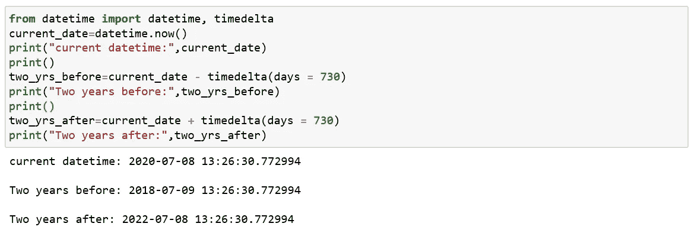

# Python 日期时间

> 原文：<https://medium.com/analytics-vidhya/python-datetime-6625e4db7d5b?source=collection_archive---------27----------------------->

Python 中的日期本身不是一种数据类型，但是它有一个名为 datetime 的模块，该模块处理日期和时间。它提供了许多函数来处理日期、时间和时间间隔。

现在让我们看看其中的一些；

**获取当前日期和时间:**

**获取当前日期:**

**分别打印日期、月份和年份:**

**打印时间:**

**分别打印小时、分钟、秒和微秒:**

除此之外，我们在这个模块中还有许多其他功能，例如:

**时间戳:**

将日期和时间作为时间戳存储在数据库中是普遍存在的。Unix 时间戳是特定日期和 UTC 时间 1970 年 1 月 1 日之间的秒数。

**时间增量:**

它用于计算日期的差异，也可用于 Python 中的日期操作。这是执行日期操作最简单的方法之一。

*语法:*

datetime.timedelta(天=0，秒=0，微秒=0，毫秒=0，分钟=0，小时=0，周=0)

就这样，我们来到了这篇文章的结尾。

快乐编码…😊😊😊