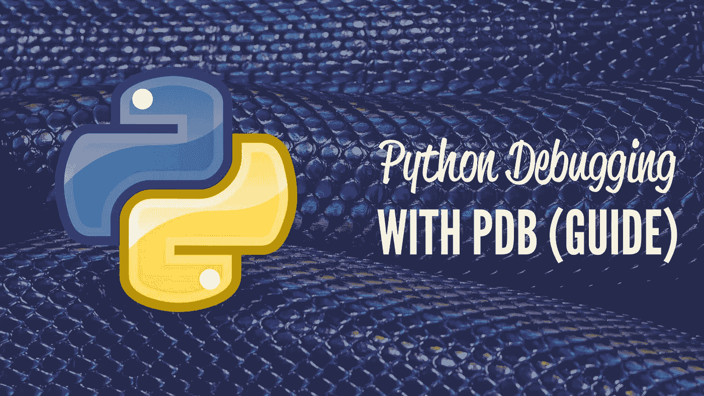

# Python 调试

> 原文：<https://medium.com/analytics-vidhya/python-debugging-4712152428ea?source=collection_archive---------23----------------------->



调试告诉我们程序中的错误在哪里，以及为什么程序不能按预期运行。在 python 中，我们可以使用 pdb 模块进行调试。在 pdb 中，p 代表 python，db 代表调试器。pdb 为 python 实现了一个交互式调试环境。它的特点是让你暂停你的程序，查看变量的值，一步一步地观察程序的执行，这样你就能理解你的程序做了什么，并发现程序逻辑中的错误。这是一个带有命令行界面的简单实用程序，由**完成**的主要工作。它**拥有**你**需要**的所有**调试器**特性，但是如果你想稍微改进一下，你**可以**使用 ipdb 扩展它，这将为**调试器**提供来自 IPython 的特性。

# 启动调试器

为了启动 python 中的调试器，我们必须首先导入 pdb 模块，它非常简单方便，不像其他语言，如 c++，java。在进入调试器之前，让我们以一个示例代码为例，试着理解代码流。

```
**def** **count**(n): #then **it** **will** **come** **here** (2)
    **for** **i** **in** **range**(n): #(3)
        **print**(i)    #(4)
    **return
count**(5) # **execution** **will** **starts** **from** **here** **here** **marking** **it** (1)**out**[]:
0
1
2
3
4 
```

让我们理解代码流，我已经提到了代码将如何逐行工作，正如我在代码中标记的 1 2 3 4 等等。假设我想将(4)作为断点，或者你可以说我想在那里停止执行，并想在打印语句之前检查每次循环更新的新值，那么我可以用下面的方法来做，我也可以用下面的方法来知道 I 和 n 的值:

```
**import** **pdb**
**def** **count**(n):
    **for** **i** **in** **range**(n):
        **pdb**.set_trace()   #breakpoint
        **print**(i)

    **return**
**count**(5)**out**[]:> <**ipython-input-1-2a444758fe7c**>(5)**count**()
**-**> **print**(i)
(Pdb) **list**
  **1**  	**import** **pdb**
  **2**  	**def** **count**(n):
  **3**  	    **for** **i** **in** **range**(n):
  **4**  	        **pdb**.set_trace()   #breakpoint
  **5**  **-**>	        **print**(i)
  **6**  	
  **7**  	    **return**
  **8**  	**count**(5)
[EOF]
(Pdb) **p** **i**
**0**
(Pdb) **p** **n**
**5**
(Pdb) **p** **locals**()
{'**n**': **5**, '**i**': **0**}
(Pdb) **p**.globals()
*** **SyntaxError**: **invalid** **syntax**
(Pdb) **c**
**0**
> <**ipython-input-1-2a444758fe7c**>(4)**count**()
**-**> **pdb**.set_trace()   #breakpoint
(Pdb) **p** **i**
**1**
(Pdb) **c**
**1**
> <**ipython-input-1-2a444758fe7c**>(5)**count**()
**-**> **print**(i)
(Pdb) **p** **i**
**2**
(Pdb) **p** **locals**()
{'**n**': **5**, '**i**': **2**}
(Pdb) **h****Documented** **commands** (type help <topic>):
========================================
**EOF**    **c**          **d**        **h**         **list**      **q**        **rv**       **undisplay**
**a**      **cl**         **debug**    **help**      **ll**        **quit**     **s**        **unt**      
**alias**  **clear**      **disable**  **ignore**    **longlist**  **r**        **source**   **until**    
**args**   **commands**   **display**  **interact**  **n**         **restart**  **step**     **up**       
**b**      **condition**  **down**     **j**         **next**      **return**   **tbreak**   **w**        
**break**  **cont**       **enable**   **jump**      **p**         **retval**   **u**        **whatis**   
**bt**     **continue**   **exit**     **l**         **pp**        **run**      **unalias**  **where** **Miscellaneous** **help** **topics**:
==========================
**exec**  **pdb** (Pdb)_____________________________________________________
```

用上面提到的方法，我们可以在每一步检查 n 和 I 的值。如您所见，在最后一行(pdb)中，将命令作为输入来执行所需的信息，因此我们只需在该框中写入命令。

# PDB 司令部

在使用 Python 调试器时，要记住一些`pdb`命令及其简短形式。

*   `args (a) :` 打印当前函数的参数列表
*   `break (b) :` 在程序执行中创建一个断点(需要参数)
*   `continue (c`或`cont) :` 继续程序执行
*   `help (h) :` 提供命令列表或指定命令的帮助
*   `jump (j) :` 设置要执行的下一行
*   `list (l) :` 打印当前行周围的源代码
*   `next (n) :` 继续执行，直到到达或返回当前函数中的下一行
*   `step (s) :` 执行当前行，在第一个可能的时机停止
*   `pp (pp) :` 输出表达式的值
*   `quit`或`exit (q) :` 中止程序
*   `return (r) :` 继续执行，直到当前函数返回

你可以从 [Python 调试器文档](https://docs.python.org/3/library/pdb.html)中阅读更多关于命令和使用调试器的信息。

# 如何使用交互式控制台调试 Python

代码模块是 python 标准库的一部分，也是一个重要的工具，因为它可以用来模拟交互式解释器。该模块还为您提供了试验用 Python 编写的代码的机会。您可以使用 Python 程序中的代码模块来完成您的工作，而不是使用调试器来单步执行代码。它将停止执行并进入交互模式来检查代码。有了代码模块，你就可以利用解释器而不牺牲编程文件所能提供的复杂性和持久性，还可以避免一次又一次地使用 print()。您可以使用该模块的`interact()`功能，它会在程序被调用时停止程序的执行，并为您提供一个交互式控制台，以便您可以检查程序的当前状态。

该函数及其可能的参数如下:

```
code.interact(banner=None, readfunc=None, local=None, exitmsg=None)
```

这将运行一个 read-eval-print 循环，并创建一个交互式控制台类的对象实例，它模拟交互式 Python 解释器的行为。

可选参数如下:

*   `banner`可以设置成一个字符串，这样你就可以标记解释器在哪里启动
*   `readfunc`可用作 InteractiveConsole.raw_input()方法
*   `local`将为解释器循环设置默认名称空间
*   `exitmsg`可以设置为一个字符串来记录解释器的结束位置

通过`local`参数，您可以使用，例如:

*   `local=locals()`用于本地命名空间
*   `local=globals()`用于全局命名空间
*   `local=dict(globals(), **locals())`同时使用全局名称空间和当前本地名称空间

您可以将`interact()`函数放在程序中您想要的任何地方，以启动代码中的交互式解释器。

启动交互式控制台的`code`模块可以让您在粒度级别上查看代码正在做什么，以了解其行为并根据需要进行更改。

*************************************************************************************************

> 谢谢你阅读这篇文章！！！！！