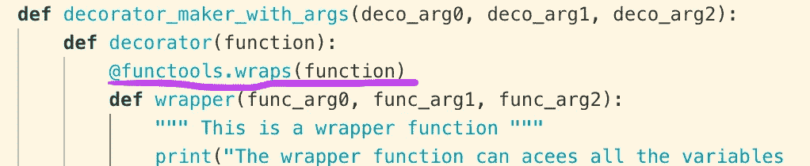

# Python 装饰者

> 原文：<https://medium.com/analytics-vidhya/python-decorators-bd8cd698fb96?source=collection_archive---------18----------------------->

在本文中，我们将学习和理解什么是 Python 装饰器。


照片由 [Sunil Rana](https://unsplash.com/@sunil07?utm_source=unsplash&utm_medium=referral&utm_content=creditCopyText) 在 [Unsplash](https://unsplash.com/s/photos/birds-nepal?utm_source=unsplash&utm_medium=referral&utm_content=creditCopyText) 上拍摄

我的草稿已经写了至少 8 个月了，现在要完成了。🌅

在使用 Django 代码库时，会遇到装饰器的多种用法，尤其是在用户授权部分。对装饰者如何使用我在代码库中看到和使用的模式有一些实际的理解。因此，深入探究装饰者到底是什么。

装饰器是修改其他函数功能的函数。它们有助于使我们的代码更短(干)。

在深入装饰者之前，让我们更清楚地了解一下‘作为一等公民的 Python 中的函数’的概念。在编程语言设计中，“一等公民”意味着能够成为

*   **赋给一个变量**
*   **作为论据通过**
*   **从函数返回**

让我们通过一个例子来看看这些行为:

**0。python 中的函数可以赋给一个变量:**

新手 me 会好奇地看着赋值，心想为什么在方法名`square`后面没有`()`。嗯，那是因为我们没有执行`square`方法。相反，我们将该方法的引用传递给一个名为`get_square`的新变量。因此，我们现在可以用新变量`get_square`调用方法`square`。

1.  **python 中的函数可以作为参数传递**

在这里，我们将函数`square`的引用作为参数传递给函数`cube`，执行`square`函数，并将它返回的值再次乘以`number_to_cube`以获得一个数的立方！漂亮。🙂

**2。python 中的函数可以返回另一个函数**

让我们后退一步，看看我们可以将一个函数定义为另一个函数。

这里我们在函数`double_func`中定义了一个函数`multiply_by_two`。我们在`double_func`函数中调用了`multiply_by_two`函数，并返回了它的值。所以我们可以在一个函数中定义另一个函数。

如果你已经注意到，函数`multiply_by_two`使用传递给`double_func`函数的`number`参数。这是因为嵌套函数可以访问封闭函数的变量范围。

现在让我们看看我们也可以返回一个函数。

这里我们看到`double_func`函数被赋给了一个变量`doubled`。我们可以通过使用`()`调用`doubled`，因为`double_func`的返回值是一个函数！如果你注意到了，我们使用了一等公民的第一份财产；函数可以赋给一个变量。

你写到文章的中间了。恭喜你。👏

现在，既然我们已经有了理解装饰者所需的必要知识，让我们开始深入研究吧！

**让我们创建一个简单的装饰器:**

这里，我们将函数`say_bye`作为参数传递给函数`lowercase_decorator`，函数`lowercase_decorator`内部有一个函数`wrapper`。`wrapper`函数执行`say_bye`函数并返回其小写返回值。

这有点太难写了，所以 Python 提供了简洁的修饰器。

我们可以通过在`say_bye`函数上使用`@lowercase_decorator`来实现上述功能，就像这样:

看，我们只需要在我们想要使用装饰器的函数上使用`@<name-of-the-decorator>`。

我们也可以对一个函数应用多个装饰器。

看，我们有两个装饰器:第一个用破折号替换空格，另一个将字符串转换成小写。在这里，decorator 的顺序并不重要，因为我们可以改变顺序，但仍然可以得到想要的结果。然而，情况可能并不总是如此。

例如，如果我们有一个 decorator 拆分字符串，而不是用破折号替换空格，那么我们需要第一个 decorator 是小写字符串，第二个 decorator 是拆分字符串。这是因为拆分字符串会返回一个不能小写的`list`数据类型。让我们花 3/4 的文章呼吸🍃

**在这里，我们将学习如何将参数传递给装饰者:**

这里参数被传递给装饰器内部的包装函数。这是在执行期间完成的。

**让我们用** `***args**` **和** `****kwargs**` **:** 来定义一个更通用的装饰器

让我们回忆一下什么是`*args`和`**kwargs`。`*args`代表可变数量的参数，`**kwargs`代表可变数量的关键字参数。关键字 arguments 有一个语法`key=val`，args 只有一个简单的变量名，如`var`。当我们不知道将传递给函数的参数数量时，它特别有用。因此是通用的。🙂

正如所料，这里的行为类似于前面将参数传递给装饰器内部的包装器的例子，但是这里我们可以灵活地发送任意数量的参数，包括无参数。

现在让我们探索一下，如果我们需要向装饰者本身发送参数会怎么样！

嗯，这里也没什么。我们需要一个额外的装饰器，它接受装饰器参数，其余两个内部函数的结构与前一个相同。

好了，现在我们看到这么多嵌套函数。如果我们想调试它们呢？让我们看看函数`places_to_travel`的元数据是什么。

```
print(places_to_travel.__name__) # prints 'wrapper'
print(places_to_travel.__doc__) # prints 'This is a wrapper function'
```

嗯（表示踌躇等）..，这在调试时并没有真正的帮助，因为我们想要看到装饰器正在操作哪个实际的函数。幸运的是，我们已经有了一个库`functools`，我们可以在包装函数上装饰它，传递它正在包装的函数的参数，就像这样:



如果我们这样做了

```
print(places_to_travel.__name__) # prints 'place_to_travel'
print(places_to_travel.__doc__) # prints 'This lists some of the country on my travel-list.'
```

根据需要！

现在让我们回顾一下什么是室内设计师。装饰者修改它所装饰的函数的功能。这是可能的，因为 python 中的函数是“一等公民”。

祝贺完成！你成功了💪。我希望这对理解和实现 python decorators 有所帮助。

我的下一篇文章很可能是关于 Java 注释的。到时候见。

感谢您的阅读。

如果你喜欢，👏非常感谢。

**参考**:

*   数据营