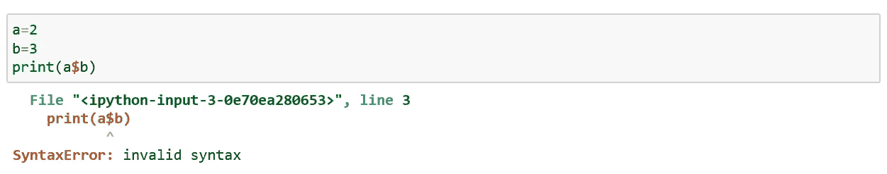
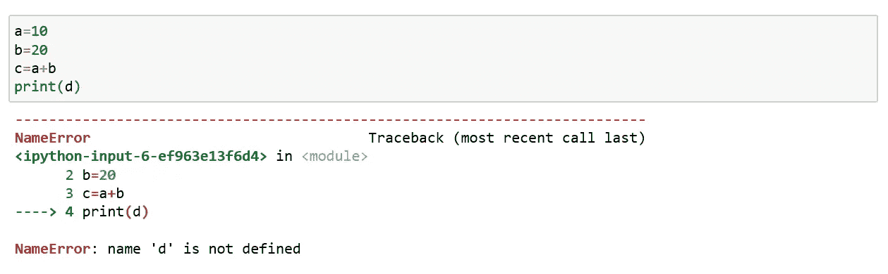
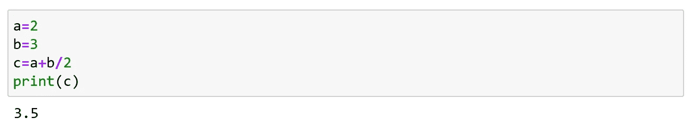
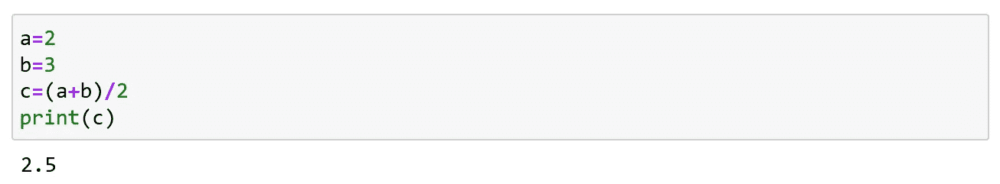
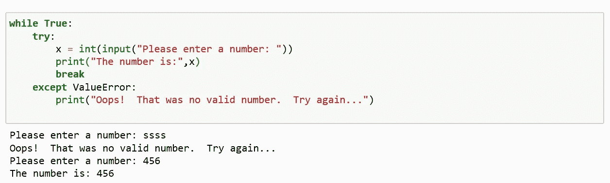
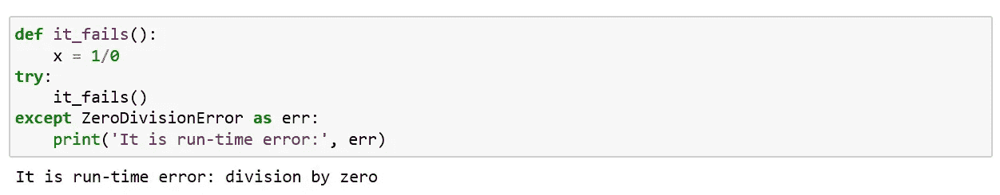
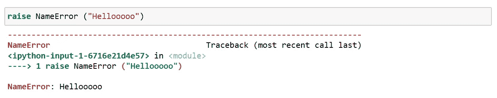
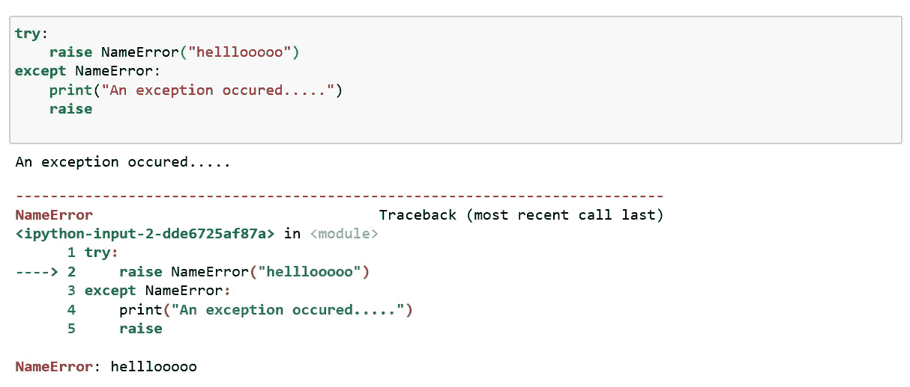
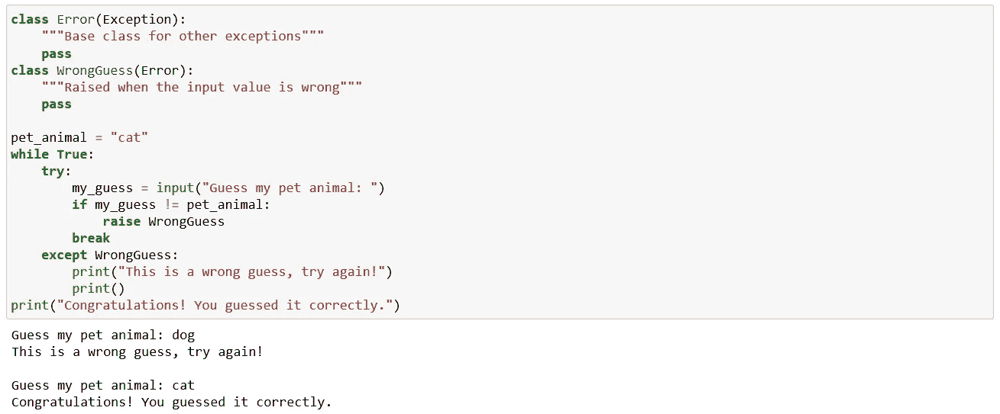

# Python 错误和异常

> 原文：<https://medium.com/analytics-vidhya/python-errors-and-exception-4ea007737843?source=collection_archive---------21----------------------->

当你在编写程序时犯了一些错误，并试图运行它时，python 解释器会遇到一个错误。

一旦解释程序遇到错误，程序就会终止。

这些错误主要分类如下:

语法错误

逻辑误差

**语法错误:**

编写代码时没有构造正确的语法所导致的错误，这种错误称为语法错误或解析错误。

句法误差

**逻辑错误:**

运行时发生的错误称为异常或逻辑错误。每当这些类型的运行时错误发生时，Python 都会创建一个异常对象。如果处理不当，它会打印出对该错误的追溯，以及有关该错误发生原因的一些详细信息。

名称错误

您经常看到的一些内置错误有:

语法错误

名称错误

类型错误

。零除法误差

数值误差

数据误差

索引错误

缩进误差

逻辑错误是最难修复的。当程序运行时没有崩溃，但产生不正确的结果时，就会出现这种情况。这个错误是由程序逻辑中的一个错误引起的。您不会得到错误消息，因为没有发生语法或运行时错误。

例如，当我们试图找出两个数字的平均值，而你没有按照预期的方式正确地编写代码，这将导致逻辑错误。

在这里你不会得到错误，而是得到一个不正确的结果(算术运算的顺序)。

逻辑误差

为了解决这个问题，我们将简单地添加括号:c=(a+b)/2

**自定义异常:**

Python 有许多内置的异常，当出现问题时，会强制程序输出一个错误。

但是，有时您可能需要创建自己的自定义异常。

我们也可以在 Python 中定义自己的异常。

示例 1:

这里，首先执行 try 子句。

如果没有异常发生，except 子句被跳过并执行 try 语句。

如果出现异常，则跳过该子句的其余部分。然后，如果类型与 except 关键字后的单词匹配，则执行 except 子句。

如果出现与 except 子句中命名的异常不匹配的异常，它将被传递给外部 try 语句；如果找不到处理程序，这是一个未处理的异常，执行会停止，并显示一条如上所示的消息。try 语句可以有多个 except 子句。

示例 2:

异常处理程序不处理发生在 try 子句中的异常，也不处理发生在 try 子句中调用的函数内部的异常。

函数内部

**引发异常:**

*raise* 语句允许程序员强制发生指定的异常。例如:

使用加注

如果您需要确定是否引发了异常，但不打算处理它，可以通过重新引发异常来完成。

再次引发异常

**用户定义的异常:**

这里我们将看到如何使用用户定义的异常。

用户定义的异常

这个程序将要求用户猜一个宠物，直到他们猜对了一个存储的动物。为了帮助他们弄清楚，他们的猜测是对是错都会得到提示。

记住，错误几乎总是程序员的错。发现并消除错误的过程称为调试。

就这样，我们来到了这篇文章的结尾。

快乐编码……😊😊😊