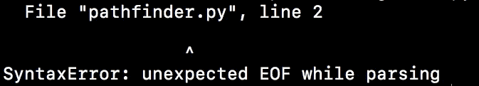
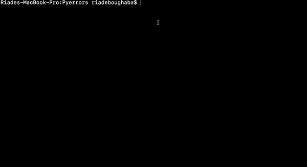
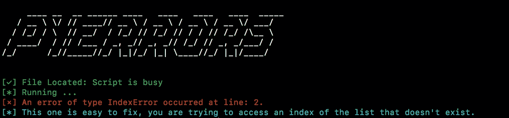

# Python 错误，如何让 Python 异常更有信息量？

> 原文：<https://medium.com/analytics-vidhya/python-errors-how-can-you-make-python-exceptions-more-informative-350cf66a4c52?source=collection_archive---------13----------------------->

如何使 python 错误(python 异常)更具描述性，易于阅读和理解。



普通 Python 语法错误(异常)

错误或异常是每个程序员在从事项目时都会遇到的最令人沮丧的事情。python 也不例外，事实上我发现 python 的错误有时很复杂，因为有些错误不明确。

在上面的图片中，错误类型是语法错误，但错误消息非常复杂，python 初学者(有时是中级)都无法理解，这是因为我没有在 print 语句中关闭括号:

```
print("Hello World!"  → # No closing parenthesis
```

如果解释器可以告诉你只查找拼写错误或未闭合的括号或任何可能在 python 脚本中产生语法错误的内容，那就简单多了。幸运的是，我已经创建了一个名为 Pyerrors 的脚本，它可以为你完成这项工作，请查看下面的图片:



Pyerrors 脚本的作用

但是在引擎盖下到底发生了什么？我收集了所有可能的异常，并创建了一个处理程序，它可以从错误中获取尽可能多的信息，并重新格式化错误消息，以便读者尽可能容易理解。

这不是一切，实际上这是一个基本的和容易解决的异常类型，比如说 IndexError？

```
lst = []
for i in range(10):
    lst.append(i)print(lst[100])
```

这将触发一个 IndexError 消息将超出范围，这个代码很简单，但是如果你使用嵌套循环或长 while 循环语句，这个错误特别导致我在尝试进行算法项目时重写我的整个代码。现在让我们看看 Pyerrors 可以对这种类型的错误做些什么:



Pyerrors 索引错误

脚本返回一个简单的错误，指出行号和要做什么的信息，在这种情况下，脚本告诉您第 2 行的索引不存在。这比普通的 python 异常消息要简单和容易理解得多。

# 怎么用？

如果您对绑定脚本感兴趣，首先您需要从这个[链接下载源代码，](https://github.com/Riade-bg/Pyerrors)然后您指定一个参数和路径。

```
>>> python pyerrors.py --errors|-e path_to_your_script
```

这就是开始的全部内容。但是请注意，Pyerrors 可能会使用您的系统中没有安装的模块，您需要做的就是:

```
1 - Navigate to Pyerrors folder from your terminal
2 - run this code: pip install -r requirements.txt
```

此外，Pyerrors 能够在脚本中搜索警告，通常 python 警告是由用户触发的，因此如果您有非常大的代码，并且您想要检查某个参数是否会触发警告，您可能想要使用此功能:

```
python pyerrors.py --warnings|-w path_to_your_script
```

# 异常树:

在这个树中，您将发现 Pyerrors 可以处理所有异常:

```
Exeptions:
  |
  |- • AssertionError
  |- • AttributeError
  |- • EOFError
  |- • FileNotFoundError
  |- • ImportError
  |- • IndexError
  |- • KeyError
  |- • KeyboardInterrupt
  |- • MemoryError
  |- • NameError
  |- • NotImplementedError
  |- • ModuleNotFoundError
  |- • OSError
  |- • OverflowError
  |- • ReferenceError
  |- • RuntimeError
  |- • StopIteration
  |- • SyntaxError
  |- • IndentationError
  |- • TabError
  |- • SystemError
  |- • TypeError
  |- • UnboundLocalError
  |- • ValueError
  |- • ZeroDivisionError
```

并在 python 中包含了所有类型的警告。

# 结论:

这是版本 1.0，所以它不是一个“成熟”的脚本，它可能有问题或错误，但在未来这个脚本将有更强大的特性和功能。如果你喜欢它或者想为剧本做点贡献，欢迎你，别忘了留下一颗星，这将有助于激励我。

[我的推特](https://twitter.com/riade_b)