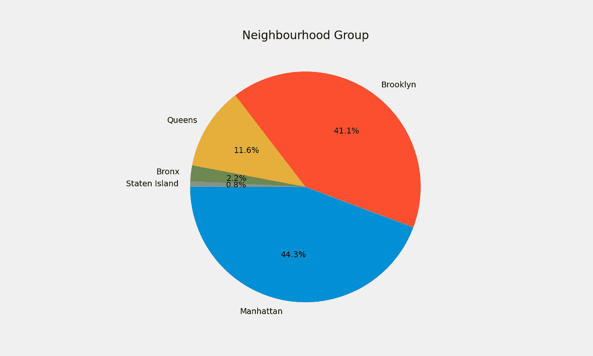
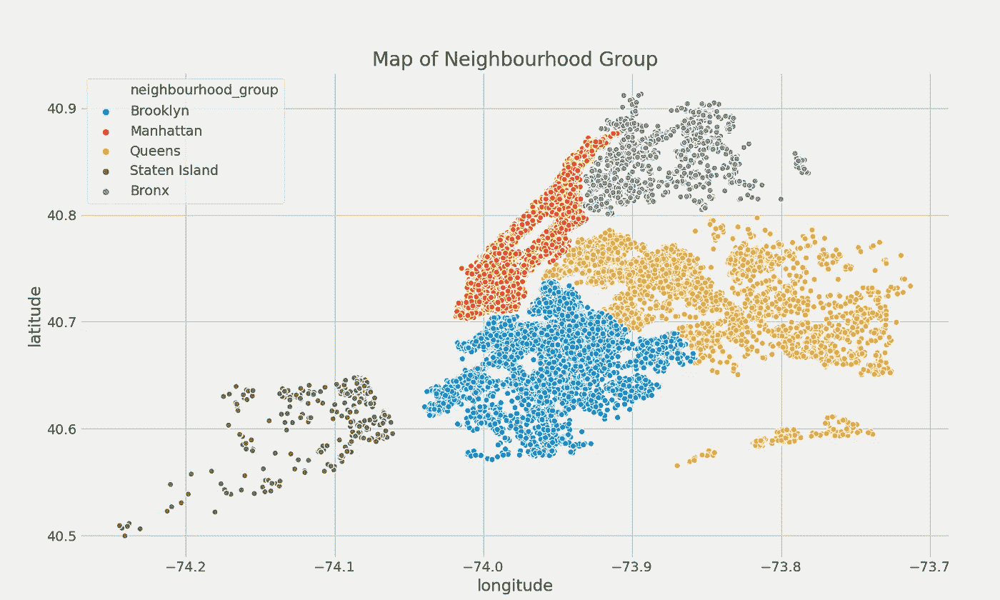
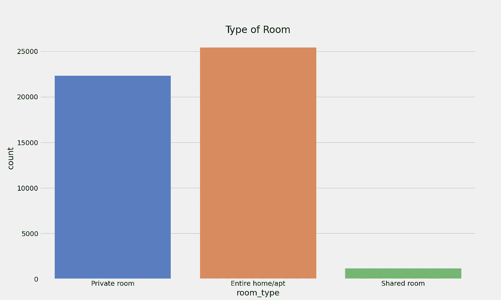
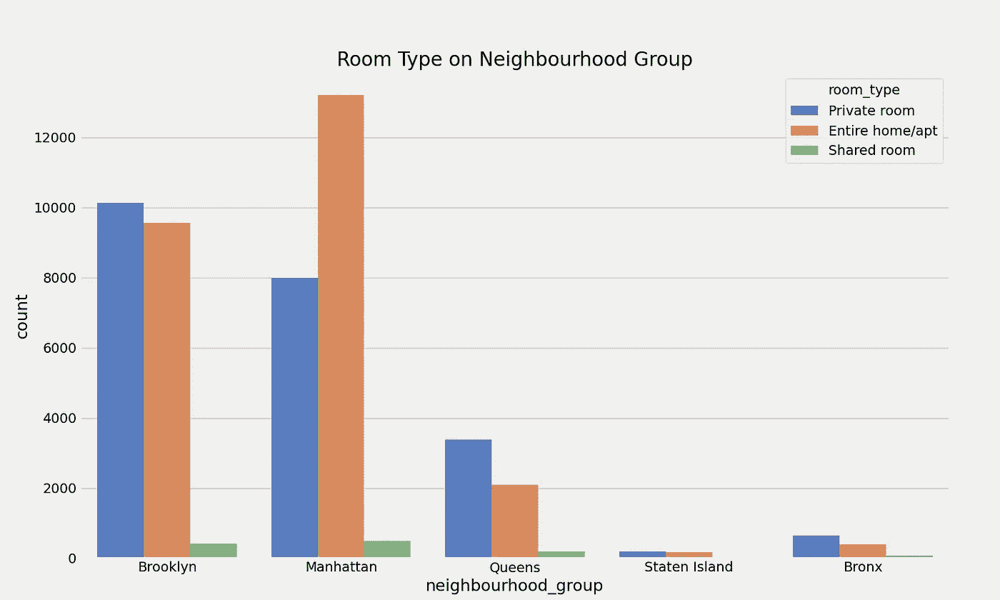
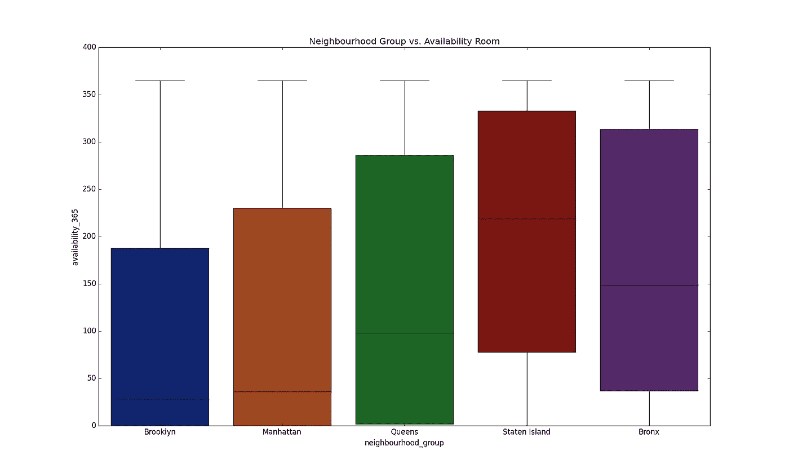
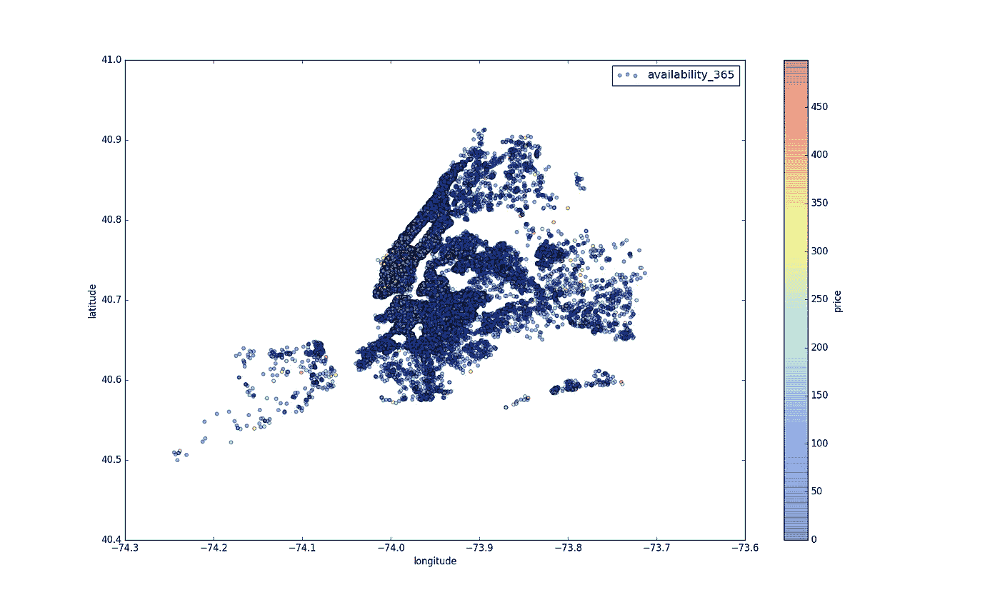
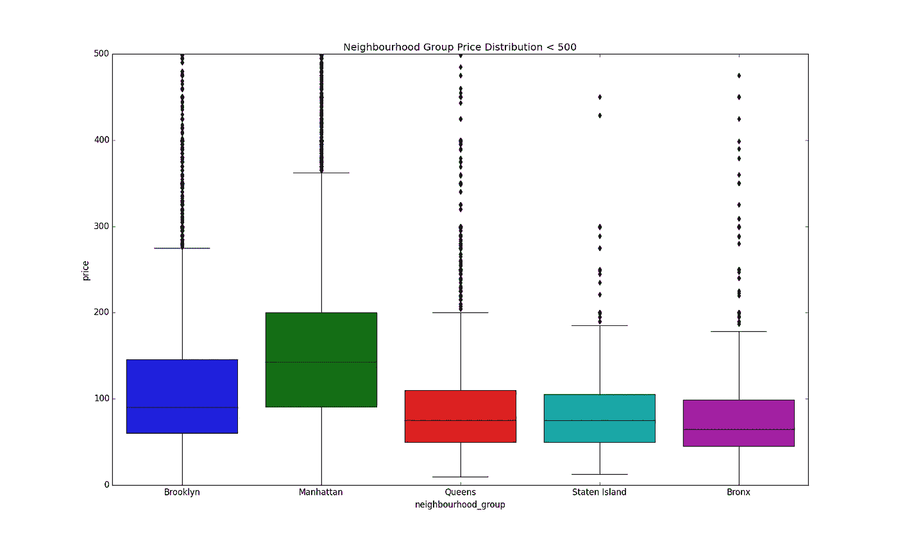
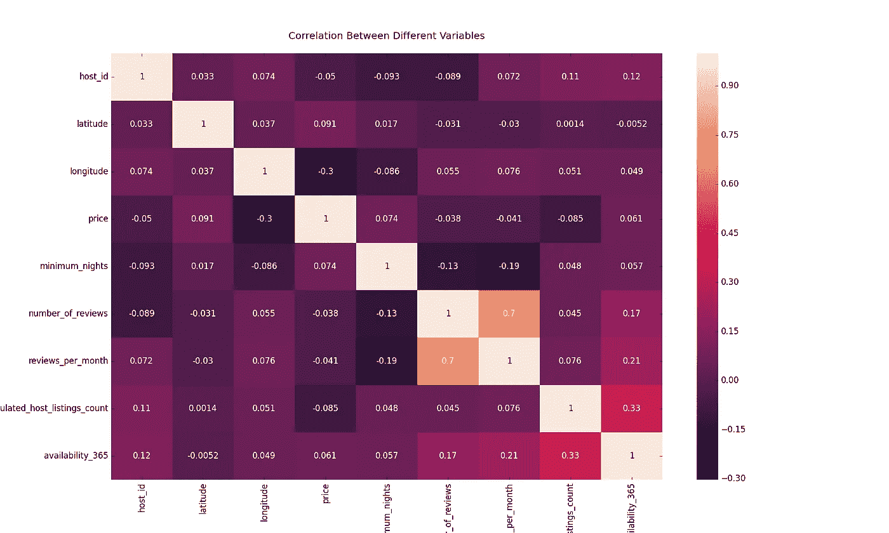
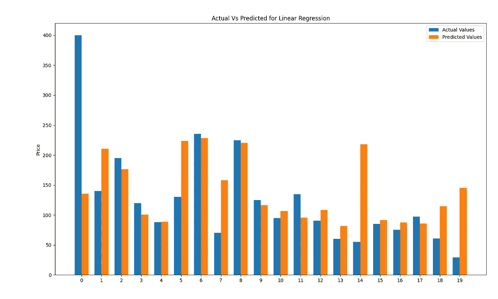

# 纽约 Airbnb 上的 Python 探索性数据分析(EDA)

> 原文：<https://medium.com/analytics-vidhya/python-exploratory-data-analysis-eda-on-nyc-airbnb-cbeabd622e30?source=collection_archive---------2----------------------->


凯尔西·多迪在 [Unsplash](https://unsplash.com?utm_source=medium&utm_medium=referral) 上的照片

答 irbnb 是一个在线市场，它将想出租房屋的人和在当地寻找住处的人联系起来。纽约是美国人口最多的城市，也是全球最受欢迎的旅游和商业城市之一。

自 2008 年以来，客人和主人一直使用 Airbnb 来拓展旅行的可能性，并提供一种更独特、更个性化的体验世界的方式。如今，Airbnb 已经成为全世界都在使用的一种服务。对于这家通过 Airbnb 提供数百万房源的公司来说，数据分析师成为了一个至关重要的因素。这些列表会生成大量数据，这些数据可被分析并用于安全性、业务决策、了解客户和提供商在平台上的行为、实施创新的附加服务、指导营销计划等等。

# 导入库

```
import pandas as pdimport numpy as npimport matplotlibimport matplotlib.pyplot as pltimport seaborn as sns
```

# 加载数据

我们使用的数据集是来自 Kaggle 的“[纽约 Airbnb 开放数据](https://www.kaggle.com/dgomonov/new-york-city-airbnb-open-data)”。使用 Pandas 库，我们将加载 CSV 文件。用 nyc_df 为数据集命名。

```
nyc_df = pd.read_csv(“AB_NYC_2019.csv”)
```

# 数据分析和清理

让我们总结一下现有的数据集。

```
Rows     : 48895
Columns  : 16Features :
 ['id', 'name', 'host_id', 'host_name', 'neighbourhood_group', 'neighbourhood', 'latitude', 'longitude', 'room_type', 'price', 'minimum_nights', 'number_of_reviews', 'last_review', 'reviews_per_month', 'calculated_host_listings_count', 'availability_365']Missing Value    : 20141Columns with missing value:
id                                False
name                               True
host_id                           False
host_name                          True
neighbourhood_group               False
neighbourhood                     False
latitude                          False
longitude                         False
room_type                         False
price                             False
minimum_nights                    False
number_of_reviews                 False
last_review                        True
reviews_per_month                  True
calculated_host_listings_count    False
availability_365                  False
dtype: bool
```

我们有 4 列包含缺失值。现在，我们删除了不必要的列，如 id、name、host_name、last_review。

```
nyc_df.drop([‘id’,’name’,’host_name’,’last_review’], axis=1, inplace=True)print(nyc_df.head())
```

将“每月审核”中的所有 NaN 值替换为 0

```
nyc_df.reviews_per_month.fillna(0, inplace=True)print(nyc_df.isnull().any())host_id                           False
neighbourhood_group               False
neighbourhood                     False
latitude                          False
longitude                         False
room_type                         False
price                             False
minimum_nights                    False
number_of_reviews                 False
reviews_per_month                 False
calculated_host_listings_count    False
availability_365                  False
dtype: bool
```

我们再也没有错过价值。

# 勘探数据和可视化

现在是时候探索我们的数据并将其可视化，以识别数据集之间的关系。

## 邻里小组

```
plt.style.use('fivethirtyeight')plt.figure(figsize=(13,7))plt.title("Neighbourhood Group")g = plt.pie(nyc_df.neighbourhood_group.value_counts(), labels=nyc_df.neighbourhood_group.value_counts().index,autopct='%1.1f%%', startangle=180)plt.show()
```



上面的饼状图显示，纽约的 Airbnb 房源都在曼哈顿附近，布鲁克林的酒店份额最高。我们还从这幅邻里关系图中得知。

```
plt.style.use('fivethirtyeight')plt.figure(figsize=(13,7))plt.title("Neighbourhood Group")g = plt.pie(nyc_df.neighbourhood_group.value_counts(), labels=nyc_df.neighbourhood_group.value_counts().index,autopct='%1.1f%%', startangle=180)plt.show()
```



## —房间详情

让我们看看房间的类型。

```
plt.figure(figsize=(13,7))plt.title("Type of Room")sns.countplot(nyc_df.room_type, palette="muted")fig = plt.gcf()plt.show()
```



我们可以看到，整个住宅/公寓的份额最高，其次是私人房间，最不喜欢的是合租房间。

让我们来看看某个邻居组所住的房间类型。

```
plt.figure(figsize=(13,7))plt.title("Room Type on Neighbourhood Group")sns.countplot(nyc_df.neighbourhood_group,hue=nyc_df.room_type, palette="muted")plt.show()
```



图表显示，整个住宅/公寓最靠近曼哈顿，而靠近布鲁克林的私人房间和公寓几乎相等。

## —邻里小组与空房间

```
plt.style.use('classic')plt.figure(figsize=(13,7))plt.title("Neighbourhood Group vs. Availability Room")sns.boxplot(data=nyc_df, x='neighbourhood_group',y='availability_365',palette="dark")plt.show()
```



上图显示了可用房间和邻居组之间的关系。

## —邻里群体价格分布

```
plt.figure(figsize=(13,7))plt.title("Map of Price Distribution")ax=nyc_df[nyc_df.price<500].plot(kind='scatter', x='longitude',y='latitude',label='availability_365',c='price',cmap=plt.get_cmap('jet'),colorbar=True,alpha=0.4)ax.legend()plt.ioff()plt.show()
```



我们从上面的图表中得到的信息是红色点是价格较高的房间。还有，我们可以看到曼哈顿地区的房价更贵。

```
plt.style.use('classic')plt.figure(figsize=(13,7))plt.title("Neighbourhood Group Price Distribution < 500")sns.boxplot(y="price",x ='neighbourhood_group' ,data = nyc_df[nyc_df.price<500])plt.show()
```



从上面的箱线图中，我们肯定可以观察到纽约 Airbnb 价格分布的一些情况。

1.  我们可以声明曼哈顿具有列表的最高范围价格，平均价格大约为 140 美元，其次是布鲁克林，每晚 90 美元，
2.  皇后区和斯塔滕岛的分布似乎非常相似，
3.  布朗克斯是最便宜的。

# 价格预测

让我们看看各列之间的相关性。

```
corr = nyc_df.corr(method='kendall')plt.figure(figsize=(13,10))plt.title("Correlation Between Different Variables\n")sns.heatmap(corr, annot=True)plt.show()
```



从上面的图表中，我们知道除了每月审查次数和审查次数之外，没有很强的相关性。

**—线性回归**

现在，让我们尝试使用来自 [scikit learn](https://scikit-learn.org/stable/) 的基本机器学习模型进行价格预测。Scikit learn 是 Python 编程语言的免费软件机器学习库。

用于机器学习的导入库

```
from sklearn.model_selection import train_test_splitfrom sklearn.linear_model import LinearRegressionfrom sklearn import metricsfrom sklearn.metrics import mean_squared_error,r2_score, mean_absolute_errorfrom sklearn import preprocessing
import warningswarnings.filterwarnings('ignore')
```

然后，用 0 和 n_classes-1 之间的值对标签进行编码

```
encode = preprocessing.LabelEncoder()
```

安装标签编码器

```
encode.fit(nyc_df.neighbourhood_group)nyc_df.neighbourhood_group=encode.transform(nyc_df.neighbourhood_group)
```

将标签转换为规范化编码

```
encode = preprocessing.LabelEncoder()encode.fit(nyc_df.neighbourhood)nyc_df.neighbourhood=encode.transform(nyc_df.neighbourhood)encode = preprocessing.LabelEncoder()encode.fit(nyc_df.room_type)nyc_df.room_type=encode.transform(nyc_df.room_type)nyc_df.sort_values(by='price',ascending=True,inplace=True)
```

现在，训练线性回归模型

```
l_reg = LinearRegression()X = nyc_df[['host_id','neighbourhood_group','neighbourhood','latitude','longitude','room_type','minimum_nights','number_of_reviews','reviews_per_month','calculated_host_listings_count','availability_365']]y = nyc_df['price']X_train, X_test, y_train, y_test = train_test_split(X, y, test_size=0.2, random_state=101)l_reg.fit(X_train,y_train)
```

价格预测

```
predicts = l_reg.predict(X_test)print("Mean Squared Error: ", np.sqrt(metrics.mean_squared_error(y_test, predicts)))print("R2 Score: ", r2_score(y_test,predicts) * 100)print("Mean Absolute Error: ", mean_absolute_error(y_test,predicts))print("Mean Squareroot Error: ", mean_squared_error(y_test,predicts))
```

我们从线性回归模型中得到的输出

```
Mean Squared Error:  180.73409656936212
R2 Score:  11.639576782324035
Mean Absolute Error:  72.86091366825374
Mean Squareroot Error:  32664.813662743516
```

接下来，我们想知道实际价格和预测价格之间的差异。让我们从制作一个名为 lr_pred_df 新数据帧开始

```
lr_pred_df = pd.DataFrame({‘actual_values’: np.array(y_test).flatten(),‘predicted_values’: predicts.flatten()}).head(20)
```

然后想象它

```
x = lr_pred_df.indexwidth = 0.35fig, ax = plt.subplots()rects1 = ax.bar(x - width/2, lr_pred_df.actual_values, width, label='Actual Values')rects2 = ax.bar(x + width/2, lr_pred_df.predicted_values, width, label='Predicted Values')ax.set_ylabel('Price')ax.set_title('Actual Vs Predicted for Linear Regression')ax.set_xticks(x)ax.legend()fig.tight_layout()plt.show()
```



您可以通过我的 GitHub 下载数据和 python 代码文档:

[](https://github.com/dwiknrd/medium-code/tree/master/ny-airbnb) [## dwiknrd/中等代码

### 此时您不能执行该操作。您已使用另一个标签页或窗口登录。您已在另一个选项卡中注销，或者…

github.com](https://github.com/dwiknrd/medium-code/tree/master/ny-airbnb)