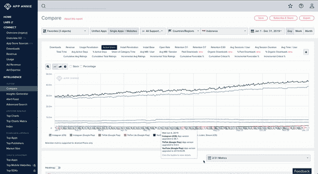
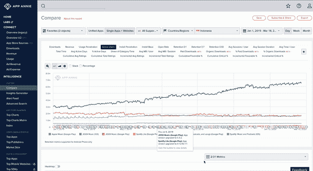
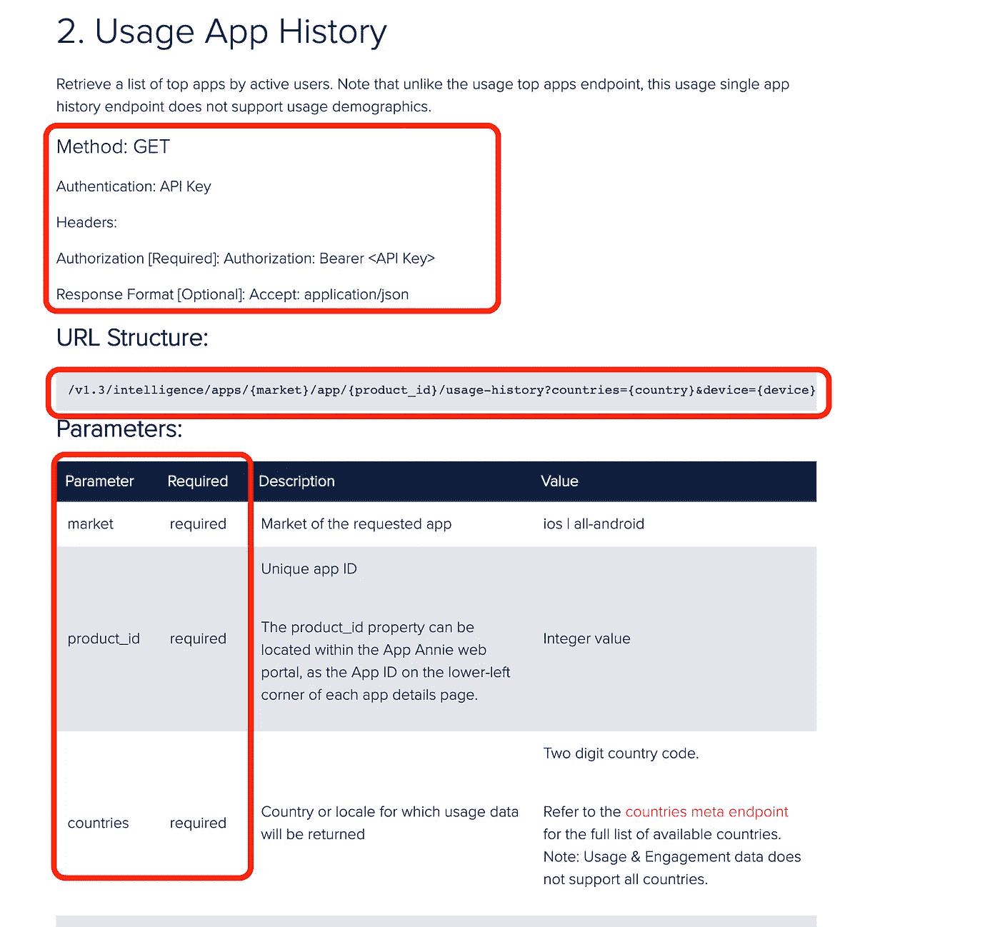
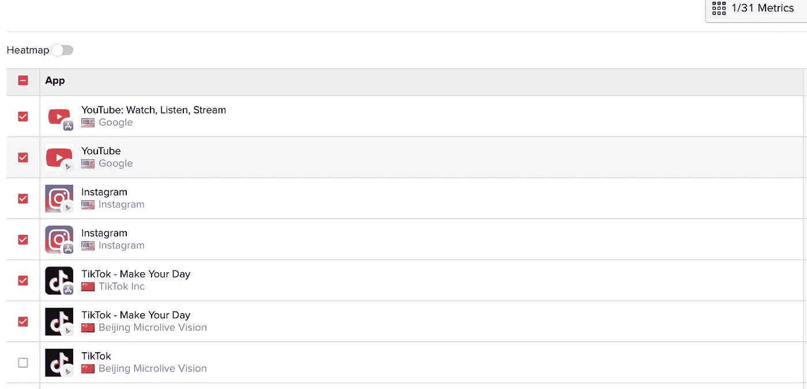
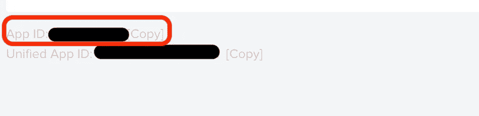
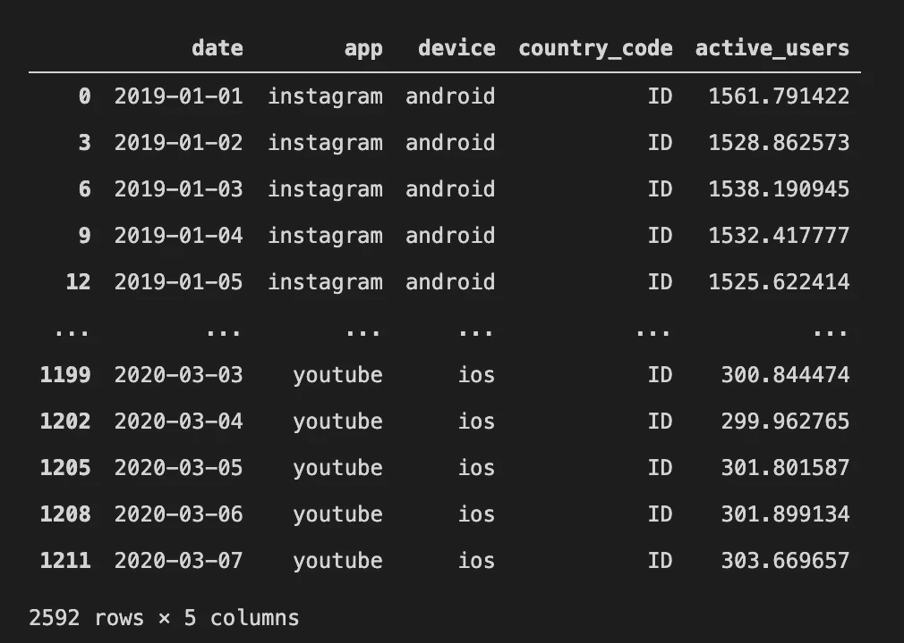

# Python:使用 API 提取数据

> 原文：<https://medium.com/analytics-vidhya/python-extracting-data-using-api-4adaf786f2d3?source=collection_archive---------2----------------------->

*初学者阅读了解更多关于在 python 中使用 API 的内容，不推荐给专业人士*

E 提取数据的方式有很多种，比如将数据导出到平面文件，以 JSON 格式下载等等。这些是输出。但是，如果**使用脚本**，您可以直接连接到您的数据(提取它)并转换成您想要的格式。

# 什么是 API？


图示:API 从数据库中提取数据

> [API](https://www.howtogeek.com/343877/what-is-an-api/) 代表**应用编程接口**，它是一组**协议**，用于**应用服务**之间的通信。

我相信你们中的一些人听到这件事会感到不舒服(害怕)，并认为:

> API 太难了，对于像我这样的分析师来说，我不需要知道这些，这个东西只适合工程师或科学家。

嗯，你的想法一点也没错。使用 API 只是获取数据的众多方法之一，**最简单的方法是手动下载/导出数据到 csv(通过点击按钮)**。

不同之处在于，您可以**以编程方式连接到 API 服务**，导出这些数据，进行一些转换，并将其作为输出加载。基本上，您可以创建一个脚本来做所有这些事情，而不是做 3-5 个步骤(下载、转换、加载等)。即使您能够通过再次运行脚本将数据刷新到最新状态，否则按照传统方式，您需要再次执行 3-5 个步骤来更新数据。

# **案例:从 App Annie 中抽取活跃用户**

活跃用户正成为一些公司用来衡量他们相对于竞争对手的市场地位的标准指标之一。了解竞争对手活跃用户的常用方法之一是从 [**App Annie**](https://www.appannie.com/en/) 。

App Annie 是一个基于应用和移动历史数据来估计活跃用户、下载或广告的平台。

```
**IMAGINE THIS!**You want to **compare** 3 biggest online content provider: [**Youtube**](https://www.youtube.com), [**Instagram**](https://www.instagram.com), and [**TikTok**](https://www.tiktok.com/en) **active users** **daily** for **all time** both **android** and **ios** devices
```

从技术上讲，您可以通过单击导出或使用 API 来提取数据。我将向您介绍这两种方法。

## 方法 1:在 App Annie 界面点击导出



App Annie 界面:创建比较报告并导出到 csv

步骤其实很简单，比如:

1.  您只需要创建比较报告，添加您想要比较的平台
2.  选择`Single Apps + Websites`这样可以区分 android 和 ios
3.  选择时间框架(我选择从 2019 年 1 月到 2019 年底)
4.  选择您想要的聚合(我希望每天都有)
5.  点击右上角的`Export`，继续操作，直到您的 csv 准备就绪

缺点是当您在特定时间执行这些步骤时，**报告只会更新到该特定时间**，如果您想要再次更新，您需要再次运行所有这 5 个步骤。你将需要清理你的数据，这可以在 excel 或其他电子表格阅读器中完成，或者你有另一个堆栈来更容易地完成这项工作(*相信我，在电子表格*中手动完成清理工作是很累的)

## 方法 2:使用 App Annie API 导出数据

首先，您需要**确保您在 App Annie 上的访问权限也包括 API 访问权限**



正在检查您帐户的 API 密钥

您可以通过以下步骤完成此操作:

1.  指向右上角的帐户形状按钮，单击`API Key`
2.  如果您可以访问 App Annie API，您应该可以查看此页面，并单击`Show Key`，这是您的 API 密钥(不要与任何人共享)
3.  请注意点击 API 的使用限制，如果超过限制，您将无法再次点击 API

其次，浏览 [App Annie 帮助中心](https://helpcenter.appannie.com/community/s/)，该 API 构建器记录了连接 API 和提取数据所需的所有内容，例如:您需要的 URL 结构、响应格式、响应中每个属性的定义等。

```
In this case, I have to follow the steps from this [**LINK**](https://helpcenter.appannie.com/community/s/article/Usage-Engagement-APIs), at **Usage App History** part
```

您需要根据此文档指定正确的 URL 结构，并填写所需的参数以成功获取您的数据(请参见下图)



定义良好的 API 文档

## 起始代码！！！

1.  导入所需的库

```
import pandas as pd
import json
import requests
```

2.构造所需格式的密钥( *API 密钥因用户而异*

```
key = f'bearer {api_key}'
```

3.创建一个函数将 JSON 传递给 pandas dataframe ( *原因:可读性更强*，然后你只需改变参数`product_id`就可以改变不同的 app，改变参数`market`用于 ios/android，改变参数`country`就可以改变国家。然后，你可以调用这个函数来得到结果。

```
def extract_active_user_appannie(product_id, market, country, app, granularity="daily", start_date="2019-01-01"):
    #market = ios/all-android
    #country = "2 digit country code (ID,SG,TH,etc)"
    #granularity = daily, weekly, monthly
    url = f"[https://api.appannie.com/v1.3/intelligence/apps/{market}/app/{product_id}/usage-history?countries={country}&granularity={granularity}&start_date={start_date](https://api.appannie.com/v1.3/intelligence/apps/{market}/app/{product_id}/usage-history?countries={country}&granularity={granularity}&start_date={start_date)}"response = requests.get(url, headers={'Authorization':key})
    df = pd.DataFrame(response.json()["list"])[["device","date","active_users"]]
    df["country_code"] = country
    df["app"] = app
    return df
```

您可以通过点击每个应用程序找到`product_id`，向下滚动页面，您会发现灰色字体的`App ID`



点击应用名称进入应用页面并获取应用 ID



将应用程序 ID 复制为上面代码中的 product_id

4.激动人心的部分:使用函数从每个应用程序中提取数据

```
#android
android_instagram = extract_active_user_appannie(product_id=<instagram_android_app_ID>,app="instagram",market="all-android",country="ID")
android_tiktok = extract_active_user_appannie(product_id=<tiktok_android_app_ID>,app="tiktok",market="all-android",country="ID")
android_youtube = extract_active_user_appannie(product_id=<youtube_android_app_ID>,app="youtube",market="all-android",country="ID")#ios
ios_instagram = extract_active_user_appannie(product_id=<instagram_ios_app_ID>,app="instagram",market="ios",country="ID")
ios_tiktok = extract_active_user_appannie(product_id=<tiktok_ios_app_ID>,app="tiktok",market="ios",country="ID")
ios_youtube = extract_active_user_appannie(product_id=<youtube_ios_app_ID>,app="youtube",market="ios",country="ID")df = pd.concat([android_instagram,android_tiktok,android_youtube,ios_instagram,ios_tiktok,ios_youtube])
df = df.loc[df["device"].isin(["android","ios"])]
df = df[["date","app","device","country_code","active_users"]]
```



最终输出样本

*❗️* ***警告*** *:以上数字是我自己生成的虚拟数字，根本不代表各自 App 的真实活跃用户* **(实际活跃用户是保密的，版权归 App Annie 所有)**

下次您想要将数据更新到最近的日期时，您只需再次运行 python 脚本，或者使用 cron/airflow 使其自动化。这显然可以节省你的时间很多，你可以做其他事情。

# 结论

根据我的经验，你将需要以上两种方法，但在某些情况下。

**何时可以应用方法 1:**

1.  你只需要**一次临时分析**，不需要一直更新数据。
2.  **您很快就需要数据**(例如:您的利益相关者在早上请求数据，并期望数据在当天中午/下午准备好👌)，如果是这种情况，我不希望您使用 API 提取数据，因为创建和测试脚本将会耗尽时间，并且您还需要清理数据。

**何时可以应用方法 2:**

1.  **你需要的数据应该每天/每周/每月更新**(例如:创建一个仪表板)，除非你不会浪费你的生命😩，我建议您自动化数据提取过程，直到它准备好结束输出。
2.  **你有足够的时间来探索这种方法**，我知道这种方法从来都不容易，但我很肯定你会从这种方法中获益，因为你会更了解 API 本身以及如何与其输出进行交互。这将是你改变人生的时刻。毕竟这种方法实在是太酷了，而不仅仅是导出手册。(哈哈哈😂😂)

**— — — — —故事结束— —**

***注意事项*** *:本文仅涵盖从数据提取到数据准备就绪。但是，更有趣的部分是我们如何利用这些数据成为利益相关者的有用见解。我将在另一个故事中讲述这些事情。敬请关注！！！！*