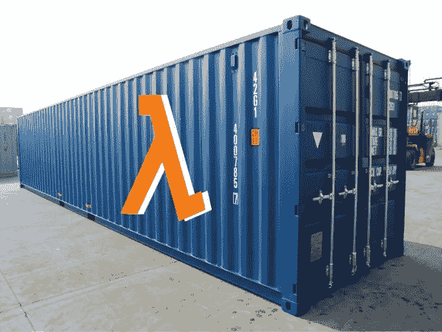
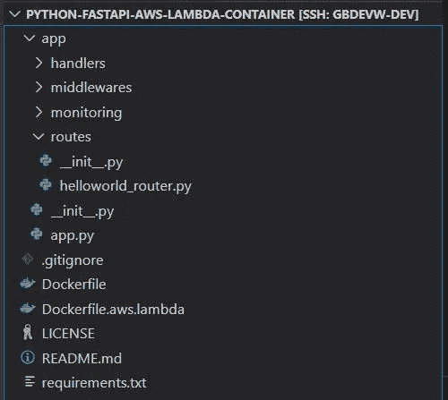
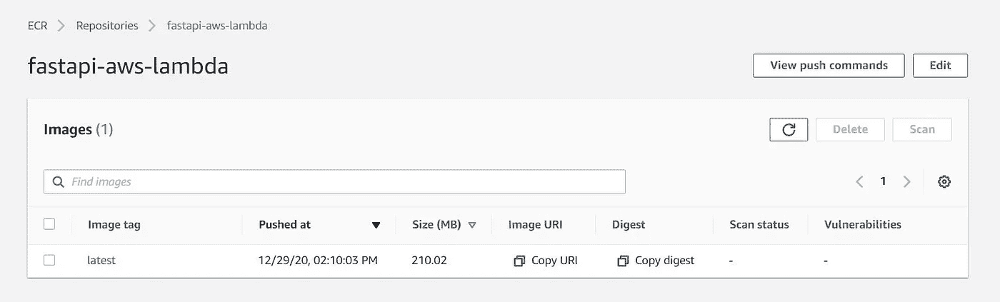
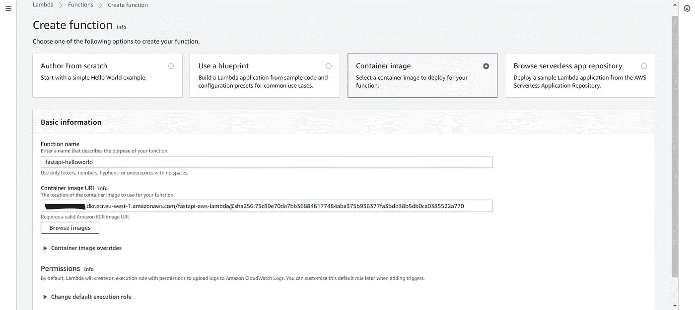
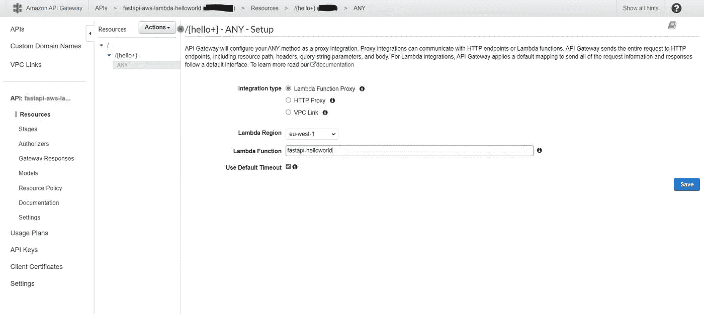
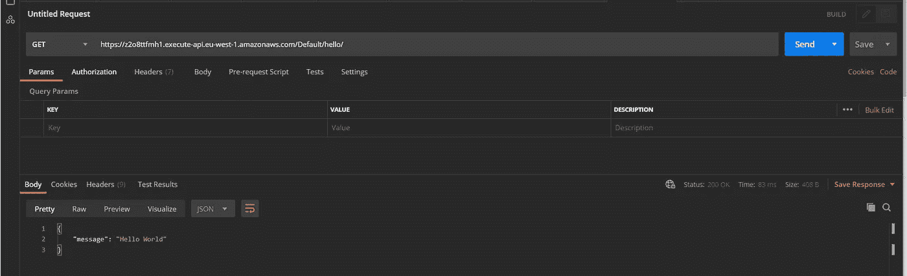

# Python FastAPI 和 AWS Lambda 容器

> 原文：<https://medium.com/analytics-vidhya/python-fastapi-and-aws-lambda-container-3e524c586f01?source=collection_archive---------2----------------------->



2020 年 12 月，AWS 已经发布了对 AWS Lambda 的[容器支持。本文展示了如何在 AWS Lambda 上构建、测试和部署一个容器，该容器嵌入了一个基于](https://aws.amazon.com/blogs/aws/new-for-aws-lambda-container-image-support/) [FastAPI](https://fastapi.tiangolo.com/) 和 [Mangum](https://mangum.io/) 的简单 Python REST API。

容器支持对于部署无法通过 Lambda 限制或使用不支持的运行时的应用程序非常有用。这对嵌入深度学习或机器学习模型的 Python 应用程序尤其有用，因为库和模型通常太重，无法部署在 AWS Lambda 上，即使使用 Lambda 层也是如此。

测试应用程序的源代码、Dockerfile 和指令可以在[这里](https://github.com/gbdevw/python-fastapi-aws-lambda-container)找到。尽情享受吧！

## 项目布局



根目录包含一个描述 Python 依赖关系的 requirements.txt 文件和一个“app”文件夹，该文件夹是 FastAPI 应用程序的根模块。

它还包含两个 Docker 文件:一个用于构建在 Uvicorn 上运行 FastAPI 应用程序的“常规”容器，另一个使用 AWS 提供的图像来构建可以在 AWS Lambda 上部署的容器。

## FastAPI 应用程序

app.py 文件包含配置 FastAPI 应用程序、其中间件、路由器、错误处理程序等的 Python 脚本

最重要的部分是第 24 行，这里我们使用 [Mangum](https://pypi.org/project/mangum/) 来创建 AWS Lambda 处理程序，它将翻译并“转发”请求到 FastAPI 应用程序。

## 构建 AWS Lambda 容器的 Dockerfile 文件

Dockerfile 文件非常简单:

*   它使用来自 AWS 的基础映像
*   它复制本地“app”文件夹的内容，并将其粘贴到工作目录下的“app”文件夹中
*   它复制工作目录中的 requirements.txt 文件
*   它使用 pip 和 requirements.txt 安装 Python 依赖项
*   CMD 定义了在哪里可以找到 Lambda 处理程序，并将被基本映像入口点使用。

## 构建容器并将其推到 AWS ECR 上

该命令使用专用 Dockerfile 构建容器，并对其进行标记，以便能够将其推送到 ECR 私有存储库:

```
docker build -t <account_id>.dkr.ecr.eu-west-1.amazonaws.com/fastapi-aws-lambda:latest . -f Dockerfile.aws.lambda
```

以下是如何登录 ECR 并将映像推送到私有 ECR 存储库的方法:

```
export AWS_ACCESS_KEY_ID=secret
export AWS_SECRET_ACCESS_KEY=secret
export AWS_DEFAULT_REGION=<region>aws ecr get-login-password --region <region> | docker login --username AWS --password-stdin <account_id>.dkr.ecr.eu-west-1.amazonaws.comdocker push <account_id>.dkr.ecr.eu-west-1.amazonaws.com/fastapi-aws-lambda:latest
```

结果是:



## 本地测试 AWS Lambda 容器

AWS 提供的容器映像已经包含了 [Lambda 运行时接口仿真器](https://docs.aws.amazon.com/lambda/latest/dg/images-test.html)，可以在本地测试。

首先，必须启动容器:

```
docker run -p 9000:8080 <account_id>.dkr.ecr.eu-west-1.amazonaws.com/fastapi-aws-lambda:latest
```

API 不能直接针对 AWS Lambda 容器进行测试(但是您可以简单地运行 FastAPI 应用程序来测试 API)。要测试 Lambda，您必须向 RIE 发送一个 Lambda 事件。该事件将被转发给 Lambda 处理程序，后者将翻译该事件并将其“转发”给 FastAPI 应用程序。

该命令向 RIE 发送一个事件，该事件模拟来自 AWS API 网关的事件:

```
curl -XPOST "[http://localhost:9000/2015-03-31/functions/function/invocations](http://localhost:9000/2015-03-31/functions/function/invocations)" -d '{
    "resource": "/hello",
    "path": "/hello/",
    "httpMethod": "GET",
    "headers": {
      "Accept": "*/*",
      "Accept-Encoding": "gzip, deflate",
      "cache-control": "no-cache",
      "CloudFront-Forwarded-Proto": "https",
      "CloudFront-Is-Desktop-Viewer": "true",
      "CloudFront-Is-Mobile-Viewer": "false",
      "CloudFront-Is-SmartTV-Viewer": "false",
      "CloudFront-Is-Tablet-Viewer": "false",
      "CloudFront-Viewer-Country": "US",
      "Content-Type": "application/json",
      "headerName": "headerValue",
      "Host": "gy415nuibc.execute-api.us-east-1.amazonaws.com",
      "Postman-Token": "9f583ef0-ed83-4a38-aef3-eb9ce3f7a57f",
      "User-Agent": "PostmanRuntime/2.4.5",
      "Via": "1.1 d98420743a69852491bbdea73f7680bd.cloudfront.net (CloudFront)",
      "X-Amz-Cf-Id": "pn-PWIJc6thYnZm5P0NMgOUglL1DYtl0gdeJky8tqsg8iS_sgsKD1A==",
      "X-Forwarded-For": "54.240.196.186, 54.182.214.83",
      "X-Forwarded-Port": "443",
      "X-Forwarded-Proto": "https"
    },
    "multiValueHeaders":{
      "Accept":[
        "*/*"
      ],
      "Accept-Encoding":[
        "gzip, deflate"
      ],
      "cache-control":[
        "no-cache"
      ],
      "CloudFront-Forwarded-Proto":[
        "https"
      ],
      "CloudFront-Is-Desktop-Viewer":[
        "true"
      ],
      "CloudFront-Is-Mobile-Viewer":[
        "false"
      ],
      "CloudFront-Is-SmartTV-Viewer":[
        "false"
      ],
      "CloudFront-Is-Tablet-Viewer":[
        "false"
      ],
      "CloudFront-Viewer-Country":[
        "US"
      ],
      "":[
        ""
      ],
      "Content-Type":[
        "application/json"
      ],
      "headerName":[
        "headerValue"
      ],
      "Host":[
        "gy415nuibc.execute-api.us-east-1.amazonaws.com"
      ],
      "Postman-Token":[
        "9f583ef0-ed83-4a38-aef3-eb9ce3f7a57f"
      ],
      "User-Agent":[
        "PostmanRuntime/2.4.5"
      ],
      "Via":[
        "1.1 d98420743a69852491bbdea73f7680bd.cloudfront.net (CloudFront)"
      ],
      "X-Amz-Cf-Id":[
        "pn-PWIJc6thYnZm5P0NMgOUglL1DYtl0gdeJky8tqsg8iS_sgsKD1A=="
      ],
      "X-Forwarded-For":[
        "54.240.196.186, 54.182.214.83"
      ],
      "X-Forwarded-Port":[
        "443"
      ],
      "X-Forwarded-Proto":[
        "https"
      ]
    },
    "queryStringParameters": {
    },
    "multiValueQueryStringParameters":{
    },
    "pathParameters": {
    },
    "stageVariables": {
      "stageVariableName": "stageVariableValue"
    },
    "requestContext": {
      "accountId": "12345678912",
      "resourceId": "roq9wj",
      "stage": "testStage",
      "requestId": "deef4878-7910-11e6-8f14-25afc3e9ae33",
      "identity": {
        "cognitoIdentityPoolId": null,
        "accountId": null,
        "cognitoIdentityId": null,
        "caller": null,
        "apiKey": null,
        "sourceIp": "192.168.196.186",
        "cognitoAuthenticationType": null,
        "cognitoAuthenticationProvider": null,
        "userArn": null,
        "userAgent": "PostmanRuntime/2.4.5",
        "user": null
      },
      "resourcePath": "/hello/",
      "httpMethod": "GET",
      "apiId": "gy415nuibc"
    },
    "body": "{}",
    "isBase64Encoded": false
}'
```

以下是本地 Lambda 容器的输出:

```
{"isBase64Encoded": false, "statusCode": 200, "headers": {"content-length": "25", "content-type": "application/json", "x-correlation-id": "e6ccda71-c841-40de-8208-aff40a2b155b"}, "body": "{\"message\":\"Hello World\"}"}
```

## 部署 AWS Lambda 并配置 AWS API 网关

首先，AWS Lambda 创建如下:



其次，配置 API 网关。这里，对/hello 资源及其所有子资源的所有请求都被转发到刚刚创建的 AWS Lambda。API 部署在名为“Default”的阶段上。



## 测试 REST API

AWS Lambda 已经创建并使用了容器。AWS API 网关被配置并将请求转发给 Lambda。

现在是测试 API 的时候了。Postman 用于向“/hello/”端点发送 GET 请求。



一切都很好，Lambda 成功地处理了请求。我们可以注意到第一次冷启动是由于容器拉力。查看 Cloudwatch 日志:

```
REPORT RequestId: 55ed629c-0e61-426a-96d0-fc8d0106356b Duration: 48.08 ms Billed Duration: 5128 ms Memory Size: 128 MB Max Memory Used: 74 MB Init Duration: 5079.39 msREPORT RequestId: 4518ba46-4bc9-4fac-a74c-1e7e3730bfe4 Duration: 3.47 ms Billed Duration: 4 ms Memory Size: 128 MB Max Memory Used: 74 MB
```

另外，请注意计费持续时间现在不限于最低 100 毫秒。使用 AWS Lambda 的另一个重要原因；)