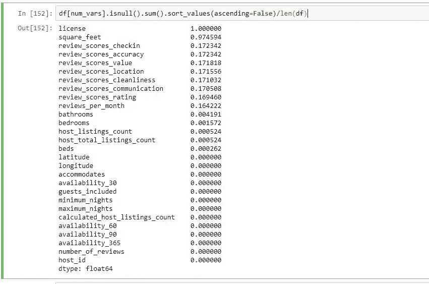

# Python:在熊猫数据框中查找缺失值

> 原文：<https://medium.com/analytics-vidhya/python-finding-missing-values-in-a-data-frame-3030aaf0e4fd?source=collection_archive---------0----------------------->

如何使用 Python/Pandas 在数据框中查找缺失值

熊猫数据框中缺少值

# **简介:**

当你开始从事任何数据科学项目时，提供给你的数据从来都不是干净的。任何数据集最常见的问题之一是缺少值。大多数机器学习算法都无法处理缺失值。在应用任何机器学习算法之前，需要解决丢失的值。

根据缺失值是连续的还是分类的，可以用不同的方式处理缺失值。在这一节中，我将介绍如何查找缺失值。在下一篇文章中，我将讨论如何处理丢失的值。

# **查找缺失值:**

在本练习中，我将使用西雅图 Airbnb 数据中的“listings.csv”数据文件。数据可以在这个链接下找到:【https://www.kaggle.com/airbnb/seattle?select=listings.csv 

**第一步:加载数据帧，研究数据帧的结构。**

第一步是加载文件并查看文件的结构。当您有一个包含大量列的大 dateset 时，很难查看每一列并研究列的类型。

为了找出有多少列是分类的和数字的，我们可以使用 pandas“dtypes”来获得不同的数据类型，您可以使用 pandas“value _ counts()”函数来获得每个数据类型的计数。Value_counts 对所有唯一实例进行分组，并给出每个实例的计数。

正如您在下面看到的，我们有 62 列是对象(分类数据)，17 列是浮点数据类型，13 列是 int 数据类型。

**步骤 2:在数据框中分离分类和数字列**

将数据框中的分类列和数值列分开的原因是，这两种数据类型处理缺失值的方法是不同的，我将在下一节介绍这一点。

实现这一步最简单的方法是根据数据类型从原始数据框中过滤出列。通过使用“dtypes”函数和等式运算符，可以得到哪些列是对象(分类变量)，哪些不是。

要获得满足上述条件的列的列名，我们可以使用“df.columns”。下面的代码给出了对象的列名和非对象的列名。

正如你在下面看到的，我们将原始数据帧分成两部分，并给它们分配了新的变量。一个用于分类变量，一个用于非分类变量。

**第三步:查找缺失值**

对于分类变量和连续变量，查找缺失值是一样的。我们将使用“num_vars ”,它保存所有非对象数据类型的列。

**df[num_vars]** 将给出“num_vars”中的所有列，它由数据框中所有非对象数据类型的列组成。

我们可以使用 pandas **"isnull()"** 函数找出所有缺少值的字段。如果字段有缺失值，则返回 True，如果字段没有缺失值，则返回 false。

为了得到每一列中有多少缺失值，我们使用了 **sum()** 和 **isnull()** ，如下所示。这将汇总上一步中每一列中所有的真值。

按降序对列进行排序总是一种好的做法，这样您就可以看到缺失值最高的列。为此我们可以使用 **sort_values()** 函数。默认情况下，该函数将按升序排序。因为我们首先想要缺失值最高的列，所以我们想将其设置为降序。您可以通过在 **sort_values()中传递“ascending=False”参数来做到这一点。**

上面给出了每一列中缺失值的数量。要获得每列中缺失值的百分比，可以除以数据框的长度。您可以“len(df)”，它给出了数据框中的行数。

正如您在下面看到的，license 列缺少 100%的数据，square _ feet 列缺少 97%的数据。

# **结论**

上面的文章介绍了如何使用 Python pandas 库在数据框中查找缺失值。以下是步骤

1.  使用 **isnull()** 函数识别数据帧中缺失的值
2.  使用 **sum()** 函数获得每列所有缺失值的总和。
3.  使用**sort _ values(ascending = False)**函数以降序获取缺少值的列。
4.  除以 **len(df)** 得到每一列中缺失值的百分比。

在本节中，我们确定了丢失的值，在下一节中，我们将讨论如何处理这些丢失的值。