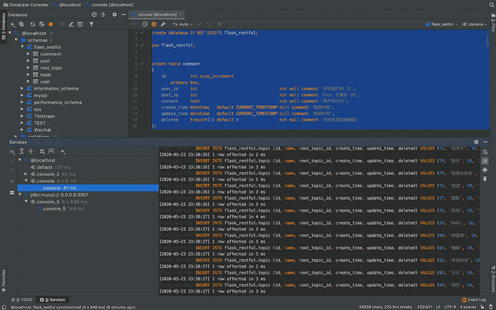
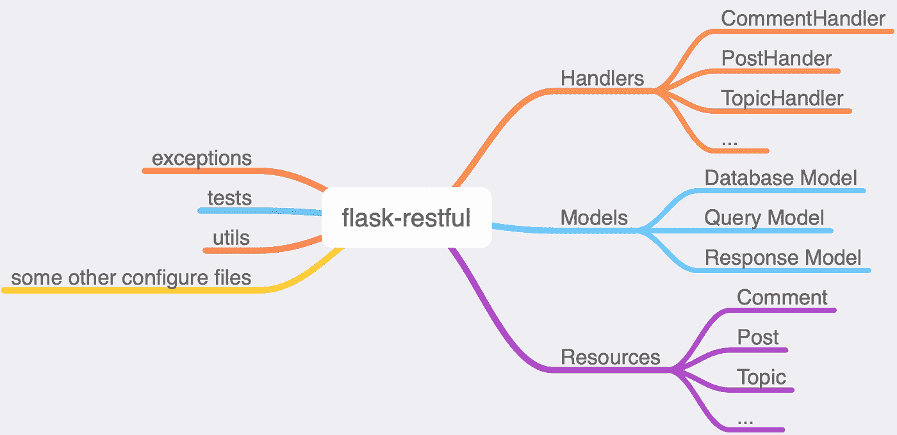

# Python flask-restful web 后端

> 原文：<https://medium.com/analytics-vidhya/python-flask-restful-web-backend-598e86e74fd7?source=collection_archive---------15----------------------->

*   这是一个基于`flask-restful`的 web 后端项目，编码在`python3.8`中。
*   你可以把它当作学习 web-framework 的模板，或者只是开始使用 python 编写 web 项目。
*   该项目使用**输入**进行输入提示。
*   本项目使用 **Unittest** 进行测试。
*   这个项目的资源库网址是[这里](https://github.com/RuiCoreSci/flask-restful)

# 1.需要

*   Python3.8
*   MySql(5.7 或以上版本)

# 2.奔跑

# 2.1 Docker(推荐)

1.  安装[对接器](https://docs.docker.com/get-docker/)。
2.  光盘到项目目录，运行`make run`直到完成。

*   `make run`会构建 docker 镜像，启动服务器(比如 Mysql)。

1.  运行`make init`到初始数据库(创建数据库，创建表格，**无数据导入**)。

*   到 [localhost](http://0.0.0.0:24579/health) 检查是否正确启动。

**注意** : `make test`将运行文件夹`tests`中的所有单元测试。

# 2.2 外壳

1.  使用类似`CREATE DATABASE flask DEFAULT CHARSET utf8`的命令或 GUI 工具(如 [DataGrip](https://www.jetbrains.com/datagrip/) )在您自己的 DB 服务器中创建一个数据库。
2.  将文件`settings.py`中的`SQLALCHEMY_DATABASE_URI`和`SQLALCHEMY_DATABASE_BASE`修改为您自己的设置。
3.  运行:

```
python3.8 -m venv --clear venvsource ./venv/bin/activepip install -r requirements.txtpython server.py
```

1.  进入[本地主机](http://0.0.0.0:24579/health)检查是否正确启动。

# 2.3 加载样本数据

*   如果你想加载 soma 数据来玩这个项目，使用这个项目提供的`data.sql`。

1.  打开 DataGrip，连接 Mysql 数据库；
2.  使用任意编辑器打开`data.sql`，将其内容复制到控制台，执行；

*   使用 DataGrip，您应该得到类似这样的结果:



# 3.休息

*   什么是**休息**？REST 代表**(资源)表述性状态转移**，它是一种无状态通信协议。rest 的核心概念是**资源**。在 **REST** 的观点中，每一个可以被抽象的概念都被称为资源。假设属性`name`、`age`、`email`可以抽象为用户模型，那么`User`可以表示为资源。
*   **转移**是指资源从服务器端转移到客户端。
*   在 **REST** 世界中，每个操作都是在某种资源上操作的，并且有预定义的**动词**来描述。如 **Post** 表示创建一个资源， **Put** 表示更新一个资源， **Delete** 表示删除一个资源。这三个动词是主要使用的，你可以查看这里的[了解更多细节。](https://realpython.com/flask-connexion-rest-api/)

# 4.休息的好处

*   使用 REST，您将获得一些优势:

1.  每个 **URI** (或者 URL)都是针对一个特定的资源，它让你的代码变得干净 [**自描述**](https://en.wikipedia.org/wiki/Self-documenting_code) 。基本上，自我描述意味着你所见即所得，你可以快速猜测你将从 URI 得到什么。
2.  资源与视图函数是分离的，这意味着你可以在不影响其他人的情况下改变你的后端逻辑函数，前提是你采用相同的参数并返回相同的资源，这很容易实现。
3.  它是无状态的，这意味着在请求资源之前，你不需要担心被包围的上下文。

# 5.统一响应结构

*   使用 Rest，我们应该使返回到**的响应保持不变**。大多数情况下，响应数据应该包含两部分:**元**和**数据**。
*   **Meta** 表示关于请求的信息，来自客户端的请求是成功还是失败？是否被服务器成功理解但请求不被允许？
*   **数据**表示请求者想要得到的资源。
*   在本项目中，响应定义如下:

```
{
    "data": data,
    "error_code": error_code,
    "error_msg": error_msg,
}
```

*   例如，当一个请求想要得到一个用户，比如说**用户 1** ，它可能得到:

```
{
    "data": {
        "id": 1,
        "name": "John",
        "web_site": "https://github.com/account",
        "email": "hrui801@gmail.com",
        "create_time": "2020-05-22 13:41:49",
        "update_time": "2020-05-22 13:41:49" },
    "error_code": 0,
    "error_msg": "success"
}
```

*   **你应该知道的一些事情**:
*   基本上，我们不直接在处理函数中返回 JSON 数据，而是返回一个对象。
*   因此，在返回前端之前，我们应该将对象编组为 JSON 格式。
*   在 flask 中，您可以使用 **jsonify** 函数来实现这一点，要将定制的数据传输到 JSON，您可以重写 **json。JSONEncoder** 函数。
*   在这个项目中，json。JSONEncoder 被重写为:

```
class JsonEncoder(json.JSONEncoder):
    def default(self, value) -> Any:
        if isinstance(value, (datetime.datetime, datetime.date)):
            return value.strftime("%Y-%m-%d %H:%M:%S")
        if isinstance(value, ApiResponse):
            return value.get()
        if isinstance(value, BaseModel):
            return value.marshal()
        if isinstance(value, types.GeneratorType):
            return [self.default(v) for v in value] return json.JSONEncoder.default(self, value)
```

*   然后注册到 flask app:

```
app.json_encoder = JsonEncoder
```

*   Finlay，在你返回数据到前端之前，调用`jsonify`函数:

```
def schema(query_model: BaseQueryModel, response_model: ApiDataType):
    def decorator(func): @wraps(func)
        def wrapper(self, **kwargs) -> Callable:
            """Some logic """
            # jsonify function is called here
            return jsonify(func(self, **kwargs))        return wrapper return decorator
```

# 6.统一异常处理

*   异常**并不意味着不好，另一方面，让用户知道他们正在做服务器不满意的事情是很重要的。他们需要知道原因。**
*   为了给用户相应的错误信息，并正确地引发异常，本项目使用文件**异常**来阐明所有异常。

```
class ServerException(Exception):
    code = 500 class ArgumentInvalid(ServerException):
    code = 400
```

*   你可以给每个类添加一个**消息**属性。
*   我们想在代码中引发异常，需要一个**统一异常处理函数**:

```
def handle_exception(e) -> Tuple[Dict[str, Union[Union[int, str, list], Any]], Union[int, Any]]:
    code = 500
    if isinstance(e, (HTTPException, ServerException)):
        code = e.code logger.exception(e)
    exc = [v for v in traceback.format_exc(limit=10).split("\n")]
    if str(code) == "500":
        send_dingding_alert(request.url, request.args, request.json, repr(e), exc)
    return {'error_code': code, 'error_msg': str(e), 'traceback': exc}, code
```

*   然后注册应用程序:

```
app.register_error_handler(Exception, handle_exception)
```

*   **注意**:如果想直接在代码中引发异常，又不想写异常处理函数，那么所有的异常**必须是**werkzeug . exceptions . httpexception**的子类**。

# 7.统一查询模型、响应模型和数据库模型

*   在面向对象编程中，最好将参数保持为单个对象，而不是多个独立的参数。Python 和 Flask 里就是这样。
*   假设您想通过用户的**姓名**和/或**年龄**和/或**电子邮件**来查询用户，最好这样写:

```
def get_user(filter_obj):
    # filter_obj will have property:name, age, email
        pass
```

*   不是:

```
def get_user(name, age, email):
        pass
```

## 7.1 本项目对请求参数使用查询模型

```
class BaseQueryModel(BaseModel):
    def __init__(self, **kwargs: dict):
        super().__init__(drop_missing=False, **kwargs)
        """ Some logic """
```

*   并且**查询模式的 args 验证**可以写入 BaseModel。

## 7.2 本项目对响应结果采用响应模型

```
class BaseResponseModel(BaseModel):
    def __init__(self, **kwargs):
        super().__init__(**kwargs)
        """ Some logic """
```

*   **在返回前端**之前，不要忘记 jsonify 你的响应模型。

## 7.3 本项目使用 ORM 管理数据库

*   **对象关系映射**用于与数据库通信，它让你从编写 SQL 语句中解脱出来，让你以对象方式**编码**。

```
from flask_sqlalchemy import SQLAlchemyclass Base(db.Model, SurrogatePK):
    """DataBase Model that Contains CRUD Operations""" __abstract__ = True """Some logic that all subclass should be inherited """
```

## 7.4 本项目使用 Alembic 更新数据库

```
from sqlalchemy.ext.declarative import declarative_baseMeta = declarative_base()
db = SQLAlchemy(model_class=Meta)class Base(db.Model, SurrogatePK):
    """DataBase Model that Contains CRUD Operations"""
```

*   Alembic 有点像 git，它保存你的数据库模型的每个版本。它会生成一个文件夹`alembic`、`alembic/versions`，所有版本都存储在`versions`中。

# 8.招摇还是不招摇

*   Swagger 提供了一种自动生成文档的方法，因此您不需要自己更新文档。Web 前端开发人员可以检查它进行开发。
*   但是以我的经验，前端开发人员和后端开发人员在开发之前讨论产品需求，自动生成的文档不够详细，不足以声明需求。所以这个项目不要用它。
*   不过用它也无妨，如果你想用 swagger，在这里查看一下[。](https://flask-restplus.readthedocs.io/en/stable/swagger.html)

# 9.本项目的结构



*   **MVC(模型、视图、控制器)**是典型的设计模式。这个项目是在 MVC 模式编程，但并不严格坚持它。

## 9.1 模型(这个项目中的模型):存储关于资源的信息

*   具体来说，它们是:
*   数据库模型， **ORM** 在这个文件夹中，它将你的 python 对象转移到数据库行中。
*   QueryModel，作为一个模型组织在一起的参数。所以前端发送参数给后端，后端把它们放在一起创建一个新的对象来做参数验证工作，因为使用模型，一些默认的函数可以绑定到它。
*   ResponseModel，返回到前端的资源。

## 9.2 查看(本项目中的资源):做路由工作

*   视图处理路由工作，当一个 URL 被请求时，视图函数知道调用什么逻辑函数。

## 9.3 控制器(本项目中的处理程序):做逻辑工作

*   处理程序用来做逻辑工作，比如 **CRUD** 。

## 9.4 其他一些文件夹/文件

*   文件夹**豁免**存储定制的异常文件和一个发送错误到丁丁的文件。
*   文件夹**蓝图**用于组织所有 API。
*   文件夹 **tests** 存储所有**单元测试用例**，**使用一个测试用例**是在开发新特性时保持项目良好运行的好方法。

# 10.N + 1 问题

*   每次查询一个表 10 次以获取一行比查询一个表一次以获取 10 行要慢。
*   **ORM** 将程序员从编写原始 SQL 语句中解放出来，但也引入了一些新问题。数据库查询 **N+1** 问题是一个常见的问题。
*   假设你有两个表，**用户**和**帖子**，一个用户可以写很多帖子。考虑下面的场景:
*   你有一个页面，需要显示 10 个随机用户的信息，还要求你显示每个用户的所有帖子。
*   在这种情况下 ORM 会做什么？**先**，查询用户表**一次**得到十个用户；**第二个**，为循环用户查询每个用户一次帖子表，ORM 查询帖子表**十次**。
*   代码应该是这样的:

```
users = User.query.limit(10) # query oncefor user in users:
    posts = Post.query.filter_by(user_id==user.id)
# Query ten times
# All times Query Table is 1 + 10
```

*   如果你查询用户表 1 次，得到 **N** 个用户，那么你需要查询帖子表 **N** 次才能得到帖子，所有次查询表都是 **1+N** ，这叫 **N+1** 问题(也许叫 1+N 似乎更合理)。
*   其实如果你熟悉 join 的话，是不需要查询 N+1 次的。
*   所以在你的项目中，**小心地**处理这个场景。
*   脸书提供了一个名为**数据加载器**的解决方案来解决这个问题。

# 11.休息的坏处

*   虽然休息有很多好处，但也确实有一些坏处。
*   主要缺点是浪费资源，比如网络 IO。
*   在 REST 中，你查询一个资源，你得到它的所有字段。很多时候，你只是想要其中的一部分。
*   另一个问题是 URL 混杂，在 REST 中，每个资源需要一个 URL，当有很多资源时，管理这些 URL 可能是一个困难的问题。
*   因为所有这些，另一个框架 **Graphql** 由脸书发明。
*   在 **Graphql** 中，有一个 URL，您编写查询来请求您想要获得的字段。它解决了 REST 的问题。
*   如果你想了解更多关于 graphql 的信息，请点击 查看 [**。**](https://graphql.org/learn/)

# 12.丰富

*   在这个项目中，一些代码可以抽象为一个基类。在**处理程序**中，基本上它们都做 CRUD 工作，只有不同的参数和稍微不同的逻辑。
*   如果凝乳工作被抽象为一个基类，代码可能会更干净和简单。

# 13.应该提到一些工具

*   **Docker** ，使用 Docker 在不同平台上运行项目。
*   Docker-compose ，一个为你提供管理 Docker 的简单方法的工具。
*   Makefile 自动编译工具，可以节省你很多时间。
*   预提交，在提交之前自动格式化你的代码，它保持你的项目格式良好，在团队工作时特别有用。
*   [**travis-ci.com**](https://travis-ci.com/)，自动集成平台，推送后可以自动运行你的测试。

*   [](https://codebeat.co/)**，计算你的代码的复杂程度。**
*   **[**shields.io**](https://shields.io/) ，为您的项目提供精美的元数据徽章。你可以简单地把你的 GitHub 库 URL 放在空白，它会自动为你生成建议的徽章。**

# **14.一句话**

*   **这个项目是用 Python3.8 使用 flask-restful 框架编码的，你可以把它当作**一个学习 web-framework 的模板**或者仅仅是一个**开始使用 Python 编写 web 项目**。**
*   **我尽量把上面的框架解释清楚，但是如果你发现任何错误或者想改进代码，欢迎你**打**[**hrui835@gmail.com**](mailto:hrui835@gmail.com)联系我。**
*   **如果 [**对本项目有帮助，请点击一颗星**](https://github.com/RuiCoreSci/flask-restful) 。**

# **保持器**

**[@RuiCore](https://github.com/ruicore)**

# **贡献的**

**接受 PRs。**

**小注:如果编辑自述文件，请遵守[标准-自述文件](https://github.com/RichardLitt/standard-readme)规范。**

# **许可证**

**麻省理工学院 2020 ruicore**