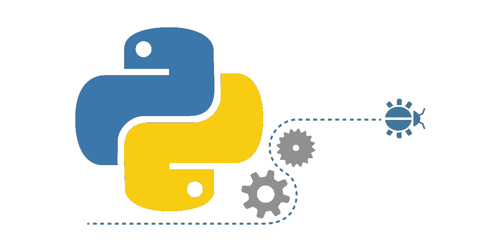
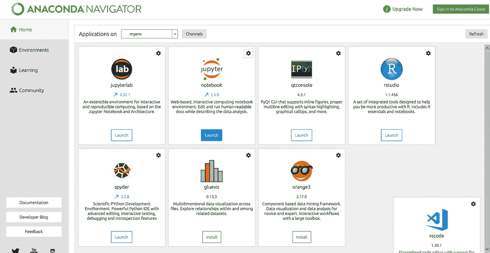
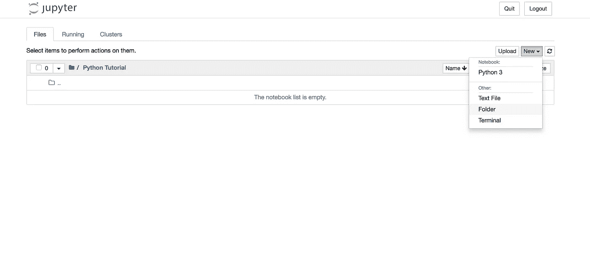
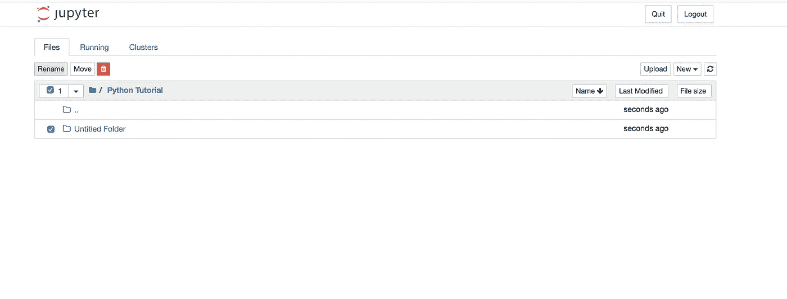
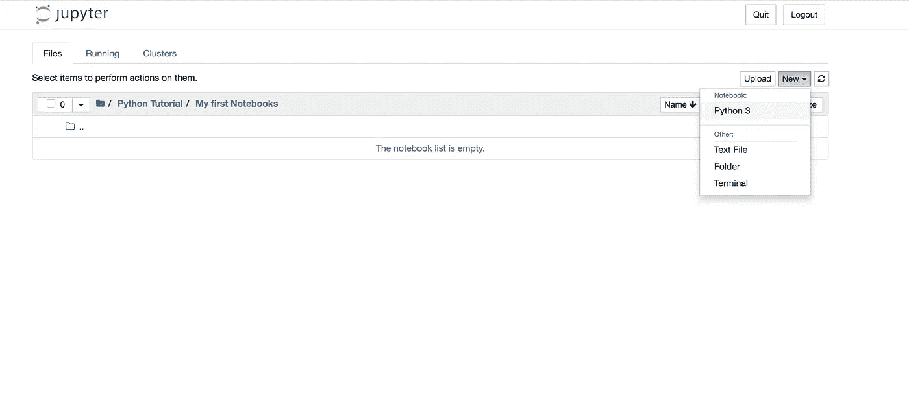
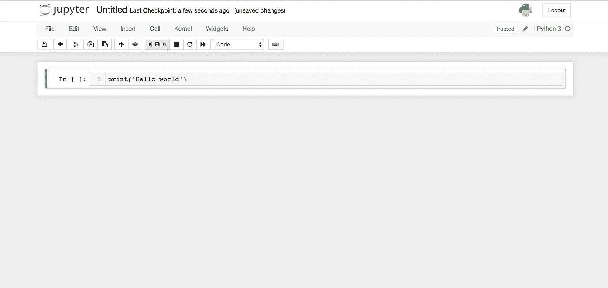
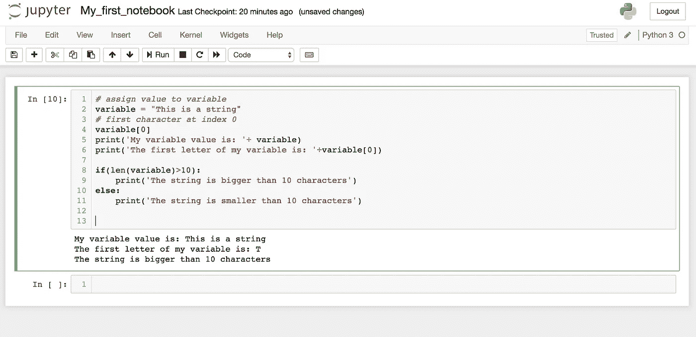
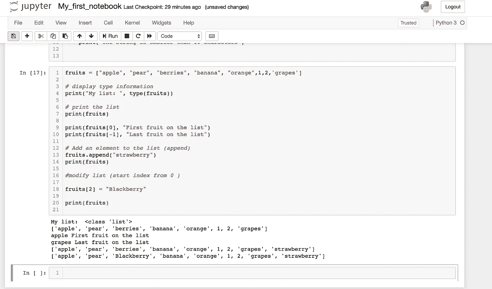
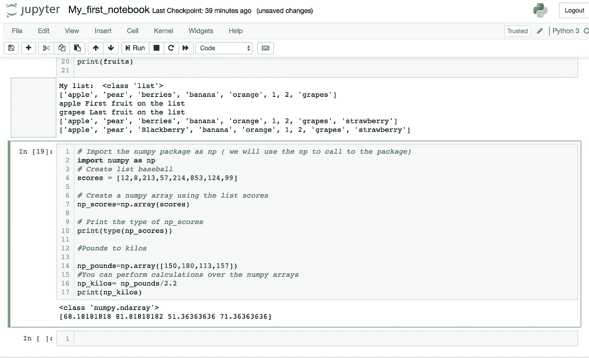
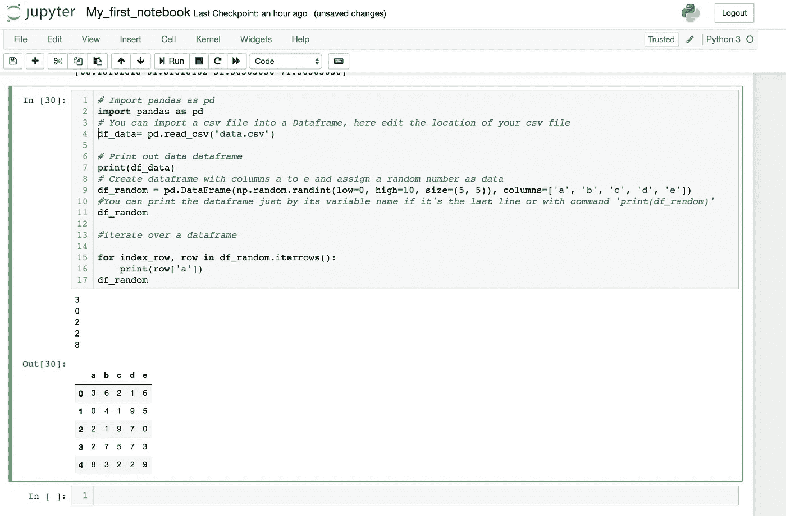

# Python 适合使用 Jupyter 的初学者

> 原文：<https://medium.com/analytics-vidhya/python-for-beginners-using-jupyter-c0cae11e64b1?source=collection_archive---------19----------------------->

## 开发人员基础 Jupyter 初学者系列教程的第 1 部分。

*注意:本文假设你至少了解一种面向对象编程语言*

有许多用于数据分析的编程语言(例如 R)，然而，Python 的优势在于对于软件开发人员或具有编程技能的人来说更直观。随着数据分析包的使用和对不同机器学习和人工智能包的访问，python 在数据分析和人工智能领域越来越受欢迎。

***如果你对 Python 一无所知，这是一个很好的起点。***

首先，我们必须了解基础知识:安装和选择“现成的”IDE。对于这些初始步骤，我们需要在我们的操作系统中安装 python。

为了让一切尽可能容易和顺利，我会推荐初学者安装 Anaconda([https://www.anaconda.com/download](https://www.anaconda.com/download))。Anaconda 的优势是将您需要的所有工具都放在一个工作位置。所以您不需要安装 python 或 Jupyter，因为 Anaconda 包中有这两个工具以及其他将来会有用的工具。

如果你不想安装 anaconda，你将不得不通过命令安装 python 或者去官方网站下载安装程序:[https://www.python.org/downloads](https://www.python.org/downloads)
按照向导的步骤，Python 将被安装在你的 OS 中。之后，您可以选择安装 Jupyter 笔记本或通过文本编辑器或命令行来尝试您的代码。

***如果你不是装置爱好者，你可以从 Azure 网站在线试用 Jupyter 笔记本:[https://notebooks.azure.com/](https://notebooks.azure.com/)* * *

一旦你安装了 Anaconda，进入应用程序并启动 Jupyter 笔记本。

# Jupyter 笔记本

这将打开您的个人文件夹的树状视图。

要添加新文件夹，请点击*“新建”→“文件夹”*

将出现一个新的*“无标题文件夹”*(您可以通过选择文件夹并点击“重命名”来更改名称。

要创建新的 Jupyter 笔记本，请点击*“新建”→“笔记本:python 3”*

# 拿着你的 Jupyter 笔记本

**基本命令:**

要运行代码，您必须在单元格中键入它，然后单击“运行”。这将在单元格下方显示输出。

您可以在“插入”菜单上添加更多单元格，然后将笔记本导出为 python 文件(。py)稍后执行。

**进口包装:**

Python 默认包含一些包，要访问这些包，只需在代码中导入它们。如果该包不是 python 中的默认包，您需要在使用它之前安装该包。

要导入一个包，首先必须将它安装在 python 环境中。如果您使用的是 conda，您可以通过在终端中键入以下内容来完成此操作:

conda 安装包 _ 名称

如果你没有 anaconda 或者想用 Python 安装，首先需要安装 pip(这样会更简单)。

Linux: sudo 安装 python3-pip

mac: sudo 轻松安装 pip3

窗户。Pip3 通常通过安装程序与 python 一起安装。

安装 pip 后，您可以在终端中使用以下命令。

pip3 安装包 _ 名称

(“pip 安装包名称”用于 python 2x)

要在 python 文件或 jupyter 笔记本中导入包，您必须在使用它们之前调用它们，例如:

将 numpy 作为 np 导入

(‘as xx’将是别名。)

查看这个网站获得更多的 python 包:[https://pypi.org/project/pip/](https://pypi.org/project/pip/)

**定义变量:**

在 python 变量中，类型是动态类型的，所以不需要声明类型。

**列表:**

您可以将字符串列表、数字列表或混合列表定义为数组。

**Numpy:**

numpy 或数字 python 是一个 Python 包，它提供了一个“NumPy 数组”，这是常规 Python 列表的一个替代。numpy 相对于普通链表的最大优点是可以非常容易和快速地对数组进行计算。

要安装 numpy，请在终端中使用以下命令:

pip3 安装数量

**熊猫:**

Numpy 数组作为 2D 数组的缺点是只能有一种类型的数据。如果你需要处理不同类型的数据，Pandas 是一个很好的伙伴。Pandas 数据帧有行和列，允许存储不同类型的数据，并且很容易操作数据。

要安装该软件包，您需要在终端中编写命令:

pip3 安装熊猫

## 这是针对使用 Jupyter 的 Python 初学者的一系列教程的第一部分，请继续关注下一部分！

*最初发布于:[https://www . piecex . com/articles/Python-for-初学者-using-Jupyter-208](https://www.piecex.com/articles/Python-for-beginners-using-Jupyter-208)

> 顺便说一下，如果你目前是另一种编程语言的开发者，我想向你推荐网站[www.piecex.com](https://piecex.page.link/mdm)，这是一个人工智能驱动的源代码市场，你可以在那里出售你的项目/脚本。如果你想增加收入，看看吧！