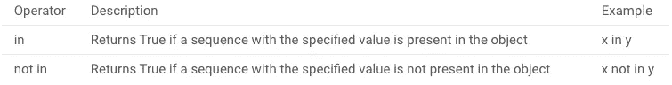

# 用于数据科学的 Python

> 原文：<https://medium.com/analytics-vidhya/python-for-data-science-9fbea48da942?source=collection_archive---------12----------------------->

Python 是一种流行的编程语言，在数据科学中大量使用。在这些文章中，我们将涵盖在我们开始如何将 Python 用于数据科学之前您应该知道的所有基础知识。我们将涉及的概念是:

1.  Python 介绍。
2.  数据结构。
3.  条件和循环。
4.  功能。
5.  异常和文件处理。
6.  正则表达式和网页抓取。
7.  面向对象编程(OOPS)。

一旦我们完成了上面提到的主题，我们将学习三个重要的库。这些库是:

1.  NumPy。
2.  熊猫。
3.  Matplotlib。

> 为了便于阅读、学习和练习，我将这十个话题分解成十篇文章！。我希望你们都很兴奋，渴望学习。让我们开始吧。

# 1.Python 简介

# Python 是什么？为什么要用于数据科学？

Python 是一种流行的、动态的、解释的、面向对象的、易于学习和理解的高级编程语言。它是由吉多·范·罗苏姆在 20 世纪 80 年代末开发的。今天在任何地方都能很容易地找到它。仅举几个例子，python 不仅用于小项目，也用于大公司，如[谷歌](http://www.google.com)、[微软](https://www.microsoft.com/)、[脸书](https://editor.analyticsvidhya.com/www.facebook.com)、[网飞](https://editor.analyticsvidhya.com/www.netflix.com)或 [Nasa](https://www.nasa.gov/) 。

根据 StackOverflow 的说法，Python 是发展最快的编程语言。

 [## 堆栈溢出开发者调查 2020

### 每个月，大约有 5000 万人访问 Stack Overflow 来学习、分享和建立他们的职业生涯。行业估计…

insights.stackoverflow.com](https://insights.stackoverflow.com/survey/2020) 

在数据科学中，Python 被广泛使用。此外，它也是数据科学家最喜欢的工具，因为它易于学习，并且支持多种平台。由于其庞大的库，它是数据科学家用于各种数据科学项目和应用程序的最佳语言。它的开源社区与日俱增。

## 使用 Python 的一些优势:

1.  可读和可维护的代码。
2.  帮助开发大型复杂的软件应用程序。
3.  允许我们在不同的系统中运行相同的代码。
4.  非常大和健壮的库。
5.  许多开源框架和工具，如 NumPy、Pandas、Matplotlib、SciPy、Scikit Learn 等，正在用于机器学习和数据分析。

> 在我们开始之前，我强烈建议你安装最新版本的 [python](https://www.python.org/downloads/) 并下载 [anaconda](https://www.anaconda.com/products/individual) 。熟悉 [jupyter 笔记本。](https://www.analyticsvidhya.com/blog/2018/05/starters-guide-jupyter-notebook/)你就可以上路了！

## 我们的第一个 Python 程序(Hello World)

打开 Jupyter Notebook，在 Python 命令行中键入以下代码！！—按 shift + enter，就可以了。恭喜你刚刚写了你的第一个程序。万岁！！

# Python:变量和关键字

变量是存储数据值的容器。在 Python 中，我们给变量赋值。变量是在你给它赋值的时候创建的。

让我们试着想象一下！它！想象你有一个盒子。在那里，你可以放置一件物品。这里让**框**是容器，而**项**是数据值。

从上图可以看出，这里的盒子是一个变量，里面放着一个字符串:“Samia”。在 Python 3 中，字符串是 Unicode 字符(例如“H2O-O2”是一个字符串)。在 Python 中，我们可以用单引号或双引号来标识字符串。

> 理解赋值运算符(=)非常重要。

为了更好地理解它，让我们举一个例子，假设我们创建了一个名为 myNum 的变量，它包含一个整数:4。

每当我们试图使用同一个变量盒来存储另一个数字时，初始值就会被删除。重要的是要知道在 Python 中每个变量都可以被覆盖。

**我们再举一个例子**

假设我们有一个学生的信息，包括他们是 covid 阳性还是阴性。让我们取一个特定学生的四个属性(姓名、年龄、分数、正数 _ 或负数)并存储在 Python 变量中！。在 Jupyter 笔记本单元格中键入以下代码:

> name = "Carlton"
> 年龄= 21
> 分数= 92.5
> 阳性或阴性=假

就像 Python 中的其他编程语言一样，我们有不同的数据类型。如您所见， **name** 变量保存了**字符串**:“Carlton”，这是一个用双引号括起来的字符串值。

age 和 marks 变量包含整数:21 和浮点数:92.5 这两个数值。有三种数字 Python 数据类型:

1.  （同 Internationalorganizations）国际组织
2.  漂浮物
3.  复杂的

正数或负数是一个布尔值。布尔文本只能有两个值 True 或 False。

> 在布尔文字中，True 等于 1，False 等于 0。

为了验证 python 中对象的类型，我们使用了 **type( )** 函数。现在不用担心函数。试试吧！！

**例子**

> x = 10
> 
> 打印(类型(x))

# Python 基本数学运算符。

运算符用于对变量和值执行运算。Python 中有各种数学运算符:

*   算术运算符
*   比较运算符
*   逻辑运算符
*   赋值运算符
*   标识运算符
*   成员运算符

## 1.算术运算符。

算术运算符与数值一起用于执行常见的数学运算。

让我们取两个变量 x 和 y，并在 Jupyter notebook 中执行这些操作:

## 2.比较运算符。

比较运算符用于比较两个值。结果将给出真或假的布尔值。

在 Jupyter notebook 中对两个变量 x = 4 和 y = 6 执行比较运算符:

## 3.逻辑运算符。

逻辑运算符用于组合条件语句。

## 4.赋值运算符。

赋值运算符用于给变量赋值。一些操作符是:

让我们试着通过给变量 c 赋值来理解赋值操作符。我希望你在 Jupyter 的笔记本上和不同的操作符一起玩得开心。

我要给变量 c 赋值一个整数值。

## 5.标识运算符。

恒等运算符用于比较对象，不是比较它们是否相等，而是比较它们是否是具有相同内存位置的同一个对象:

运算符描述示例:如果两个变量是相同的对象，则返回 True。如果两个变量不是相同的对象，则 x is y is not 返回 True。x 不是 y

## 6.成员运算符。

成员操作符用于测试一个序列是否存在于一个对象中！。

中的运算符描述示例如果具有指定值的序列存在于对象 x 中，则返回 True 如果具有指定值的序列不存在于对象
中，则返回 True

例如，让我们考虑一个名称为**的 ram** ，我们将名称值赋给一个变量 **name** 。假设我们想知道这封信是否存在。

> name = "ram "

> 注意:用你的 Jupyter 笔记本上的值试试吧！。你只有在实践和理解概念的时候才会学习。

# Python 运算符优先级。

运算符优先级影响表达式的求值方式。

下表按优先级从高到低列出了所有运算符。

**举例:**

x = 10+6 * 3；这里，x 被赋值为 28 而不是 48，因为运算符*的优先级高于+。所以它先乘以 6 * 3，然后加 10。

## Python 注释

评论是我的最爱。它不仅能帮助你让别人理解你的代码，还能帮助你让代码更具可读性。

注释以#开头，无论你在后面写什么，Python 都会忽略它。

## 结论。

在本文中，我们介绍了 Python 的简介和基础知识，帮助您开始学习 Python 的数据科学之旅，从中您了解了什么是变量和不同的数据类型。不同的 Python 数学运算符以及如何使用它们。在下一篇文章中，我将介绍 Python 中的数据结构。在那之前，祝你学习愉快！