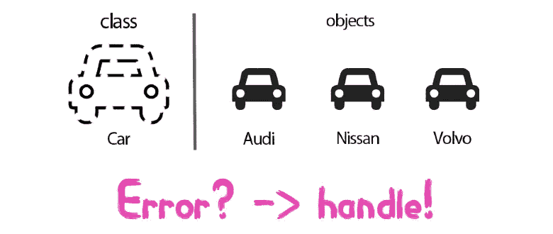

# 面向金融分析的 Python 系列— Python 核心第 5 天

> 原文：<https://medium.com/analytics-vidhya/python-for-financial-analysis-series-python-core-day-5-7029a8a47d40?source=collection_archive---------27----------------------->

**高亮:**

*   在本文中，您将了解使用异常处理和用户定义类的 Python 财务分析。

这是 Python 核心学习的最后一天。我们快到了！在第 4 天，我们学习了字典、对象/类的概念以及使用包/模块“日期时间”。第五天，我们将学习一个高级话题…