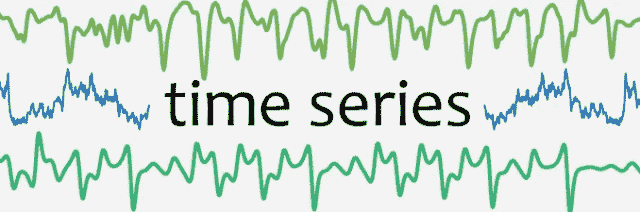

# 面向金融分析的 Python 系列— Python 工具第 5 天

> 原文：<https://medium.com/analytics-vidhya/python-for-financial-analysis-series-python-tools-day-5-e933198f78a2?source=collection_archive---------0----------------------->

这是关于基本的时间序列分析的会议，从日志回报，滚动统计到技术分析。我们还将学习如何使用 IEX(最流行的金融数据云之一)来检索历史每日价格。

## 重要更新