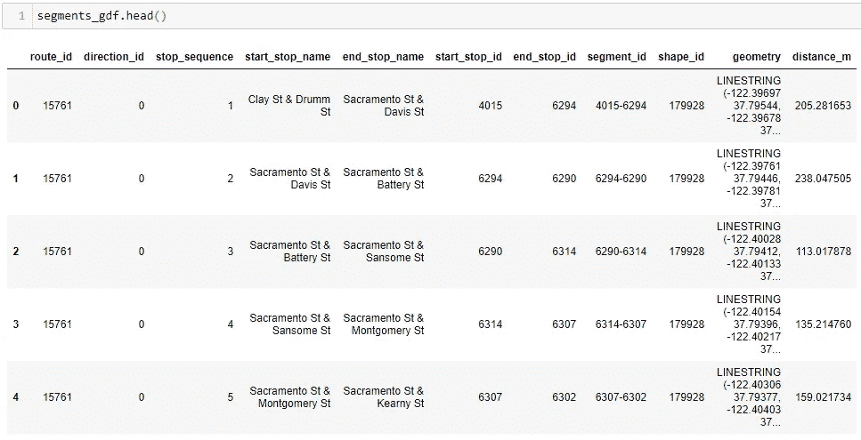
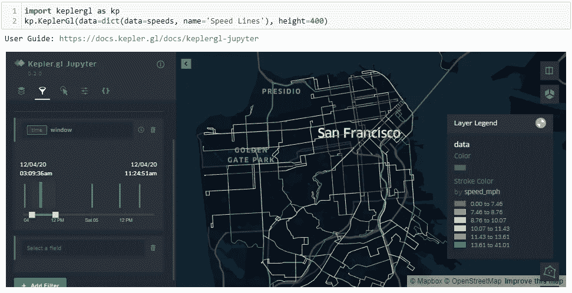

# python for Transit:GTFS 地图中公交路段的速度

> 原文：<https://medium.com/analytics-vidhya/python-for-gtfs-speed-by-bus-segment-in-a-map-2c0316f71e87?source=collection_archive---------9----------------------->

## 深入研究 gtfs_functions Python 包

## 更新 2023 年 3 月！！

此包已于 2023 年 3 月更新。这篇文章反映了这个包的最新版本的用法。

# 介绍

在本文中，我们将了解如何使用 Python 包 **gtfs_functions 从 GTFS 中获取公交路段的计划平均速度。**你可以在 GitHub 上找到[库和官方文档。](https://github.com/Bondify/gtfs_functions)

如果你正在寻找关于这个包的详细解释，我推荐你首先阅读[这个介绍](https://santiagoa-toso.medium.com/python-for-transit-get-the-most-out-of-your-gtfs-with-this-python-package-44d0b732f657)。这里，我们将直接深入了解在地图中获取停靠频率的具体用例。

*友情提醒:请帮我鼓掌(或者很多！)当你读完之后如果觉得这篇文章有帮助。*

## 软件包安装和 GTFS 解析

要安装软件包并解析 GTFS，请运行下面的代码。为了这篇文章，我从 SFMTA 下载了 [GTFS。](https://www.sfmta.com/reports/gtfs-transit-data)

```
# In your terminal run
pip install gtfs_functions

# Or in a notebook (or similar)
!pip install gtfs_functions

# Import package
from gtfs_functions import Feed, map_gdf

feed = Feed("SFMTA.zip", time_windows=[0, 6, 9, 15, 19, 22, 24])

routes = feed.routes
trips = feed.trips
stops = feed.stops
stop_times = feed.stop_times
shapes = feed.shapes
```

## 将形状切割成段

有时，在止损点或线级别查看变量并不是最佳解决方案，我们需要在段级别进行查看。我们想知道站 A 和站 B 之间发生了什么，以及它与站 C 和站 d 之间发生的有什么不同。

为了能够在路段级别聚合信息，我们首先需要将每条路线的长形状切割成从一个站点到另一个站点的路段。

这正是函数 *cut_gtfs* 所做的。它从解析的 GTFS 中获取 3 个参数:

```
segments_gdf = feed.segments
```

输出显示:



函数 cut_gtfs()的地理数据框架输出。

那就是:

*   段的 **route_id**
*   **区段的 direction_id** 当进入 GTFS 时
*   **来自 GTFS 的航段的起点站的 stop_sequence**
*   **开始 _ 停止 _ 名称**因为它来自 GTFS
*   来自 GTFS 的
*   因为它来自 GTFS
*   因为它来自 GTFS
*   **segment_id** 作为 *start_stop_id* 和 *end_stop_id* 的串联
*   **shape_id** 该段来自 GTFS
*   **几何图形**作为线串
*   **distance_m** 表示线段的长度，单位为米。这将有助于以后计算速度。

拥有分段本身并不是输出，而是我们最终在分段级别聚合变量所必须采取的中间步骤。让我们在接下来的部分看看如何做到这一点。

## 计算分段速度

GTFS 为我们提供每次旅行和停留的时间信息。既然我们也有了每段的米距离，那么计算每次旅行的两个站点之间的速度将是一件微不足道的事情。我们还可以计算出每个时间段内该路段的出行次数。所有这些信息都可以用来计算每条路线、路段、方向和一天中的时间的**加权平均速度。**

这正是函数 *speeds_from_gtfs* 所做的，它有 4 个参数:

*   **路线**从第一步开始
*   **从步骤 1 开始的停止次数**
*   **在步骤 4 中计算的 segments_gdf**
*   **截止值**如步骤 2 中所定义

```
speeds = feed.avg_speeds
```

特定区段、方向和时间的输出显示:

输出中有一些不言自明的列，因此我将只解释与速度相关的列:

*   **speed_kmh:** 该路线、路段、方向和一天中时间的平均速度，单位为千米/小时
*   **max_kmh:** 该路线、路段和方向以公里/小时为单位的最大日平均速度。
*   **speed_mph:** 该路线、路段、方向和一天中时间的平均速度，单位为英里/小时
*   **max_mph:** 该路线、路段和方向的最大平均日速度，单位为英里/小时。

注意，在上面的例子中，选择的*航段 3114–3144*出现了四次:服务于该航段的每条路线出现一次，第四次出现在路线“所有线路”上。该路径由函数创建，它将该路段的加权平均速度进行汇总，并考虑在其起始和终止站点停靠的所有路径。

另外，请注意“所有线”的聚合值考虑了三个线段，忽略了线在 GTFS 的方向。这是有意义的，因为路段总是在相同的站点开始和结束，即使指定的方向在 GTFS 是不同的

> 路线“所有线路”是由该功能本身创建的，它汇总了该特定路段的加权平均速度，并考虑了所有路线在其起点和终点的停靠点。

## 在地图上显示结果

如果您希望在所有行的段级别可视化数据，我建议您使用比我们在以前的文章中看到的 *map_gdf()* 更强大的工具，如 [kepler.gl](https://docs.kepler.gl/docs/keplergl-jupyter) (也就是我最喜欢的数据 viz 库)。例如，要检查每个路段的计划速度:



您将需要手动设置颜色和滤镜的样式，但您可以完全控制视觉效果。或者你可以学习用编程的方式来做这件事(我还没有)。

你觉得这篇文章有帮助吗？请让我知道留下一些掌声！！

# 致谢和参考

即使这不是一个企业包，Via 的数据科学纽约团队的一些成员在该包的最后一次更新中进行了合作。特别要感谢 [Mattijs De Paepe](https://github.com/mattijsdp) 大大改进了分段切割功能，以及 [Tobias Bartsch](https://github.com/tobiasbartsch) 实现了模式计算。

就严重依赖其他包而言， *map_gdf()* 只是一个[叶子](https://python-visualization.github.io/folium/)包装器，它的大部分功劳归于它的创造者。