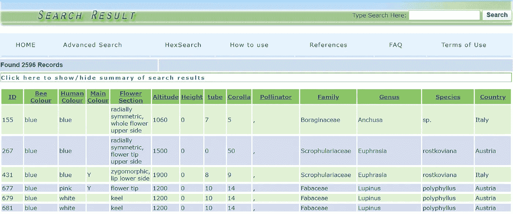

# 探索植物反射率数据库的 python(FReD)

> 原文：<https://medium.com/analytics-vidhya/python-for-playing-around-with-the-floral-reflectance-database-fred-b32f607bb251?source=collection_archive---------26----------------------->

## [现实世界中的 DS](https://towardsdatascience.com/)

## 聚类光谱数据以预测传粉物种

你可能在英国皇家植物园看到的花(【https://www.kew.org/】T2

## 开源数据是最好的，我希望有更多这样的数据。我最喜欢的一些数据和数字资源可以在[皇家植物园邱园收藏馆找到。](https://www.kew.org/science/collections-and-resources/data-and-digital/plants)

今天让我们来看看**弗雷德**，这个[植物反射率数据库](http://reflectance.co.uk/)，是由伦敦大学玛丽女王学院和皇家植物园合作开发的:你可以在这里阅读《公共科学图书馆综合》的手稿[。到目前为止(2020 年 4 月 27 日)，有超过 100 种开花植物的大约 2000 个反射样本，以及元数据，包括感知的*蜜蜂颜色*、*人类颜色*、采样时的*海拔高度(米)*、花的*导管长度(毫米)*和*花冠长度(毫米)*、*传粉者的类型*](https://journals.plos.org/plosone/article?id=10.1371/journal.pone.0014287)

弗雷德搜索结果

下面是一个例子，说明如何使用 python selenium 包和 pandas *read_html:* 从网站中提取数据

## 分析:降维

分析该数据的直接的第一步是将数据从高维度(300-700nm 的反射光谱)减少到某个最佳的(和任意的)低维度。接下来，让我们对 FReD 的 664 个光谱进行采样，并在标准缩放后，使用[主成分分析(PCA)](https://scikit-learn.org/stable/modules/generated/sklearn.decomposition.PCA.html) 对数据进行转换。如果你熟悉 PCA，你会很高兴地知道第一个 PC 包含 52%的方差，第二个 77%，第三个 89%，第四个 93%。这种方法做得非常好，在 2-D 中，我们可以立即看到不同的花族如何具有某种程度的聚类，例如下面的:*菊科*(向日葵)的左上角簇为橙色，而*唇形科*(薄荷)似乎停留在紫色的下部。尽管如此，豆科植物看起来还是均匀分布在绿色中。这并不奇怪，因为我们并不期望花族具有所有相同的光谱特征——你甚至可以拥有开不同颜色花的同一物种的植物。

基于前 4 个花卉家系的二维 PCA 图

然而，有趣的是思考不同的传粉者如何与这个集群联系起来。我们真正想了解的是，是什么特征让传粉者决定授粉？基于同样的逻辑，我们可以在下面看到橙色的蜜蜂是如何不聚集在一起，并乐于到处授粉的。绿色的苍蝇似乎覆盖了更少的情节，甲虫甚至更少。*甲虫是挑剔的传粉者吗？*

基于蜜蜂、苍蝇和甲虫的二维 PCA 图

这里给出了一个 Jupyter 笔记本的例子:

## 分析(未来):传粉者预测器

不幸的是，弗雷德还没有足够的数据来建立任何深度学习模型。*希望* FReD *社区可以快速收集更多数据*，因为看看我们如何利用电磁频谱作为工具来预测授粉者类型将是非常有趣的。我们已经知道昆虫使用花的线索，如颜色、形状、图案、挥发性化合物甚至电场，但我们不一定知道谁是有效的授粉者(正如我们可以从弗雷德的缺失数据中看到的)。

除了整天坐着看花寻找潜在的授粉者——这听起来很有趣——或者设置相机陷阱，我怀疑我们很快就能部署统计学习模型来预测它们。

TLDR；

目前还没有足够的植物反射率数据来建立任何深度学习模型，尽管根据初步分析，该领域已经为它做好了准备。

参考资料:

阿诺德·SEJ，法鲁克·S，萨沃莱宁·V，麦克欧文·PW，奇特卡·L，2010 弗雷德:花卉反射率数据库——花卉颜色分析的门户网站。PLoS ONE 5(12): e14287。doi:10.1371/journal . pone . 0014287

*Dominic Clarke，Heather Whitney，Gregory Sutton，Daniel Robert，大黄蜂对植物电场的探测和学习。科学:第 340 卷，第 6128 期，第 66–69 页*。doi:10.1126/科学