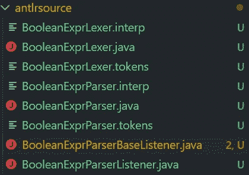
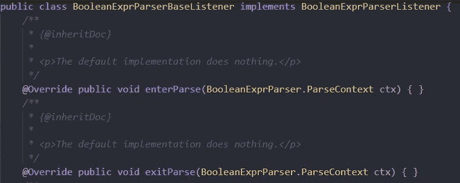
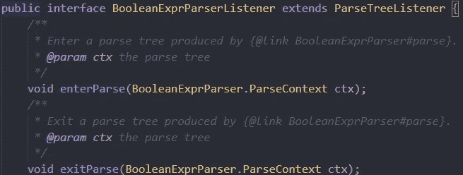

# 来自表达式的 python—ANTLR 系列(第 2 部分)

> 原文：<https://medium.com/analytics-vidhya/python-from-expressions-the-antlr-series-part-2-5436ef00bcf?source=collection_archive---------10----------------------->

在前一部分中，我创建了两个 ANTLR 语法文件，用于将基本布尔表达式转换为 python 表达式并生成一个 python 文件。对于上下文，如果您还不知道的话，可以看一下前面的部分。

 [## 来自表达式的 python-ANTLR 系列(第 1 部分)

### 所以，在最后一个故事中，我在 ANTLR(或它的树，双关语)上走了一小段路，概述了它…

medium.com](/@hrajpal96/python-from-expressions-the-antlr-series-part-1-3d7696c3a01c) 

为了继续，现在让我们生成解析器文件。这一次，我将使用 maven 配置和用于 VS 代码的 ANTLR 插件来生成这些文件:

每个标签定义了 ANTLR 在生成解析器类时应该使用的目录，或者需要或不需要生成的文件。例如，listener 和 visitor 标签都是这样定义的，它们对应的 java 类/接口是基于它们的布尔值生成的。

**目标语言解析器文件集如下:**

让我们更深入地研究一下**监听器 vs 访问者遍历模式**，并探索一下**BooleanExprParserBaseListener**(这是一个很长的名字，我知道)类是做什么的。

# 警告！！！

## 遍历模式？它们是什么？差异？如何？用哪个？

ANTLR4 提供了两种遍历语法树的方法:

*   Listener(默认):listener 模式是一种事件驱动的方法，用于遍历每种解析器规则类型的语法树。为每个分析器规则提供一个包含进入和退出事件方法的接口。
*   访问者:这使得解析树的遍历也可以由用户控制。使用提供的访问方法显式地遍历或访问解析树中的节点(针对解析器规则)。

侦听器和访问者模式都有各自的优点和缺点，这取决于使用它们的环境。

## 什么保持不变？

*   对于两种实现，规则的语法规则保持完全相同。
*   两种实现的解析器输出也是相同的。

## 有什么不同？

*   因为访问者模式依赖于用户来定义它的遍历序列，所以它使用调用堆栈来管理这些遍历。这意味着大量的输入可能会导致溢出，而在分配的堆上使用堆栈的侦听器却不会遇到这样的问题。

> 侦听器和访问者机制之间的最大区别是**侦听器方法由 ANTLR 提供的 walker 对象**独立调用，而**访问者方法必须通过显式访问调用**来遍历其子方法。忘记在节点的子节点上调用 visitor 方法，意味着这些子树不会被访问。
> 
> [参考**参考**参考](http://media.pragprog.com/titles/tpantlr2/listener.pdf)

## **跳回我们生成的监听器**

监听器实现和监听器接口

接口类的实现只特定于某些语言，通常，实现类/模块是在目标语言中定义的。请注意在接口和实现中定义的根(或解析)节点侦听器方法。所有的方法都有相应的上下文对象，由生成的解析器类提供。这允许在遍历解析树时操作该规则的上下文。

让我们创建与解析器的第一个交互，并生成一个简单表达式的输出:

因为我们已经在语法文件中添加了将基本操作符翻译成 python 对应操作符的动作，所以解析器的输出表达式已经是解析形式了。例如，一个简单的比较表达式，比如`a eq b`，将被转换成 pythonic 表达式`a == b`。

现在我们已经转换了表达式，我们可以使用侦听器文件中的某些更改将它转换为函数，并使用模板将该表达式替换为占位符函数文本，用于多个这样的表达式，如:

解析后的表达式可以很容易地替换成上面的表达式。不要担心替换部分，我们稍后会讲到。现在，为了从每个表达式中提取参数列表，我们将添加一个列表，以便在每次触发标识符类型的(解析器规则)条目事件侦听器方法时捕获每个标识符名称。

让我们将一个字符串列表定义为一个实例变量，在一个无参数的构造函数中初始化它，定义它的 getter 方法，并添加一个方法来清除这个列表，这样它就可以在每次表达式解析和替换完成时被清除。

让我们将上下文的 **getText** 方法中的标识符名称追加到我们每次为 identifierExpression 触发 enter 事件时创建的列表中:

# 最后，

我们需要遍历树来触发这些事件，以收集表达式的所有参数。ANTLR 正好为此提供了一个类，ParseTreeWalker。顾名思义，这允许在遍历解析树时同时使用侦听器和访问者实现类。让我们使用监听器遍历上面定义的解析树:

注意这里的 **walk** **方法**使用监听器监听事件触发器，同时遍历传递的解析树。接下来，我们使用 getter 方法获取解析表达式时获取的所有标识符名称的列表。

在下一部分中，我将使用这个解析的表达式创建一个 python 函数，它使用一个模板文件(我们可以在其中替换这些表达式和我们的参数列表)，看起来像这样:

 [## 来自表达式的 python—ANTLR 系列(第 3 部分)

### 到目前为止，这个过程的要点是什么

medium.com](/@hrajpal96/python-from-expressions-the-antlr-series-part-3-7ac541a1d08c)