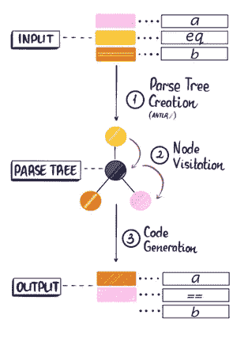

# 来自表达式的 python—ANTLR 系列(第 3 部分)

> 原文：<https://medium.com/analytics-vidhya/python-from-expressions-the-antlr-series-part-3-7ac541a1d08c?source=collection_archive---------14----------------------->

# 到目前为止，这个过程的要点是什么



在第三步，我将使用前一部分生成的表达式或中间代码生成的输出，并将其替换到一个模板组文件中(由一个**模板引擎**使用)，这将允许我们将呈现的函数字符串写入一个 python 文件。

模板引擎将通过用我们的目标语言(即 Python)生成实际可用的代码来完成代码生成的目标。

当我提到**模板引擎**时，你首先想到的是 **web 框架**。几乎所有的现代 web 框架都有一个共同的目标，那就是使用模板引擎来生成动态的、业务就绪的 web 页面。每个模板引擎的最终目标是将获取的输出替换到模板文件中，以便即时显示给最终用户。

下面是对所有模板引擎的简要比较:


[https://www.stringtemplate.org/](https://www.stringtemplate.org/)

我将使用一个类似的模板引擎，叫做 **StringTemplate** 。它广泛用于网页模板，但也支持创建目标语言代码文件的基本模板操作。

# **基础知识第一**

在编写字符串模板时，必须记住下面的语法备忘单:

*   `<attribute>`计算属性的字符串值(在这种情况下是我们的表达式),如果它存在，则为空字符串。例如，在 Java 中使用 StringTemplate 对象时，`<expression>`将被键`expression`引用。因此，如果用户在“expression”键上输入任何值，它将作为模板中的一个表达式属性。
*   对于模板内的自定义或用户定义的对象，使用`<attribute.property>`，这将查找属性的属性作为属性，然后访问类似 getProperty()或 isProperty()或 hasProperty()的方法。
*   `<attribute:t1(argument-list): ... :tN(argument-list)>`基本上，迭代相同模板替换的对象列表。这将按照从左到右的顺序应用多个模板。对多值属性应用模板的结果是另一个多值属性。整个表达式的计算结果是所有模板元素的串联
*   `<! comment !>`注释，按照定义，被 StringTemplate 忽略。
*   模板定义看起来像带有非类型化参数的函数定义:
    `templateName(arg1, arg2, ..., argN) ::= "single-line template"` 或
    `templateName(arg1, arg2, ..., argN) ::= <<multi-line template>>` 或
    `templateName(arg1, arg2, ..., argN) ::= <%multi-line template that ignores indentation and newlines%>`

下面是 Python StringTemplateExample.stg 文件的示例:

请注意，我是如何使用上述基础示例中的第二种模板类型来保持缩进和两行空白的，因为这需要遵循 Python PEP8 的规则，即 Python 方法之间有两行。下面我们来看看这个模板在 Java 中的用法:

## 输入:

```
a gt b and c gt d
a eq b
```

## 输出:

我们已经从一个基本的布尔表达式中生成了 pythonic 的易于计算的参数化函数代码。有很多这样的用例，ANTLR 和 **StringTemplate** (或其他一些模板引擎)的组合可用于将源语言代码翻译成准备运行的目标语言代码。

以下是整个系列的 github 项目的完整链接:

[](https://github.com/hrajpal96/BooleanParser) [## hrajpal96/BooleanParser

### 在 GitHub 上创建一个帐户，为 hrajpal96/BooleanParser 开发做贡献。

github.com](https://github.com/hrajpal96/BooleanParser)