# Python 函数

> 原文：<https://medium.com/analytics-vidhya/python-functions-4f45322d7743?source=collection_archive---------25----------------------->

函数是执行特定任务的一组语句。它只在被调用时运行。您可以将数据(参数)传递给函数。

Python 有很多内置函数；我们可以创建自己的函数，这些函数称为用户自定义函数。

随着我们的程序变得越来越大，通过将代码分解成更小的部分，更大的函数使你的程序看起来更有组织性和可管理性。

函数使得代码可重用。

函数可以返回数据作为结果。

**语法:**

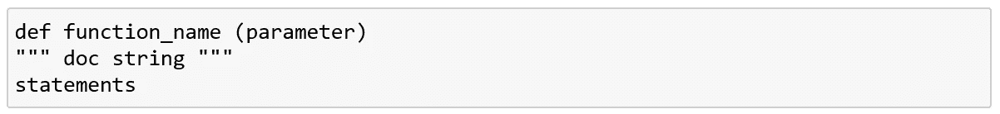

函数语法

使用 def 关键字后跟唯一的函数名来定义函数。

**定义函数的一些规则:**

输入参数应该在括号内。

每个函数的代码块都应该是预定的。

可选的文档字符串(doc string)可以用来描述一个函数做什么。“docstring”应该在三重引号内。

**如何调用函数？**

一旦定义了一个函数，我们就可以通过输入带有适当参数的函数名来调用它。

我们也可以从一个函数调用另一个函数。

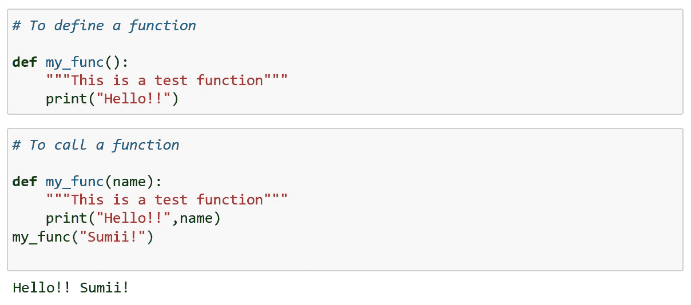

定义和调用函数

**文档字符串:**

文档字符串称为 docstring。它是函数头之后的第一个字符串。它用来描述一个函数做什么。

尽管它是可选的，但使用 docstring 总是更好。

使用三重代码，以便 docstring 可以有多行。

我们可以使用以下命令查看 docstring:

*< <功能 _ 名称> >。__doc__*

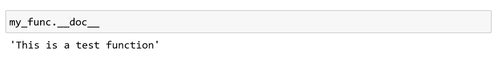

文档字符串

**参数和自变量:**

形参是函数定义中括号内列出的变量，而实参是调用函数时分配给该变量的值。

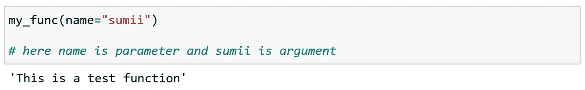

参数和自变量

**默认参数:**

当我们创建一个函数时，我们给参数一些值。这些被称为默认参数。

当我们调用不带参数的函数时，它使用默认值。

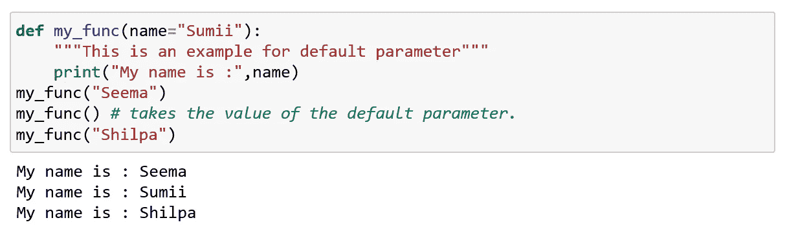

默认参数

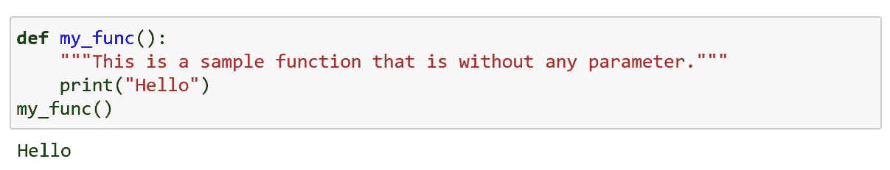

无参数

如果您尝试在括号内给出任何参数，就会出现错误。

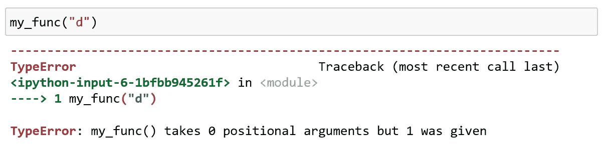

括号内给出的参数

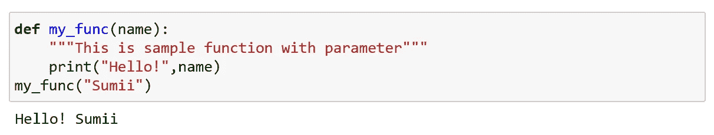

带参数

如果调用函数时没有给定参数；那么这也会导致错误。

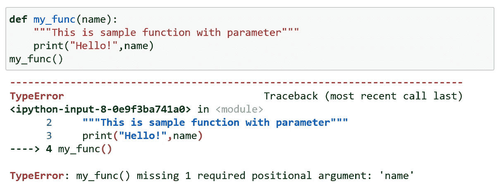

调用时没有给出参数

默认情况下，函数必须在正确数量的参数内被调用；这意味着如果你的函数需要一个参数，当它被调用时，你必须给出一个参数；不多也不少。

**任意论据:**

当您不知道必须向函数传递多少个参数时，我们在函数定义中的参数前添加*。

该函数现在将接收一组参数，并可以相应地访问。

python 中的任意参数经常被缩写成*args(非关键字)。

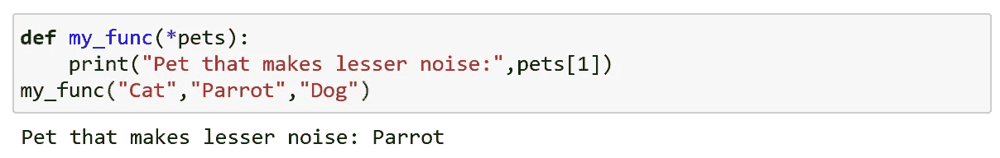

武断的论点

**关键字参数(kwargs):**

。为参数赋值。

。在这种情况下，参数的顺序无关紧要。

。调用函数时，会分配关键字参数。

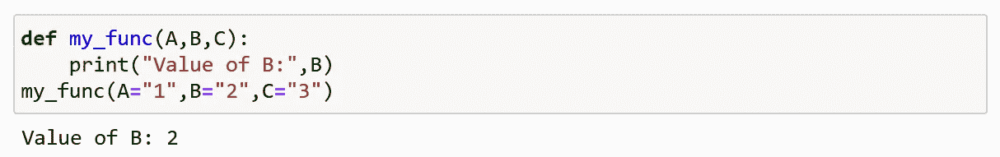

关键字参数

**任意关键字参数:**

*Args 用于传递可变长度的非关键字参数，但我们不能用它来传递关键字参数。

**kwargs 对此给出了解决方案(即它可以向函数传递可变长度的关键字参数)。

我们在参数名前使用双星号(**)来表示这种类型的参数。

实参作为字典传递，这些实参在函数内部创建一个字典，其名称与形参相同，但不包括双星号(**)。

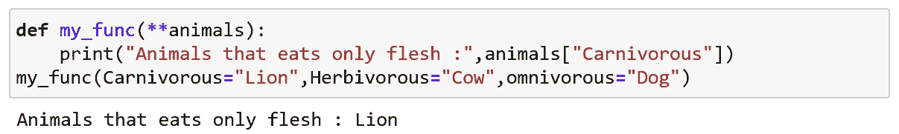

任意关键字参数

**传递列表作为参数:**

任何数据类型的参数都可以传递给函数(字符串、元组、列表)。它将被视为函数中相同的数据类型。

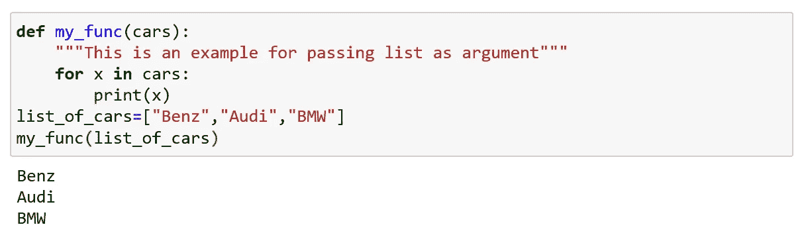

将列表作为参数传递

**返回值:**

我们在函数中使用了 *return* ，所以函数会返回值。

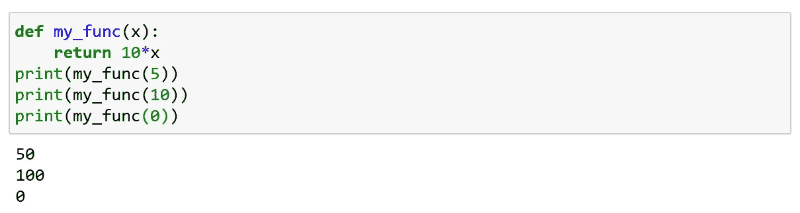

使用返回

**通过:**

一个函数定义不能为空，但是如果你希望它为空以备将来使用，或者出于其他原因，那么只需简单地设置一个“pass”即可。

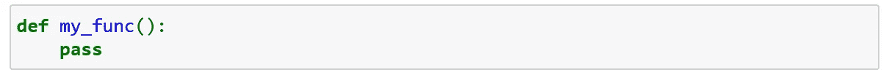

使用通行证

**递归函数:**

调用其他函数的函数是已知的，但调用自身的函数称为递归函数。

每个递归函数都有一个基本条件，这意味着给一个函数一个停止递归的条件。如果没有给定基本条件，函数将无限调用自己。

Python 限制了递归的深度，以避免无限递归。当递归发生无限次时，这将导致堆栈过载。为了避免这样的问题，python 限制了递归。

默认情况下，最大深度设置为 1000。当超过限制时，python 将抛出 RecursionError。

复杂的任务可以使用递归分解成更简单的子任务，这允许干净的编码(优点)。

但是递归函数有时很难理解其逻辑，使用大量内存和时间，并且这些函数很难调试(缺点)。

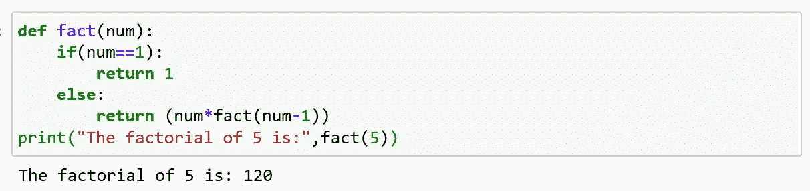

递归函数

**匿名功能:**

匿名函数是没有名字的函数。

普通函数使用关键字' def '定义，匿名函数使用关键字' *lambda '定义。*

匿名函数也称为 lambda 函数。

**语法:**

*lambda 参数:表达式*

Lambda 函数可以有任意数量的参数，但只能有一个表达式。计算并返回该表达式。

每当需要函数对象时就使用它。

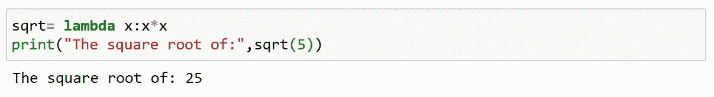

Lambda 函数或匿名函数

在上面的代码中，x 是参数，x*x 是表达式。

**λ的用途:**

当我们在短时间内需要一个无名函数时，可以使用。

它可以与其他内置函数一起使用，如 filter()、map()等。

**λ使用滤波器():**

filter()接受一个函数并作为参数列出。

这提供了一种过滤掉所有元素的简单方法。并返回符合给定条件的列表。

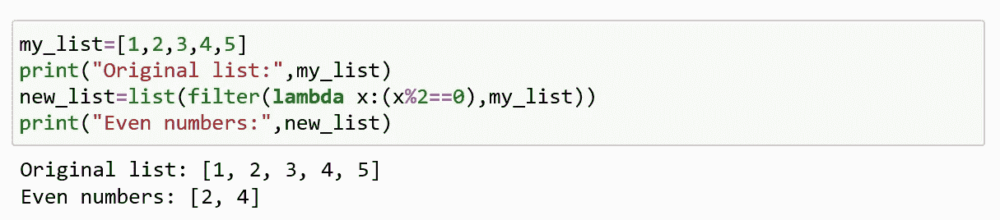

Lambda 使用过滤器( )

**λ使用 map():**

map()接受一个函数并作为参数列出。

当调用该函数时，它将条件应用于列表的所有元素，并创建一个新列表，然后返回这个新列表。

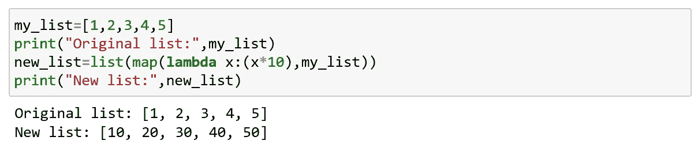

使用 map()的 Lambda

本文中讨论的概念应该有助于您使用 Python 构建自己的函数。

快乐编码…😊😊😊