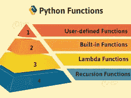

# PYTHON 函数

> 原文：<https://medium.com/analytics-vidhya/python-functions-6920c88c9f6f?source=collection_archive---------14----------------------->

# 功能介绍



函数是一组相关的语句，在任何语言如 C、C++、Python 和 Java 中执行特定的任务。函数将我们的程序分成更小的模块。随着我们的程序变得越来越大，函数使它变得更有组织性，更易管理，并且可以一次又一次地使用。

# Python 中函数的语法

```
**def** **function_name**(arguments):
    """docstring"""
    statement(s)
```

函数定义由以下组件组成:

*   关键字`def`在 python 中标记函数头的开始。
*   唯一标识函数的函数名。
*   我们通过参数向函数传递值。它们是可选的。
*   冒号(:)标记函数头的结尾。
*   Docstring 描述了函数的可选功能，但它总是给出函数的清晰性。
*   组成函数体的一个或多个有效 python 语句。语句必须具有相同的缩进级别(通常为 4 个空格)或制表符。
*   可选的`return`语句，用于从函数中返回值。
*   可以使用 function_name 打印 docstring。__doc__ 方法。
*   `return`语句用于退出一个函数，并从调用它的地方返回。该语句可以包含一个表达式，该表达式被求值并返回值。如果语句中没有表达式或者`return`语句本身不在函数中，那么函数将返回`None`对象。

# 函数的示例

```
**def** **add**(a,b):
    """ This function return sum 
    of two numbers"""
    sum=a+b
    **return** sum
```

# 如何在 python 中调用函数？

一旦我们定义了一个函数，我们就可以从另一个函数、程序甚至 Python 提示符中调用它。要调用一个函数，我们只需输入带有适当参数的函数名。

```
>>>**add**(1,2)**3**
```

# 文档字符串

函数头后面的第一个字符串称为 docstring，是 documentation string 的缩写。它简单地用来解释一个函数做什么，可以用 function_name 打印出来。__doc__ 方法。

例如:

```
>>>print(add.__doc__)This fuction return sum 
    of two numbers
```

# 退货单

`return`语句用于退出一个函数，并返回到调用它的地方。

# 返回语法

返回[expression_list]

该语句可以包含一个表达式，该表达式被求值并返回值。如果语句中没有表达式或者`return`语句本身不在函数中，那么函数将返回`None`对象。

# 变量的范围和生存期

变量的作用域是程序中可以识别变量的部分。函数内部定义的参数和变量在函数外部是不可见的。因此，它们具有局部范围。

变量的生存期是指变量在内存中存在的时间。函数内部变量的生存期与函数执行的时间一样长。

一旦我们从函数中返回，它们就被销毁了。因此，函数不会记住以前调用的变量值。

这里有一个例子来说明函数中变量的作用域。

```
**def** **func**():
    x = 20
    print("Value inside function:",x)x = 100
**func**()
print("Value outside function:",x)
```

功能输出:

```
**Value** inside **function**: 20Value outside **function**: 100
```

在这里，我们可以看到 x 的值最初是 100。即使函数`func()`将 x 的值更改为 20，也不会影响函数外部的值。

这是因为函数内部的变量 x 与外部的不同(对于函数是局部的)。虽然名称相同，但却是两个不同的变量，作用域不同。

另一方面，函数外部的变量从内部是可见的。他们有全球性的视野。

我们可以从函数内部读取这些值，但不能更改(写入)它们。为了修改函数外部的变量值，必须使用关键字`global`将它们声明为全局变量。

# 功能类型

基本上，我们可以将函数分为以下两种类型:

*   内置函数-内置于 Python 中的函数。
*   用户定义的功能-由用户自己定义的功能。

# 争论

在用户定义函数中，我们首先定义一个函数并调用它。否则，函数调用将导致错误。这里有一个例子。

```
**def** **add**(a,b):
    """ This fuction return sum 
    of two numbers"""
    sum=a+b
    **return** sumprint("sum of numbers is:",add(1,2))
```

输出:

```
sum of numbers is: 3
```

这里，函数 add `()`有两个参数。因为我们用两个参数调用了这个函数，所以它运行得很平稳，没有任何错误。如果我们用不同数量的参数调用它，解释器将显示一条错误消息。下面是对这个函数的调用，有一个和没有参数，以及相应的错误消息。

```
>>>add(1) #with one argumentTypeErorr: add() missing 1 required positional argument: 'b'>>>add() #with no argument**TypeError**: add() missing 2 required positional arguments: 'a' and 'b'
```

# 可变函数参数

在 Python 中，还有其他方法来定义可以接受可变数量参数的函数，如下所示:

# Python 默认参数

Python 中的函数参数可以有默认值。

我们可以使用赋值运算符(=)为参数提供默认值。这里有一个例子。

```
**def** **greet**(name, msg="Good morning!"):
    """
    This function greets to
    the person with the
    provided message. If the message is not provided,
    it defaults to "Good
    morning!"
    """ **print**("Hello", name + ', ' + msg) greet("sumit")
greet("sam", "How do you do?")
```

输出

```
Hello sumit, Good morning!
Hello sam, How **do** you **do**?
```

在该函数中，参数`name`没有默认值，在调用期间是必需的(强制的)。参数`msg`的默认值为`"Good morning!"`。因此，它在通话过程中是可选的。如果提供了一个值，它将覆盖默认值。函数中任意数量的参数都可以有默认值。但是一旦我们有了一个默认参数，它右边的所有参数也必须有默认值。也就是说，非默认参数不能跟在默认参数后面。例如，如果我们将上面的函数头定义为:

```
**def** **greet**(msg = "Good morning!", name):SyntaxError: non-default argument follows default argument
```

# Python 关键字参数

当我们用一些值调用一个函数时，这些值根据它们的位置被分配给参数。

例如，在上面的函数`greet()`中，当我们将其称为`greet("sam", "How do you do?")`时，值`"sam"`被赋给参数名，类似地`"How do you do?"`被赋给 msg。Python 允许使用关键字参数调用函数。当我们以这种方式调用函数时，参数的顺序(位置)可以改变。对上述函数的以下调用都是有效的，并且产生相同的结果。

```
# 2 keyword arguments
greet(name = "sam",msg = "How **do** you **do**?")# 2 keyword arguments (out of order)
greet(msg = "How **do** you **do**?",name = "sam") 1 positional, 1 keyword argument
greet("sam", msg = "How **do** you **do**?")
```

正如我们所看到的，我们可以在函数调用中混合位置参数和关键字参数。但是我们必须记住，关键字参数必须跟在位置参数之后。关键字参数后有位置参数会导致错误。例如，函数调用如下:

```
**greet**(name="Bruce","How do you do?")**SyntaxError**: **non-keyword** **arg** **after** **keyword** **arg**
```

# Python 任意参数

有时，我们事先不知道传递给函数的参数的数量。Python 允许我们通过带有任意数量参数的函数调用来处理这种情况。在函数定义中，我们在参数名前使用星号(*)来表示这种类型的参数。这里有一个例子。

```
**def** **greet**(*names):
    """This function greets all
    the person in the names tuple.""" # names is a tuple with arguments
    **for** name **in** names:
        **print**("Hello", name) greet("sumit", "sam", "aman", "John")Hello sumit
Hello sam
Hello aman
Hello John
```

# 关键字参数

Kwargs 允许你将关键字可变长度的参数传递给一个函数。如果你想处理一个函数中的命名参数，你应该使用**kwargs。

```
**def** **greet**(**kwargs):""" This function greets to the person with the provided message."""**if** kwargs:print("Hello {0},{1}".format(kwargs['name'],kwargs['msg']))greet(name="sam",msg="How are you doing?")
```

# Python 递归

一个函数可以调用其他函数，函数甚至可以调用自己。这种结构称为递归函数。递归函数的示例如下:

```
**def** **factorial**(x):
    """This is a recursive function
    to find the factorial of an integer""" **if** x == 1:
        **return** 1
    **else**:
        **return** (x * factorial(x-1)) num =5
**print**("The factorial of", num, "is", factorial(num))
```

输出

```
**The** factorial of 5 is 120
```

在上面的例子中，`factorial()`是一个递归函数，正如它自称的那样。每个函数都将该数字乘以它下面的数字的阶乘，直到它等于 1。这个递归调用可以在下面的步骤中解释。

```
**factorial**(5)             # 1st call with 5
**5** * factorial(4)         # 2nd call with 4
**5** * 4 * factorial(3)     # 3rd call with 3
**5** * 4 * 3 * factorial(2) # 4th call with 25 * 4 * 3 * 2 * factorial(1) #5th call with 15 * 4 * 3 * 2 * 1  # return from 5th call as number120    # return from 1st call
```

# 递归的优点

*   递归函数使代码看起来干净优雅。
*   使用递归可以将复杂的任务分解成更简单的子问题。
*   使用递归比使用嵌套迭代更容易生成序列。

# 递归的缺点

*   有时候递归背后的逻辑很难理解。
*   递归调用是昂贵的(低效的),因为它们占用了大量的内存和时间。
*   递归函数很难调试。

# λ函数

在 Python 中，匿名函数是没有名字的函数。在 Python 中，普通函数是使用`def`关键字定义的，而匿名函数是使用`lambda`关键字定义的。因此，匿名函数也被称为 lambda 函数。

# python 中 Lambda 函数的语法

```
lambda arguments: expression
```

Lambda 函数可以有任意数量的参数，但只能有一个表达式。计算并返回表达式。Lambda 函数可以用在任何需要函数对象的地方。

# python 中 Lambda 函数的示例

假设我们想找出一个数的平方，那么我们可以用 lambda 函数按照下面的方法来做。

```
**squr = lambda** x : x**2squr(5)
```

输出

```
25
```

在上面的程序中，`lambda x: x ** 2`是 lambda 函数。这里 x 是参数，`x ** 2`是被求值并返回的表达式。

# python 中 Lambda 函数的使用

当我们在短时间内需要一个无名函数时，我们使用 lambda 函数。在 Python 中，我们一般把它作为一个高阶函数的参数(一个接受其他函数作为参数的函数)。Lambda 函数与内置函数一起使用，如`filter()`、`map()`等。

使用过滤器()的示例:

Python 中的`filter()`函数接受一个函数和一个列表作为参数。使用列表中的所有项目调用该函数，并返回一个新列表，其中包含该函数评估为`True`的项目。下面是一个使用`filter()`函数从列表中过滤出偶数的例子。

```
**lst**=[1,2,3,4,5,6]even_list=list(filter(lambda x:(x%2==0),lst))print(even_list)
```

输出

```
[2,4,6]
```

map()的示例:

Python 中的`map()`函数接受一个函数和一个列表。使用列表中的所有项目调用该函数，并返回一个新列表，该列表包含该函数为每个项目返回的项目。下面是一个使用`map()`函数将列表中的所有项目加倍的例子。

```
**lst**=[1,2,3,4,5,6]new_list=list(map(lambda x:x**2 ,lst))print(new_list)
```

输出

```
[1,4,9,16,25,36]
```

reduce()示例:

reduce(fun，seq)函数用于将参数中传递的特定函数应用于传递序列中提到的所有列表元素。该功能在“functools”模块中定义。

```
**from** functools **import** reducelst=[1,2,3,4,5]mult=reduce(**lambda** x,y : x*y ,lst)print(mult)
```

输出

```
120
```

# Python 全局、局部和非局部变量

# 全局变量

在 Python 中，在函数外部或全局范围内声明的变量称为全局变量。这意味着可以在函数内部或外部访问全局变量。让我们看一个如何在 Python 中创建全局变量的例子。

# 示例 1:创建一个全局变量

```
x = "global"**def** **var**():
    **print**("x inside:", x)**var()****print**("x outside:", x)
```

输出

```
x inside: globalx outside: global
```

如果你想改变函数中 x 的值呢？

```
x = "global"**def** **double**():
    x = x * 2
    **print**(x)**double**()
```

输出

```
UnboundLocalError: local variable 'x' referenced before assignment
```

输出显示一个错误，因为 Python 将 x 视为局部变量，并且 x 也没有在 double `()`中定义。

# 局部变量

在函数体内或局部范围内声明的变量称为局部变量。

# 示例 2:访问范围外的局部变量

```
**def** **foo**():
    y = "local" foo()
**print**(y)
```

输出

```
NameError: name 'y' **is** **not** defined
```

输出显示一个错误，因为我们试图在全局范围内访问局部变量 y，而局部变量只在`foo()`或局部范围内工作。

# 示例 3:创建一个局部变量

通常，我们在函数内部声明一个变量来创建一个局部变量。

```
**def** **foo**():
    y = "local"
    **print**(y)foo()
```

输出

```
local
```

# 示例 4:在同一代码中使用全局和局部变量

```
x = "global "**def** **foo**():
    **global** x
    y = "local"
    x = x * 2
    **print**(x)
    **print**(y)foo()
```

输出

```
global globallocal
```

# 示例 5:同名的全局变量和局部变量

```
x = 5**def** **foo**():
    x = 10
    **print**("local x:", x) foo()
**print**("global x:", x)
```

输出

```
local x: 10
global x: 5
```

# 非局部变量

非局部变量用于未定义局部范围的嵌套函数中。这意味着变量既不能在局部范围内，也不能在全局范围内。

让我们看一个如何在 Python 中创建全局变量的例子。

我们使用`nonlocal`关键字来创建非局部变量。

# 示例 6:创建一个非局部变量

```
**def** **outer**():
    x = "local" **def** **inner**():
        **nonlocal** x
        x = "nonlocal"
        **print**("inner:", x) inner()
    **print**("outer:", x) outer()
```

输出

```
inner: **nonlocal**
outer: **nonlocal**
```

在上面的代码中，有一个嵌套的`inner()`函数。我们使用`nonlocal`关键字来创建一个非局部变量。`inner()`功能被定义在另一个功能`outer()`的范围内。

注意:如果我们改变了一个非局部变量的值，这些改变就会出现在局部变量中。

# 全局关键字

在 Python 中，`global`关键字允许你修改当前作用域之外的变量。它用于创建一个全局变量，并在局部上下文中对该变量进行更改。

# 全局关键字规则

Python 中`global`关键字的基本规则是:

*   当我们在函数内部创建变量时，默认情况下它是局部的。
*   当我们在函数之外定义变量时，默认情况下它是全局的。不一定要用`global`关键字。
*   我们使用`global`关键字在函数中读写一个全局变量。
*   在函数外使用`global`关键字没有任何效果。

***************************************************

> 感谢您阅读文章！