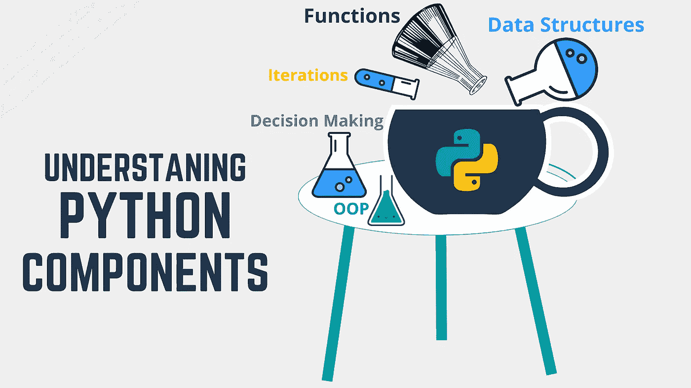

# 数据科学的 Python 基础

> 原文：<https://medium.com/analytics-vidhya/python-fundamentals-for-data-science-7b11745a6414?source=collection_archive---------22----------------------->



在我之前的[帖子](https://daizy-o.medium.com/launching-into-data-science-fda94963fd5c)中，我提到我将进入数据科学领域，同时使用 python 来实现这一目标。但是，在深入研究之前，有必要了解底层概念。我花了一周的时间来研究这个，我准备分享我所能研究的。

在这篇文章中，我们将回顾一些概念并研究一些例子。我还会在每个主题的末尾附上一个有用的链接，以帮助您更好地理解。打开你的代码编辑器，让我们开始工作吧！

```
content = ["**Variables**", "**Data Structures**", "**Conditional Statements**", "**Iterations**", "**Functions**", "**Lambda Expressions**", "**OOP**"]
covered = []print("All Topics: {}".format(content))def check_list():
    if len(covered) == 0:
        return "No topic covered yet"
    else:
        return covereddef update_list(topic):
    covered.append(topic)
    return covereddef alter_content(topic):
    if topic in content:
        content.remove(topic)
        print("\nCovered: {}\nCurrent Topic: {}\n".format   
     (check_list(), topic))
        update_list(topic)
    else:
        print("Topic is not part of the content")
```

## 1.变量

```
**alter_content("Variables")**>>All Topics: ['Variables', 'Data Structures', 'Conditional Statements', 'Iterations', 'Functions', 'Lambda Expressions', 'OOP']

>>Covered: No topic covered yet
>>Current Topic: **Variables**
```

在 python 中，为变量赋值时会创建一个变量。比如`name = "Daizy"`。`“name”`现在是引用值`“Daizy”`的变量。变量可以引用一个新值，例如`name = "Daphne"`。值可以是不同的类型，例如字符串、整数、浮点数。

有效变量名的例子包括:`name, my_name`。但是像`2car, car-name, car name`这样的名字是无效的。

## 2.数据结构

```
**alter_content("Data Structures")**>>Covered: ['Variables']
>>Current Topic: **Data Structures**
```

python 中使用的最常见的数据结构是可变的(列表、字典)——它们引用的值可以被操纵，以及不可变的(元组、字符串)——这些值不能被操纵。

这些数据结构对于保存相关或不相关的数据组非常有用。

*   列表对于保存有序数据很有用。`passwords = ["rga34jd", 11111, "DaizyO", "HighlyFavoured", 00009, 34]`
*   字典对于保存键/对值很有用。`student_results = {"John" : 90, "Mark" : 98, "Mary" : 94, "Michael" : 99}`
*   元组对于保护数据很有用。`tuple1 = ("yes", "no", "maybe")`
*   字符串作为字符序列很有用。`name = "Daizy"`

访问这个[链接](https://thomas-cokelaer.info/tutorials/python/data_structures.html)来访问关于这些数据结构以及如何操作它们的教程。

## 3.决策

```
**alter_content("Conditional Statements")** 
>>Covered: ['Variables', 'Data Structures']
>>Current Topic: **Conditional Statements**
```

假设您希望您的程序在满足不同条件时采取不同的执行路径，那么使用`if statements`是最好的选择。Python 为这些语句提供了简洁明了的语法:

```
if/then                                    elif
if expression:                             if expression:
   Statement                                  Statement
else:                                      elif expression:
   Statement                                  Statement
                                           else:
                                              Statement
```

如果您有两个以上的条件需要交叉检查，可以使用 elif 语句。举个例子:

```
print("Enter your marks:")
marks = int(input())print("Your mark is {}".format(marks))if (60 <= marks <= 69):
    grade = "D"
elif (70 <= marks <= 79):
    grade = "C"
elif (80 <= marks <= 89):
    grade = "B"
elif (marks >= 90):
    grade = "A"
else:
    grade = "F"

print("Grade: {}".format(grade))
```

如果我输入`81`作为标记，它将被检查到满足它的每一个条件；在这种情况下，作为第三个`80 < 81 <89`的是`true`。这就是`if statements`的工作方式。

一个有用的[资源](https://www.guru99.com/if-loop-python-conditional-structures.html)了解更多关于决策的信息。

## 4.迭代次数

```
**alter_content("Iterations")** 
>>Covered: ['Variables', 'Data Structures', 'Conditional Statements']
>>Current Topic: **Iterations**
```

迭代对于遍历序列很有用，直到满足某个条件(while 循环)或者知道应该执行多少次(for 循环)。如果你有一个序列，比如一个列表，它提供了迭代的起点和终点。

```
family = [{"name" :"Dee", "age" : 19, "gender" : "F"}, {"name" :"Tim", "age" : 49, "gender" : "M"}]for member in family:
    print("\n{} \n{} \n{}".format(member["name"], member["age"], member["gender"]))
```

该循环将遍历家族列表中的每个元素并执行一些操作，在本例中打印姓名、年龄和性别。

## 5.功能

```
**alter_content("Functions")**

>>Covered: ['Variables', 'Data Structures', 'Conditional Statements', 'Iterations']
>>Current Topic: **Functions**
```

函数是执行特定任务的可重用代码块。函数语法:

```
def function_name(parameters):
    suite
    expression
```

让我们参考这篇文章的第一段代码来了解如何创建和使用函数。该模块中有三个函数，但我们将重点关注其中的一个:`alter_content(topic)`，因为它是我们每次开始一个新主题时都要调用的函数。

```
def alter_content(topic):
    if topic in content:
        content.remove(topic)
        print("\nCovered: {}\nCurrent Topic: {}\n".format   
     (check_list(), topic))
        update_list(topic)
    else:
        print("Topic is not part of the content")
```

`alter_content`只接受一个参数`topic`，并使用该参数执行某些操作:

```
 Check if the topic is in the content list
   - If so:
          1\. Remove it from that list
          2\. Print some output
          3\. Call another function to update another list of topics that have been covered
   - If not:
          1\. Print some output
```

为了使用这个函数，我们在函数外部调用了一个函数`alter_content()`，在这个例子中，传递期望的参数`topic`，例如`alter_content("Daizy")`。这个调用将产生`"Topic is not part of the content”`作为输出，因为`"Daizy”`不在`content`列表中。

在这种情况下，函数的用处是显而易见的，如果我没有编写函数，那么每当我想要操作列表并产生一些输出时，我就必须编写大量的代码。但是因为我写了一个函数，所以我所要做的就是像我上面描述的那样调用它。

有关功能的更多信息，请参考本[教程](https://www.tutorialspoint.com/python/python_functions.htm)。

## 6.λ表达式

```
**alter_content("Lambda Expressions")**

>>Covered: ['Variables', 'Data Structures', 'Conditional Statements', 'Iterations', 'Functions']
>>Current Topic: **Lambda Expressions**
```

Lambda 表达式是匿名函数，也就是说，它们不像常规函数那样有名字。它们适用于一次性使用以及将其他函数作为参数的函数。

它们是采用`lambda parameters : expression`形式的单行函数。它们允许许多参数，但只有一个表达式。

以此为例:我有一个要检索其平方的整数列表。我可以使用内置的`map()`函数来应用一些函数，这些函数将返回列表中每个整数的平方。

```
numbers = [1, 2, 3, 4, 5]
squares = map(lambda x : x*x, numbers)
squares_list = list(squares)
```

你可以看到，用一行 lambda 函数，这非常简单和整洁。这篇[教程](https://www.guru99.com/python-lambda-function.html)是进一步理解 lambda 函数的良好起点。

## 7.面向对象编程

```
**alter_content("OOP")** 
>>Covered: ['Variables', 'Data Structures', 'Conditional Statements', 'Iterations', 'Functions', 'Lambda Expressions']
>>Current Topic: **OOP**
```

面向对象编程是一种将信息分组到对象类中的概念。类是对象的蓝图，而对象是类的实例。Python 支持这个概念，它允许我们定义可重用的类，这些类可用于创建实例。

例如，`Animal class`，从中可以创建许多动物实例，它们具有某些属性，如名称和腿的数量，以及某些行为，如进食:

```
class Animal:
     def __init__(self, name, no_of_legs):
         self.name = name
         self.no_of_legs = no_of_legs

     def eat(self, food):
         print("{} eats {}".format(self.name, food))dog = Animal("Dog", 4)
print(dog.eat("Bones"))>>"Dog eats Bones"
```

更多关于 python OOP 的内容，请参考[这个](https://www.programiz.com/python-programming/object-oriented-programming)链接。


照片由[兰斯格兰达尔](https://unsplash.com/@lg17?utm_source=medium&utm_medium=referral)在 [Unsplash](https://unsplash.com?utm_source=medium&utm_medium=referral) 上拍摄

万岁！你坚持到了最后！🙌重温这些概念并与你分享我对它们的理解是非常棒的。我希望已经为您增加了一些价值，并且我们现在可以将 python 用于未来的数据科学。干杯！