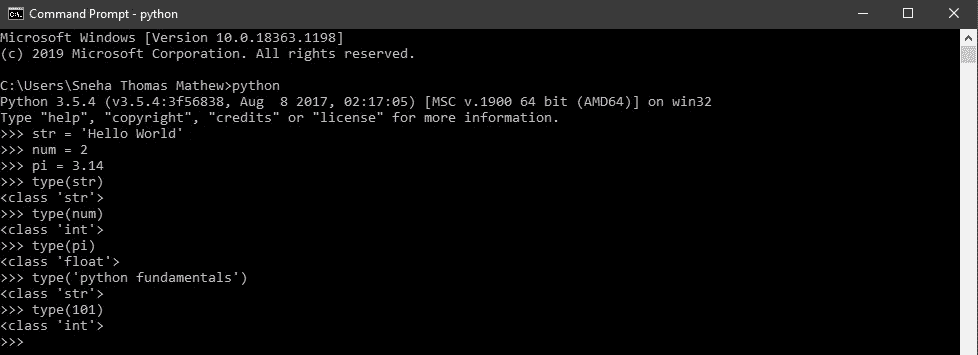
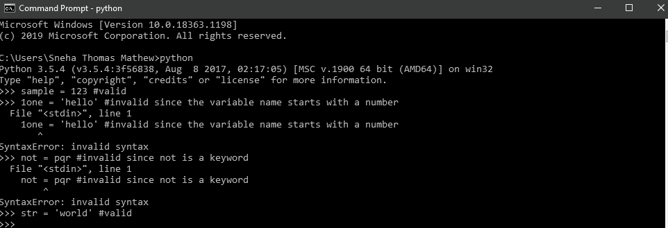
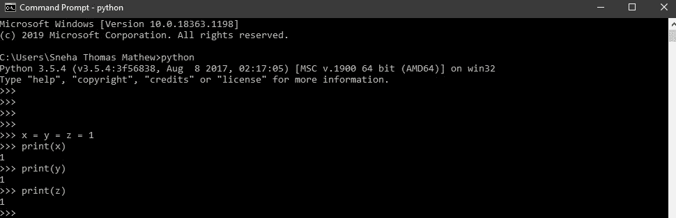

# 面向所有人的 Python 基础——变量

> 原文：<https://medium.com/analytics-vidhya/python-fundamentals-for-everybody-variables-b76fd2699b20?source=collection_archive---------26----------------------->

安妮·斯普拉特在 [Unsplash](https://unsplash.com?utm_source=medium&utm_medium=referral) 上的照片

这是许多关于 **python 基础知识的文章的第二篇**，这是一个专注于 Python 基础知识的 Python 教程系列。

你可以参考下面这个系列的前一篇文章。

 [## 面向所有人的 Python 基础—Python 简介

### 这是 python 教程系列“面向所有人的 Python 基础”的许多文章中的第一篇，该系列着重于…

snehathomasmathew.medium.com](https://snehathomasmathew.medium.com/python-fundamentals-for-everyone-introduction-to-python-177e1567ce43) 

在本文结束时，你将了解 python 中什么是变量，它们是如何赋值的，以及 python 中各种运算符可以执行的基本运算。

事不宜迟，让我们开始吧！

> **那么，什么是变量呢？**

就像我们在家里有一个储存东西的储藏室一样，在任何编程语言(Python，C，C++)中，变量都是一个存储位置，在那里存储一些值。

> 换句话说，变量指的是保存或存储某个值的存储位置。

存储在变量中的值可以在以后访问或更新。

一个值可以包含相似或不同类型的值，即。，它可能包含数字、字母、字母数字甚至特殊符号。

例如:

*>>>str = " Hello World "*

所以在这里，“str”是一个包含字母值的变量。在编程术语中，“str”被称为保存字符串值的变量名。因此，我们说，“字符串”是字符串数据类型。

*> > > num = 2*

类似地，“num”是一个保存数值的变量名，因此，“num”的数据类型是 integer。

*> > >圆周率= 3.14*

“pi”是一个包含浮点(十进制值)的变量，因此，“pi”的数据类型是 float。

> *Python 支持* ***内置函数****‘type()’，以值为参数，返回其数据类型。*

作者图片

内置函数基本上是 python 解释器中已经存在的代码块，并且总是可用的。

例如，当你想打印某样东西时，你只需写*>>>print(‘hello world’)*，hello world 就会被打印出来。

但是实际发生的是，解释器中的一段代码在调用 print() 时被执行。

> 我可以随意给变量取任何名字吗？嗯， ***python 变量有一些命名规则。***

*   Python 是一种区分大小写的语言，这意味着变量 student 和 Student 被视为不同的
*   python 变量必须以字母(a-z 或 A-Z)或下划线(_)开头
*   保留名称不能用作变量名，例如“if”不能用作变量名，因为“if”是用于检查条件的保留字。

以下代码片段展示了 python 中有效和无效变量名的一些示例。

作者图片

> **Python 赋值**

到目前为止，从上面的例子中，你必须熟悉变量是如何赋值的。， *<变量名> = <表达式>*

*例如，str = '你好'*

Python 也支持多重赋值，也称为链赋值。如果多个变量只有一个值，那么可以这样赋值:x=y=z=1

这里，x、y 和 z 都被赋予一个值 1。

作者图片

**嗯，坚持到这篇文章结束做得很好！；)**

> 现在你知道了什么是变量以及如何声明它们，并且对内置函数有了一个了解。

在下一篇文章中，我们将研究操作符和操作数。