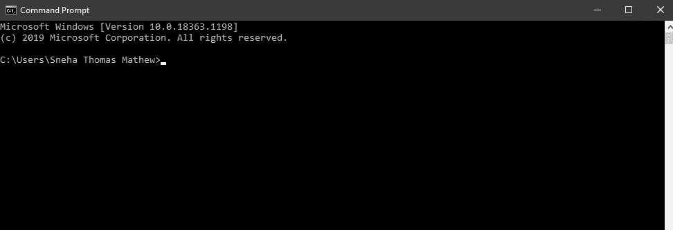
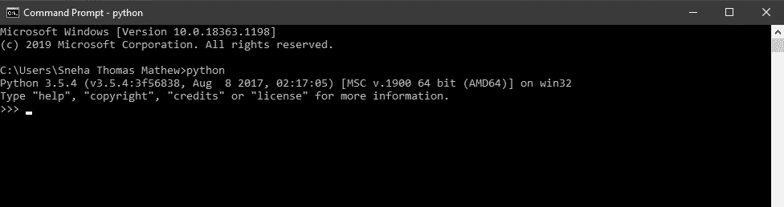
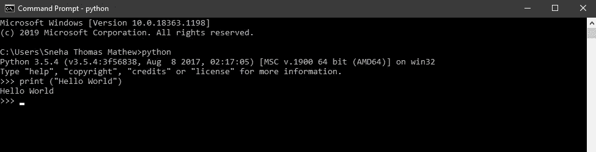
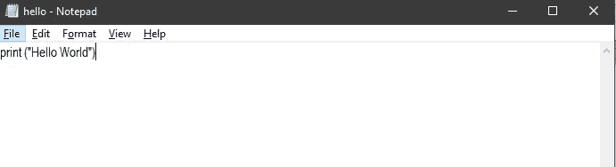
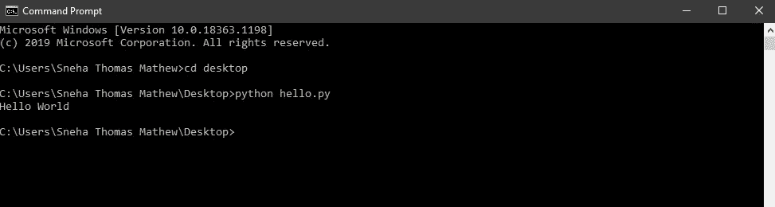

# 面向所有人的 Python 基础—Python 简介

> 原文：<https://medium.com/analytics-vidhya/python-fundamentals-for-everyone-introduction-to-python-177e1567ce43?source=collection_archive---------21----------------------->

在 [Unsplash](https://unsplash.com?utm_source=medium&utm_medium=referral) 上由 [Hitesh Choudhary](https://unsplash.com/@hiteshchoudhary?utm_source=medium&utm_medium=referral) 拍摄的照片

这是许多关于 **python 基础知识的文章的第一篇**，这是一个专注于 Python 基础知识的 Python 教程系列。

在本文结束时，您将了解如何从您的系统运行 python 程序。

> **Python 简介**

Python 是一种编程语言，由吉多·范·罗苏姆于 1991 年开发，在荷兰国家数学和计算机科学研究所公开发行。

它是免费的开源软件，通俗地说，它意味着一段可以公开访问的代码——因此任何人都可以查看、修改和分发他们认为合适的代码。

Python 易于学习，易于阅读，独立于平台，面向对象，并支持与主要数据库的接口。

Python 是一种解释型语言，这意味着只要我们在系统中输入或加载 python 程序，解释器就会运行它。如果存在错误，它会引发一个异常并打印错误。

> 让我们看看 python 程序是如何运行的

**Python 有两种编程方式:**

1.  *交互模式编程*
2.  *脚本模式编程*

> **交互模式编程**

这里，我们在命令提示符下调用 python 解释器。命令提示符是与用户交互的命令行界面。

要在 windows 操作系统中打开命令提示符，请单击开始按钮，选择运行并键入 cmd。

Windows 操作系统中的命令提示符(图片由作者提供)

如果您的系统中已经安装了 python，则在命令提示符(cmd)中键入“python ”,然后按 enter 键在 cmd 上打开 python 命令行。

作者图片

在命令行中键入以下代码:

*> > >打印(《你好世界》)*

作者图片

> **脚本模式编程**

在这种模式下，通过 python 脚本调用解释器。Python 脚本不过是用编辑器(例如记事本)编写的一些 python 代码，用。py 扩展名，例如 hello.py

因此，打开记事本这样的编辑器，输入代码，例如

*打印(《你好世界》)*

并将文件保存为。py 扩展名。在本例中为 hello.py

作者图片

现在，通过打开命令提示符运行脚本，并通过键入以下命令遍历到保存脚本的目录

*$python hello.py*

作者图片

## 祝贺你取得了如此大的成就！

> 现在，您已经了解了 python 程序在您的系统中运行的两种方式。

在下一篇文章中，我们将研究变量。