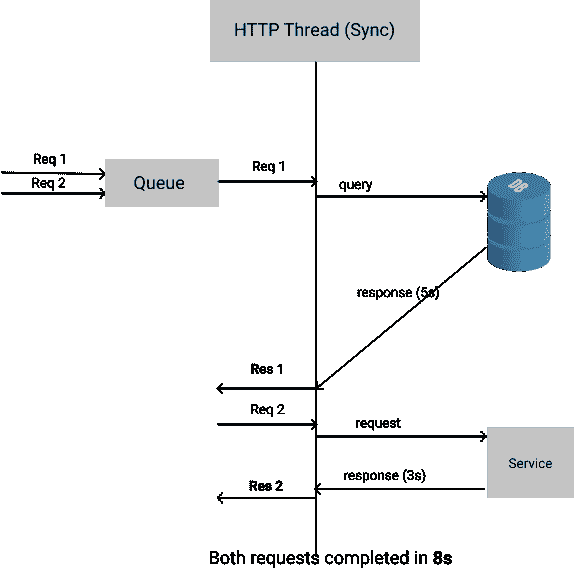
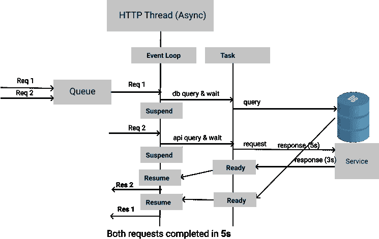

# Python 生成器/协同例程/异步 IO 及示例

> 原文：<https://medium.com/analytics-vidhya/python-generators-coroutines-async-io-with-examples-28771b586578?source=collection_archive---------1----------------------->

在我做的一项咨询工作中，我使用了 python asyncio，并理解了其简单语法中的困难。需要阅读一些博客和例子来理解它是如何工作的。这个主题是压倒性的，因为它与生成器/旧协程语法的历史有关，并且需要一些关于一些概念的基础知识来更好地理解。

我想分享我的学习，这将有助于理解核心基础知识和简短的定义和简单的代码示例，这样使用 asyncio 会更容易一些。:).

**话题**

1)简介
2)历史&工作原理
3)总结
4)简单的 HTTP API 爬虫示例

# **1。简介**

以下是对主题中使用的术语的简要概述。

***并发 vs 并行***

*   并发性——执行两个或更多任务的能力，这些任务可以在重叠的时间段内开始、运行和完成(可以是在多核上真正的并行执行，或者在线程的帮助下在单核机器上进行时间分片)。
*   并行性——是指同时并行执行任务。(例如，至少两个线程同时执行)
*   线程—线程有助于执行多个任务，这有助于实现并发/并行。在单个 python 进程中，由于[全局解释器锁](https://docs.python.org/3/glossary.html#term-global-interpreter-lock) (CPython 实现)，线程并行是不可能的。GIL 是一种互斥机制，可以防止多个线程同时在 Python 对象上执行。因此在一个 python 进程中，一次只能执行多个线程中的一个线程。
*   多进程—需要多个 python 进程来实现并行性。**多处理**包提供本地和远程并发，通过使用子进程而不是线程来有效地避开 GIL。

***同步 Vs 异步***

同步/异步是关于计算/任务如何在单个线程的上下文中完成的。

*   同步—阻止任务的执行。线程(cpu)的计算/任务执行被阻塞/等待操作(IO)完成。
    例如，处理 http 请求的单个线程进行 db 调用，等待 DB 响应返回 http 响应，然后获取下一个 http 请求。
*   异步—任务的并发执行。由单个线程执行的多个任务可以彼此独立地开始、暂停和完成。异步任务不会阻塞通常等待 IO 的操作。这对于 IO 受限(磁盘/网络)的用例非常有帮助，因为当我们等待 IO 时，CPU 可以用于其他目的。**python 中的协程**有助于实现这一点。
    **例如**处理 http 请求的单线程进行 DB 调用，并挂起当前任务等待 DB 响应。同一个线程获得一个新的请求并开始处理。



# **2)历史&它是如何运作的？**

## 迭代器:

迭代器是可以被惰性迭代(使用 __iter__ 和 __next__)的对象。

```
list = [1, 2]
iterator = iter(list)
print(next(iterator)) 
print(iterator.__next__())
print(next(iterator))**# Output:** 1
2
Raise StopIteration exception since no items to iterate
```

## **发电机:**

**生成器(常规)**是迭代器，有助于简化构建定制逻辑迭代器的复杂性。它为每次运行动态生成一个值(例如，懒惰的生产者)。

**如何创建？**

生成器是任何带有`yield`语句而不是`return`语句的普通函数

> `yield`是一个关键字，用法和`return`一样，只是函数会返回一个生成器。`yield`语句暂停函数，保存其所有状态，然后在后续调用中从上一个状态继续执行(更多信息参见[此处](https://www.programiz.com/python-programming/generator))。

```
import randomdef simple_generator():
    yield 10
    yield 100

gen = simple_generator()
print(gen)
print(next(gen))
print(gen.__next__())
try:
    print(next(gen))
except StopIteration:
    print('iteration stopped')**# Output:**
<**generator object** simple_generator at 0x100fa48b8>
10
100
iteration stopped
```

相同的示例生成器对象可以与“for”循环交互，因为它是一个迭代器

```
def magic_pot(start=1, end=1000):
    while True:
        yield random.randint(start, end)gen = magic_pot()
for a in gen:    
    print(a)**# Output:** prints numbers without stopping
569
...
```

我们可以将生成器管道化，类似于 Unix 管道。

```
def read_file(file_name):
    for row in open(file_name, "r"):
        yield row

def read_csv_row(file_name):
    for row in read_file(file_name):
        yield row.split(',')

def read_csv(file_name):
    for items in read_csv_row(file_name):
        print("Row: " + str(items))

read_csv('test.csv')**# Output:** Row: ['col1', 'col2', 'col3\n']
Row: ['1', '2', '3\n']
Row: ['3', '4', '5']
```

[**PEP-380**](https://www.python.org/dev/peps/pep-0380/) **，** `**yield from**` **是为了简化发电机的管路而引入的)**

*   Python 3.3 中添加的`yield from`使得重构生成器以及将它们链接在一起变得更加容易

```
**# Example:**def read_file(file_name):
    for row in open(file_name, "r"):
        yield row**"or"**def read_file(file_name):
    yield from open(file_name, "r")
```

## 协程:

> 协程是计算机程序组件，它通过允许在某些位置暂停和恢复执行的多个入口点，来概括用于非抢占式多任务处理的子程序。

协程有助于实现协同多任务/ **并发**。它们是通过能够暂停&恢复线程中的任务来帮助并行执行的功能/任务。(例如，异步 I/O 和其他形式的事件驱动编程或协作多任务)

## 将**进化为**“生成器协程”:

生成器不能在执行期间接受参数，这使得很难控制生成器函数内部的逻辑流(例如，协程 A 等待来自另一个 http 调用协程 B 的响应，协程 A 挂起->协程 B Http 完成->恢复协程 A(来自协程 B 的 Http 响应))。

使用 PEP-342(Python 2.5 **)** 对 Generators 进行了改进，以支持协同程序，这有助于将参数传递给 generators 来控制执行流。这最终有助于实现**协同能力**其他形式的**合作多任务**。

[**PEP-342**](https://www.python.org/dev/peps/pep-0342/)

> Python 的生成器函数几乎是协程——但不完全是——因为它们允许暂停执行以产生一个值，但不提供在执行恢复时传入的值或异常。
> 
> **发生器**不能在其他函数执行时产生控制，除非这些函数本身被表示为发生器，并且外部发生器被编写为响应内部发生器产生的值而产生控制。这使得即使相对简单的用例(如**异步通信**)的实现也变得复杂，因为调用任何函数要么需要生成器阻塞(即不能产生控制)，要么必须在每个需要的函数调用周围添加大量样板循环代码
> 
> 然而，如果可以在生成器挂起时将值( **send()** )或异常传递到生成器中，那么一个简单的**协同例程调度程序或蹦床函数**就可以让协程在没有阻塞的情况下相互调用——这对异步应用程序来说是一个巨大的福音。然后，这些应用程序可以编写协同例程，通过将控制权让给 I/O 调度程序来执行非阻塞套接字 I/O，直到数据已经发送或变得可用。与此同时，执行 I/O 的代码将简单地执行如下操作:
> 
> data =(yield non blocking _ read(my _ socket，nbytes))
> 
> 为了**暂停执行**直到 nonblocking_read()协程产生一个值。

以上 PEP 增加的改进为生成器增加了 **send()、throw()、close()** 方法。`yield`已被更改为表达式，其行为类似于双向通信工具，如下例所述。

```
**Example — generator with send() and yield expression**import randomdef magic_pot(start=1, end=1000):
    while True:
        stop = **(yield random.randint(start, end))**
        print("stop %s" % stop)
        if stop is True:
            yield "magic pot stopped"
            breakgen = magic_pot()
print(gen)
print(gen.send(None))  **# same as next(gen)**
print("second")
print(next(gen))
print(gen.send(True))  **# input value for generator**try:
    print(next(gen))
except StopIteration:
    print('iteration stopped')**Output:** <generator object magic_pot at 0x10ab39840>
735
second
stop None              **# stop is printed after the next(gen)**
506
stop True
magicpot stopped
iteration stoppedIn the code, 
- '**yield random.randint(start, end)'** returns an outputwhich is triggered by next(gen) or gen.send(None) **- '(yield random.randint(start, end))'** captures the subsequent iteration input parameter(using gen.send(None) or gen.send(Any))which is used to control flow inside the generator coroutine. In this example, gen.send(True) is passed to stop the coroutine. 
**- (yield) works bidirectional with output and input.**
```

## 协同程序与生成器:

协程是一个遵循特定约定的生成器。

*   协程**将控制权**让给另一个协程，并且**可以从它放弃控制权的地方继续执行**。
*   协程是数据消费者，而生成器是数据生产者
*   可以在初始化后将值发送到基于生成器的协程(使用**send()**&**(yield)**语句)，而常规生成器不能。

## **AsyncIO —** 异步 I/O、事件循环、协程和任务

*来自 Python 文档:*

> 该模块为使用协程编写单线程并发代码、通过套接字和其他资源多路复用 I/O 访问、运行网络客户端和服务器提供了基础架构。我们将看看下面的每个主题。
> 
> 事件循环是每个 asyncio 应用程序的核心。事件循环运行异步任务和回调，执行网络 IO 操作，并运行子进程。应用程序开发人员通常应该使用高级别的 asyncio 函数，如 asyncio.run()，并且应该很少需要引用循环对象或调用其方法。

## 异步发电机协同程序:

在 python 3.4 中，基于生成器的协同程序是使用新的 [asyncio](https://docs.python.org/3/library/asyncio.html) 模块库用`[@asyncio.coroutine](https://docs.python.org/3/library/asyncio-task.html#asyncio.coroutine)` decorator 创建的。Asyncio 生成器协同程序使用`yield from`语法来挂起协同程序。

asyncio 协程可以:

*   “屈服于”另一个协程
*   “屈服于”未来
*   返回表达式
*   引发异常

`yield from`语句将控制权交还给事件循环，让其他协程执行。

*   [**PEP 380**](http://www.python.org/dev/peps/pep-0380) 中引入了“yield from”语法，代替了生成器协程的原始 yield 语法。“yield from”用于生成器协程内部。`yield from` 迭代器或本机/生成器协程/未来。
*   允许生成器使用“yield from”调用本机协同程序( **async def)** ，也允许生成器协同程序由本机协同程序使用 await 表达式调用。
*   “yield”用法使它们成为必须迭代的常规生成器/迭代器，并且不能与 asyncio 方法一起工作。

```
import asyncio
import random

@asyncio.coroutine
def compute_coroutine(x):
    yield from asyncio.sleep(random.random()) **# yield from native coroutine**
    print(x * 2)

asyncio.run(compute_coroutine(2))**# Output
4**asyncio.run()
 - starts compute_coroutine() coroutine
 - suspends compute_coroutine() and start asyncio.sleep()
 - resumes compute_coroutine()
 - coroutines are suspended/executed with the help of asyncio event loop--------------------------------------------------------------------@asyncio.coroutine
def coroutine_generator(x):
    for i in range(0, x):
        yield i
    print("input=%s" % x)

asyncio.run(coroutine_generator(2))**# Output - yield inside coroutine cannot be used with asyncio** RuntimeError: Task got bad yield: 0
```

## 本机协同程序:

`async/await`从 Python 3.5 开始引入关键字，使协程编程的语法更有意义，是最新的语法。

*   异步定义返回一个*本机协程*对象。异步定义函数总是协程，即使没有 await。
*   常规生成器返回一个*生成器*对象
*   asyncio.coroutine 返回*基于生成器的协程对象*
*   types.coroutine 返回基于生成器的 coroutine 对象

```
import asyncio
import types

@asyncio.coroutine
def async_gen_data():
    yield 10 @types.coroutine
def types_gen_data():
    yield 10

async def async_native_coroutine():
    print('async_native_coroutine')

async def async_native_coroutine_generator():
    print('async_native_coroutine_generator')
    yield 100

print(async_gen_data())
print(types_gen_data())
print(async_native_coroutine())
print(async_native_coroutine_generator())**# Output:** <**generator** object async_gen_data at 0x10b6c1e58>
<**generator** object types_gen_data at 0x10b6c1e58>
<**coroutine** object async_native_coroutine at 0x10b6d9748>
<**async_generator** object async_native_coroutine_generator at 0x10b709f28>We will see more on @types.coroutine / async_generator in the further sections.
```

## 等待

*   “await”应与 async def 一起使用。`await`用于获取协程对象的执行结果
*   async/await 是@asyncio.coroutine/'yield from '的最新等效项
*   await 适用于生成器/本机协程对象和使用 __await__ 方法返回迭代器的对象。
*   在引擎盖下，`await`借用了`yield from`的实现，并额外检查了它的参数是否确实是可实现的。
*   **本机/生成器协同程序，未来，任务**是**可实现的**

```
**# example1: async native coroutine**import asyncio

async def f1():
    print('before')
    await asyncio.sleep(1)
    print('after 1 sec') asyncio.run(f1()) # runs in a event loop and execute**# Output** <coroutine object f1 at 0x101d852c8>
after 1 sec---------------------------------print(f1())**# Output**
RuntimeWarning: coroutine 'f1' was never (coroutine needs to be awaited)---------------------------------
await f1() **# Output** SyntaxError: 'await' outside function (should be used inside async function/native coroutine)
```

**并发协同程序( *async/await，@ asyncio . coroutine/yield from*):**

```
import asyncio
import random@asyncio.coroutine
def compute(tid, x):
    print("%s: input=%s with sleep=%s" % (tid, x, sleep))
    yield from asyncio.sleep(random.random())  # async future
    return x * 2@asyncio.coroutine
def print_sum(tid, x):
    result = yield from compute(tid, x)  # return a value
    print("%s: result=%s" % (tid, result))async def task(tid, x):
    return await print_sum(tid, x)  # await a coroutineasync def main():
    await asyncio.gather(
        task("t1", 2),
        print_sum("t2", 3),
        task("t3", 4),
    )asyncio.run(main())**# Output - execute 3 tasks concurrently** t1: input=2 with sleep=0.7909687238238471
t2: input=3 with sleep=0.25100171976591423
t3: input=4 with sleep=0.4164068460815761
t2: result=6
t3: result=8
t1: result=4*await asyncio.gather()* - Run alls coroutines concurrently inside the event loop and gathers all the results to be returned by main()
```

协程 compute() "yield from "语句将控制权交还给事件循环(暂停)，并在协程`asyncio.sleep()`完成后继续执行。请注意，`asyncio.sleep()`本身是一个协程，被阻塞的协程在睡眠后恢复。事件循环基于可运行的协同程序执行，并且输出执行顺序(t1，t2，t3)基于示例中的延迟而变化。

## 事件循环:

*   [事件循环](https://www.educative.io/blog/python-concurrency-making-sense-of-asyncio)使用协作调度，这意味着事件循环一次运行一个任务。当一个任务等待 Future 完成时，事件循环运行其他任务、回调或执行 IO 操作。任务也可以取消。
*   事件循环与一个线程相关联
*   SelectorEventLoop —基于**选择器**模块(epoll()/kqueue()/select())的事件循环，用于高级和高效的 I/O 多路复用。
*   ProactorEventLoop—windows 的事件循环

```
**# event loop with multiple coroutines calls**import asyncio
import threading
from asyncio import eventsasync def f1():
    print('tid:%s - before' % threading.get_ident())
    await asyncio.sleep(1)
    print('tid:%s - after 1 sec' % threading.get_ident())def run(fn):
    loop = events.new_event_loop()
    loop.run_until_complete(fn)
    loop.close() print('tid:%s - start' % threading.get_ident())
**# creates 2 new event loop for each run()** run(f1())
run(f1())**# Output**
tid:4638019008 - start
tid:4638019008 - before
tid:4638019008 - after 1 sec
tid:4638019008 - before
tid:4638019008 - after 1 secEvent loop uses only unix thread(tid is the same in all outputs) to schedule tasks for each run() which created new_event_loop() every-time.
```

## **期货**

一个`[Future](https://docs.python.org/3/library/asyncio-future.html#asyncio.Future)`是一个特殊的**低级**可调用对象，代表一个异步操作的**最终结果**。Future 对象正在等待，这意味着协程将等待，直到 Future 在其他地方被解析

```
import asyncioasync def num_calc(name, number):
    f = 1
    for i in range(2, number + 1):
        await asyncio.sleep(1)
        f *= i
    print(f"Task {name}: multiplier({number}) = {f}")
    return fasync def main():
    **#** **schedule calls concurrently & gathers all async future results**
    results = await asyncio.gather(num_calc("A", 2), num_calc("B", 3), num_calc("C", 4) )  
    print(results) asyncio.run(main())**# Output** Task A: multiplier(2) = 2
Task B: multiplier(3) = 6
Task C: multiplier(4) = 24
[2, 6, 24]# Results [2, 6, 24] are printed based on await on the futures
```

**期货之间的协调**

```
import asyncio
from asyncio import Future

async def child_future(future):
    print("child sleep")
    await asyncio.sleep(1)
    print("child woke")
    future.done()
    future.set_result("future is resolved")
    return "child complete"

async def parent(future):
    print("parent wait for child")
    print(await future)
    return "parent complete"

async def main():
    future = Future()
    print(await asyncio.gather(parent(future), child_future(future)))

asyncio.run(main())**# Output : parent waits for child to complete the task**
parent wait for child
child sleep
child woke
future is resolved
['parent complete', 'child complete']
```

## **任务:**

*任务是未来的子类。任务*用于在事件循环中同时调度协程*。协程被打包到一个*任务*中，其功能类似于`[asyncio.create_task()](https://docs.python.org/3/library/asyncio-task.html#asyncio.create_task)`协程被自动调度为很快运行。Task 有 add_done_callback()来处理进一步的代码清理/完成逻辑。*

```
import asyncio

**async def** nested():
    return 42

def result_callback(future):
    print("Callback: %s" % future.result())

**async def** main():
 **# Schedule nested() to run soon concurrently with "main()".**
    task = asyncio.create_task(nested())
    task.**add_done_callback**(result_callback)

    # "task" can now be used to cancel "nested()", or
    # can simply be awaited to wait until it is complete:
    await task

asyncio.run(main())**# Output** Callback: 42Prints callback result after the task is complete.
```

## @ [types.coroutine](https://www.python.org/dev/peps/pep-0492/#id55) :

Decorator 将生成器标记为协程。与 asyncio.coroutine()非常相似，不太值得关注。它允许 asyncio 中现有的*基于生成器的协同程序*和*本地协同程序(async)之间的互操作性。*

```
import typesasync def magic_pot(db):
    return 1 **@types.coroutine** def process_magic_pot():
    data = yield from magic_pot(db) 
    print(data)pmp = process_magic_pot()
print(magic_pot())
print(pmp)
asyncio.run(pmp)**# Output:** <coroutine object magic_pot at 0x107ed5c48>
<generator object process_magic_pot at 0x107f542a0>
1
```

## **异步发电机:**

本机协程内的“yield”返回异步生成器

```
**Rationale: (**from[PEP 255](https://www.python.org/dev/peps/pep-0255))Regular generators enabled an elegant way of writing complex *data producers* and have them behave like an iterator. However, currently there is no equivalent concept for the 
*asynchronous iteration protocol* (async for). This makes writing asynchronous data producers unnecessarily complex, as one must define a class that implements __aiter__ and __anext__ to be able to use it in an async for statement.def func():            # a function
    return

def genfunc():         # a generator function
    yieldasync def coro():      # a coroutine function
    await smth()async def read(db):    # a coroutine function without await
    passasync def asyncgen():  # an async generator coroutine function
    await smth()
    yield 42The result of calling an *asynchronous generator function* is an *asynchronous generator object*, which implements the asynchronous iteration protocol defined in [PEP 492](https://www.python.org/dev/peps/pep-0492).
```

**新的异步迭代协议支持带异步/等待的生成器**

*异步迭代协议*

1.  一个 __aiter__ 方法返回一个*异步迭代器*。
2.  __anext__ 方法返回一个可调整的对象，该对象使用 StopIteration 异常来“产生”值，并使用 StopAsyncIteration 异常来表示迭代结束。

```
async def async_generator():
    for i in range(2):
        await asyncio.sleep(1)
        yield i * i

async def main():
    gen = async_generator()
    print(gen)
    print(await gen.__anext__()) **# await for the 'yield'**
    print(await gen.__anext__())
    await gen.aclose()           **# close the generator for clean-up**

asyncio.run(main())

**# Output**
0
1'yield' has to be awaited until exhausted to close the async generator in a clean way. Otherwise, it can cause task 'shutdown' exceptions.
```

## 异步用于:

简化了异步发电机的迭代(yield)。

```
# combination of using async generator and coroutineasync def main():
    **async for** i in async_generator():
        print(i)

loop = asyncio.get_event_loop()
asyncio.ensure_future(main())
asyncio.ensure_future(main())
loop.run_forever()**# Output** 0
0
1
1
```

# 3.摘要

*   yield 关键字创建常规生成器。“yield from”是迭代和耗尽生成器的捷径
*   **generator.send()** 帮助向协程发送值。‘yield’对于协程之间的迭代是双向的。
*   [事件循环](https://www.educative.io/blog/python-concurrency-making-sense-of-asyncio)使用协同调度。并发任务被安排在一个由线程管理的事件循环中。
*   @asyncio.coroutine 创建 asyncio 生成器协程对象，并使用“yield from”来处理本机/生成器协程。`yield from`语句将控制权交还给事件循环，让其他协程执行。
*   @types.coroutine 类似于@asyncio.coroutine，它有助于将常规生成器转换为协同程序对象，并在本机协同程序之间实现互操作。
*   asyncio 是一个使用 **async/await** 语法编写**并发**代码的库。
*   用 **async/await** 语法声明的协同程序是编写 asyncio 应用程序的首选方式。
*   async/await 是@asyncio.coroutine/'yield from '的最新等效项
*   本机/生成器协同程序，未来，任务是**可实现的**
*   Future 是一个特殊的低级对象，表示异步操作的最终结果。
*   任务是未来的一个子类。任务用于调度 ***事件循环*** *中的**协程*并发*** *执行。**
*   **async for** 用于迭代异步生成器
*   **async with** 用于执行带清理(垃圾收集)的异步操作

# 4.简单的 HTTP API 爬虫示例

```
**# Simple example to crawl http urls in parallel**import aiohttp
import asyncio
import time

**async def** get_req(page_no):
    print("called at time1: " + str(time.time()))
    async with aiohttp.ClientSession() as session:
        async with session.get("http://reqres.in/api/users?page=" + str(page_no), headers={}) as resp:
            print("called at time2: " + str(time.time()))
            return await resp.json()

**async def** fetch_all_urls():
    results = await **asyncio.gather**(*[get_req(page_no) for page_no in range(1, 5)], return_exceptions=True)
 **# results = [await get_req(page_no) for page_no in range(1, 5)]**
    for result in results:
        print('page: %s, size: %s' % (result['page'], len(result['data'])))
    return results

**def** get_htmls():
    loop = asyncio.get_event_loop()
    htmls = loop.run_until_complete(fetch_all_urls())
    return htmls

start = time.time()
print("start time: " + str(start))
get_htmls()
print("time taken: " + str(time.time() - start))**# Output:**
start time: 1583848827.362924
called at time1: 1583848827.363832
called at time1: 1583848827.365168
called at time1: 1583848827.365639
called at time1: 1583848827.365942
called at time2: 1583848827.625053
called at time2: 1583848827.6382
called at time2: 1583848827.656707
called at time2: 1583848827.981515
page: 1, size: 6
page: 2, size: 6
page: 3, size: 0
page: 4, size: 0
time taken: 0.6193337440490723**#** Uncomment the bold line (replace "await asyncio.gather" line with the next commented line and check the results). Request are completed done sequentially and takes 2 seconds to complete. In this case, await iterated sequentially can lose all concurrency and thats how started this journey of understanding the asyncio.
```

**参考文献:**

特别感谢所有帮助我理解复杂概念的人，感谢他们的博客/演示。我使用了一些参考链接中的部分定义/示例参考。

*   [www.dabeaz.co](https://www.dabeaz.com/coroutines/Coroutines.pdf)m 出色的演示文稿和[源代码](http://www.dabeaz.com/coroutines/)
*   Abu Ashraf Masnun 就这些主题撰写了出色的文章。查看他的博客([http://masnun.com](http://masnun.com))
*   [https://real python . com/async-io-python/# other-features-async-for-and-async-generators-comprehensions](https://realpython.com/async-io-python/#other-features-async-for-and-async-generators-comprehensions)
*   [https://www . educative . io/blog/python-concurrency-making-sense-of-asyn CIO](https://www.educative.io/blog/python-concurrency-making-sense-of-asyncio)
*   [https://snarky . ca/how-the-heck-do-async-await-work-in-python-3-5/](https://snarky.ca/how-the-heck-does-async-await-work-in-python-3-5/)

请让我知道你对定义/代码的反馈/修正。如果你正在读这最后一行，你有足够的耐心/兴趣来读这么长的帖子，为此表示感谢:)。