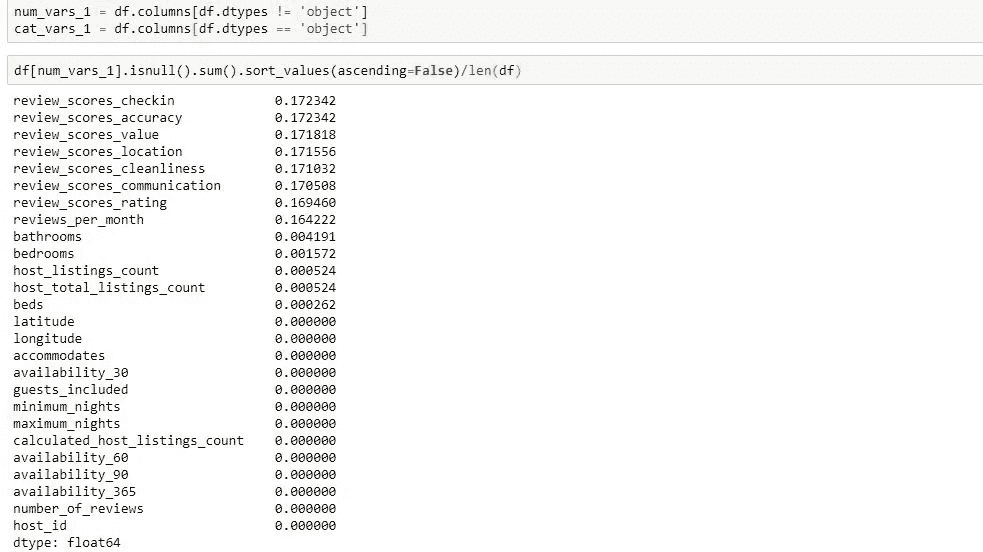

# Python:处理数据框中的缺失值

> 原文：<https://medium.com/analytics-vidhya/python-handling-missing-values-in-a-data-frame-4156dac4399?source=collection_archive---------7----------------------->

## 如何使用 Python/Pandas 处理数据框中的缺失值

# **简介**

在上一篇文章中，我们讨论了如何找到丢失的值。此链接包含有关如何在数据框中查找缺失值的详细信息。[https://medium . com/@ kallepalliravi/python-finding-missing-values-in-a-data-frame-3030 AAF 0e 4 FD](/@kallepalliravi/python-finding-missing-values-in-a-data-frame-3030aaf0e4fd)

现在您已经确定了所有丢失的值，那么如何处理这些丢失的值呢？在本文中，我们将讨论如何处理数据帧中的缺失数据。

有多种处理缺失数据的方法，这因情况而异。处理缺失数据没有通用的最佳方法。使用您的最佳判断并探索不同的选项来确定哪种方法最适合您的数据集。

1.  **删除所有丢失数据的行/列**:当您有大部分数据丢失的行/列时可以使用。当您删除行/列时，您可能会丢失一些有价值的信息，并导致有偏见的模型。因此，在删除之前，请分析您的数据，并检查是否有任何特殊原因导致数据丢失。
2.  **输入数据**:这是目前最常用的处理缺失数据的方法。在这种方法中，当数据缺失时，您需要估算一个值。输入数据会给数据集带来偏差。插补可以通过多种方式完成。

a.您可以将一列的平均值、中间值或众数值归入一列中的缺失值。

b.您使用预测算法来估算缺失值。

c.对于分类变量，您可以将缺失数据标记为一个类别。

在这个练习中，我们将使用西雅图 Airbnb 数据集，它可以在下面的链接中找到。[https://www.kaggle.com/airbnb/seattle?select=listings.csv](https://www.kaggle.com/airbnb/seattle?select=listings.csv)

**加载数据，找出缺失值。**

这些步骤的细节可以在下面的链接中找到。[https://medium . com/@ kallepalliravi/python-finding-missing-values-in-a-data-frame-3030 AAF 0 E4 FD](/@kallepalliravi/python-finding-missing-values-in-a-data-frame-3030aaf0e4fd)

加载数据文件并检查数据结构

每个数字列中缺失数据的百分比

分类列中缺失数据的百分比

# **1。删除缺失数据的行/列:**

**删除特定行/列**

从上面可以看到，license 列中 100%的值和 square _ feet 列中 97%的值在数字列中缺少数据。

monthly_price 中 60%的值、security_deposit 中 51%的值和 weekly_price 中 47%的值缺少数据

让我们试着删除这 5 列。

熊猫 **drop** 功能可以用来删除行和列。这个函数的完整细节可以在下面的[https://pandas . pydata . org/pandas docs/stable/reference/API/pandas 中找到。DataFrame.drop.html](https://pandas.pydata.org/pandas-docs/stable/reference/api/pandas.DataFrame.drop.html)

应该删除的所有列都应该包含在 columns 参数中。轴=1 表示列，轴=0 表示行。在这种情况下，我们要删除 columns 参数中指定的所有列。

正如您在下面看到的，现在您没有已被删除的列。

**用 NA 删除行/列**

如果你想用 NA 删除行/列，我们可以使用 pandas 中的 **dropna** 功能。此功能的详细信息可以在下面的链接中找到。[https://pandas . pydata . org/pandas-docs/stable/reference/API/pandas。DataFrame.dropna.html](https://pandas.pydata.org/pandas-docs/stable/reference/api/pandas.DataFrame.dropna.html)

dropna 函数有多个参数，3 个主要参数是

1.  如何:这有两个选项“任何”或“所有”。如果您设置为“任何”,即使某个值在行或列中有 NA，它也会删除这些列。如果您设置为“全部”,则仅当行/列中的所有值都有 NA 时，才会发生删除。
2.  轴:这可以设置为 0 或 1。如果 0，则删除具有 NA 值的行，如果 1，则删除具有 NA 值的列。
3.  subset:如果您希望只在某些列上执行操作，那么在 subset 中提到列名。如果 subset 未定义，则在所有列上执行操作。

# **2。输入数据**

通过推测，你试图从它所贡献的值中推断出一个值。在这种情况下，通过对具有缺失值的特征使用不同的方法，您可以在缺失值的位置指定一个值。方法可以简单到为缺失值分配列的均值、中值和众数，也可以使用机器学习技术来预测缺失值。数字变量和分类变量的插补方法可能不同。

**数值插补:**

对于数字列，最常见的估算数据的方法是用列的平均值、中值或众数来代替缺失值。

为此，我们将编写一个函数，用 mean/median/mode 填充 na，然后将该函数应用于所有列。

在下面，我展示了一个用列的平均值填充缺失数据的例子。

fill_mean 函数遍历数据框中的每一列，并用列平均值填充的 na。

然后，您可以使用 apply()函数对数据框中的一列或多列应用 fill_mean 函数。

此示例显示了如何使用 mean，如果要估算列的中位数或众数，可以使用 median()和 mode()函数来代替 mean()。

**分类值的插补:**

对于分类变量，显然不能使用均值或中值进行插补。但是我们可以使用使用最频繁使用的值的模式，或者另一种方法是将缺失数据单独作为类别。

由于我已经讲述了如何估算最频繁值，在这一步，我将展示如何将缺失数据作为一个类别。这非常简单，您只需将 NA 替换为“缺失数据”类别。缺失数据将是每个分类变量中的一个级别。

**使用模型预测缺失值的插补:**

另一种选择是使用模型来预测缺失值。要完成这个任务，你可以从 sklearn 库中迭代输入。你可以在下面的链接中找到细节

[https://sci kit-learn . org/stable/modules/generated/sk learn . impute . iterative imputr . html](https://scikit-learn.org/stable/modules/generated/sklearn.impute.IterativeImputer.html)

迭代估算器考虑具有缺失值的特征，并将模型开发为其他特征的函数。然后，它估计缺失值并估算这些值。

它以迭代的方式进行，这意味着它会将第一个具有缺失值的要素视为响应变量，并将所有其他要素视为输入变量。使用这些输入变量，它将估计响应变量中缺失值的值。在下一步中，它会将具有缺失值的第二个要素视为响应变量，并将所有其他要素用作输入变量，并估计缺失值。此过程将继续，直到所有具有缺失值的要素都得到处理。

在下面的示例中，我在估算器中使用随机森林来估算缺失值，并将估算器拟合到数据框中。

# **结论:**

在本文中，我们讨论了如何处理数据框中的缺失值。

1.  删除缺少值的行/列
2.  用平均值、均值或众数等统计方法输入缺失值。
3.  对于分类变量，将缺失数据作为一个类别。
4.  使用迭代估算器开发一个模型来预测每个要素中的缺失值。