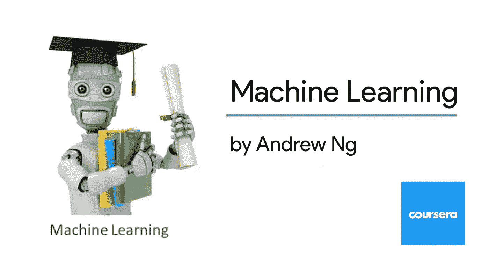

# 吴恩达机器学习课程的 Python 实现(上)

> 原文：<https://medium.com/analytics-vidhya/python-implementation-of-andrew-ngs-machine-learning-course-part-1-6b8dd1c73d80?source=collection_archive---------1----------------------->



几个月前，我有机会完成了[吴恩达](https://medium.com/u/592ce2a67248?source=post_page-----6b8dd1c73d80--------------------------------)在 Coursera 上教授的机器学习 MOOC。对于任何想进入人工智能/人工智能世界的人来说，这是一个非常好的介绍。但是问题是…这门课是用八度音程授课的。

我一直在想，如果这门课是用 Python 写的，会有多神奇。我最终决定重新上这门课，但只有这一次，我将完成 Python 的编程作业。

在这一系列的博客文章中，我计划写一下课程中使用的 Python 版本的编程练习。我这样做有几个原因:

1.  它将帮助任何想要 Python 版本课程的人(也包括我)
2.  它有望让那些愿意学习他们已经熟悉的算法的 Pythonic 实现的用户受益

> **先决条件**
> 
> 强烈建议您首先观看[第 1 周](https://www.coursera.org/learn/machine-learning/home/week/1)视频讲座。
> 
> 应该对 Python 生态系统有基本的了解。

在这一节，我们将看看最简单的机器学习算法。

## **一元线性回归**

> 首先是问题陈述的一些背景。
> 
> 这里我们将实现一个变量的线性回归来预测一辆食品车的利润。假设你是一家特许经营餐厅的首席执行官，正在考虑在不同的城市开设新的分店。该连锁店已经在各个城市有了卡车，而且你有了这些城市的利润和人口数据。

文件 ex1data1.txt(可在第 2 周的作业材料中找到)包含我们线性回归练习的数据集。第一列是一个城市的人口，第二列是该城市一辆快餐车的利润。利润为负值表示亏损。

首先，与执行任何机器学习任务一样，我们需要导入某些库。

```
import numpy as np
import pandas as pd
import matplotlib.pyplot as plt
```

**读取并绘制数据**

在开始任何任务之前，通过可视化来理解数据通常是有用的。对于此数据集，您可以使用散点图来可视化数据，因为它只有两个属性可以绘制(利润和人口)。

*(现实生活中你会遇到的很多其他问题都是多维的，无法在二维图上绘制出来。为了创造多维的情节，你必须创造性地运用各种美学，如颜色、形状、深度等。*

```
data = pd.read_csv('ex1data1.txt', header = None) #read from dataset
X = data.iloc[:,0] # read first column
y = data.iloc[:,1] # read second column
m = len(y) # number of training example
data.head() # view first few rows of the data
```


这里我们使用 pandas `read_csv`函数来读取逗号分隔的值。此外，我们使用了`head`函数来查看数据的前几行。

```
plt.scatter(X, y)
plt.xlabel('Population of City in 10,000s')
plt.ylabel('Profit in $10,000s')
plt.show()
```


**增加截距项**

在接下来的几行中，我们向数据中添加了另一个维度来容纳截距项(这样做的原因在视频中有解释)。我们还初始化初始参数`theta`到`0`和学习率`alpha`到`0.01`。

```
X = X[:,np.newaxis]
y = y[:,np.newaxis]
theta = np.zeros([2,1])
iterations = 1500
alpha = 0.01
ones = np.ones((m,1))
X = np.hstack((ones, X)) # adding the intercept term
```

**关于 np.newaxis 的注释:**当您将数据读入 X，y 时，您会发现 X，y 是秩 1 数组。秩 1 的数组将具有(m，1)的形状，而秩 2 的数组将具有(m，1)的形状。当操作数组时，最好将秩 1 的数组转换为秩 2 的数组，因为秩 1 的数组通常会产生意想不到的结果。
为了将秩 1 转换为秩 2，我们使用了`someArray[:,np.newaxis]`。

接下来我们将计算成本和梯度下降。吴恩达在视频讲座中很好地解释了如何做到这一点。我只是为吴恩达在演讲中使用的伪代码提供 Python 代码。

**计算成本**

```
def computeCost(X, y, theta):
    temp = np.dot(X, theta) - y
    return np.sum(np.power(temp, 2)) / (2*m)J = computeCost(X, y, theta)
print(J)
```

您应该会看到`32.07`的成本。

**使用梯度下降法寻找最佳参数**

```
def gradientDescent(X, y, theta, alpha, iterations):
    for _ in range(iterations):
        temp = np.dot(X, theta) - y
        temp = np.dot(X.T, temp)
        theta = theta - (alpha/m) * temp
    return thetatheta = gradientDescent(X, y, theta, alpha, iterations)
print(theta)
```

预期的`theta`值`[-3.6303, 1.1664]`

我们现在有了`theta`的优化值。在上述成本函数中使用该值。

```
J = computeCost(X, y, theta)
print(J)
```

它应该给你一个值`4.483` ，比`32.07`好得多

**显示最佳拟合线的图**

```
plt.scatter(X[:,1], y)
plt.xlabel('Population of City in 10,000s')
plt.ylabel('Profit in $10,000s')
plt.plot(X[:,1], np.dot(X, theta))
plt.show()
```


让我们将线性回归的概念扩展到多个独立变量。

**多元线性回归**

在本节中，我们将实现多个变量的线性回归(也称为多元线性回归)。

> 问题背景:
> 
> 假设你正在出售你的房子，你想知道一个好的市场价格是多少。一种方法是首先收集最近出售的房屋信息，并制作一个房价模型。你的工作是根据其他变量预测房价。

文件 ex1data2.txt((可在第 2 周的作业材料中找到))包含俄勒冈州波特兰市的一组房屋价格训练集。第一栏是房子的大小(平方英尺)，第二栏是卧室的数量，第三栏是房子的价格。

您已经拥有了我们在上一节中构建的必要基础设施，这些基础设施也可以很容易地应用于本节。这里我们将只使用我们在上一节中建立的方程。

```
import numpy as np
import pandas as pddata = pd.read_csv('ex1data2.txt', sep = ',', header = None)
X = data.iloc[:,0:2] # read first two columns into X
y = data.iloc[:,2] # read the third column into y
m = len(y) # no. of training samples
data.head()
```


从上面可以看出，我们在这里处理的独立变量不止一个(但是你在前面章节学到的概念在这里也适用)。

**特征归一化**

通过查看这些值，注意到房子的大小大约是卧室数量的 1000 倍。当要素相差数量级时，首先执行要素缩放可以使梯度下降收敛得更快。

我们的任务是:

*   从数据集中减去每个要素的平均值。
*   减去平均值后，将特征值除以各自的“标准偏差”

```
X = (X - np.mean(X))/np.std(X)
```

**添加截距项并初始化参数**

(下面的代码类似于我们在上一节中所做的)

```
ones = np.ones((m,1))
X = np.hstack((ones, X))
alpha = 0.01
num_iters = 400
theta = np.zeros((3,1))
y = y[:,np.newaxis]
```

**计算成本**

```
def computeCostMulti(X, y, theta):
    temp = np.dot(X, theta) - y
    return np.sum(np.power(temp, 2)) / (2*m)
J = computeCostMulti(X, y, theta)
print(J)
```

你应该会看到`65591548106.45744`的成本。

**使用梯度下降寻找最佳参数**

```
def gradientDescentMulti(X, y, theta, alpha, iterations):
    m = len(y)
    for _ in range(iterations):
        temp = np.dot(X, theta) - y
        temp = np.dot(X.T, temp)
        theta = theta - (alpha/m) * temp
    return theta
theta = gradientDescentMulti(X, y, theta, alpha, num_iters)
print(theta)
```

您的最佳参数将是`[[334302.06399328],[ 99411.44947359], [3267.01285407]]`

我们现在有了`theta`的优化值。在上述成本函数中使用该值。

```
J = computeCostMulti(X, y, theta)
print(J)
```

这应该给你一个`2105448288.6292474`的值，比`65591548106.45744`好得多

你现在已经学会了如何用一个或多个独立变量进行线性回归。干得好！

这个帖子到此为止。如果你喜欢我的作品，请给我一个(或几个)掌声。

您可以在这里找到本系列的其他文章

*   [逻辑回归](/analytics-vidhya/python-implementation-of-andrew-ngs-machine-learning-course-part-2-1-1a666f049ad6)(第 2.1 部分)
*   [正则化逻辑回归](/analytics-vidhya/python-implementation-of-andrew-ngs-machine-learning-course-part-2-2-dceff1a12a12)(第 2.2 部分)