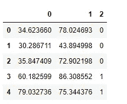
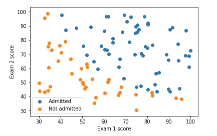
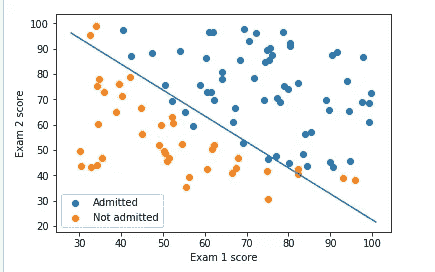

# 吴恩达机器学习课程的 Python 实现(第 2.1 部分)

> 原文：<https://medium.com/analytics-vidhya/python-implementation-of-andrew-ngs-machine-learning-course-part-2-1-1a666f049ad6?source=collection_archive---------1----------------------->


在我的[上一篇文章](/analytics-vidhya/python-implementation-of-andrew-ngs-machine-learning-course-part-1-6b8dd1c73d80)中，我们已经讨论了作为第一周和第二周编程作业的一部分的单个和多个独立变量的线性回归的 Pythonic 实现。现在我们将转到第 3 周的内容，即逻辑回归。

既然这将是一篇相当长的文章，我将把这篇文章分成两部分。请注意第 2.2 部分，该部分探讨了如何解决过度拟合问题。

如果你是新来的，我鼓励你阅读我以前的帖子

[吴恩达机器学习教程的 Python 实现(上)](/analytics-vidhya/python-implementation-of-andrew-ngs-machine-learning-course-part-1-6b8dd1c73d80)

> 先决条件
> 
> *强烈建议您首先观看第三周*[](https://www.coursera.org/learn/machine-learning/home/week/3)**视频讲座。**
> 
> **应该对 Python 生态系统有基本的了解。**

*在这里，我们将研究业界使用最广泛的 ML 算法之一。*

***逻辑回归***

*在这部分练习中，您将构建一个逻辑回归模型来预测学生是否被大学录取。*

> *问题背景*
> 
> *假设你是一个大学部门的管理人员，你想根据每个申请人两次考试的成绩来决定他们被录取的机会。您有以前申请者的历史数据，可以用作逻辑回归的训练集。对于每个培训示例，您都有申请人的两次考试成绩和录取决定。*
> 
> *你的任务是建立一个分类模型，根据这两次考试的分数来估计申请人的录取概率。*

*首先让我们加载必要的库。*

```
*import numpy as np
import pandas as pd
import matplotlib.pyplot as plt
import scipy.optimize as opt    # more on this later*
```

*接下来，我们读取数据(必要的数据可在 [week-3](https://www.coursera.org/learn/machine-learning/home/week/3) content 下获得)*

```
*data = pd.read_csv('ex2data1.txt', header = None)
X = data.iloc[:,:-1]
y = data.iloc[:,2]
data.head()*
```

**

*所以我们有两个独立特征和一个因变量。这里的`0`表示考生未能被录取，而`1`则相反。*

***可视化数据***

*在开始实现任何学习算法之前，如果可能的话，可视化数据总是好的。*

```
*mask = y == 1
adm = plt.scatter(X[mask][0].values, X[mask][1].values)
not_adm = plt.scatter(X[~mask][0].values, X[~mask][1].values)
plt.xlabel('Exam 1 score')
plt.ylabel('Exam 2 score')
plt.legend((adm, not_adm), ('Admitted', 'Not admitted'))
plt.show()*
```

**

***实施***

*在开始实际成本函数之前，回想一下逻辑回归假设使用了 sigmoid 函数。让我们定义我们的 sigmoid 函数。*

***乙状结肠功能***

```
*def sigmoid(x):
  return 1/(1+np.exp(-x))*
```

*注意，这里我们写的是矢量化代码。所以不管`x`是标量、矢量、矩阵还是张量都没关系；-).当然，编写和理解矢量化代码需要一些思考(经过一些练习后，任何人都会变得很擅长)。然而，它消除了循环的*，也有助于高效和通用的代码。**

***成本函数***

*让我们实现逻辑回归的成本函数。*

```
*def costFunction(theta, X, y):
    J = (-1/m) * np.sum(np.multiply(y, np.log(sigmoid(X @ theta))) 
        + np.multiply((1-y), np.log(1 - sigmoid(X @ theta))))
    return J*
```

*注意，我们在上面的`costFunction`中使用了`sigmoid`函数。*

> *编码成本函数有多种方法。更重要的是潜在的数学思想和我们将它们转化为代码的能力。*

***渐变功能***

```
*def gradient(theta, X, y):
    return ((1/m) * X.T @ (sigmoid(X @ theta) - y))*
```

*请注意，虽然此梯度看起来与线性回归梯度相同，但公式实际上是不同的，因为线性和逻辑回归对假设函数有不同的定义。*

*让我们用初始参数调用这些函数。*

```
*(m, n) = X.shape
X = np.hstack((np.ones((m,1)), X))
y = y[:, np.newaxis]
theta = np.zeros((n+1,1)) # intializing theta with all zerosJ = costFunction(theta, X, y)
print(J)*
```

*这应该给我们一个 j 的值`0.693`。*

***使用 fmin_tnc 学习参数***

*在[之前的任务](/analytics-vidhya/python-implementation-of-andrew-ngs-machine-learning-course-part-1-6b8dd1c73d80)中，我们通过实施梯度下降算法找到了线性回归模型的最佳参数。我们写了一个成本函数，并计算了它的梯度，然后采取梯度下降步骤。这一次，我们将使用`scipy` 库中的内置函数`fmin_tnc`，而不是采用梯度下降的步骤。*

*`fmin_tnc`是一个优化求解器，可找到无约束函数的最小值。对于逻辑回归，您希望使用参数`theta`优化成本函数。*

> *优化中的约束通常是指对参数的约束。例如，限制可能值`theta`的约束可以取值(例如`theta` ≤ 1)。逻辑回归没有这样的约束，因为`theta`允许取任何实数值。*

*具体来说，在给定固定数据集(X 和 y 值)的情况下，您将使用`fmin_tnc`找到逻辑回归成本函数的最佳或最优参数`theta`。您将向`fmin_tnc` 传递以下输入:*

*   *我们试图优化的参数的初始值。*
*   *一个函数，当给定训练集和特定的`theta`时，计算数据集(X，y)相对于`theta` 的逻辑回归成本和梯度。*

```
*temp = opt.fmin_tnc(func = costFunction, 
                    x0 = theta.flatten(),fprime = gradient, 
                    args = (X, y.flatten()))
#the output of above function is a tuple whose first element #contains the optimized values of theta
theta_optimized = temp[0]
print(theta_optimized)*
```

> **关于* `[*flatten()*](https://docs.scipy.org/doc/numpy/reference/generated/numpy.ndarray.flatten.html)` *功能的说明:不幸的是* `*scipy’s fmin_tnc*` *不能很好地与列或行向量一起工作。它要求参数采用数组格式。* `*flatten()*` *函数将一个列或行向量缩小成数组格式。**

*上面的代码应该给`[-25.16131862, 0.20623159, 0.20147149]`。*

*如果您已经正确地完成了`costFunction` ，那么`fmin_tnc`将收敛到正确的优化参数，并返回`theta`的最终值。请注意，通过使用`fmin_tnc`，您不必自己编写任何循环，也不必像梯度下降那样设置学习速率。这都是由`fmin_tnc` :-)完成的，你只需要提供一个计算成本和梯度的函数。*

*让我们使用这些优化的`theta`值来计算成本。*

```
*J = costFunction(theta_optimized[:,np.newaxis], X, y)
print(J)*
```

*您应该会看到一个值`0.203`。将此与使用初始`theta`获得的成本`0.693` 进行比较。*

***绘制决定边界(可选)***

*这个最终的`theta`值将用于在训练数据上绘制决策边界，产生一个类似于下图的图。*

```
*plot_x = [np.min(X[:,1]-2), np.max(X[:,2]+2)]
plot_y = -1/theta_optimized[2]*(theta_optimized[0] 
          + np.dot(theta_optimized[1],plot_x)) mask = y.flatten() == 1
adm = plt.scatter(X[mask][:,1], X[mask][:,2])
not_adm = plt.scatter(X[~mask][:,1], X[~mask][:,2])
decision_boun = plt.plot(plot_x, plot_y)
plt.xlabel('Exam 1 score')
plt.ylabel('Exam 2 score')
plt.legend((adm, not_adm), ('Admitted', 'Not admitted'))
plt.show()*
```

**

*看起来我们的模型在区分被录取的学生和没被录取的学生方面做得很好。现在让我们量化我们的模型精度，为此我们将写一个函数，名为`accuracy`*

```
*def accuracy(X, y, theta, cutoff):
    pred = [sigmoid(np.dot(X, theta)) >= cutoff]
    acc = np.mean(pred == y)
    print(acc * 100)accuracy(X, y.flatten(), theta_optimized, 0.5)*
```

*这应该给我们一个`89%`的准确度分数。嗯…还不错。*

*你现在已经学会了如何进行逻辑回归。干得好！*

*这个帖子到此为止。如果你喜欢我的作品，请给我一个(或几个)掌声。*

*你可以在这里找到这个系列的下一篇文章。*