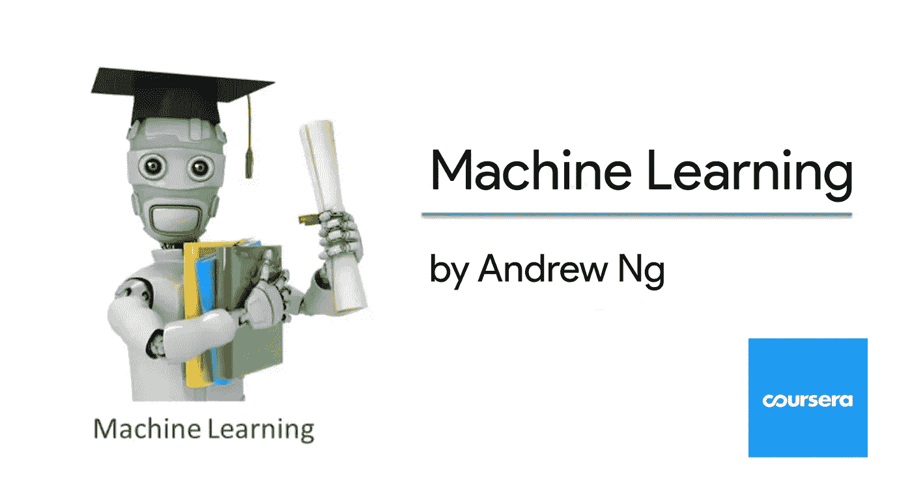
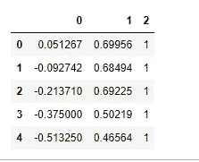
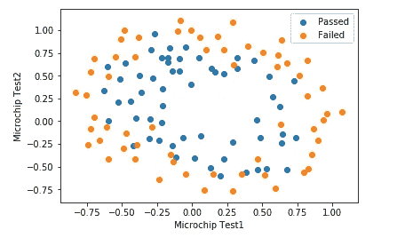
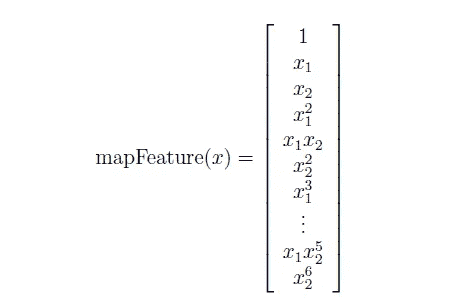
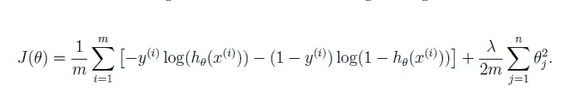
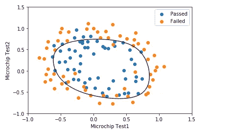

# 吴恩达机器学习课程的 Python 实现(第 2.2 部分)

> 原文：<https://medium.com/analytics-vidhya/python-implementation-of-andrew-ngs-machine-learning-course-part-2-2-dceff1a12a12?source=collection_archive---------0----------------------->



到目前为止，这是一个非常受欢迎的系列，我非常感谢你们所有人阅读它。查看下面以前的文章(以防你还没有涉及到它们):

*   [一元和多元线性回归](/analytics-vidhya/python-implementation-of-andrew-ngs-machine-learning-course-part-1-6b8dd1c73d80)(上)
*   [逻辑回归或分类](/analytics-vidhya/python-implementation-of-andrew-ngs-machine-learning-course-part-2-1-1a666f049ad6)(第 2.1 部分)

继续我们的吴恩达课程的 Pythonic 版本的旅程，在这篇博文中，我们将学习正则化逻辑回归。

> **先决条件**
> 
> 强烈建议您首先观看[第 3 周](https://www.coursera.org/learn/machine-learning/home/week/3)视频讲座，并完成视频测验。
> 
> 应该对 Python 生态系统有基本的了解。

**正则化逻辑回归**

> 问题背景
> 
> 您将实现正则化逻辑回归来预测来自制造厂的微芯片是否通过质量保证(QA)。在质量保证过程中，每个微芯片都要经过各种测试，以确保其功能正常。
> 
> 假设你是工厂的产品经理，你有一些微芯片在两次不同测试中的测试结果。从这两个测试中，你想要决定微芯片是应该被接受还是被拒绝。为了帮助你做决定，你有一个过去微芯片测试结果的数据集，从中你可以建立一个逻辑回归模型。

首先让我们加载必要的库。

```
import numpy as np
import pandas as pd
import matplotlib.pyplot as plt
import scipy.optimize as opt    # more on this later
```

接下来，我们读取数据(必要的数据可在 [week-3](https://www.coursera.org/learn/machine-learning/home/week/3) content 下获得)

```
data = pd.read_csv('ex2data2.txt', header = None)
X = data.iloc[:,:-1]
y = data.iloc[:,2]
data.head()
```



所以我们有两个独立特征和一个因变量。这里`0`表示芯片被拒绝，`1`表示被接受。

**可视化数据**

在开始实现任何学习算法之前，如果可能的话，可视化数据总是好的。

```
mask = y == 1
passed = plt.scatter(X[mask][0].values, X[mask][1].values)
failed = plt.scatter(X[~mask][0].values, X[~mask][1].values)
plt.xlabel('Microchip Test1')
plt.ylabel('Microchip Test2')
plt.legend((passed, failed), ('Passed', 'Failed'))
plt.show()
```



上图显示，我们的数据集不能被穿过图的直线分成正例与反例。因此，逻辑回归的直接应用将不会在该数据集上很好地执行，因为逻辑回归将只能找到线性决策边界。

**特征映射**

更好地拟合数据的一种方法是从每个数据点创建更多的要素。因此，我们将把这些特征映射到所有的多项式项`x1`和 `x2`的六次方。



作为这种映射的结果，我们的两个特征的向量(两个 QA 测试的分数)已经被转换成 28 维向量。在这个更高维特征向量上训练的逻辑回归分类器将具有更复杂的决策边界，并且当在我们的二维图中绘制时将呈现非线性。

虽然特征映射允许我们构建更具表现力的分类器，但它也更容易过度拟合。在练习的下一部分，您将实现正则化逻辑回归来拟合数据，并亲自了解正则化如何帮助解决过度拟合问题。

```
def mapFeature(X1, X2):
    degree = 6
    out = np.ones(X.shape[0])[:,np.newaxis]
    for i in range(1, degree+1):
        for j in range(i+1):
            out = np.hstack((out, np.multiply(np.power(X1, i-j),                                     np.power(X2, j))[:,np.newaxis]))
    return outX = mapFeature(X.iloc[:,0], X.iloc[:,1])
```

**实施**

在开始实际成本函数之前，回想一下逻辑回归假设使用了 sigmoid 函数。让我们定义我们的 sigmoid 函数。

**乙状结肠功能**

```
def sigmoid(x):
  return 1/(1+np.exp(-x))
```

**成本函数**

像往常一样，让我们编码成本函数和梯度函数。



```
def lrCostFunction(theta_t, X_t, y_t, lambda_t):
    m = len(y_t)
    J = (-1/m) * (y_t.T @ np.log(sigmoid(X_t @ theta_t)) + (1 - y_t.T) @ np.log(1 - sigmoid(X_t @ theta_t)))
    reg = (lambda_t/(2*m)) * (theta_t[1:].T @ theta_t[1:])
    J = J + reg
    return J
```

> 编码成本函数有多种方法。更重要的是潜在的数学思想和我们将它们转化为代码的能力。

**渐变功能**

```
def lrGradientDescent(theta, X, y, lambda_t):
    m = len(y)
    grad = np.zeros([m,1])
    grad = (1/m) * X.T @ (sigmoid(X @ theta) - y)
    grad[1:] = grad[1:] + (lambda_t / m) * theta[1:]
    return grad
```

让我们用初始参数调用这些函数。

```
(m, n) = X.shape
y = y[:, np.newaxis]
theta = np.zeros((n,1))
lmbda = 1J = lrCostFunction(theta, X, y, lmbda)
print(J)
```

这给了我们一个值`0.69314718`。

**使用 fmin_tnc 学习参数**

与之前的帖子类似，我们将使用`fmin_tnc`

`fmin_tnc`是一个优化求解器，可以找到一个无约束函数的最小值。对于逻辑回归，您希望使用参数`theta`优化成本函数。

```
output = opt.fmin_tnc(func = lrCostFunction, x0 = theta.flatten(), fprime = lrGradientDescent, \
                         args = (X, y.flatten(), lmbda))
theta = output[0]
print(theta) # theta contains the optimized values
```

> 关于`[flatten()](https://docs.scipy.org/doc/numpy/reference/generated/numpy.ndarray.flatten.html)`函数的说明:不幸的是`scipy’s fmin_tnc` 不能很好地处理列或行向量。它要求参数采用数组格式。`flatten()`函数将一个列或行向量简化为数组格式。

**模型精度**

让我们通过从我们学习的参数预测结果，然后与原始结果进行比较，来尝试找到模型的准确性。

```
pred = [sigmoid(np.dot(X, theta)) >= 0.5]
np.mean(pred == y.flatten()) * 100
```

这使得我们的模型精度为`83.05%`。

**标绘决定边界(可选)**

为了帮助您可视化该分类器所学习的模型，我们将绘制(非线性)决策边界来分隔正例和负例。我们通过在均匀间隔的网格上计算分类器的预测来绘制非线性决策边界，然后绘制预测从 y = 0 变化到 y = 1 的等高线图。

```
u = np.linspace(-1, 1.5, 50)
v = np.linspace(-1, 1.5, 50)
z = np.zeros((len(u), len(v)))def mapFeatureForPlotting(X1, X2):
    degree = 6
    out = np.ones(1)
    for i in range(1, degree+1):
        for j in range(i+1):
            out = np.hstack((out, np.multiply(np.power(X1, i-j), np.power(X2, j))))
    return outfor i in range(len(u)):
    for j in range(len(v)):
        z[i,j] = np.dot(mapFeatureForPlotting(u[i], v[j]), theta)mask = y.flatten() == 1
X = data.iloc[:,:-1]
passed = plt.scatter(X[mask][0], X[mask][1])
failed = plt.scatter(X[~mask][0], X[~mask][1])
plt.contour(u,v,z,0)
plt.xlabel('Microchip Test1')
plt.ylabel('Microchip Test2')
plt.legend((passed, failed), ('Passed', 'Failed'))
plt.show()
```



我们的模型在对各种数据点进行分类方面做得非常好。

还可以尝试改变`lambda`的值，亲自看看决策边界是如何变化的。

谢谢你坚持到现在。如果你喜欢我的作品，给我一个(或几个)掌声。

本系列的下一篇文章将会非常有趣，因为我们将[构建一个识别手写数字的模型](/analytics-vidhya/a-guide-to-using-logistic-regression-for-digit-recognition-with-python-codes-86aae6da10fe)。