# Python 输入、输出和导入:

> 原文：<https://medium.com/analytics-vidhya/python-input-output-and-import-d8c0ce26d1f?source=collection_archive---------17----------------------->

## Python 输入:

到目前为止，我们的程序是静态的，值被定义为变量。在某些情况下，用户可能想输入变量的值，这允许灵活性。Python 有 input()函数来执行此操作。

*语法:*

输入([屏幕上显示的字符串])

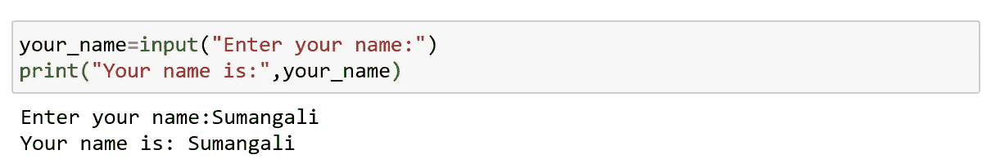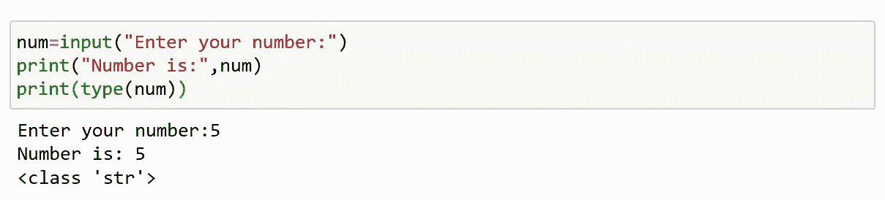

这里我们可以清楚地看到，python 习惯性地把用户给出的输入值作为字符串。要转换它，我们可以使用 int()或 float()函数。

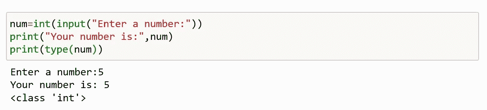

***使用 eval():***

如果输入是字符串，它可以计算表达式。

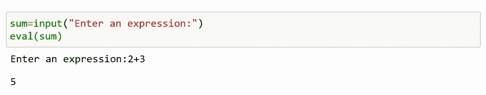

**接受多个输入:**

拆分()

列表理解

**使用 split():**

该功能有助于从用户处获得多个输入。它用指定的分隔符分隔给定的输入。如果没有分隔符，任何空白都被认为是分隔符。

*语法:*

输入()。拆分(分隔符，最大拆分)

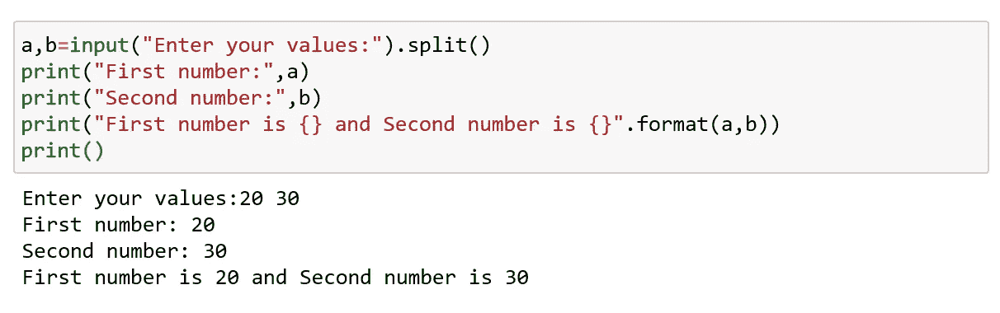

一次接受两个输入

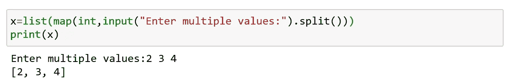

使用 list()接受多个输入并进行类型转换

**使用列表理解:**

列表理解通常用于在 python 中创建列表，但也用于从用户那里获得多个输入。[]

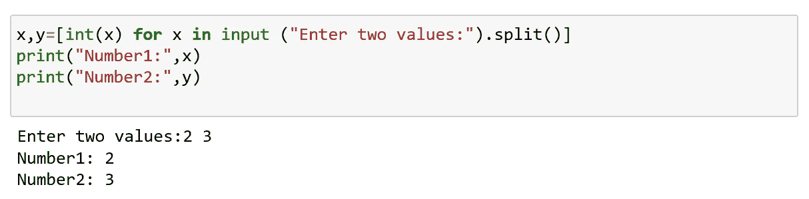

一次接受两个输入

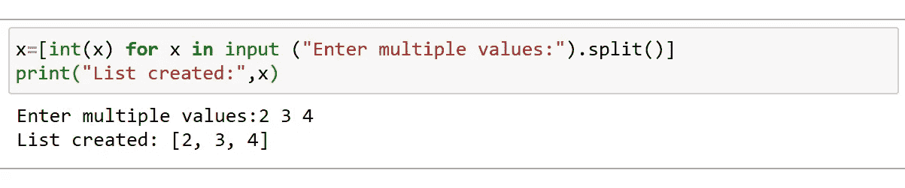

取多个值

## Python 导入:

当你的程序越来越深时，我们不能一直为我们需要执行的每一个动作编写代码。所以实际上，我们把程序分成不同的模块。Python 有各种模块和库。这些模块包含 python 定义和语句。

一个模块中的定义可以导入到另一个模块或 python 中的交互式解释器中。我们使用 import 关键字来执行此操作。

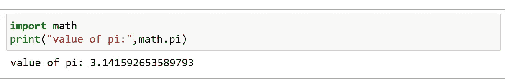

现在，数学模块中的所有定义对我们来说都很方便。当你只需要一个特定的功能时，使用关键字中的*。*

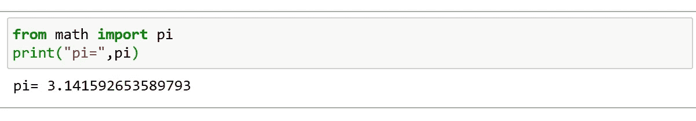

## Python 输出:

为了在屏幕上输出数据，我们使用 print()函数。

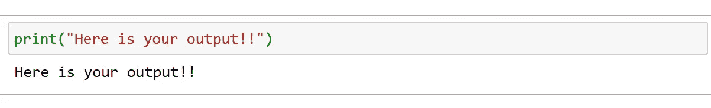

*语法:*

print(*object，sep= " "，end= "，file=sys.stdout，flush=False)

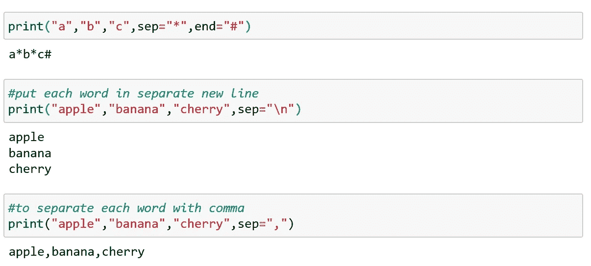

**使用 format()输出格式:**

为了让你的输出看起来更容易，你必须格式化输出的实际外观。这可以使用*来完成。格式()*

这可以用于任何字符串对象。

大括号{}用作占位符。

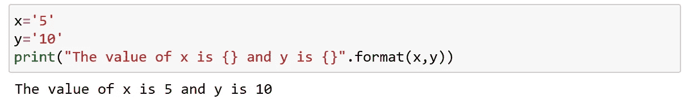

我们也可以使用关键字参数来格式化字符串。

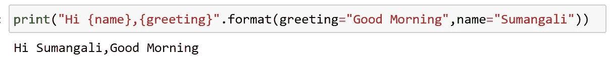

Python 让我们的工作变得简单。

快乐编码…😊😊😊