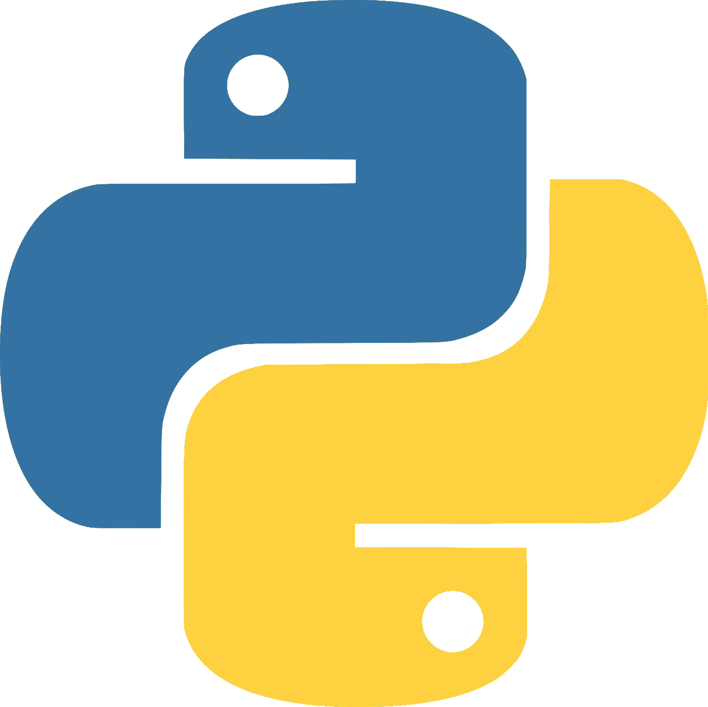
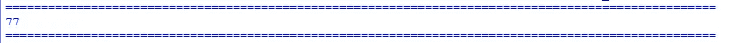
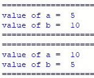
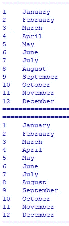
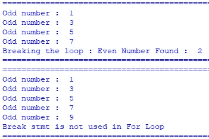
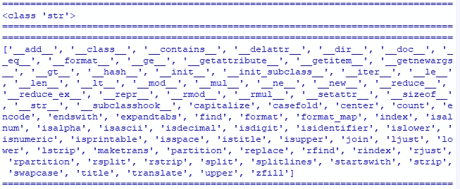
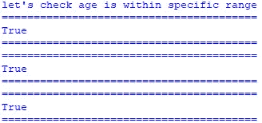
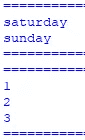
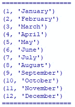

# Python 充满了惊喜！

> 原文：<https://medium.com/analytics-vidhya/python-is-full-of-surprises-3e2e9b4f88af?source=collection_archive---------4----------------------->



# 这里有 8 个有趣的——可能令人惊讶的——Python 特性。

## 1.找出一个对象占用了多少内存。

*   每当你试图找出你的程序吃掉所有可用内存的原因时，这就派上了用场。
*   您可以使用 getSizeof()函数来确定对象的大小

```
import syss = " Python is full of surprise "print("=="*50)
print(sys.getsizeof(s))
print("=="*50)
```

输出:



## 2.就地交换变量

*   大多数时候，当我们开始学习任何新的编程语言时。我们将做这个练习来交换变量的值。
*   大多数情况下，我们使用一些临时变量来存档
*   但是 python 不需要临时变量。

```
a = 5
b = 10print("=="*50)
print("value of a = ",a)
print("value of b = ",b)
print("=="*50)a,b = b,aprint("=="*50)
print("value of a = ",a)
print("value of b = ",b)
print("=="*50)
```

输出:



## 3.使用枚举内置函数

*   使用 Python 的 enumerate 内置函数，我们可以循环遍历元素列表，并获得一个自动计数器，而不需要额外的变量。

```
months = [  'January','February','March','April',
            'May','June','July','August',
            'September','October','November','December'
        ]
#normal approach
count = 1
print("=="*20)
for month in months:
    print("{0:<4} {1:<25}".format(count,month) )
    count+=1
print("=="*20)#use of enumerate
print("=="*20)
for count,month in enumerate(months,1):
    print("{0:<4} {1:<25}".format(count,month) )
print("=="*20)
```

输出:



## 4.在 for 循环中使用 else 子句。

*   您可以在 for 循环中添加“else”子句，它将在循环正常完成后执行。
*   如果循环找到“break”语句，则“else”子句不会执行。

```
a = [1,3,5,7,2]
print("=="*30)
for i in a:
    if i%2 == 0:
        print("Breaking the loop : Even Number Found : ",i)
        break
    else:
        print("Odd number : ",i)
else:
    print("Brek stmt is not used in For Loop")
print("=="*30)b = [1,3,5,7,9]
print("=="*30)
for i in b:
    if i%2 == 0:
        print("Even Number Found : ",i)
        break
    else:
        print("Odd number : ",i)
else:
    print("Break stmt is not used in For Loop")
print("=="*30)
```

输出:



## 5.了解一个模块能提供什么

*   使用内置函数 dir()可以返回任何对象的属性和方法列表。
*   当你试图弄清楚如何做某事并需要知道对象是否支持它时，这非常有用。

```
s = " Hello Python"print("=="*40)
print(type(s))
print("=="*40)print("=="*40)
print(dir(s))
print("=="*40)
```

输出:



## 6.让你的条件更具可读性

*   您可以在 Python 中链接条件运算符，使表达式看起来更自然。
*   在评估它们时，请记住所有的比较操作都具有相同的优先级。

```
age = 10print("let's check age is within specific range or not")
print("=="*20)
print(1 <= age <= 18)
print("=="*20)print("=="*20)
print(1<= age and age <= 18)
print("=="*20)age = 19
print("=="*20)
print(age >= 18 and age <= 25)
print("=="*20)
```

输出:



## 7.从函数中返回多个值

*   您可以从一个函数返回多个值，而无需创建单独的结构来存储这些值。

```
def weekend_days():
    return "saturday","sunday"sat,sun = weekend_days()print("=="*10)
print(sat)
print(sun)
print("=="*10)def numbers():
    return 1,2,3x,y,z = numbers()print("=="*10)
print(x)
print(y)
print(z)
print("=="*10)
```

输出:



## 8.聚合多个序列中的元素

*   每当您有多个序列并且想要并行遍历它们时，您可以使用 zip()将它们聚集在一起。

```
months = [  'January','February','March','April',
            'May','June','July','August',
            'September','October','November','December'
        ]numbers = [1,2,3,4,5,6,7,8,9,10,11,12]print("=="*9)
for i in zip(numbers,months):
    print(i)
print("=="*9)
```

输出:



Python 有许多有趣的特性。我们将在其他文章中讨论更多有趣的特性。

要下载代码，请访问以下链接:

[https://github . com/Raj 1997/Python-Mini-Projects/tree/master/Python % 20 趣味% 20 特色](https://github.com/raj1997/Python-Mini-Projects/tree/master/Python%20Interesting%20Features)

参考:

【https://twitter.com/svpino/status/1310439090073071617?s=20 号