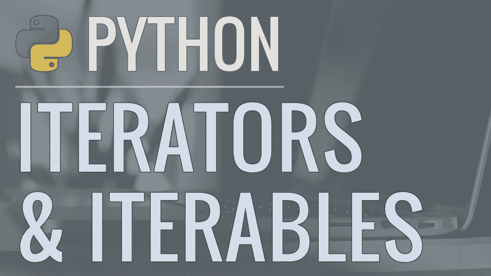
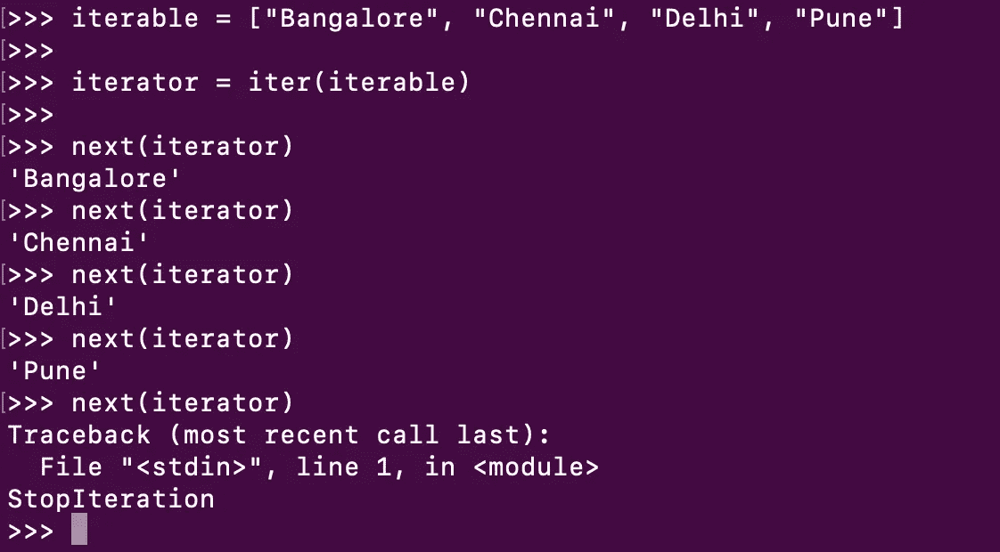

# Python 迭代器和可迭代对象

> 原文：<https://medium.com/analytics-vidhya/python-iterators-and-iterables-b74161c372c6?source=collection_archive---------14----------------------->



For 循环和 Comprehensions 用于遍历一个源(列表、字典或集合)，一个接一个地挑选项目并对其执行一些操作。但是有时需要更细粒度的控制。有两个重要的概念，大量的 Python 语言行为都是基于这两个概念构建的。这些是可迭代对象和迭代器对象。基本上，可迭代对象是那些可以循环的对象。示例包括列表、字符串和元组。

使用内置的 **iter()** 函数将可迭代对象转换为迭代器对象。

```
iterator = iter(iterable)
```

迭代器对象可以传递给内置的 **next()** 函数来获取下一项。

```
item = next(iterator)
```

我们可以通过 Python REPL 的一个简单例子来理解这一点。



在上面的例子中，我们首先创建了一个列表，它是一个 iterable 对象。接下来，我们将这个列表传递给内置的 **iter()** 函数，这个函数给了我们一个迭代器对象。现在我们可以使用 **next()** 函数来遍历这个迭代器对象。每次调用 next()函数时，它都会从第一项开始给出列表中的下一项。注意，当我们在迭代完所有项目后调用 next()函数时，我们会得到一个 **StopIteration** 异常。

在第二个例子中，我们将看到我们可以将一个 iterable 对象作为参数传递给一个方法。

```
def first(iterable):
    iterator = iter(iterable)
    try:
        return next(iterator)
    except StopIteration:
        raise ValueError("iterable is empty")print(first(["1st", "2nd", "3rd"]))
print(first({"1st", "2nd", "3rd"}))
print(first(set()))
```

在上面的代码中，一个列表或集合的 iterable 被传递给 **first()** 方法。因为每次用新的 iterable 对象调用 first()方法时，都会创建一个新的 iterator 对象。在 try 块中，对这个 iterator 对象调用 next()方法，它总是返回 iterable(列表、集合等)中的第一项。)对象。上面代码的输出是，

```
1st
2nd
Traceback (most recent call last):
File "iterator.py", line 4, in first
return next(iterator)
StopIterationDuring handling of the above exception, another exception occurred:Traceback (most recent call last):
File "iterator.py", line 10, in <module>
print(first(set()))
File "iterator.py", line 6, in first
raise ValueError("iterable is empty")
ValueError: iterable is empty
```

因为在最后一次调用中，我们将一个空集传递给了 first()函数，它引发了一个 **StopIteration** 异常，该异常在 except 块中处理。它会引发 ValueError 并打印错误消息。

注意，诸如 for 循环和 comprehensions 之类的高级结构是直接建立在这个低级迭代协议之上的。

感谢阅读😊