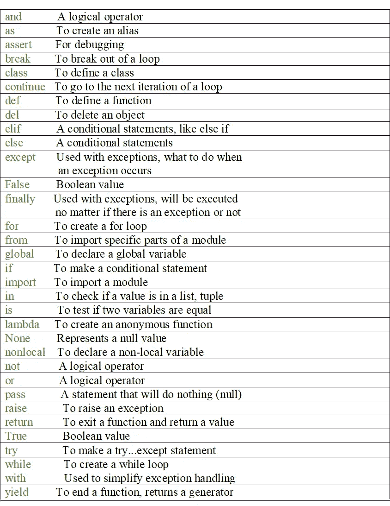
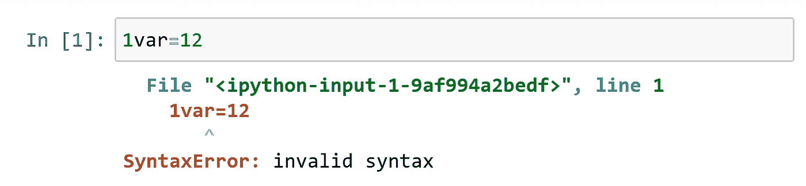
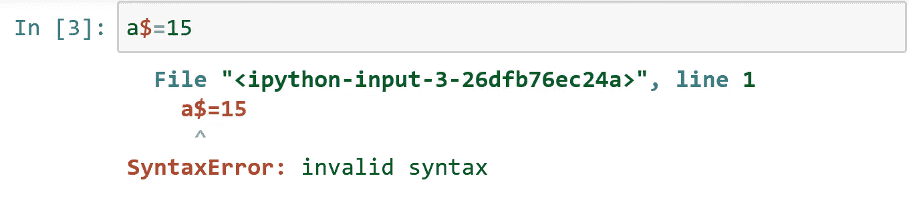

# Python 关键字和标识符

> 原文：<https://medium.com/analytics-vidhya/python-keywords-and-identifiers-6e515201d1fe?source=collection_archive---------16----------------------->

**Python 关键词:**

关键字是 python 中的保留字。这些保留字不能用作函数名、变量名或任何其他标识符。

关键词是具有特定用途的特殊词语。它们通常用于定义程序的语法和结构。

关键字区分大小写。

下面列出了所有关键字:

在 python 中，关键字以绿色突出显示。

python 3.7 中有 33 个关键字，这可能会随着版本的更新而变化。如果你已经注意到，你一定已经看到所有的关键字都是小写的，除了“真”、“假”和“无”。这 3 个不是小写的关键字必须按原样书写。

**Python 标识符:**

标识符是给予类、函数、变量等实体的名称。它有助于区分一个实体和另一个实体。

标识符是用户定义的名称，但它有一些规则要遵循:

1.它可以是小写或大写字母、数字或下划线(_)的组合。例:myclass，Mydata，var_1 都有说服力。

2.标识符不能以数字开头。

示例:1var 无效。

3.其他特殊字符如@、#、$、%、^都是没有根据的。除了下划线(_)

4.标识符可以是任意长度。多个单词可以用下划线隔开。例如:我的当前地址。

在这篇文章中，你学习了什么是关键词和标识符。以及需要考虑的规则。

快乐学习…😊😊😊