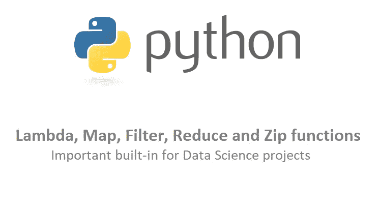

# Python: Lambda，Map，Filter，Reduce 和 Zip 函数

> 原文：<https://medium.com/analytics-vidhya/python-lambda-map-filter-reduce-and-zip-functions-73556a86a454?source=collection_archive---------10----------------------->

数据科学项目中最重要的内置 Python 函数



# 希腊字母的第 11 个

Lambda 用于创建小函数，不需要将其绑定到名称(匿名)。它可以有任意数量的参数，但只有一个表达式。他们不能使用常规的 python 语句。它们总是包含一个隐式的 return 语句。

**正常功能**

```
def add(x, y):
    return x + y

print(**add(5, 10)**)Output:
15
```

**λ函数**

```
Syntax:

lambda arguments : expression
```

示例:

```
# add two parameters
add2 = lambda x, y: x + y
print(**add2(5, 10)**)# add three parameters
add3 = lambda x, y, z: x + y + z
print(**add3(5, 10, 15)**)Output:
15
30
```

注意:当 lambda 函数作为参数传递给其他函数 filter()、map()和 reduce()时，可以看出 lambda 函数的重要性。

# 地图

Map 函数有两个参数:1)函数和 2)任意数量的可迭代对象(列表、字典)。该函数应用于序列的每个元素。如果提供了多个序列，那么可迭代对象的大小应该是相同的。

```
Syntax: map(function_object, iterable_1, iterable_2, ...)
```

示例:

```
# add 3 to the parameter
def add3(x):
    return x + 3# One list [5,6,7] with normal function
print( list( **map(add3, [5,6,7])** ) )# One list [5,6,7] with lambda
print( list( **map(lambda x: x + 3, [5,6,7])** ) )# Two lists [1,2,3] and [5,6,7] with lambda
print( list( **map(lambda x, y: x + y, [1,2,3], [5,6,7])** ) )Output:
[8, 9, 10]
[8, 9, 10]
[6, 8, 10]# Dictionary objects in a list
total_marks = [
    {"user": 'john', "marks": 60},
    {"user": 'mike', "marks": 70},
    {"user": 'ken', "marks": 90},
]

print( list( **map(lambda x: x['user'], total_marks)** )) print( list( **map(lambda x: x['marks'] + 10, total_marks)** )) print( list( **map(lambda x: x['user'] == "mike", total_marks)** ))Output:
['john', 'mike', 'ken']
[70, 80, 100]
[False, True, False]
```

# 过滤器

函数返回**真**的过滤元素。

```
Syntax: filter(function_object, iterable)
```

示例:

```
print(list( **filter(lambda x: x % 2 == 0,[0,1,1,2,3,5,8,13,21,34])** ))# filter users with marks greater than 80
total_marks = [
    {**"user"**: **'john'**, **"marks"**: 60},
    {**"user"**: **'mike'**, **"marks"**: 70},
    {**"user"**: **'ken'**, **"marks"**: 90},
]print(list( **filter(lambda x: x['marks'] > 80,total_marks)** ))Output:
[0, 2, 8, 34]
[{'user': 'ken', 'marks': 90}]
```

# 减少

将函数应用于序列，并返回单个值。首先，它将函数应用于序列的前两个元素。然后将函数应用于返回值和第 3 个元素，然后再次将函数应用于返回值和第 4 个元素，依此类推..

```
Syntax: reduce(function_object, iterable)
```

示例:

```
# From python 3 onwards, reduce is moved to functools. 
# So, import it 
from functools import reduce
print( **reduce(lambda x, y: x + y, [1,2,3,4,5])** )Output:
15
```

# 活力

Zip 将每个 iterable 的第一项组合成一个元组，然后组合第二项，依此类推。

```
Syntax: zip(*iterables)
```

示例:

```
name = [**'john'**, **'mike'**, **'ken'**]
marks = [60, 70, 90]

print(list(**zip(name, marks)**))Output:
[('john', 60), ('mike', 70), ('ken', 90)]
```

**注:**

*   如果没有传递参数，zip()返回一个空迭代器。
*   如果传递了单个 iterable，zip()将返回一个 1 元素元组的迭代器。
*   如果用多个大小传递多个 iterables，那么它将返回最小大小迭代器的元组。例如，如果迭代器-1 有 5，迭代器-2 有 10，那么它将返回一个只有 5 的迭代器。

**感谢**阅读！请👏如果你喜欢这篇文章，请跟我来，因为它鼓励我写更多！