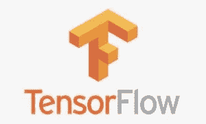

# Python 库

> 原文：<https://medium.com/analytics-vidhya/python-libraries-d73859384c43?source=collection_archive---------22----------------------->

**Python 库**是一个函数和方法的集合，允许我们在不编写代码的情况下执行许多操作。Python 中的每个**库都包含了大量有用的模块，我们可以将它们导入到我们的日常编程中。**

Python 库是您可能希望包含在程序/项目中的可重用代码块。与 C++或 C 之类的语言相比，Python 库不属于 Python 中的任何特定上下文。这里,“库”粗略地描述了核心模块的集合。本质上，库是模块的集合。

一些最有用的 python 库如下:

1.  NumPy
2.  SciPy
3.  熊猫
4.  sci kit-学习
5.  Mathplotlib
6.  张量流
7.  PyTorch

# NumPy:

NumPy(数值 Python)是科学计算和执行基本和高级数组操作的完美工具。

它对于机器学习中的基础科学计算非常有用。它对于线性代数、傅立叶变换和随机数功能特别有用。像 TensorFlow 这样的高端库在内部使用 NumPy 来操作张量。

# 科学:

SciPy 是一个非常受欢迎的库，因为它包含优化、线性代数、积分和统计的不同模块。

它的主要功能是建立在 NumPy 之上的，所以它的数组使用这个库。SciPy 非常适合各种科学编程项目(科学、数学和工程)。它在子模块中提供了高效的数值例程，如数值优化、积分等。大量的文档使得使用这个库变得非常容易。

# 熊猫:

熊猫是数据科学的必需品。它提供快速、富于表现力和灵活的数据结构，以便轻松(直观地)处理结构化(表格、多维、潜在异构)和时序数据。

我们知道数据集必须在训练前准备好。在这种情况下，Pandas 就派上了用场，因为它是专门为数据提取和准备而开发的。它提供了高级数据结构和各种数据分析工具。它提供了许多搜索、组合和过滤数据的内置方法。

# sci kit-学习:

Skikit-learn 是经典 ML 算法最流行的 ML 库之一。它构建在两个基本 Python 库之上，即。、NumPy 和 SciPy。Scikit-learn 支持大多数监督和非监督学习算法。Scikit-learn 还可以用于数据挖掘和数据分析，这使它成为 ML 初学者的一个很好的工具。

它具有各种算法，如支持向量机、随机森林和 k 邻居，它还支持 Python 数值和科学库，如`NumPy`和`SciPy`。

# 数学绘图库:

Matplotlib 是一个 Python 库，它使用 Python 脚本来编写二维图形和绘图。数学或科学应用通常需要不止一个轴来表示。这个库帮助我们一次构建多个地块。

Matpoltlib 是一个非常流行的用于数据可视化的 Python 库。和熊猫一样，和机器学习没有直接关系。当程序员想要可视化数据中的模式时，它特别有用。

它为数据可视化提供了各种图形和图表，即。直方图、误差图、条形图等。

# 张量流:

顾名思义，Tensorflow 是一个涉及定义和运行涉及张量的计算的框架。它可以训练和运行深度神经网络，这些网络可用于开发几种人工智能应用。TensorFlow 广泛应用于深度学习研究和应用领域。

*   TensorFlow 使用自动高性能 API，如— Keras。它提供了机器学习模型的即时迭代。
*   这个库的特点是渴望执行，它允许你创建、操作机器学习模型，并使调试方式更容易。
*   借助 TensorFlow，您可以在任何设备和内部任何浏览器上轻松移动云中的 ML 模型。

# PyTorch:

它基于 Torch 库，最初由 facebook 的 A.I 研究小组开发。PyTorch 的好处是，它可以用于多变量应用，如计算机视觉和 NLP(自然语言处理)。

PyTorch 是最大的机器学习库，允许开发人员使用 GPU 加速执行张量计算，创建动态计算图形，并自动计算梯度。

> 编写 Python 代码的乐趣应该在于看到短小、简洁、易读的类，这些类用少量清晰的代码表达了大量的动作——而不是让读者厌烦得要死的大量琐碎代码。
> 
> 吉多·范·罗苏姆